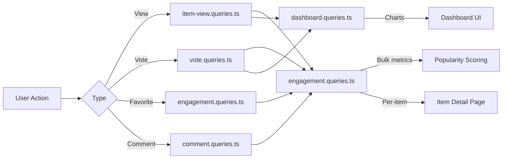

# Заявки за ангажираност и взаимодействие

Заявките за ангажираност обобщават потребителските взаимодействия (гледания, гласове, любими, коментари) между елементите. Тези заявки осигуряват сортиране по популярност, диаграми на таблото за управление и панели за ангажираност за всеки артикул. Съответните модули са `engagement.queries.ts`, `vote.queries.ts`, `comment.queries.ts`, `item-view.queries.ts` и `dashboard.queries.ts`.

## Поток от данни за ангажираност



## Групови показатели за ангажираност (`engagement.queries.ts`)

### `getEngagementMetricsPerItem`

Основната функция за оценка на популярността. Връща всички измерения на ангажираността за множество елементи в една паралелна партида от заявки:

```typescript
export async function getEngagementMetricsPerItem(
  itemSlugs: string[]
): Promise<Map<string, ItemEngagementMetrics>>
```

Тип връщане:

```typescript
export interface ItemEngagementMetrics {
  views: number;
  votes: number;       // Net votes (upvotes - downvotes)
  favorites: number;
  comments: number;
  avgRating: number;   // Average rating from comments (0-5)
}
```

### Стратегия за паралелни заявки

Четири независими заявки се изпълняват през `Promise.all` за максимална производителност:

```typescript
const [viewsData, votesData, favoritesData, commentsData] = await Promise.all([
  // 1. Views per item
  db.select({ itemId: itemViews.itemId, count: count() })
    .from(itemViews)
    .where(inArray(itemViews.itemId, itemSlugs))
    .groupBy(itemViews.itemId),

  // 2. Net votes per item (upvotes - downvotes)
  db.select({
      itemId: votes.itemId,
      netScore: sql<number>`SUM(CASE
        WHEN vote_type = 'upvote' THEN 1
        WHEN vote_type = 'downvote' THEN -1
        ELSE 0 END)`.as('netScore'),
    })
    .from(votes)
    .where(inArray(votes.itemId, itemSlugs))
    .groupBy(votes.itemId),

  // 3. Favorites per item
  db.select({ itemSlug: favorites.itemSlug, count: count() })
    .from(favorites)
    .where(inArray(favorites.itemSlug, itemSlugs))
    .groupBy(favorites.itemSlug),

  // 4. Comments count + average rating (excluding soft-deleted)
  db.select({
      itemId: comments.itemId,
      count: count(),
      avgRating: sql<number>`COALESCE(AVG(${comments.rating}), 0)`.as('avgRating'),
    })
    .from(comments)
    .where(and(inArray(comments.itemId, itemSlugs), isNull(comments.deletedAt)))
    .groupBy(comments.itemId),
]);
```

### Нормализиране на резултата

Всеки резултат от заявка се преобразува в `Map` за търсене на O(1), след което се комбинира в окончателната карта на показателите:

```typescript
const viewsMap = new Map<string, number>(
  viewsData.map(v => [v.itemId, Number(v.count)])
);
// ... same for votesMap, favoritesMap, commentsMap

for (const slug of itemSlugs) {
  metricsMap.set(slug, {
    views: viewsMap.get(slug) ?? 0,
    votes: votesMap.get(slug) ?? 0,
    favorites: favoritesMap.get(slug) ?? 0,
    comments: commentsMap.get(slug)?.count ?? 0,
    avgRating: commentsMap.get(slug)?.avgRating ?? 0,
  });
}
```

### Самостоятелни метрични функции

|функция|Връща се|Описание|
|----------|---------|-------------|
|`getFavoritesPerItem(itemSlugs)`|`Map<string, number>`|Любим брой на артикул|
|`getCommentsPerItem(itemSlugs)`|`Map<string, { count, avgRating }>`|Брой коментари и средни оценки|

И двете функции използват един и същ модел: ранно връщане за празни масиви, `groupBy` агрегиране, `Map` конструкция.

## Заявки за гласуване (`vote.queries.ts`)

### Гласувайте за CRUD

|функция|Описание|
|----------|-------------|
|`createVote(vote)`|Създаване на глас с нормализиране на охлюв|
|`getVoteByUserIdAndItemId(userId, itemSlug)`|Проверете съществуващия вот|
|`deleteVote(voteId)`|Трудно изтриване на глас|

Всички функции за гласуване нормализират охлюви за артикули чрез `getItemIdFromSlug()` преди заявка.

### Изчисляване на нетния резултат

Резултат на индивидуален артикул с помощта на условен `SUM`:

```typescript
export async function getVoteCountForItem(itemSlug: string): Promise<number> {
  const itemId = getItemIdFromSlug(itemSlug);
  const [result] = await db
    .select({
      netScore: sql<number>`
        SUM(CASE
          WHEN vote_type = 'upvote' THEN 1
          WHEN vote_type = 'downvote' THEN -1
          ELSE 0
        END)`.as('netScore')
    })
    .from(votes)
    .where(eq(votes.itemId, itemId));
  return Number(result?.netScore ?? 0);
}
```

### Резултати от групово гласуване

`getVotesPerItem` връща `Map<string, number>` нетни резултати за множество елементи, като използва `inArray` и `groupBy`.

### Сортирани по гласуване елементи

```typescript
export async function getItemsSortedByVotes(limit = 10, offset = 0) {
  return db
    .select({
      itemId: votes.itemId,
      voteCount: sql<number>`count(${votes.id})`.as('vote_count')
    })
    .from(votes)
    .groupBy(votes.itemId)
    .orderBy(sql`vote_count DESC`)
    .limit(limit)
    .offset(offset);
}
```

## Запитвания за коментари (`comment.queries.ts`)

### Коментирайте CRUD

|функция|Описание|
|----------|-------------|
|`createComment(data)`|Създаване с нормализиране на охлюв|
|`getCommentById(id)`|Необработен запис на коментар|
|`getCommentWithUserById(id)`|Коментирайте с присъединяване към потребителски профил|
|`updateComment(id, { content?, rating? })`|Актуализиране с клеймо за време `editedAt`|
|`updateCommentRating(id, rating)`|Актуализация само за оценка|
|`deleteComment(id)`|Меко изтриване (`deletedAt = new Date()`)|

### Коментари с потребителски данни

`getCommentsByItemId` използва `innerJoin` с `clientProfiles`, за да обогати всеки коментар с информация за автора:

```typescript
export async function getCommentsByItemId(itemSlug: string): Promise<CommentWithUser[]> {
  const itemId = getItemIdFromSlug(itemSlug);
  return db
    .select({
      id: comments.id,
      content: comments.content,
      rating: comments.rating,
      userId: comments.userId,
      itemId: comments.itemId,
      createdAt: comments.createdAt,
      updatedAt: comments.updatedAt,
      editedAt: comments.editedAt,
      deletedAt: comments.deletedAt,
      user: {
        id: clientProfiles.id,
        name: clientProfiles.name,
        email: clientProfiles.email,
        image: clientProfiles.avatar
      }
    })
    .from(comments)
    .innerJoin(clientProfiles, eq(comments.userId, clientProfiles.id))
    .where(and(eq(comments.itemId, itemId), isNull(comments.deletedAt)))
    .orderBy(desc(comments.createdAt));
}
```

## Преглед на проследяване (`item-view.queries.ts`)

### Ежедневно дедупликиране

Изгледите се премахват дублирани на зрител на елемент на UTC ден, като се използва `onConflictDoNothing` upsert шаблон:

```typescript
export async function recordItemView(
  view: Pick<NewItemView, 'itemId' | 'viewerId' | 'viewedDateUtc'>
): Promise<boolean> {
  const result = await db
    .insert(itemViews)
    .values(view)
    .onConflictDoNothing()
    .returning({ id: itemViews.id });
  return result.length > 0; // true = new view, false = duplicate
}
```

### Преглед на функциите за агрегиране

|функция|Параметри|Връща се|Описание|
|----------|-----------|---------|-------------|
|`getTotalViewsCount(itemSlugs)`|`string[]`|`number`|Общ брой показвания на елементи|
|`getRecentViewsCount(itemSlugs, days)`|`string[], number`|`number`|Преглеждания през последните N дни|
|`getDailyViewsData(itemSlugs, days)`|`string[], number`|`Map<string, number>`|Дневни преглеждания|
|`getViewsPerItem(itemSlugs)`|`string[]`|`Map<string, number>`|Прегледите на артикул се броят|

### Помощник за UTC дата

Всички изчисления на дата използват UTC за предотвратяване на грешки, свързани с часовата зона:

```typescript
function getUtcDateString(daysAgo: number = 0): string {
  const date = new Date();
  date.setUTCDate(date.getUTCDate() - daysAgo);
  return date.toISOString().split('T')[0]; // "YYYY-MM-DD"
}
```

## Статистика на таблото (`dashboard.queries.ts`)

### Налични показатели

|функция|Цел|
|----------|---------|
|`getVotesReceivedCount(itemSlugs)`|Общ брой гласове за артикулите на потребителя|
|`getCommentsReceivedCount(itemSlugs)`|Общ брой коментари за артикули на потребителя|
|`getUniqueItemsInteractedCount(clientId)`|Елементи, с които потребителят се е ангажирал|
|`getUserTotalActivityCount(clientId)`|Общо гласове + коментари от потребител|
|`getWeeklyEngagementData(itemSlugs, weeks)`|Седмични обобщени данни от диаграмата|
|`getDailyActivityData(clientId, itemSlugs, days)`|Разбивка на дневната активност|
|`getTopItemsEngagement(itemSlugs, limit)`|Топ артикули по рейтинг на ангажираност|

### Седмично обобщаване на ангажираността

Използва `to_char` на PostgreSQL с ISO седмичен формат за последователно седмично групиране:

```typescript
const weeklyVotes = await db
  .select({
    week: sql<string>`to_char(${votes.createdAt}, 'IYYY-IW')`.as('week'),
    count: count(),
  })
  .from(votes)
  .where(and(inArray(votes.itemId, itemSlugs), gte(votes.createdAt, startDate)))
  .groupBy(sql`to_char(${votes.createdAt}, 'IYYY-IW')`)
  .orderBy(sql`to_char(${votes.createdAt}, 'IYYY-IW')`);
```

## Съображения за производителност

- Всички групови функции приемат масиви и използват `inArray` за групова обработка
- Входните данни за празен масив се връщат рано, без да удрят базата данни
- `Promise.all` изпълнява едновременно независими агрегати
- `Map` структурите от данни осигуряват O(1) търсене по време на асемблирането на резултата
- Плажно изтритите коментари се изключват чрез `isNull(comments.deletedAt)` във всички агрегирания
