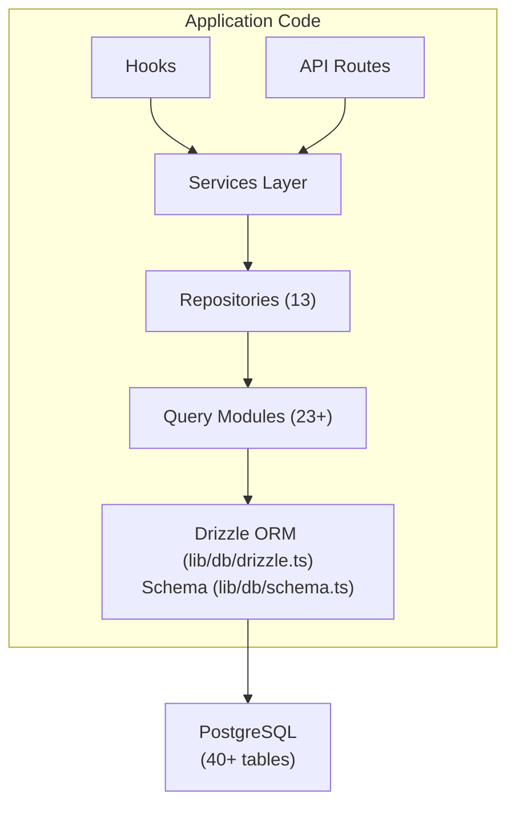

# Преглед на базата данни

Шаблонът Ever Works използва **Drizzle ORM** с **PostgreSQL** като слой база данни. Базата данни не е задължителна – приложението може да работи без нея за внедрявания само със съдържание – но тя захранва всички потребителски, абонаментни, ангажирани и административни функции.

## Технологичен стек

|Компонент|технология|Цел|
|-----------|-----------|---------|
|ORM|Дъжд ORM|Създател на безопасни за тип заявки и управление на схеми|
|База данни|PostgreSQL|Първична релационна база данни|
|Шофьор|`postgres` (postgres.js)|PostgreSQL клиент за Node.js|
|миграции|Комплект за дъжд|Генериране и изпълнение на миграция на схема|
|Засяване|`drizzle-seed` + персонализирани скриптове|Инициализация на база данни с данни по подразбиране|

## Архитектура на база данни



## Конфигурация

### Конфигурация на дъжд (`drizzle.config.ts`)

```typescript
export default {
  schema: "./lib/db/schema.ts",
  out: "./lib/db/migrations",
  dialect: "postgresql",
  dbCredentials: {
    url: process.env.DATABASE_URL,
  },
} satisfies Config;
```

Конфигурацията сочи към:
- **Файл със схема**: `lib/db/schema.ts` -- единственият източник на истина за всички дефиниции на таблици
- **Изход за миграции**: `lib/db/migrations/` -- където се съхраняват генерираните SQL миграционни файлове
- **Диалект**: PostgreSQL
- **Връзка**: Чрез `DATABASE_URL` променлива на средата

### Управление на връзката (`lib/db/drizzle.ts`)

Връзката с базата данни се инициализира лениво при първа употреба и повторно използва връзки през горещи презареждания в разработка чрез глобален сингълтон модел.

Ключови характеристики:
- **Мързелива инициализация**: Връзката с базата данни не се създава, докато не бъде изпълнена първата заявка
- **Достъп, базиран на прокси сървър**: Експортираният `db` обект използва JavaScript `Proxy`, за да инициализира прозрачно връзката
- **Пулиране на връзки**: Конфигурируем размер на пула чрез `DB_POOL_SIZE` променлива на средата (по подразбиране: 20 в производство, 10 в разработка, фиксирани 1-50)
- **Изчакване на неактивност**: Връзките се освобождават след 20 секунди неактивност
- **Изчакване на връзката**: 30-секундно изчакване за установяване на нови връзки
- **Singleton pattern**: Използва `globalThis` за запазване на връзките през горещи презареждания на Next.js

```typescript
// Usage - just import and use
import { db } from '@/lib/db/drizzle';

const users = await db.select().from(schema.users);
```

### Променливи на средата

|Променлива|Задължително|По подразбиране|Описание|
|----------|----------|---------|-------------|
|`DATABASE_URL`|не| - |Низ за свързване на PostgreSQL|
|`DB_POOL_SIZE`|не| 10/20 |Размер на пула за връзки (dev/prod)|

Когато `DATABASE_URL` не е зададено, функциите на базата данни се дезактивират тихо, което позволява на приложението да работи в режим само за съдържание.

## Преглед на схемата

Схемата на базата данни е дефинирана в един файл (`lib/db/schema.ts`), съдържащ 40+ таблици, организирани по домейн:

|Домейн|Маси|Описание|
|--------|--------|-------------|
|Потребители и авт| 8 |Потребители, акаунти, сесии, токени, удостоверители|
|Роли и разрешения| 3 |RBAC с роли, разрешения и съпоставяне на разрешения за роли|
|Клиентски профили| 1 |Разширени потребителски профили за клиентски акаунти|
|Ангажираност със съдържание| 4 |Коментари, гласове, любими, прегледи на артикули|
|Абонаменти| 4 |Планове, история на абонаментите, доставчици на плащания, платежни сметки|
|Известия| 1 |Система за уведомяване в приложението|
|Администриране и модериране| 4 |Доклади, история на модерирането, дневници за проверка на елементи, дневници на дейността|
|Интеграции| 2 |CRM конфигурация, съпоставяне на интеграция|
|Фирми| 2 |Фирми и артикуло-фирмени асоциации|
|Спонсор реклами| 1 |Спонсорирани реклами на артикули|
|Проучвания| 2 |Анкети и отговори на анкети|
|Бюлетин| 1 |Абонаменти за бюлетин|
|система| 1 |Проследяване на състоянието на семената|

## Инициализация на база данни

При стартиране на приложението (чрез `instrumentation.ts`), шаблонът автоматично:

1. **Извършва миграции**: `migrate()` функцията на Drizzle прилага всички чакащи миграции (идемпотентни -- вече приложените миграции се пропускат)
2. **Изходни данни**: Ако базата данни не е била заредена, началният скрипт се изпълнява със защита за препоръчително заключване, за да се предотвратят условия на състезание при многопроцесни внедрявания

Това се обработва от `lib/db/initialize.ts`. Вижте [Ръководство за миграции](./migrations-guide) и [Зареждане на база данни](./seeding) за подробности.

## Ключови команди

```bash
# Generate a migration from schema changes
pnpm db:generate

# Run pending migrations
pnpm db:migrate

# Seed the database
pnpm db:seed

# Open Drizzle Studio (database GUI)
pnpm db:studio
```
