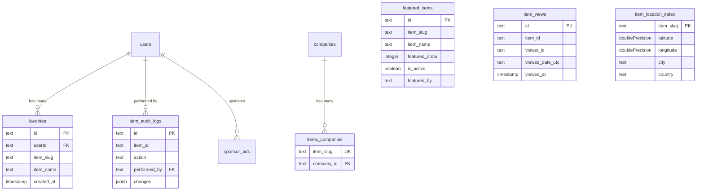

# Дълбоко гмуркане на схема на елементи

## Преглед

В шаблона Ever Works **елементите се съхраняват в базирана на Git CMS** (`.content/` директория), а не в традиционна таблица на база данни. Въпреки това множество таблици на бази данни поддържат операции, свързани с елементи, като проследяване на изгледи, одитиране на промени, индексиране на местоположения, управление на любими, представяне на елементи и свързване на елементи с компании.

Тази страница документира всяка таблица на база данни, която препраща или поддържа елементи.

**Изходен файл:** `template/lib/db/schema.ts`

---

## Item-Supporting Tables

| Table | Purpose |
|---|---|
| `favorites` | User-saved favorite items |
| `featured_items` | Admin-curated featured items |
| `item_views` | Per-day unique view tracking |
| `item_audit_logs` | Complete change history for admin panel |
| `item_location_index` | Geospatial index for "Near Me" filtering |
| `items_companies` | Links items to company records |
| `location_index_meta` | Singleton metadata for location index |

---

## Таблица: `favorites`

Съхранява потребителските отметки/предпочитани връзки с елементи, идентифицирани от slug.

### Колони

|Колона|Име на БД|Тип|Nullable|По подразбиране|Ограничения|
|---|---|---|---|---|---|
|`id`|`id`|`text`|не|`crypto.randomUUID()`|Първичен ключ|
|`userId`|`userId`|`text`|не| - |FK -> `users.id` (КАСКАДА)|
|`itemSlug`|`item_slug`|`text`|не| - | - |
|`itemName`|`item_name`|`text`|не| - | - |
|`itemIconUrl`|`item_icon_url`|`text`|да| - | - |
|`itemCategory`|`item_category`|`text`|да| - | - |
|`createdAt`|`created_at`|`timestamp`|не|`now()`| - |
|`updatedAt`|`updated_at`|`timestamp`|не|`now()`| - |

### Индекси

|Име|Колони|Тип|
|---|---|---|
|`user_item_favorite_unique_idx`|`(userId, itemSlug)`|Уникален|
|`favorites_user_id_idx`|`userId`|B-дърво|
|`favorites_item_slug_idx`|`itemSlug`|B-дърво|
|`favorites_created_at_idx`|`createdAt`|B-дърво|

### TypeScript типове

```typescript
export type Favorite = typeof favorites.$inferSelect;
export type NewFavorite = typeof favorites.$inferInsert;
export type FavoriteWithUser = Favorite & {
    user: typeof users.$inferSelect;
};
```

---

## Table: `featured_items`

Admin-curated list of items to highlight on the site. Supports ordering and optional expiration.

### Columns

| Column | DB Name | Type | Nullable | Default | Constraints |
|---|---|---|---|---|---|
| `id` | `id` | `text` | No | `crypto.randomUUID()` | Primary Key |
| `itemSlug` | `item_slug` | `text` | No | - | - |
| `itemName` | `item_name` | `text` | No | - | - |
| `itemIconUrl` | `item_icon_url` | `text` | Yes | - | - |
| `itemCategory` | `item_category` | `text` | Yes | - | - |
| `itemDescription` | `item_description` | `text` | Yes | - | - |
| `featuredOrder` | `featured_order` | `integer` | No | `0` | Display ordering |
| `featuredUntil` | `featured_until` | `timestamp` | Yes | - | Optional expiration |
| `isActive` | `is_active` | `boolean` | No | `true` | - |
| `featuredBy` | `featured_by` | `text` | No | - | Admin user ID |
| `featuredAt` | `featured_at` | `timestamp` | No | `now()` | - |
| `createdAt` | `created_at` | `timestamp` | No | `now()` | - |
| `updatedAt` | `updated_at` | `timestamp` | No | `now()` | - |

### Indexes

| Name | Columns | Type |
|---|---|---|
| `featured_items_item_slug_idx` | `itemSlug` | B-tree |
| `featured_items_featured_order_idx` | `featuredOrder` | B-tree |
| `featured_items_is_active_idx` | `isActive` | B-tree |
| `featured_items_featured_at_idx` | `featuredAt` | B-tree |
| `featured_items_featured_until_idx` | `featuredUntil` | B-tree |

### TypeScript Types

```typescript
export type FeaturedItem = typeof featuredItems.$inferSelect;
export type NewFeaturedItem = typeof featuredItems.$inferInsert;
```

---

## Таблица: `item_views`

Проследява уникални ежедневни изгледи за артикул. Използва базирана на бисквитки анонимна идентификация на зрителя и дедупликация на UTC дата. Не съхранява IP адреси за поверителност.

### Колони

|Колона|Име на БД|Тип|Nullable|По подразбиране|Ограничения|
|---|---|---|---|---|---|
|`id`|`id`|`text`|не|`crypto.randomUUID()`|Първичен ключ|
|`itemId`|`item_id`|`text`|не| - |елемент плужек|
|`viewerId`|`viewer_id`|`text`|не| - |Анонимен идентификатор на бисквитка|
|`viewedDateUtc`|`viewed_date_utc`|`text`|не| - |Формат ГГГГ-ММ-ДД|
|`viewedAt`|`viewed_at`|`timestamp (tz)`|не|`now()`|Точно време за гледане|

### Индекси

|Име|Колони|Тип|
|---|---|---|
|`item_views_unique_daily_idx`|`(itemId, viewerId, viewedDateUtc)`|Уникален|
|`item_views_item_date_idx`|`(itemId, viewedDateUtc)`|Композитно B-дърво|

### TypeScript типове

```typescript
export type ItemView = typeof itemViews.$inferSelect;
export type NewItemView = typeof itemViews.$inferInsert;
```

---

## Table: `item_audit_logs`

Stores the complete change history for items managed through the admin panel. Since items live in Git, `itemId` is the slug (not a foreign key).

### Columns

| Column | DB Name | Type | Nullable | Default | Constraints |
|---|---|---|---|---|---|
| `id` | `id` | `text` | No | `crypto.randomUUID()` | Primary Key |
| `itemId` | `item_id` | `text` | No | - | Item slug |
| `itemName` | `item_name` | `text` | No | - | Denormalized |
| `action` | `action` | `text (enum)` | No | - | See enum values below |
| `previousStatus` | `previous_status` | `text` | Yes | - | For status changes |
| `newStatus` | `new_status` | `text` | Yes | - | For status changes |
| `changes` | `changes` | `jsonb` | Yes | - | `{ field: { old, new } }` |
| `performedBy` | `performed_by` | `text` | Yes | - | FK -> `users.id` (SET NULL) |
| `performedByName` | `performed_by_name` | `text` | Yes | - | Denormalized |
| `notes` | `notes` | `text` | Yes | - | Review notes |
| `metadata` | `metadata` | `jsonb` | Yes | - | IP, user agent, etc. |
| `createdAt` | `created_at` | `timestamp (tz)` | No | `now()` | - |

### Action Enum Values

```typescript
export const ItemAuditAction = {
    CREATED: 'created',
    UPDATED: 'updated',
    STATUS_CHANGED: 'status_changed',
    REVIEWED: 'reviewed',
    DELETED: 'deleted',
    RESTORED: 'restored'
} as const;
```

### Indexes

| Name | Columns | Type |
|---|---|---|
| `item_audit_logs_item_id_idx` | `itemId` | B-tree |
| `item_audit_logs_action_idx` | `action` | B-tree |
| `item_audit_logs_performed_by_idx` | `performedBy` | B-tree |
| `item_audit_logs_created_at_idx` | `createdAt` | B-tree |
| `item_audit_logs_item_id_action_idx` | `(itemId, action)` | Composite B-tree |

### TypeScript Types

```typescript
export type ItemAuditLog = typeof itemAuditLogs.$inferSelect;
export type NewItemAuditLog = typeof itemAuditLogs.$inferInsert;
export type ItemAuditChanges = Record<string, { old: unknown; new: unknown }>;
```

---

## Таблица: `item_location_index`

Геопространствен индекс за елементи, позволяващ филтриране „Близо до мен“ и сортиране въз основа на разстояние. Това е таблица само с индекс -- източникът на истината остава в Git CMS.

### Колони

|Колона|Име на БД|Тип|Nullable|По подразбиране|Ограничения|
|---|---|---|---|---|---|
|`itemSlug`|`item_slug`|`text`|не| - |Първичен ключ|
|`latitude`|`latitude`|`doublePrecision`|не| - | - |
|`longitude`|`longitude`|`doublePrecision`|не| - | - |
|`address`|`address`|`text`|да| - | - |
|`city`|`city`|`text`|да| - | - |
|`state`|`state`|`text`|да| - | - |
|`country`|`country`|`text`|да| - | - |
|`cityNormalized`|`city_normalized`|`text`|да| - |Малки букви, изрязани|
|`countryNormalized`|`country_normalized`|`text`|да| - |Малки букви, изрязани|
|`postalCode`|`postal_code`|`text`|да| - | - |
|`serviceArea`|`service_area`|`text`|да| - | - |
|`isRemote`|`is_remote`|`boolean`|не|`false`| - |
|`indexedAt`|`indexed_at`|`timestamp (tz)`|не|`now()`| - |

### Индекси

|Име|Колони|Тип|
|---|---|---|
|`item_location_index_latitude_idx`|`latitude`|B-дърво|
|`item_location_index_longitude_idx`|`longitude`|B-дърво|
|`item_location_index_city_idx`|`city`|B-дърво|
|`item_location_index_country_idx`|`country`|B-дърво|
|`item_location_index_city_normalized_idx`|`cityNormalized`|B-дърво|
|`item_location_index_country_normalized_idx`|`countryNormalized`|B-дърво|
|`item_location_index_is_remote_idx`|`isRemote`|B-дърво|
|`item_location_index_indexed_at_idx`|`indexedAt`|B-дърво|
|`item_location_index_lat_long_idx`|`(latitude, longitude)`|Композитно B-дърво|

### TypeScript типове

```typescript
export type ItemLocationIndex = typeof itemLocationIndex.$inferSelect;
export type NewItemLocationIndex = typeof itemLocationIndex.$inferInsert;
```

---

## Table: `items_companies`

Links item slugs to company database records.

### Columns

| Column | DB Name | Type | Nullable | Default | Constraints |
|---|---|---|---|---|---|
| `itemSlug` | `item_slug` | `text` | No | - | Unique |
| `companyId` | `company_id` | `text` | No | - | FK -> `companies.id` (CASCADE) |
| `createdAt` | `created_at` | `timestamp (tz)` | No | `now()` | - |
| `updatedAt` | `updated_at` | `timestamp (tz)` | No | `now()` | - |

### Indexes

| Name | Columns | Type |
|---|---|---|
| `items_companies_company_id_idx` | `companyId` | B-tree |

---

## Таблица: `location_index_meta`

Метаданни за повторно изграждане на индекс на местоположение за проследяване на таблица Singleton в различни внедрявания.

### Колони

|Колона|Име на БД|Тип|Nullable|По подразбиране|Ограничения|
|---|---|---|---|---|---|
|`id`|`id`|`text`|не|`'singleton'`|Първичен ключ|
|`lastRebuildAt`|`last_rebuild_at`|`timestamp (tz)`|да| - | - |
|`lastRebuildDurationMs`|`last_rebuild_duration_ms`|`integer`|да| - | - |
|`lastRebuildItemCount`|`last_rebuild_item_count`|`integer`|да| - | - |
|`updatedAt`|`updated_at`|`timestamp (tz)`|не|`now()`| - |

### Индекси

|Име|Колони|Тип|
|---|---|---|
|`location_index_meta_singleton_idx`|`id`|Уникален|

---

## Relations Diagram



---

## Примери за заявки

### Извличане на потребителски любими

```typescript
import { db } from '@/lib/db/drizzle';
import { favorites } from '@/lib/db/schema';
import { eq } from 'drizzle-orm';

const userFavorites = await db
    .select()
    .from(favorites)
    .where(eq(favorites.userId, userId));
```

### Запишете изглед на елемент

```typescript
import { itemViews } from '@/lib/db/schema';

await db.insert(itemViews).values({
    itemId: 'my-item-slug',
    viewerId: cookieViewerId,
    viewedDateUtc: '2025-01-15',
}).onConflictDoNothing();
```

### Вземете активни представени елементи

```typescript
import { featuredItems } from '@/lib/db/schema';
import { eq, asc, or, isNull, gte } from 'drizzle-orm';

const featured = await db
    .select()
    .from(featuredItems)
    .where(eq(featuredItems.isActive, true))
    .orderBy(asc(featuredItems.featuredOrder));
```

### Намерете елементи в близост до местоположение (ограничаващо поле)

```typescript
import { itemLocationIndex } from '@/lib/db/schema';
import { and, between } from 'drizzle-orm';

const nearby = await db
    .select()
    .from(itemLocationIndex)
    .where(
        and(
            between(itemLocationIndex.latitude, minLat, maxLat),
            between(itemLocationIndex.longitude, minLng, maxLng)
        )
    );
```

### Вземете одитна история за даден елемент

```typescript
import { itemAuditLogs } from '@/lib/db/schema';
import { eq, desc } from 'drizzle-orm';

const history = await db
    .select()
    .from(itemAuditLogs)
    .where(eq(itemAuditLogs.itemId, 'my-item-slug'))
    .orderBy(desc(itemAuditLogs.createdAt));
```

---

## Design Notes

- **Items are NOT in the database.** They live in a Git-based CMS cloned into `.content/`. The database only stores metadata, indexes, and relationships.
- **Item identification is by slug.** All item-supporting tables reference items via `item_slug` or `item_id` (which IS the slug), not via foreign keys.
- **Denormalization is intentional.** Tables like `favorites` and `featured_items` store `item_name` and `item_icon_url` to avoid cross-system lookups at read time.
- **Privacy-first views.** The `item_views` table uses anonymous cookie IDs and does not store IP addresses.
