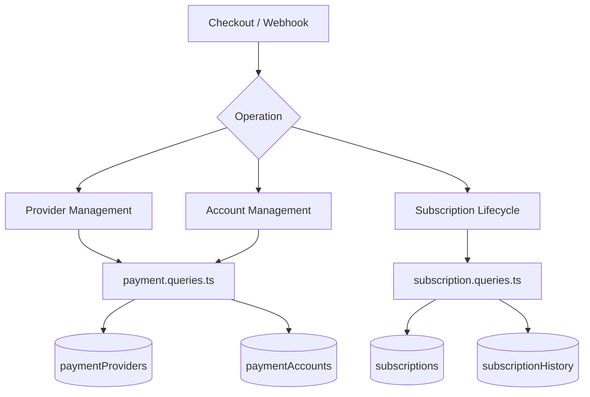
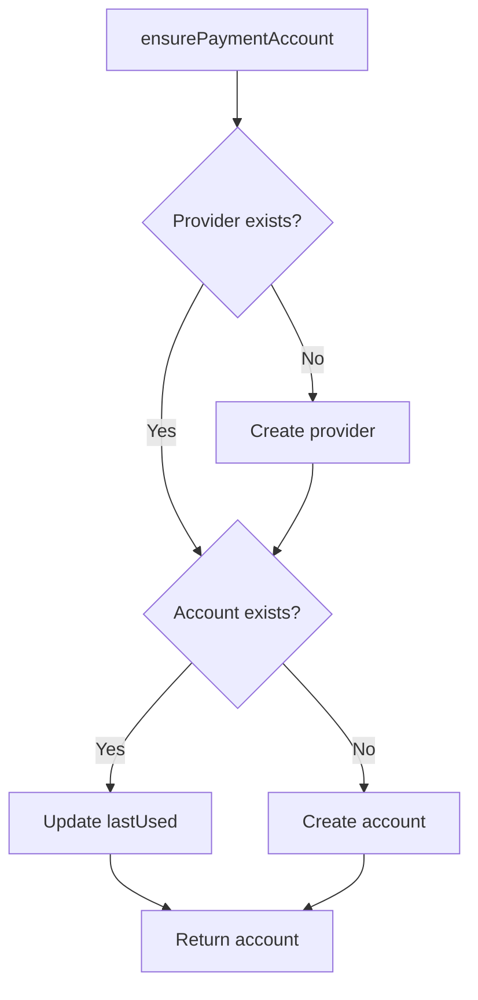
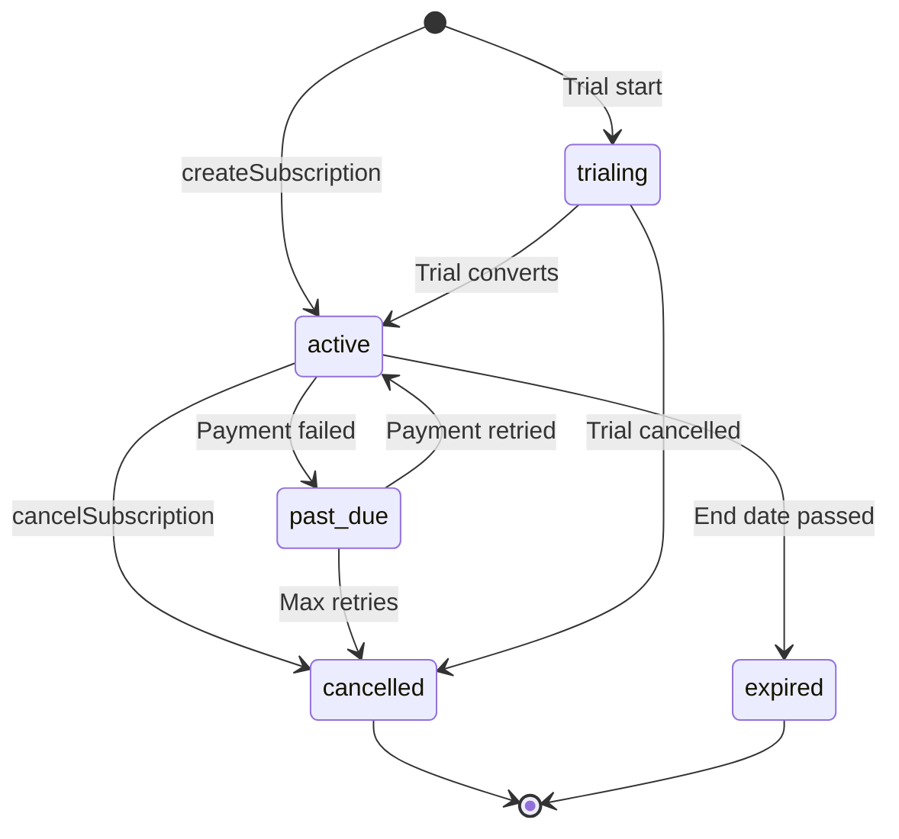

# Запитвания за плащане и абонамент

Заявките за плащане управляват регистъра на доставчика, потребителските акаунти за плащане и пълния жизнен цикъл на абонамента. Съответните модули са `payment.queries.ts` и `subscription.queries.ts`.

## Архитектура на платежната система



## Запитвания за доставчик на плащания (`payment.queries.ts`)

### Доставчик CRUD

|функция|Описание|
|----------|-------------|
|`getPaymentProvider(id)`|Вземете доставчик по ID|
|`getPaymentProviderByName(name)`|Вземете доставчик по име (напр. `'stripe'`)|
|`getActivePaymentProviders()`|Избройте всички активни доставчици, подредени по име|
|`createPaymentProvider(data)`|Създайте нов запис на доставчик|
|`updatePaymentProvider(id, data)`|Частична актуализация на полетата на доставчика|
|`deactivatePaymentProvider(id)`|Задайте `isActive = false`|

Поддържани имена на доставчици: `stripe`, `lemonsqueezy`, `polar`, `solidgate`.

### Запитвания за разплащателна сметка

Сметките за плащане свързват потребител с идентификационен номер на клиент, специфичен за доставчика:

|функция|Описание|
|----------|-------------|
|`getPaymentAccountByUserId(userId, providerId)`|Вземете акаунт с активна проверка на доставчика|
|`getPaymentAccountByCustomerId(customerId, providerId)`|Обратно търсене по клиентски идентификатор|
|`createPaymentAccount(data)`|Създайте акаунт с клеймо за време `lastUsed`|
|`updatePaymentAccountLastUsed(accountId)`|Докоснете `lastUsed` клеймо за време|
|`getUserPaymentAccountByProvider(userId, providerName)`|Търсене по име на доставчик (първо разрешава доставчика)|

### Активно валидиране на доставчик

`getPaymentAccountByUserId` извършва тройно вътрешно свързване, за да гарантира, че и доставчикът, и потребителят са валидни:

```typescript
export async function getPaymentAccountByUserId(
  userId: string,
  providerId: string
): Promise<PaymentAccount | null> {
  const result = await db
    .select({ /* payment account fields */ })
    .from(paymentAccounts)
    .innerJoin(paymentProviders, eq(paymentAccounts.providerId, paymentProviders.id))
    .innerJoin(users, eq(paymentAccounts.userId, users.id))
    .where(and(
      eq(paymentAccounts.userId, userId),
      eq(paymentAccounts.providerId, providerId),
      eq(paymentProviders.isActive, true)
    ))
    .limit(1);
  return result[0] || null;
}
```

### Осигурете разплащателна сметка

`ensurePaymentAccount` внедрява идемпотентен модел за включване за платежни сметки:



```typescript
export async function ensurePaymentAccount(
  providerName: string,
  userId: string,
  customerId: string,
  accountId?: string
): Promise<PaymentAccount>
```

### Настройте потребителски акаунт за плащане

`setupUserPaymentAccount` разширява модела за осигуряване с откриване на промяна на клиентския идентификатор:

```typescript
if (existingAccount.customerId !== customerId) {
  await db
    .update(paymentAccounts)
    .set({
      customerId,
      accountId: accountId || existingAccount.accountId,
      lastUsed: new Date(),
      updatedAt: new Date()
    })
    .where(eq(paymentAccounts.id, existingAccount.id));
}
```

### Удобни псевдоними

- `getOrCreatePaymentAccount` -- псевдоним за `ensurePaymentAccount`
- `createOrGetPaymentAccount` -- псевдоним за `setupUserPaymentAccount`

## Заявки за абонамент (`subscription.queries.ts`)

### Търсене на абонамент

|функция|Параметри|Връща се|
|----------|-----------|---------|
|`getUserActiveSubscription(userId)`|Потребителско име|Активен абонамент или нула|
|`getUserSubscriptions(userId)`|Потребителско име|Всички абонаменти (подредени по дата)|
|`getSubscriptionByProviderSubscriptionId(provider, subId)`|Доставчик + подид|Абонамент или нула|
|`getSubscriptionByUserIdAndSubscriptionId(userId, subId)`|Потребител + подид|Абонамент или нула|
|`getSubscriptionWithUser(subId)`|ID на абонамент|Абонамент с потребителско присъединяване|
|`hasActiveSubscription(userId)`|Потребителско име|Булева стойност|

### Жизнен цикъл на абонамента

#### Създавайте

```typescript
export async function createSubscription(data: NewSubscription): Promise<Subscription> {
  const result = await db
    .insert(subscriptions)
    .values({ ...data, createdAt: new Date(), updatedAt: new Date() })
    .returning();
  return result[0];
}
```

#### Актуализиране на състоянието

Промените в състоянието автоматично задават `cancelledAt` и `cancelReason` при преминаване към `CANCELLED`:

```typescript
export async function updateSubscriptionStatus(
  subscriptionId: string,
  status: string,
  reason?: string
): Promise<Subscription | null>
```

#### Отказ

Поддържа както незабавно анулиране, така и анулиране в края на периода:

```typescript
export async function cancelSubscription(
  subscriptionId: string,
  reason?: string,
  cancelAtPeriodEnd: boolean = false
): Promise<Subscription | null>
```

Когато `cancelAtPeriodEnd = true`, състоянието остава `ACTIVE`, но са зададени `cancelledAt` и `cancelAtPeriodEnd`.

### Поток на състоянието на абонамента



### Резолюция на плана

`getUserPlan` проверява изтичането на абонамента и се връща към безплатния план:

```typescript
export async function getUserPlan(userId: string): Promise<string> {
  const subscription = await getUserActiveSubscription(userId);
  if (!subscription) return PaymentPlan.FREE;
  return getEffectivePlan(subscription.planId, subscription.endDate, subscription.status);
}
```

`getUserPlanWithExpiration` връща пълни подробности за изтичане:

```typescript
{
  planId: string;         // Stored plan
  effectivePlan: string;  // Actual plan after expiration check
  isExpired: boolean;
  expiresAt: Date | null;
  status: string | null;
  subscriptionId: string | null;
}
```

### Изтичане и подновяване

|функция|Описание|
|----------|-------------|
|`getSubscriptionsExpiringSoon(days)`|Активните абонаменти изтичат в рамките на N дни|
|`getExpiredSubscriptions()`|Крайната дата на абонаментите е изтекла|
|`getSubscriptionsForRenewalReminder(days)`|Абонаменти, изискващи известия за подновяване|

### История на абонаментите

Промените се регистрират в таблицата `subscriptionHistory`:

```typescript
export async function logSubscriptionHistory(data: NewSubscriptionHistory)
export async function getSubscriptionHistory(subscriptionId: string)
```

### Статистика на абонамента

`getSubscriptionStats` връща общия брой:

```typescript
{
  total: number;
  active: number;
  cancelled: number;
  expired: number;
  pastDue: number;
  trialing: number;
}
```

## Константи на схемата

```typescript
// lib/db/schema.ts
export const SubscriptionStatus = {
  ACTIVE: 'active',
  CANCELLED: 'cancelled',
  EXPIRED: 'expired',
  PAST_DUE: 'past_due',
  TRIALING: 'trialing',
} as const;

// lib/constants/payment.ts
export const PaymentPlan = {
  FREE: 'free',
  STANDARD: 'standard',
  PREMIUM: 'premium',
} as const;

export const PaymentProvider = {
  STRIPE: 'stripe',
  LEMONSQUEEZY: 'lemonsqueezy',
  POLAR: 'polar',
  SOLIDGATE: 'solidgate',
} as const;
```
