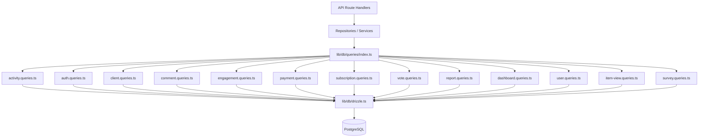

# Система за шаблони на заявки

Шаблонът организира всички заявки към базата данни в специфични за домейна модули под `lib/db/queries/`. Всеки модул следва принципа на единната отговорност (SRP), като групира свързани операции заедно. Експортиране на барел в `index.ts` осигурява единна входна точка за всички функции за заявки.

## Преглед на архитектурата



## Модули за заявки

|Модул|Файл|Цел|
|--------|------|---------|
|активност|`activity.queries.ts`|Регистриране на активността и одитна пътека|
|авт|`auth.queries.ts`|Токени за повторно задаване на парола, токени за потвърждение|
|Клиент|`client.queries.ts`|Клиентски профил CRUD, търсене, статистика|
|Коментирайте|`comment.queries.ts`|Коментирайте CRUD с потребителски присъединявания|
|Компания|`company.queries.ts`|Фирмен мениджмънт и обвързване артикул-фирма|
|Табло за управление|`dashboard.queries.ts`|Статистика на таблото и диаграми за ангажираност|
|Годеж|`engagement.queries.ts`|Обобщени показатели за ангажираност (гледания, гласове, любими, коментари)|
|Интеграционно картографиране|`integration-mapping.queries.ts`|CRM интеграционни съпоставки|
|Артикул|`item.queries.ts`|Нормализиране и валидиране на елемента|
|Одит на артикул|`item-audit.queries.ts`|История на промените на артикула|
|Изглед на артикул|`item-view.queries.ts`|Преглед на проследяване с дедупликация|
|Индекс на местоположението|`location-index.queries.ts`|Геопространствено индексиране на елементи|
|Умереност|`moderation.queries.ts`|Действия за модериране на съдържанието|
|Бюлетин|`newsletter.queries.ts`|Управление на абонати за бюлетин|
|Плащане|`payment.queries.ts`|Доставчик на плащания и управление на акаунти|
|Докладвай|`report.queries.ts`|Доклади за съдържание с филтриране|
|Абонамент|`subscription.queries.ts`|Управление на жизнения цикъл на абонамента|
|Проучване|`survey.queries.ts`|Отговори и анализи на анкетата|
|Потребител|`user.queries.ts`|CRUD и администраторски проверки на основните потребители|
|Гласувайте|`vote.queries.ts`|Гласувайте CRUD и изчисляване на нетния резултат|

## Често срещани модели

### 1. Модел на пагинация

Всички заявки за списък следват последователен модел на страниране, използвайки `limit` и `offset`:

```typescript
export async function getClientProfiles(params: {
  page?: number;
  limit?: number;
  search?: string;
  status?: string;
}): Promise<{
  profiles: ClientProfileWithAuth[];
  total: number;
  page: number;
  totalPages: number;
  limit: number;
}> {
  const { page = 1, limit = 10, search, status } = params;
  const offset = (page - 1) * limit;

  // 1. Build WHERE conditions dynamically
  const whereConditions: SQL[] = [];
  if (search) { /* add ILIKE condition */ }
  if (status) { whereConditions.push(eq(clientProfiles.status, status)); }
  const whereClause = whereConditions.length > 0
    ? and(...whereConditions)
    : undefined;

  // 2. Count query for total
  const countResult = await db
    .select({ count: sql<number>`count(distinct ${clientProfiles.id})` })
    .from(clientProfiles)
    .where(whereClause);
  const total = Number(countResult[0]?.count || 0);

  // 3. Data query with limit/offset
  const profiles = await db
    .select({ /* fields */ })
    .from(clientProfiles)
    .where(whereClause)
    .orderBy(desc(clientProfiles.createdAt))
    .limit(limit)
    .offset(offset);

  return {
    profiles,
    total,
    page,
    totalPages: Math.ceil(total / limit),
    limit,
  };
}
```

### 2. Модел на динамично филтриране

Филтрите се натрупват като масив от SQL условия и се съставят с `and()`:

```typescript
const whereConditions: SQL[] = [];

if (search) {
  const escapedSearch = search
    .replace(/\\/g, '\\\\')
    .replace(/[%_]/g, '\\$&');
  whereConditions.push(
    sql`(${clientProfiles.name} ILIKE ${`%${escapedSearch}%`} OR
         ${clientProfiles.email} ILIKE ${`%${escapedSearch}%`})`
  );
}

if (status) {
  whereConditions.push(eq(clientProfiles.status, status));
}

if (provider) {
  whereConditions.push(
    sql`exists (
      select 1 from ${accounts}
      where ${accounts.userId} = ${clientProfiles.userId}
        and ${accounts.provider} = ${provider}
    )`
  );
}

const whereClause = whereConditions.length > 0
  ? and(...whereConditions)
  : undefined;
```

### 3. Образец за присъединяване

Кодовата база използва както изрични `innerJoin`/`leftJoin`, така и подзаявки за обработка на свързани данни:

**Вътрешно присъединяване за необходими релации:**

```typescript
const result = await db
  .select({
    id: comments.id,
    content: comments.content,
    user: {
      id: clientProfiles.id,
      name: clientProfiles.name,
      email: clientProfiles.email,
      image: clientProfiles.avatar,
    },
  })
  .from(comments)
  .innerJoin(clientProfiles, eq(comments.userId, clientProfiles.id))
  .where(and(eq(comments.itemId, itemId), isNull(comments.deletedAt)))
  .orderBy(desc(comments.createdAt));
```

**Подзаявка за избягване на дублиращи се редове от множество съединения:**

```typescript
const profiles = await db
  .select({
    id: clientProfiles.id,
    // ... other fields
    accountProvider: sql<string>`coalesce(
      (SELECT provider FROM ${accounts}
       WHERE ${accounts.userId} = ${clientProfiles.userId}
       LIMIT 1),
      'unknown'
    )`,
  })
  .from(clientProfiles);
```

### 4. Модел на агрегиране

Агрегирани функции като `count`, `SUM` и `AVG` се използват с `groupBy`:

```typescript
// Net vote score using conditional SUM
const voteCounts = await db
  .select({
    itemId: votes.itemId,
    netScore: sql<number>`
      SUM(CASE
        WHEN vote_type = 'upvote' THEN 1
        WHEN vote_type = 'downvote' THEN -1
        ELSE 0
      END)
    `.as('netScore'),
  })
  .from(votes)
  .where(inArray(votes.itemId, itemSlugs))
  .groupBy(votes.itemId);
```

### 5. Модел на паралелна заявка

Когато са необходими множество независими агрегации, заявките се изпълняват паралелно с `Promise.all`:

```typescript
const [viewsData, votesData, favoritesData, commentsData] =
  await Promise.all([
    db.select({ itemId: itemViews.itemId, count: count() })
      .from(itemViews)
      .where(inArray(itemViews.itemId, itemSlugs))
      .groupBy(itemViews.itemId),

    db.select({ itemId: votes.itemId, netScore: sql`...` })
      .from(votes)
      .where(inArray(votes.itemId, itemSlugs))
      .groupBy(votes.itemId),

    db.select({ itemSlug: favorites.itemSlug, count: count() })
      .from(favorites)
      .where(inArray(favorites.itemSlug, itemSlugs))
      .groupBy(favorites.itemSlug),

    db.select({ itemId: comments.itemId, count: count(), avgRating: sql`...` })
      .from(comments)
      .where(and(inArray(comments.itemId, itemSlugs), isNull(comments.deletedAt)))
      .groupBy(comments.itemId),
  ]);
```

### 6. Upsert / Модел за разрешаване на конфликти

Използва се за дедупликация, особено при проследяване на изгледи:

```typescript
export async function recordItemView(
  view: Pick<NewItemView, 'itemId' | 'viewerId' | 'viewedDateUtc'>
): Promise<boolean> {
  const result = await db
    .insert(itemViews)
    .values(view)
    .onConflictDoNothing()
    .returning({ id: itemViews.id });

  return result.length > 0;
}
```

### 7. Шаблон за меко изтриване

Записите се маркират като изтрити, вместо да бъдат премахнати физически:

```typescript
export async function deleteComment(id: string) {
  const [comment] = await db
    .update(comments)
    .set({ deletedAt: new Date() })
    .where(eq(comments.id, id))
    .returning();
  return comment;
}

// Querying always filters out soft-deleted records
.where(and(eq(comments.itemId, itemId), isNull(comments.deletedAt)))
```

### 8. Модел за нормализиране на резултата

Резултатите от заявката често се картографират чрез обекти за търсене `Map` за ефективен O(1) достъп:

```typescript
const viewsMap = new Map<string, number>(
  viewsData.map(v => [v.itemId, Number(v.count)])
);
const votesMap = new Map<string, number>(
  votesData.map(v => [v.itemId, Number(v.netScore ?? 0)])
);

// Combine into final metrics
for (const slug of itemSlugs) {
  metricsMap.set(slug, {
    views: viewsMap.get(slug) ?? 0,
    votes: votesMap.get(slug) ?? 0,
  });
}
```

## Споделени помощни програми

### `lib/db/queries/utils.ts`

Осигурява помощни функции, споделени между модулите за заявки:

- **`extractUsernameFromEmail(email)`** -- Извлича и дезинфекцира потребителско име от имейл адрес
- **`ensureUniqueUsername(baseUsername)`** -- Генерира уникално потребителско име чрез добавяне на цифрови суфикси, ако е необходимо

### `lib/db/queries/types.ts`

Дефинира споделени типове, използвани в модулите за заявки:

- **`ClientProfileWithAuth`** -- Клиентски профил, комбиниран с данни на доставчика на удостоверяване
- **`ClientStatus`** / **`ClientPlan`** / **`ClientAccountType`** -- Енум типове за филтриране
- **`CommentWithUser`** -- Данни за коментари, обогатени с потребителска информация

## Конвенция за внос

Всички заявки се импортират чрез барел експорт:

```typescript
import {
  getClientProfiles,
  createVote,
  getEngagementMetricsPerItem,
  getUserActiveSubscription,
} from '@/lib/db/queries';
```
