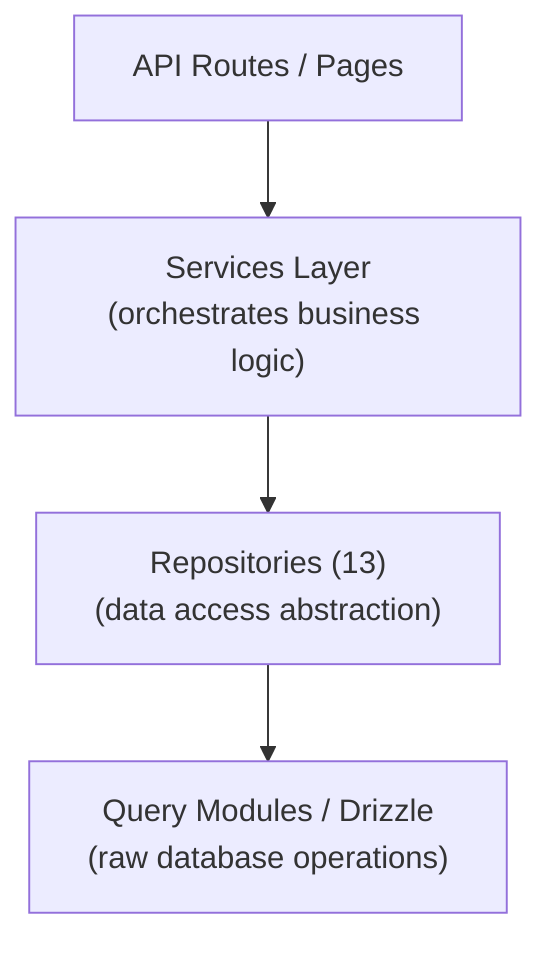

# Модел на хранилище

Шаблонът Ever Works внедрява модел на хранилище чрез 13 специализирани класа на хранилище в `lib/repositories/`. Репозиториите осигуряват абстракция от по-високо ниво над необработените заявки към база данни, капсулирайки сложна логика на заявките, бизнес правила и трансформация на данни.

## Архитектура



## Списък на хранилището

|Хранилище|Файл|Домейн|
|------------|------|--------|
|Администраторски анализ (оптимизиран)|`admin-analytics-optimized.repository.ts`|Администраторски анализ с оптимизация на производителността|
|Статистика на администратора|`admin-stats.repository.ts`|Статистика на администраторското табло|
|Категория|`category.repository.ts`|Управление на категории|
|Клиентско табло|`client-dashboard.repository.ts`|Операции на клиентското табло|
|Клиентски артикул|`client-item.repository.ts`|Изпращане на клиентски артикули|
|Колекция|`collection.repository.ts`|Управление на колекцията|
|Интеграционно картографиране|`integration-mapping.repository.ts`|CRM интеграционни съпоставки|
|Артикул|`item.repository.ts`|Операции с артикули|
|Роля|`role.repository.ts`|Управление на ролите|
|Реклама на спонсор|`sponsor-ad.repository.ts`|Управление на спонсорирана реклама|
|Етикет|`tag.repository.ts`|Управление на тагове|
|Twenty CRM Config|`twenty-crm-config.repository.ts`|CRM конфигурация|
|Потребител|`user.repository.ts`|Управление на потребителите|

## Базирано на Git хранилище за съдържание (`lib/repository.ts`)

В допълнение към хранилищата на бази данни, шаблонът включва базирано на Git хранилище на съдържание на `lib/repository.ts`. Това обработва операциите на Git CMS:

- Клониране на хранилище за съдържание от `DATA_REPOSITORY` URL
- Синхронизиране на съдържание с upstream (дърпане/натискане с откриване на конфликт)
- Проследявайте локалните промени и ги ангажирайте
- Защита при изчакване за Git операции (120 секунди изчакване)

Това е различно от хранилищата на базата данни и управлява директорията `.content/`, използвана от слоя със съдържание.

## Подробности за хранилището

### admin-analytics-optimized.repository.ts

Оптимизирано за производителност хранилище за анализи за администраторското табло. Използва пакетирани заявки и стратегии за кеширане, за да минимизира натоварването на базата данни при генериране на аналитични изгледи.

Ключови възможности:
- Обобщени статистики за изгледи
- Тенденции за растеж на потребителите
- Обобщения на ангажираността на съдържанието
- Анализ на приходите

### admin-stats.repository.ts

Предоставя статистика на таблото за управление на административния панел.

Ключови възможности:
- Общ брой потребители
- Активният абонамент се брои
- Статистика на съдържанието (артикули, коментари, отчети)
- Резюмета на последните дейности

### category.repository.ts

Управлява данни за категории с CRUD операции и обработка на взаимоотношения.

Ключови възможности:
- Списък на категории с брой елементи
- Обхождане на дървото на категории (родител/дете)
- Търсене и филтриране по категории
- Подреждане по категории

### client-dashboard.repository.ts

Най-голямото хранилище (28KB), обработващо всички данни от таблото за управление от страна на клиента.

Ключови възможности:
- Управление на представяне на клиенти
- Анализ на подаването (гледания, гласове, коментари за елемент)
- История на активността на клиента
- Обобщена статистика на таблото за управление
- Страниран списък с елементи с филтри

### client-item.repository.ts

Управлява елементи от гледна точка на клиента (подавателя).

Ключови възможности:
- Създаване и актуализации на подаване на артикул
- Проследяване на състоянието на артикула
- История на подаването
- Филтриране на артикули според клиента

### collection.repository.ts

Управление на колекции за подбрани групи артикули.

Ключови възможности:
- Събиране на CRUD операции
- Асоциации за събиране на предмети
- Подреждане и статус на колекция
- Пагиниран списък на колекцията

### интеграция-mapping.repository.ts

Устойчивост на картографиране на интеграция на CRM.

Ключови възможности:
- Създавайте и актуализирайте съпоставяния между вътрешни идентификатори и CRM идентификатори
- Операции за групово качване
- Търсене по вътрешен ID или CRM ID
- Проследяване на клеймото за синхронизиране
- Управление на хеша на версията за откриване на промени

### item.repository.ts

Основни операции с данни за елемент (за метаданни, съхранени в база данни, не за Git съдържание).

Ключови възможности:
- Управление на метаданни за артикул
- Търсене на артикул с множество филтри
- Агрегиране на данни за ангажираност на артикула
- Управление на избрани елементи

### role.repository.ts

Управление на роли за системата RBAC.

Ключови възможности:
- Ролеви CRUD операции
- Асоциации на роля-разрешение
- Присвояване на потребителски роли
- Валидиране на ролята

### спонсор-ad.repository.ts

Управление на жизнения цикъл на спонсорираната реклама.

Ключови възможности:
- Спонсориране на създаване и управление на реклами
- Преходи на състоянието (предстоящи, активни, изтекли)
- Филтриране на реклами по статус, потребител или артикул
- Данни за интегриране на плащане
- Боравене с изтичане

### tag.repository.ts

Управление на етикети с асоциации на артикули.

Ключови възможности:
- Маркирайте CRUD операции
- Търсене на етикети и автоматично попълване
- Статистика за използване на етикети
- Асоциации артикул-таг

### двадесет-crm-config.repository.ts

Управление на двадесет CRM сингълтън конфигурация.

Ключови възможности:
- Вземете/актуализирайте конфигурацията на CRM
- Активиране/деактивиране на CRM интеграция
- Управление на режима на синхронизиране
- Управление на API ключове

### user.repository.ts

Управление на потребителски акаунти.

Ключови възможности:
- Операции с потребителски профил
- Търсене и филтриране на потребители
- Управление на състоянието на акаунта
- Изтриване на потребител (плавно изтриване)

## Модел на използване

Репозиториите се импортират и използват директно в API маршрути, услуги и сървърни компоненти:

```typescript
import { clientDashboardRepository } from '@/lib/repositories/client-dashboard.repository';

// In an API route
export async function GET(request: NextRequest) {
  const session = await auth();
  const dashboard = await clientDashboardRepository.getDashboardStats(session.user.id);
  return NextResponse.json({ success: true, data: dashboard });
}
```

```typescript
import { itemRepository } from '@/lib/repositories/item.repository';

// In a server component
export default async function ItemPage({ params }) {
  const item = await itemRepository.findBySlug(params.slug);
  return <ItemDetail item={item} />;
}
```

## Хранилище срещу модули за заявки

|Аспект|Модули за заявки (`lib/db/queries/`)|Хранилища (`lib/repositories/`)|
|--------|-----------------------------------|-------------------------------------|
|Сложност|Прости, фокусирани заявки|Сложни операции с множество маси|
|Бизнес логика|Няма (чист достъп до данни)|Включва валидиране и бизнес правила|
|Трансформация на данни|Сурови резултати от база данни|Трансформирани/обогатени данни|
|Случай на употреба|Директни операции с бази данни|Достъп до данни на ниво функция|
|Типичен потребител|Други модули за заявки, прости маршрути|Услуги, API маршрути, сървърни компоненти|

И двата слоя използват Drizzle ORM и импортират връзката с базата данни от `lib/db/drizzle.ts`. Изборът между тях зависи от сложността на операцията: простите четения използват директно модули за заявки, докато сложните функции преминават през хранилища.
