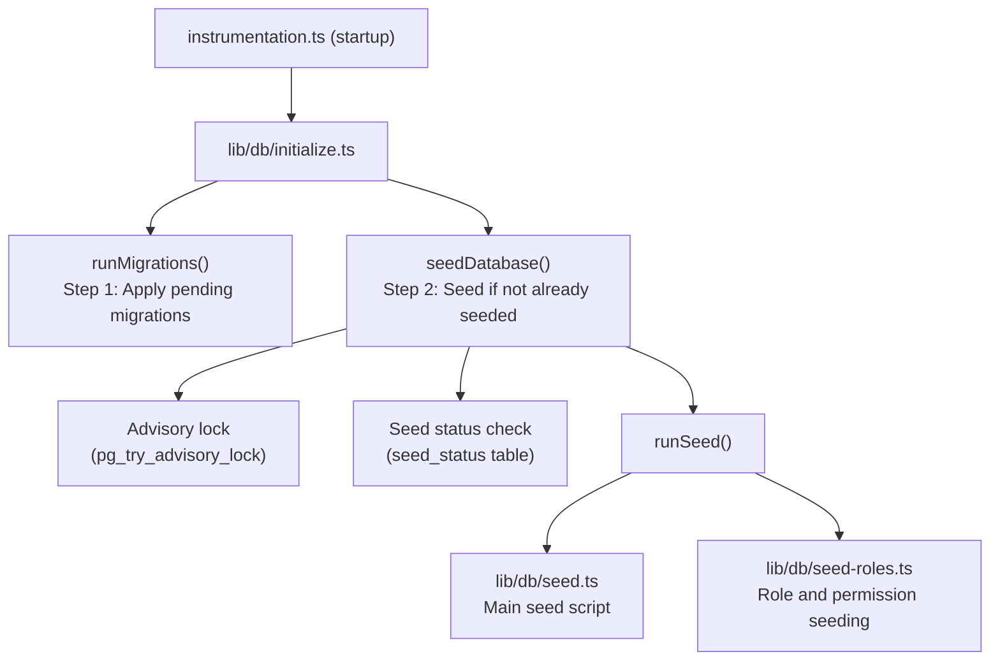

# Зареждане на база данни

Шаблонът Ever Works включва цялостна система за зареждане на база данни, която инициализира основни данни (роли, разрешения, доставчици на плащания) и по избор генерира демонстрационни данни за разработка и тестване.

## Архитектура на семена



## Начални скриптове

### Основен начален скрипт (`lib/db/seed.ts`)

Първичният начален скрипт обработва цялата инициализация на базата данни. Работи в два режима:

**Производствен режим**: Зарежда само основни данни, необходими за функционирането на приложението:
- Роли на администратор и клиент
- Системни разрешения
- Доставчици на плащания по подразбиране
- Необходими системни записи

**Демо режим**: Допълнително добавя изчерпателни тестови данни за разработка:
- Примерни потребители с различни роли
- Примерни клиентски профили
- Примерни абонаменти
- Демо коментари, гласове и любими
- Тестови известия
- Записи в дневника на дейността

Демо режимът се активира, когато е зададена променливата на средата `DEMO_MODE`.

Ключови характеристики:
- **Идемпотентност на таблица**: Всяка таблица се проверява преди зареждане; попълват се само празни таблици
- **Проверки за съществуване на таблици**: Проверява съществуването на таблици преди опит за вмъкване
- **Използва `drizzle-seed`**: Използва официалната библиотека за посяване на Drizzle за генериране на структурирани данни
- **Безопасно за повторно изпълнение**: Може да се извиква многократно без дублиране на данни

```typescript
// Simplified seed flow
export async function runSeed(): Promise<void> {
  await ensureDb();
  const isDemo = isDemoMode();

  if (isDemo) {
    // Seed comprehensive test data
  } else {
    // Seed minimal essential data only
  }

  // Seed roles (always)
  if (await isTableEmpty('roles', roles)) {
    await seedRoles();
  }

  // Seed permissions (always)
  if (await isTableEmpty('permissions', permissions)) {
    await seedPermissions();
  }

  // Seed payment providers (always)
  if (await isTableEmpty('paymentProviders', paymentProviders)) {
    await seedPaymentProviders();
  }

  // Demo-only: seed users, profiles, subscriptions, etc.
  if (isDemo) {
    await seedDemoData();
  }
}
```

### Подаване на роли (`lib/db/seed-roles.ts`)

Специален скрипт за зареждане на системата RBAC, който може да се изпълнява и независимо.

**`seedPermissions()`** създава първоначалния набор от разрешения:

|Ключ за разрешение|Описание|
|---------------|-------------|
|`read:own`|Може да чете собствени данни|
|`write:own`|Може да записва собствени данни|
|`admin:all`|Пълен административен достъп|
|`client:manage`|Може да управлява специфични за клиента операции|
|`user:read`|Може да чете потребителски данни|
|`user:write`|Може да записва потребителски данни|

Използва `onConflictDoUpdate` за безопасно актуализиране на съществуващи разрешения, без да се провалят при повторно изпълнение.

**`linkRolesToPermissions()`** създава асоциации за разрешение за роля:

- **Роля на администратор**: Получава ВСИЧКИ разрешения
- **Клиентска роля**: Получава `read:own`, `write:own` и `client:manage`

Функцията проверява дали необходимите роли (администратор, клиент) съществуват и са активни, преди да създаде асоциации.

**`seedRolesAndPermissions()`** организира и двете операции в транзакция на база данни:

```typescript
export async function seedRolesAndPermissions() {
  await db.transaction(async () => {
    await seedPermissions();
    await linkRolesToPermissions();
  });
}
```

Може да се изпълнява самостоятелно:
```bash
# Run directly (if configured as a script)
npx tsx lib/db/seed-roles.ts
```

## Система за инициализация (`lib/db/initialize.ts`)

Системата за инициализация управлява пълната стартираща последователност със защита на паралелността.

### Проследяване на състоянието на семената

Таблица `seed_status` проследява състоянието на зареждане:

|Статус|Значение|
|--------|---------|
|`seeding`|Извършва се семенна операция|
|`completed`|Семената са завършени успешно|
|`failed`|Зареждането е неуспешно (съхранена грешка)|

### Защита на паралелността

При многопроцесни внедрявания (напр. множество Vercel безсървърни функции, стартиращи едновременно), системата предотвратява дублиране на зареждане чрез:

1. **Препоръчителни заключвания на PostgreSQL**: `pg_try_advisory_lock(12345)` осигурява неблокиращо заключване. Само един процес може да го придобие.
2. **Таблица със състоянието на началния етап**: Други процеси проверяват таблицата `seed_status` и изчакват завършването.
3. **Откриване на остаряло**: Ако състояние `seeding` е по-старо от 5 минути, то се третира като остаряло и се изчиства.
4. **Време за изчакване**: Процесите, чакащи за завършване на друг екземпляр, ще изтекат след 60 секунди.

### Поток на инициализация

```
initializeDatabase()
│
├── DATABASE_URL not set? → Silent skip (DB is optional)
│
├── Step 1: Run migrations (always, idempotent)
│   └── Failure? → Error in production, warning in dev/preview
│
├── Step 2: Check if already seeded
│   └── seed_status = 'completed'? → Done
│
├── Step 3: Handle edge cases
│   ├── Previous seed failed? → Delete failed status, retry
│   ├── Stale seeding (>5min)? → Clean up, retry
│   └── Another instance seeding? → Wait for completion
│
├── Step 4: Acquire advisory lock
│   └── Lock not available? → Wait for other instance
│
├── Step 5: Double-check (another instance may have finished)
│
├── Step 6: Run seed
│   ├── Create seed_status record ('seeding')
│   ├── Execute runSeed()
│   └── Update seed_status ('completed' or 'failed')
│
└── Step 7: Release advisory lock (always, in finally block)
```

## Стартиране на семена ръчно

### Стандартно семе

```bash
pnpm db:seed
```

### Индивидуални начални скриптове

```bash
# Seed roles and permissions only
npx tsx lib/db/seed-roles.ts
```

### Демо режим

За да заредите с демонстрационни данни, задайте променливата на средата `DEMO_MODE`:

```bash
DEMO_MODE=true pnpm db:seed
```

## Променливи на средата

|Променлива|По подразбиране|Описание|
|----------|---------|-------------|
|`DATABASE_URL`| - |Низ за свързване на PostgreSQL (необходим за зареждане)|
|`DEMO_MODE`|`false`|Активиране на зареждане на демонстрационни данни|

## Резюме на данните за семена

### Винаги зареден (режим на производство)

|Таблица|данни|
|-------|------|
|`roles`|Роли на администратор и клиент|
|`permissions`|Дефиниции на системни разрешения|
|`rolePermissions`|Асоциации на роля-разрешение|
|`paymentProviders`|Stripe, LemonSqueezy, Polar, Solidgate|

### Само демо режим

|Таблица|данни|
|-------|------|
|`users`|Примерни потребители на администратор и клиент|
|`accounts`|Акаунти за удостоверяване за примерни потребители|
|`clientProfiles`|Клиентски профили с разнообразни статуси|
|`subscriptions`|Примерни абонаменти за различни планове|
|`comments`|Примерни коментари за артикул|
|`votes`|Примерни гласове|
|`favorites`|Примерни любими|
|`notifications`|Примерни администраторски известия|
|`activityLogs`|Примерна история на дейността|

## Най-добри практики

1. **Никога не стартирайте начален етап в производство с DEMO_MODE**: Демонстрационните данни трябва да се използват само в разработката и етапа
2. **Проверете състоянието на семената преди повторно ръчно сеене**: Направете заявка към таблицата `seed_status`, за да разберете текущото състояние
3. **Използване на транзакции**: Засяването на ролите използва транзакции, за да осигури последователност
4. **Идемпотентен дизайн**: Винаги проверявайте дали съществуват данни, преди да ги вмъкнете, за да поддържате безопасно повторение
5. **Препоръчителни заключвания**: Системата за препоръчително заключване предотвратява проблеми в среда без сървър, където множество копия могат да стартират едновременно
