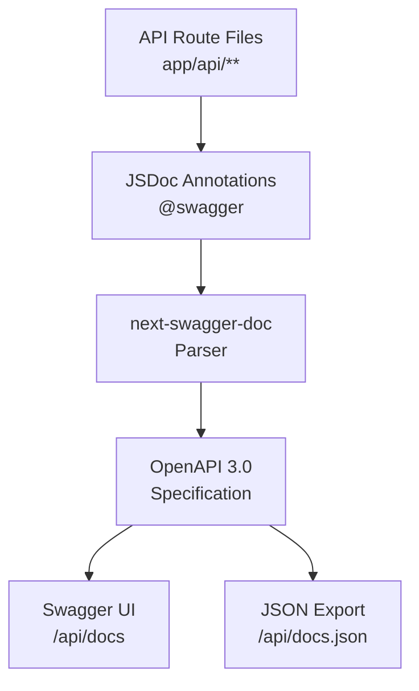

# Генериране на OpenAPI

Шаблонът разполага с автоматизирана система за генериране на OpenAPI документация, която извлича JSDoc анотации от API маршрутите и генерира интерактивна Swagger документация.

## Обзор



## Как да стартирате

```bash
# Генериране на OpenAPI спецификация
pnpm run generate:openapi

# Или директно от apps/web/
cd apps/web
pnpm run generate:openapi
```

## Конфигурация

Тази конфигурация е дефинирана в `apps/web/lib/swagger/swagger-options.ts`:

```typescript
export const swaggerOptions = {
  definition: {
    openapi: '3.0.0',
    info: {
      title: 'Ever Works API',
      version: '1.0.0',
      description: 'API documentation for Ever Works Directory Template',
    },
    servers: [
      {
        url: process.env.NEXT_PUBLIC_APP_URL || 'http://localhost:3000',
        description: 'Development server',
      },
    ],
    components: {
      securitySchemes: {
        sessionAuth: {
          type: 'apiKey',
          in: 'cookie',
          name: 'session',
          description: 'Session-based authentication via NextAuth',
        },
        cronSecret: {
          type: 'apiKey',
          in: 'header',
          name: 'x-cron-secret',
          description: 'Secret key for cron job endpoints',
        },
      },
    },
  },
  apiFolder: './app/api',
};
```

## Схеми за Сигурност

| Схема         | Тип    | Местоположение | Описание                                     |
|---------------|--------|----------------|----------------------------------------------|
| `sessionAuth` | apiKey | cookie         | Удостоверяване чрез сесия (NextAuth)         |
| `session`     | apiKey | cookie         | Алтернативно cookie удостоверяване           |
| `cronSecret`  | apiKey | header         | Секретен ключ за cron задачи                 |

## JSON Схеми

Следните схеми се споделят между крайните точки:

### ErrorResponse

```json
{
  "ErrorResponse": {
    "type": "object",
    "properties": {
      "error": {
        "type": "string",
        "description": "Error message"
      }
    }
  }
}
```

### PaginationMeta

```json
{
  "PaginationMeta": {
    "type": "object",
    "properties": {
      "total": { "type": "integer" },
      "page": { "type": "integer" },
      "limit": { "type": "integer" },
      "totalPages": { "type": "integer" }
    }
  }
}
```

## Добавяне на Swagger Анотации

### Базов Пример

```typescript
/**
 * @swagger
 * /api/admin/companies:
 *   get:
 *     summary: List all companies
 *     tags: [Admin - Companies]
 *     security:
 *       - sessionAuth: []
 *     parameters:
 *       - in: query
 *         name: page
 *         schema:
 *           type: integer
 *         description: Page number
 *     responses:
 *       200:
 *         description: List of companies
 *       401:
 *         description: Unauthorized
 */
export async function GET(request: NextRequest) {
  // implementation
}
```

## Достъп до Документацията

След генериране, документацията е достъпна на:

- **Swagger UI**: `http://localhost:3000/api/docs`
- **JSON спецификация**: `http://localhost:3000/api/docs.json`
