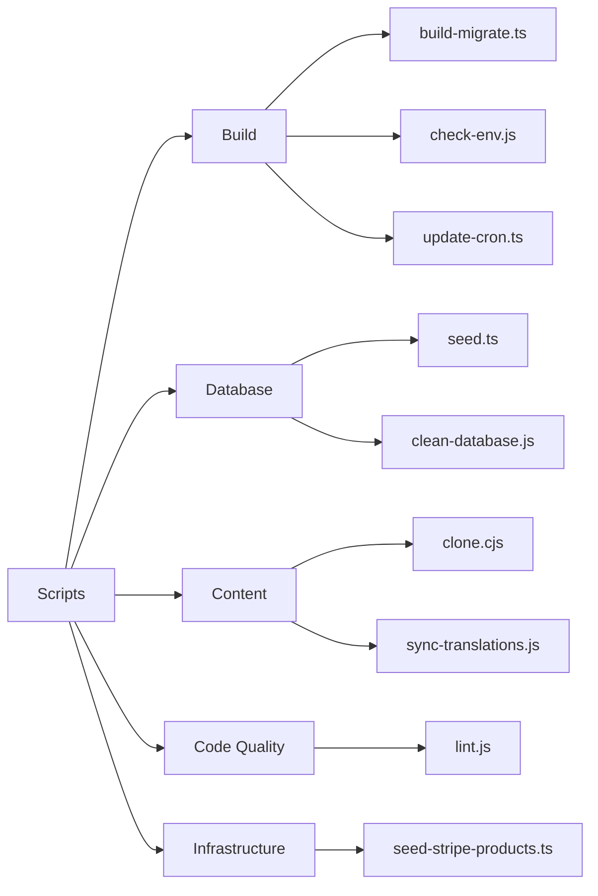
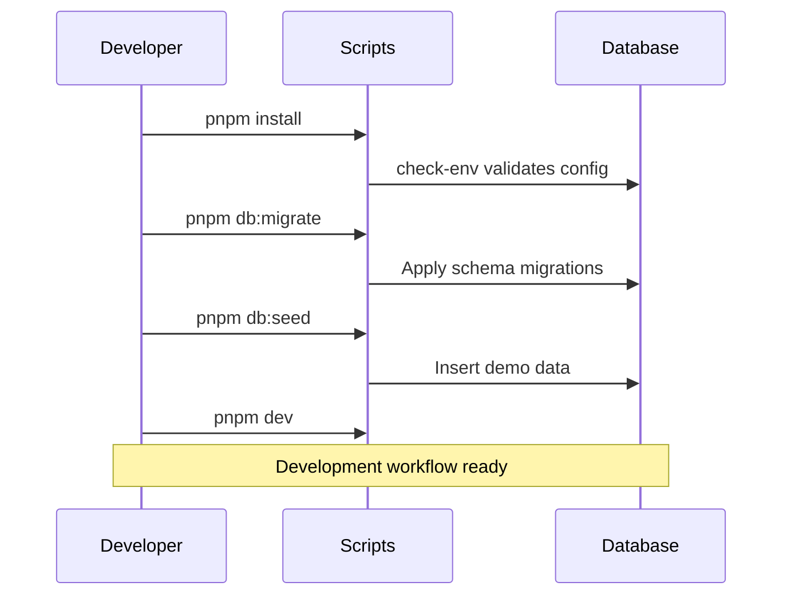

# Преглед на Скриптовете

Директорията `apps/web/scripts/` съдържа помощни скриптове за изграждане, управление на бази данни, управление на съдържание и поддръжка на кода.

## Категории Скриптове



## Скриптове за Изграждане

### `build-migrate.ts`

Изпълнява миграции на базата данни по време на изграждане.

```bash
pnpm run build:migrate
```

Стартира се автоматично преди продуктивното изграждане, за да гарантира, че схемата на базата данни е актуална.

### `check-env.js`

Проверява дали са зададени всички изисквани променливи на средата.

```bash
node scripts/check-env.js
```

Прекъсва изграждането, ако липсват критични промен­ли на средата. Стартира се автоматично по-рано от много скриптове.

### `update-cron.ts`

Обновява конфигурацията на cron задачите в Vercel или Trigger.dev.

```bash
pnpm run update:cron
```

## Скриптове за База Данни

### `seed.ts`

Попълва базата данни с демонстрационни данни за разработка и тестване.

```bash
cd apps/web
pnpm run db:seed
```

#### Данни, Създадени от Seed

| Тип         | Количество | Описание                                       |
|-------------|------------|------------------------------------------------|
| Потребители | 50         | Смесица от клиенти и администратори            |
| Компании    | 20         | Примерни компании с профили                    |
| Категории   | 10         | Категории на директорията                      |
| Елементи    | 100        | Примерни обяви за директорията                 |
| Коментари   | 200        | Примерни рецензии и обратна връзка             |

#### Seed на Stripe Продукти

| Продукт      | Цена    | Интервал |
|--------------|---------|----------|
| Basic Plan   | $9/мес  | Месечен  |
| Pro Plan     | $29/мес | Месечен  |
| Business     | $99/мес | Месечен  |

### `clean-database.js`

**⚠️ Деструктивна операция** — Изтрива всички данни от базата данни. Само за разработка.

```bash
node scripts/clean-database.js
```

## Скриптове за Съдържание

### `clone.cjs`

Клонира Git-базирано CMS хранилище в `.content/`.

```bash
node scripts/clone.cjs
```

Използва `DATA_REPOSITORY` от средата, за да определи кое хранилище да се клонира.

### `sync-translations.js`

Синхронизира всички файлове с преводи с английския еталон.

```bash
node scripts/sync-translations.js
```

Вижте [Работен Процес за Превод](./translation-workflow.md) за пълни детайли.

## Скриптове за Качество на Кода

### `lint.js`

Изпълнява ESLint с конфигурацията на проекта.

```bash
node scripts/lint.js
# Или от корена на монорепото:
pnpm lint
```

## Съответствие с `package.json`

| npm Script         | Скрипт                          | Описание                              |
|--------------------|---------------------------------|---------------------------------------|
| `db:seed`          | `scripts/seed.ts`               | Попълване с демо данни                |
| `db:migrate`       | `drizzle-kit migrate`           | Изпълнение на миграции                |
| `generate:openapi` | `scripts/generate-openapi.ts`   | Генериране на OpenAPI документация    |
| `sync:translations`| `scripts/sync-translations.js`  | Синхронизиране на преводи             |

## Типичен Работен Процес за Разработка



## Добавяне на Нови Скриптове

При добавяне на нов скрипт:

1. Създайте файла в `apps/web/scripts/`
2. Използвайте `.ts` за TypeScript или `.js`/`.cjs` за CommonJS
3. Добавете съответния запис в `apps/web/package.json` в секцията `scripts`
4. Документирайте предназначението и употребата в скрипта
5. Добавете проверките `check-env`, ако скриптът зависи от промен­ли на средата
