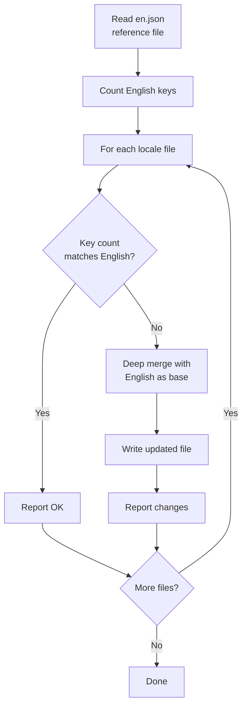
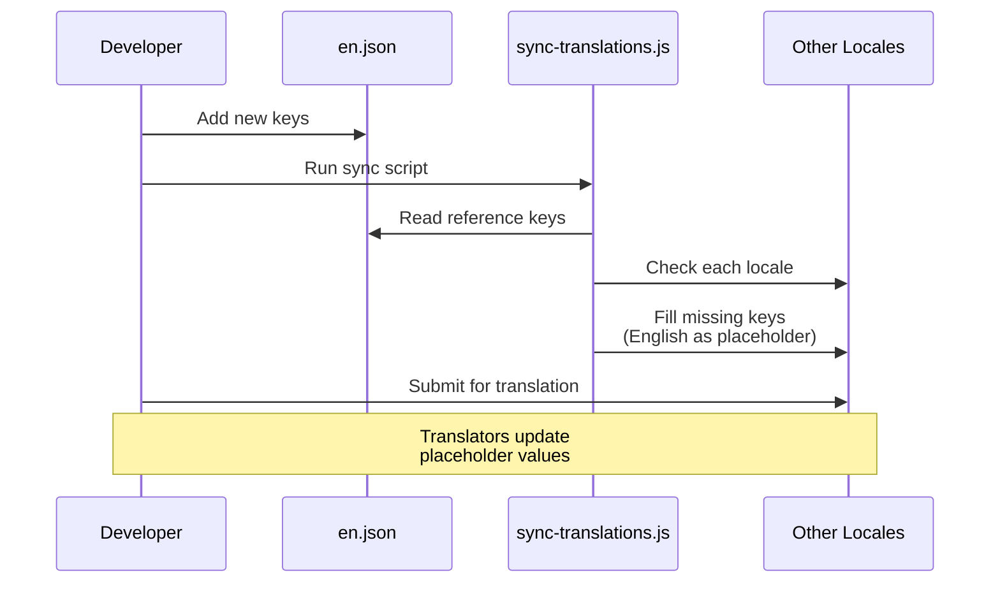

# Работен Процес за Превод

Шаблонът използва `next-intl` за интернационализация (i18n) с файлове съобщения, базирани на JSON. Работният процес за превод гарантира, че всички поддържани локали са синхронизирани с английския еталонен файл чрез автоматизиран скрипт за синхронизация.

## Поддържани Локали

Шаблонът идва с 20 поддържани езика:

| Код  | Език                 | Код  | Език         |
|------|----------------------|------|--------------|
| `en` | Английски (еталон)   | `ko` | Корейски     |
| `ar` | Арабски              | `nl` | Холандски    |
| `bg` | Български            | `pl` | Полски       |
| `de` | Немски               | `pt` | Португалски  |
| `es` | Испански             | `ru` | Руски        |
| `fr` | Френски              | `th` | Тайски       |
| `he` | Иврит                | `tr` | Турски       |
| `hi` | Хинди                | `uk` | Украински    |
| `id` | Индонезийски         | `vi` | Виетнамски   |
| `it` | Италиански           | `ja` | Японски      |

## Структура на Файловете

```
messages/
├── en.json          # Английски (еталон - единственият истинен източник)
├── ar.json          # Арабски
├── bg.json          # Български
├── de.json          # Немски
├── es.json          # Испански
├── fr.json          # Френски
├── he.json          # Иврит
├── hi.json          # Хинди
├── id.json          # Индонезийски
├── it.json          # Италиански
├── ja.json          # Японски
├── ko.json          # Корейски
├── nl.json          # Холандски
├── pl.json          # Полски
├── pt.json          # Португалски
├── ru.json          # Руски
├── th.json          # Тайски
├── tr.json          # Турски
├── uk.json          # Украински
└── vi.json          # Виетнамски
```

## Скрипт за Синхронизиране на Преводите

Скриптът `scripts/sync-translations.js` гарантира, че всеки файл с локал съдържа всички ключове, дефинирани в `en.json`.

### Стартиране на Синхронизацията

```bash
node scripts/sync-translations.js
```

### Как Работи



### Стратегия на Сливане

Синхронизацията използва дълбоко сливане, при което приоритет имат съществуващите преводи:

```javascript
function deepMerge(target, source) {
  const result = { ...source };  // Start with English (source)
  for (const key in target) {
    if (typeof target[key] === 'object' && !Array.isArray(target[key])) {
      result[key] = deepMerge(target[key], source[key] || {});
    } else {
      result[key] = target[key]; // Existing translation wins
    }
  }
  return result;
}
```

**Ключово поведение:**

- Липсващите ключове се попълват с английски стойности като заместители
- Съществуващите преводи никога не се презаписват
- Вложените структури се обработват рекурсивно
- Масивите се третират като листови стойности (не се сливат)

### Примерен Изход

```
English file has 342 translation keys

ar.json: 340/342 keys (missing 2)
  -> Updated ar.json with missing keys from English

bg.json: 342/342 keys - OK
de.json: 342/342 keys - OK
es.json: 338/342 keys (missing 4)
  -> Updated es.json with missing keys from English

Done!
```

## Формат на Файла Съобщения

Файловете с преводи използват вложен JSON с достъп до ключове чрез точкова нотация:

```json
{
  "common": {
    "loading": "Loading...",
    "error": "An error occurred",
    "save": "Save",
    "cancel": "Cancel"
  },
  "auth": {
    "signIn": "Sign In",
    "signOut": "Sign Out",
    "email": "Email Address",
    "password": "Password"
  },
  "navigation": {
    "home": "Home",
    "about": "About",
    "contact": "Contact"
  }
}
```

## Използване на Преводи в Кода

### Клиентски Компоненти

```tsx
'use client';
import { useTranslations } from 'next-intl';

export function LoginButton() {
  const t = useTranslations('auth');
  return <button>{t('signIn')}</button>;
}
```

### Сървърни Компоненти

```tsx
import { getTranslations } from 'next-intl/server';

export default async function Page() {
  const t = await getTranslations('common');
  return <h1>{t('loading')}</h1>;
}
```

### С Променливи

```json
{
  "greeting": "Hello, {name}!",
  "itemCount": "You have {count, plural, =0 {no items} one {1 item} other {# items}}"
}
```

```tsx
const t = useTranslations('dashboard');
t('greeting', { name: 'John' });     // "Hello, John!"
t('itemCount', { count: 5 });         // "You have 5 items"
```

## Добавяне на Нов Език

Следвайте тези стъпки за добавяне на нова локализация:

### Стъпка 1: Създаване на Файл Съобщения

```bash
# Копирайте английския файл като отправна точка
cp messages/en.json messages/NEW_LOCALE.json
```

### Стъпка 2: Регистриране на Локала

Добавете локала към конфигурацията на i18n:

```typescript
// i18n/config.ts (или еквивалент)
export const locales = ['en', 'ar', 'de', ..., 'NEW_LOCALE'];
```

### Стъпка 3: Превеждане на Съдържанието

Редактирайте `messages/NEW_LOCALE.json` и заменете английските низове с преведени стойности.

### Стъпка 4: Изпълнение на Синхронизацията за Проверка

```bash
node scripts/sync-translations.js
```

Ако файлът съдържа всички ключове, ще бъде изведено "OK". Липсващите ключове ще бъдат попълнени с английски заместители.

## Добавяне на Нови Ключове за Превод

При добавяне на нови функции, изискващи потребителски текст:

### Стъпка 1: Добавяне в Английския Еталон

```json
// messages/en.json
{
  "newFeature": {
    "title": "New Feature",
    "description": "This is a new feature"
  }
}
```

### Стъпка 2: Изпълнение на Синхронизацията

```bash
node scripts/sync-translations.js
```

Това автоматично ще добави новите ключове към всички файлове с локали с английски текст като заместители.

### Стъпка 3: Заявяване на Преводи

Споделете новодобавените ключове с преводачите за всеки локал. Те трябва само да актуализират стойностите-заместители на английски.

## Броене на Ключове

Скриптът за синхронизация рекурсивно брои ключовете в вложените обекти:

```javascript
function countKeys(obj) {
  let count = 0;
  for (const key in obj) {
    if (typeof obj[key] === 'object' && !Array.isArray(obj[key])) {
      count += countKeys(obj[key]); // Recurse into nested objects
    } else {
      count++;                      // Count leaf values
    }
  }
  return count;
}
```

Броят се само низовете за превод на листово ниво, а не междинните ключове за групиране.

## Поддръжка на RTL Езици

Шаблонът поддържа езици, четени отдясно наляво (RTL), включително арабски (`ar`) и иврит (`he`). RTL оформлението се обработва автоматично чрез конфигурацията на локала и CSS атрибута `dir`.

## Работен Процес Диаграма



## Добри Практики

1. **Винаги изменяйте `en.json` първи** — Това е единственият истинен източник
2. **Изпълнявайте синхронизацията след всяка английска промяна** — Поддържа всички локали актуализирани
3. **Никога ръчно не добавяйте ключове в не-английски файлове** — Използвайте скрипта за синхронизация
4. **Използвайте вложени групировки** — Групирайте ключовете по функция или страница за удобство
5. **Избягвайте твърдо кодирани низове** — Винаги използвайте `useTranslations` или `getTranslations`
6. **Тествайте RTL оформленията** — Редовно проверявайте показването на арабски и иврит
7. **Използвайте описателни ключове** — `auth.signInButton` вместо `auth.btn1`
