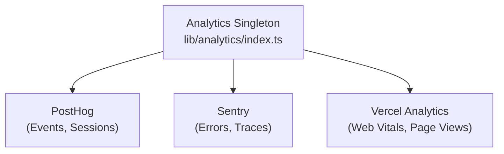

# Система за анализ

Шаблонът Ever Works се интегрира с **PostHog**, **Sentry** и **Vercel Analytics** за цялостно проследяване на събития, наблюдение на грешки, запис на сесия и анализ на ефективността.

## Архитектура



## Аналитичен клас

Основният клас `Analytics` в `lib/analytics/index.ts` е сингълтон, който управлява инициализацията и изпращането на събития между доставчиците:

```typescript
class Analytics {
  private static instance: Analytics;
  private initialized: boolean;
  private exceptionTrackingProvider: ExceptionTrackingProvider;

  static getInstance(): Analytics;
  init(): void;
  trackEvent(name: string, properties?: EventProperties): void;
  trackPageView(url: string): void;
  identify(userId: string, properties?: UserProperties): void;
  reset(): void;
}
```

### Резолюция на доставчика на проследяване на изключения

Системата поддържа гъвкава конфигурация за проследяване на изключения:

```typescript
type ExceptionTrackingProvider = 'sentry' | 'posthog' | 'both' | 'none';
```

Доставчикът се определя чрез проверка на наличността:
1. Прочетете `EXCEPTION_TRACKING_PROVIDER` конфигурационна стойност
2. Уверете се, че избраният доставчик е активиран
3. Върнете се към наличната алтернатива, ако основният не е конфигуриран

## Интеграция на PostHog

### Конфигурация

```bash
NEXT_PUBLIC_POSTHOG_KEY=phc_xxx
NEXT_PUBLIC_POSTHOG_HOST=https://us.i.posthog.com

# Optional
NEXT_PUBLIC_POSTHOG_DEBUG=false
NEXT_PUBLIC_POSTHOG_SESSION_RECORDING=true
NEXT_PUBLIC_POSTHOG_AUTO_CAPTURE=true
NEXT_PUBLIC_POSTHOG_SAMPLE_RATE=1.0
NEXT_PUBLIC_POSTHOG_SESSION_RECORDING_SAMPLE_RATE=0.1
NEXT_PUBLIC_POSTHOG_EXCEPTION_TRACKING=true
```

### PostHog API услуга

Разположена на `lib/services/posthog-api.service.ts` , услугата от страна на сървъра предоставя данни за администраторски анализ:

```typescript
class PostHogApiService {
  constructor(); // Reads from analyticsConfig

  isConfigured(): boolean;
  async getTotalPageViews(days?: number): Promise<number>;
  async getTopPages(days?: number): Promise<PageData[]>;
  async getEventCounts(eventName: string, days?: number): Promise<number>;
}
```

**Изисква се за достъп до API от страна на сървъра:**
```bash
POSTHOG_PERSONAL_API_KEY=phx_xxx
POSTHOG_PROJECT_ID=12345
```

### Кука от страна на клиента

```typescript
import { useAnalytics } from '@/hooks/use-analytics';

const {
  trackEvent,      // (name: string, properties?: object) => void
  trackPageView,   // (url: string) => void
  identify,        // (userId: string, properties?: object) => void
} = useAnalytics();
```

### Гео аналитична кука

```typescript
import { useGeoAnalytics } from '@/hooks/use-geo-analytics';

const {
  geoData,         // Geographic analytics data
  isLoading,
} = useGeoAnalytics();
```

## Интеграция на Sentry

### Конфигурация

```bash
NEXT_PUBLIC_SENTRY_DSN=https://xxx@sentry.io/xxx
SENTRY_AUTH_TOKEN=sntrys_xxx
SENTRY_ORG=your-org
SENTRY_PROJECT=your-project
NEXT_PUBLIC_SENTRY_EXCEPTION_TRACKING=true
```

Sentry осигурява:
- **Проследяване на грешки** -- Автоматично улавяне на необработени изключения
- **Мониторинг на производителността** -- Проследяване на транзакции за API маршрути и зареждания на страници
- **Повторение на сесията** -- Допълнителен запис на сесия

## Vercel Analytics

Vercel Analytics е наличен автоматично при внедряване на Vercel:

```bash
# Enabled by default on Vercel deployments
NEXT_PUBLIC_VERCEL_ANALYTICS=true
```

Осигурява:
- **Web Vitals** -- Мониторинг на основни уеб показатели (LCP, FID, CLS).
- **Прегледи на страници** -- Автоматично проследяване на прегледи на страници
- **Прозрения за аудиторията** - Географски анализ и анализ на устройства

## Табло за управление на администраторския анализ

Администраторското табло предоставя обобщени анализи чрез куката `useAdminStats` :

```typescript
import { useAdminStats } from '@/hooks/use-admin-stats';

const {
  stats,           // Dashboard statistics
  isLoading,
} = useAdminStats();
```

Куката `useDashboardStats` предоставя по-подробни показатели:

```typescript
import { useDashboardStats } from '@/hooks/use-dashboard-stats';

const {
  stats,           // { items, users, revenue, pageViews, ... }
  isLoading,
  refetch,
} = useDashboardStats();
```

## Деактивиране на Анализ

Доставчиците на анализ се деактивират, когато конфигурацията им липсва. Не се зарежда код за проследяване, ако не са зададени съответните променливи на средата. Това позволява на шаблона да работи без никакви анализи в разработката.
