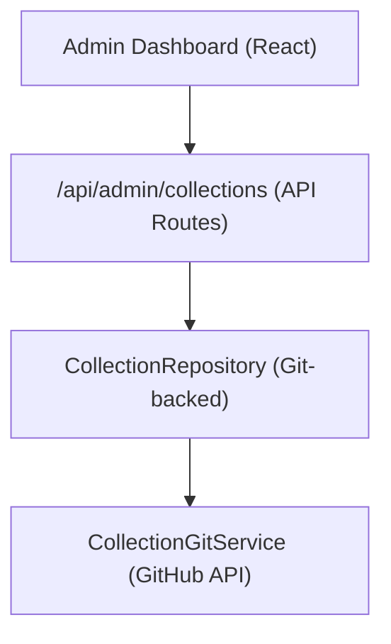

# Система за събиране

Колекциите позволяват на администраторите да подготвят групи от елементи за показване на сайта. Системата съхранява данни за събиране в базираното на Git CMS хранилище и предоставя CRUD операции чрез таблото за управление на администратора.

## Архитектура



Колекциите се съхраняват като файлове в базираното на Git CMS хранилище (конфигурирано чрез `DATA_REPOSITORY` ), като се използва `CollectionGitService` за операции за четене/запис през GitHub API.

## Модел на данни

```typescript
interface Collection {
  id: string;
  name: string;
  slug: string;
  description?: string;
  isActive: boolean;
  items: string[];          // Array of item slugs
  item_count: number;       // Computed from items array
  displayOrder?: number;
  created_at: string;
  updated_at: string;
}
```

## CollectionRepository

Разположено на `lib/repositories/collection.repository.ts` , хранилището предоставя:

```typescript
class CollectionRepository {
  async findAll(options?: CollectionListOptions): Promise<Collection[]>;
  async findById(id: string): Promise<Collection | null>;
  async findBySlug(slug: string): Promise<Collection | null>;
  async create(data: CreateCollectionRequest): Promise<Collection>;
  async update(id: string, data: UpdateCollectionRequest): Promise<Collection>;
  async delete(id: string): Promise<void>;
  async assignItems(id: string, itemSlugs: string[]): Promise<void>;
}
```

### Списък с опции

```typescript
interface CollectionListOptions {
  search?: string;           // Filter by name
  includeInactive?: boolean; // Include inactive collections
  sortBy?: 'name' | 'item_count' | 'created_at';
  sortOrder?: 'asc' | 'desc';
  page?: number;
  limit?: number;
}
```

## Административна кука

```typescript
import { useAdminCollections } from '@/hooks/use-admin-collections';

const {
  collections,        // Collection[]
  total, page, totalPages, limit,
  isLoading, isSubmitting,
  createCollection,   // (data: CreateCollectionRequest) => Promise<boolean>
  updateCollection,   // (id: string, data: UpdateCollectionRequest) => Promise<boolean>
  deleteCollection,   // (id: string) => Promise<boolean>
  assignItems,        // (id: string, itemSlugs: string[]) => Promise<boolean>
  fetchAssignedItems, // (id: string) => Promise<Item[]>
  refetch, refreshData,
} = useAdminCollections({ page: 1, limit: 10, search: '' });
```

## API крайни точки

| Метод | Крайна точка | Описание |
|--------|----------|-------------|
| ВЗЕМЕТЕ | `/api/admin/collections` | Списък на колекциите (странирани) |
| ПУБЛИКАЦИЯ | `/api/admin/collections` | Създаване на нова колекция |
| ПОСТАВЕТЕ | `/api/admin/collections/:id` | Актуализиране на колекция |
| ИЗТРИВАНЕ | `/api/admin/collections/:id` | Изтриване на колекция |
| ВЗЕМЕТЕ | `/api/admin/collections/:id/items` | Вземете присвоени елементи |
| ПУБЛИКАЦИЯ | `/api/admin/collections/:id/items` | Присвояване на елементи към колекция |

## Дисплей от страна на клиента

Куката `useCollectionsExists` проверява дали съществуват активни колекции, използвани за условно рендиране:

```typescript
import { useCollectionsExists } from '@/hooks/use-collections-exists';
const { exists, isLoading } = useCollectionsExists();
```

## Конфигурация

Колекциите изискват следните променливи на средата:

```bash
DATA_REPOSITORY=https://github.com/owner/repo   # Git CMS repository
GH_TOKEN=ghp_xxx                                  # GitHub API token
GITHUB_BRANCH=main                                # Branch for collection data
```

`CollectionRepository` анализира `DATA_REPOSITORY` URL, за да извлече собственика на GitHub и репото, след което използва токена за API удостоверяване.
