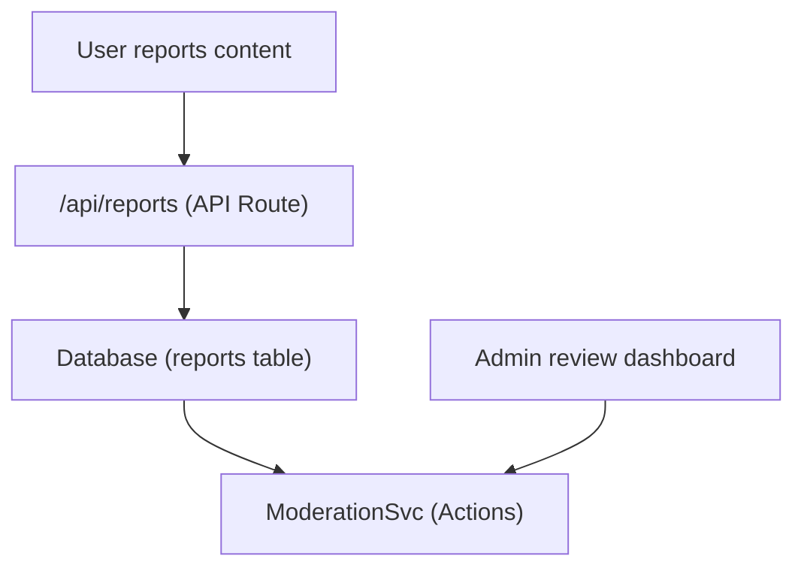

# Доклади и модериране на съдържание

Шаблонът Ever Works включва система за отчитане и модериране на съдържание, която позволява на потребителите да маркират неподходящо съдържание и на администраторите да предприемат действия по докладвани елементи и коментари.

## Архитектура



## Типове съдържание

Системата поддържа отчитане на два типа съдържание:

```typescript
enum ReportContentType {
  ITEM = 'item',
  COMMENT = 'comment',
}
```

## ModerationService

Разположена на `lib/services/moderation.service.ts` , услугата предоставя модериращи действия:

### Резолюция на собственика на съдържанието

```typescript
async function getContentOwner(
  contentType: ReportContentTypeValues,
  contentId: string
): Promise<ContentOwnerResult>;
// Returns: { success: boolean, userId?: string, error?: string }
```

Разрешава автора на докладвано съдържание, като търси коментари чрез `getCommentById()` или елементи чрез `ItemRepository.findById()` .

### Действия за модериране

| Действие | Описание | Ефект |
|--------|-------------|--------|
| **Премахване на съдържание** | Изтрийте докладвания елемент или коментар | Съдържанието е премахнато, историята е записана |
| **Предупреждение на потребителя** | Увеличете броя на предупрежденията | Броячът на предупрежденията е увеличен |
| **Суспендиране на потребител** | Временно спиране на акаунт | Достъпът до акаунта е ограничен |
| **Изключване на потребителя** | Забраняване на акаунта за постоянно | Акаунтът е ограничен за постоянно |
| **Отхвърляне на отчета** | Маркиране на доклада като разрешен без действие | Докладът е затворен |

### Изпълнение на действие

Всяко действие създава запис в историята на модерирането и може да задейства известия по имейл:

```typescript
// Example: Remove content
async function removeContent(
  contentType: ReportContentTypeValues,
  contentId: string,
  reportId: string,
  adminId: string
): Promise<ModerationResult>;
```

Услугата делегира:
- `deleteComment()` -- За премахване на коментар
- `ItemRepository` -- За премахване на елемент
- `createModerationHistory()` -- За одитна пътека
- `incrementWarningCount()` -- За предупреждения за потребителя
- `suspendUserQuery()` / `banUserQuery()` -- За действия по акаунта
- `EmailNotificationService` -- За имейли с уведомителни потребители

## Административна кука

```typescript
import { useAdminReports } from '@/hooks/use-admin-reports';

const {
  reports,           // Report[]
  total, page, totalPages,
  isLoading, isSubmitting,
  resolveReport,     // (id, action, reason?) => Promise<boolean>
  dismissReport,     // (id, reason?) => Promise<boolean>
  deleteReport,      // (id) => Promise<boolean>
  refetch, refreshData,
} = useAdminReports({ page: 1, limit: 10 });
```

## Работен процес на модериране

1. **Съдържание на потребителските отчети** -- Избира причина и изпраща чрез API за отчети
2. **Известие на администратора** -- `NotificationService.createItemReportedNotification()` или `createCommentReportedNotification()` предупреждава администраторите
3. **Администраторски прегледи** -- Преглежда подробностите за отчета в администраторското табло
4. **Администраторът предприема действие** -- Избира от: премахване на съдържание, предупреждаване на потребителя, спиране, забрана или отхвърляне
5. **Записана история** -- `createModerationHistory()` регистрира действието с ID на администратора, клеймо за време и причина
6. **Потребителят е уведомен** -- Имейл известие, изпратено до собственика на съдържанието за предприетите действия

## Действия за модериране Enum

```typescript
enum ModerationAction {
  REMOVE_CONTENT = 'remove_content',
  WARN_USER = 'warn_user',
  SUSPEND_USER = 'suspend_user',
  BAN_USER = 'ban_user',
  DISMISS = 'dismiss',
}
```

## API крайни точки

| Метод | Крайна точка | Описание |
|--------|----------|-------------|
| ПУБЛИКАЦИЯ | `/api/reports` | Изпратете нов отчет |
| ВЗЕМЕТЕ | `/api/admin/reports` | Списък на отчетите (администраторски, пагинирани) |
| ПУБЛИКАЦИЯ | `/api/admin/reports/:id/resolve` | Разрешете доклад с действие |
| ПУБЛИКАЦИЯ | `/api/admin/reports/:id/dismiss` | Отхвърляне на отчет |
| ИЗТРИВАНЕ | `/api/admin/reports/:id` | Изтриване на отчет |

## Свързана документация

- [Система за уведомяване](./notifications.md) -- Как се доставят известията за отчети
- [Гласуване и коментари](./voting-comments.md) -- Система за коментари, която може да бъде докладвана
