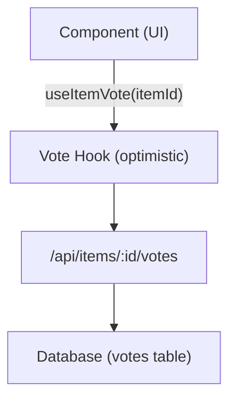

# Система за гласуване и коментари

Шаблонът Ever Works включва пълна система за гласуване и коментиране, която позволява на потребителите да гласуват за/против елементи, да оставят рецензии със звезди и да се ангажират със съдържание. И двете системи използват оптимистични актуализации за незабавна обратна връзка с потребителския интерфейс.

## Система за гласуване

### Архитектура

Системата за гласуване използва модел на гласуване за всеки елемент, при който всеки удостоверен потребител може да даде един глас (за или против) за всеки елемент. Системата проследява нетния брой гласове и гласовете на отделните потребители.



### useItemVote Hook

```typescript
import { useItemVote } from '@/hooks/use-item-vote';

const {
  voteCount,       // number -- net vote count
  userVote,        // 'up' | 'down' | null
  isLoading,       // boolean
  handleVote,      // (type: 'up' | 'down') => void
  refreshVotes,    // () => void
} = useItemVote(itemId);
```

### Поведение при гласуване

| Текущо състояние | Действие | Резултат |
|--------------|--------|--------|
| Без гласуване | Щракнете нагоре | Гласуване за (+1) |
| Без гласуване | Щракнете Надолу | Гласуване против (-1) |
| Гласуван за | Щракнете нагоре | Премахване на глас (превключване) |
| Гласуван за | Щракнете Надолу | Превключване към гласуване против (-2 нетно) |
| Гласуван против | Щракнете Надолу | Премахване на глас (превключване) |
| Гласуван против | Щракнете нагоре | Превключване към гласуване за (+2 нетно) |

### Оптимистични актуализации

Куката за гласуване прилага оптимистични актуализации с връщане назад:

1. **onMutate** -- Анулиране на изходящите заявки, снимка на текущото състояние, прилагане на оптимистична актуализация
2. **onSuccess** -- Замяна на оптимистични данни с отговор на сървъра
3. **onError** -- Връщане към моментна снимка, показване на тост за грешка

### Удостоверяване

Неупълномощени потребители, които се опитват да гласуват, виждат модал за влизане чрез `useLoginModal` :

```typescript
if (!user) {
  loginModal.onOpen('Please sign in to vote on this item');
  throw new Error('Authentication required');
}
```

### Управление на кеша

Помощната кука `useVoteCache` осигурява междукомпонентни кеш операции:

```typescript
import { useVoteCache } from '@/hooks/use-item-vote';

const {
  invalidateAllVotes,     // () => void
  invalidateItemVotes,    // (itemId: string) => void
  clearVoteCache,         // () => void
  prefetchItemVotes,      // (itemId: string) => Promise<void>
} = useVoteCache();
```

## Система за коментари

### Архитектура

Коментарите поддържат пълни CRUD операции със звездни оценки, модериране и актуализации в реално време.

### useComments Hook

```typescript
import { useComments } from '@/hooks/use-comments';

const {
  comments,              // CommentWithUser[]
  isPending,
  createComment,         // ({ content, itemId, rating }) => Promise
  isCreating,
  updateComment,         // ({ commentId, content?, rating? }) => Promise
  isUpdating,
  deleteComment,         // (commentId) => Promise
  isDeleting,
  rateComment,           // ({ commentId, rating }) => void
  isRatingComment,
  updateCommentRating,   // ({ commentId, rating }) => void
  isUpdatingRating,
  commentRating,         // number
  isLoadingRating,
} = useComments(itemId);
```

### Модел на данни за коментар

Всеки коментар включва:
- `id` -- Уникален идентификатор
- `content` -- Текст на коментара
- `rating` -- Оценка със звезди по избор (1-5)
- `userId` -- Справка за автора
- `itemId` -- Свързан артикул
- `user` -- Попълнени потребителски данни (име, имейл, изображение)
- `createdAt` / `updatedAt` -- Времеви клейма

### Интегриране на рейтинг

Коментарите и оценките са тясно интегрирани:
- Създаването на коментар с оценка актуализира общата оценка на елемента
- Редактирането на оценката на коментар предизвиква повторно изчисление
- Заявката `["item-rating", itemId]` се извлича отново след всяка мутация на коментар

### Междукомпонентни събития

Системата за коментари изпраща персонализирани DOM събития за междукомпонентна координация:

```typescript
const COMMENT_MUTATION_EVENT = "comment:mutated";
window.dispatchEvent(new CustomEvent(COMMENT_MUTATION_EVENT, { detail: comment }));
```

Други компоненти могат да слушат за промени в коментарите без директно свързване на React Query.

### Администраторско модериране

Куката `useAdminComments` осигурява управление на коментари на ниво администратор:

```typescript
import { useAdminComments } from '@/hooks/use-admin-comments';

const {
  comments,         // AdminCommentItem[]
  totalComments,
  totalPages,
  isDeleting,       // string | null (ID of comment being deleted)
  deleteComment,    // (id: string) => Promise<boolean>
} = useAdminComments({ page: 1, limit: 10, search: '' });
```

### API крайни точки

| Метод | Крайна точка | Описание |
|--------|----------|-------------|
| ВЗЕМЕТЕ | `/api/items/:id/comments` | Извличане на коментари за елемент |
| ПУБЛИКАЦИЯ | `/api/items/:id/comments` | Създайте нов коментар |
| ПОСТАВЕТЕ | `/api/items/:id/comments/:commentId` | Актуализиране на коментар |
| ИЗТРИВАНЕ | `/api/items/:id/comments/:commentId` | Изтриване на коментар |
| ПУБЛИКАЦИЯ | `/api/items/:id/comments/rating` | Оценете коментар |
| ПОСТАВЕТЕ | `/api/items/:id/comments/rating` | Актуализиране на оценката на коментара |
| ВЗЕМЕТЕ | `/api/items/:id/comments/rating` | Вземете обобщена оценка |

## Интегриране на флаг за функции

И гласуването, и коментарите зачитат флаговете на функциите:

```typescript
const flags = getFeatureFlags();
// flags.ratings -- Controls star rating display
// flags.comments -- Controls comment section visibility
```

Когато базата данни не е конфигурирана ( `DATABASE_URL` липсва), тези функции се дезактивират автоматично.
