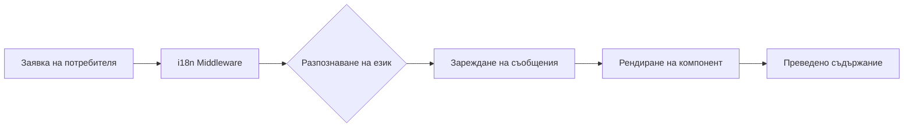

# Преглед на Интернационализацията

Ever Works е проектиран с мисъл за интернационализация, поддържайки множество езици чрез `next-intl`.

## 🌍 Поддържани езици

Шаблонът включва вградена поддръжка за:

- 🇬🇧 **Английски** (en) – Език по подразбиране
- 🇫🇷 **Френски** (fr)
- 🇪🇸 **Испански** (es)
- 🇩🇪 **Немски** (de)
- 🇨🇳 **Китайски** (zh)
- 🇸🇦 **Арабски** (ar)
- 🇧🇬 **Български** (bg)
- 🇳🇱 **Нидерландски** (nl)
- 🇮🇱 **Иврит** (he)
- 🇮🇹 **Италиански** (it)
- 🇵🇱 **Полски** (pl)
- 🇵🇹 **Португалски** (pt)
- 🇷🇺 **Руски** (ru)

## Как работи

### Локализация базирана на URL

Ever Works използва URL-базирано разпознаване на езика:

```
https://yoursite.com/en/about    → Английски
https://yoursite.com/fr/about    → Френски
https://yoursite.com/es/about    → Испански
```

### Автоматично разпознаване на езика

Системата автоматично:
1. Разпознава езика на браузъра на потребителя
2. Пренасочва към съответния езиков стандарт
3. Запомня езиковите предпочитания на потребителя
4. Връща към езика по подразбиране (Английски)

## Архитектура на преводите



## Файлове с преводи

Преводите се съхраняват в JSON файлове:

```
messages/
├── en.json    # Английски
├── fr.json    # Френски
├── es.json    # Испански
├── de.json    # Немски
├── zh.json    # Китайски
└── ar.json    # Арабски
```

## Бърз пример

```typescript
import { useTranslations } from 'next-intl';

export function MyComponent() {
  const t = useTranslations('common');

  return (
    <div>
      <h1>{t('welcome')}</h1>
      <p>{t('description')}</p>
    </div>
  );
}
```

## Функции

### ✅ Пълно покритие на преводи
- UI компоненти
- Етикети на форми и съобщения за валидиране
- Имейл шаблони
- Съобщения за грешки
- SEO метаданни

### ✅ Поддръжка на RTL
- Автоматично RTL оформление за арабски и иврит
- Огледални UI елементи
- Правилно подравняване на текста

### ✅ Форматиране на дати и числа
- Формати на дати за конкретен език
- Форматиране на валута
- Форматиране на числа

### ✅ Множествено число
- Автоматични форми за множествено число
- Правила за конкретен език

## Следващи стъпки

- [Ръководство за превод →](./translation-guide) – Научете как да добавяте и управлявате преводи
- [Начало](/getting-started) – Настройте проекта
- [Персонализиране](/guides/customization) – Персонализирайте сайта

## Нужна ли ви е помощ?

Посетете нашата [страница за поддръжка](/advanced-guide/support) за помощ с интернационализацията.
