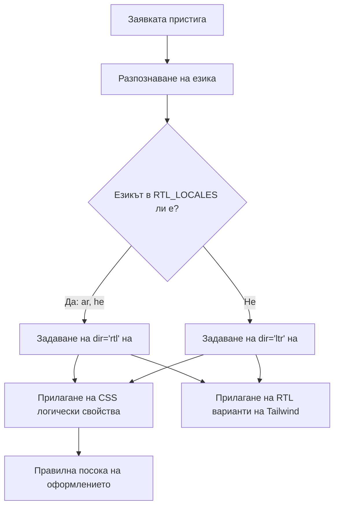

# Поддръжка на RTL (отдясно наляво)

Шаблонът осигурява пълна поддръжка за езици с посока на текста отдясно наляво (RTL), като арабски и иврит. Тази страница документира как работи разпознаването на RTL, прилагането на посоката на оформлението и адаптирането на компонентите към RTL контексти.

## Преглед на архитектурата



## Изходни файлове

| Файл | Предназначение |
|------|---------|
| `lib/constants.ts` | Дефиниране на списъка с RTL езици |
| `app/layout.tsx` | Основно оформление с атрибут `dir` |
| `components/language-switcher.tsx` | Карта на езиците с метаданни `isRTL` |

## Конфигурация на RTL езиците

```typescript
export const RTL_LOCALES: readonly Locale[] = ['ar', 'he'] as const;
```

## Как се прилага посоката

### Разпознаване в основното оформление

```typescript
export default async function RootLayout({ children }) {
  const locale = await getLocale();
  const dir = RTL_LOCALES.includes(locale as Locale) ? 'rtl' : 'ltr';

  return (
    <html lang={locale} dir={dir} suppressHydrationWarning>
      <body className={`${getFontClassNames(locale)} antialiased`}>
        {children}
      </body>
    </html>
  );
}
```

## CSS стратегии за RTL

### 1. Логически CSS свойства

| Физическо свойство | Логическо свойство | Стойност LTR | Стойност RTL |
|-------------------|-----------------|-------------|-------------|
| `margin-left` | `margin-inline-start` | Ляв отстъп | Десен отстъп |
| `margin-right` | `margin-inline-end` | Десен отстъп | Ляв отстъп |
| `padding-left` | `padding-inline-start` | Ляв padding | Десен padding |
| `text-align: left` | `text-align: start` | По ляво | По дясно |
| `left` | `inset-inline-start` | Лява позиция | Дясна позиция |

### 2. Поддръжка на RTL в Tailwind CSS

```html
<div class="ml-4 rtl:mr-4 rtl:ml-0">
  Съдържание с насочен отстъп
</div>

<svg class="rtl:rotate-180">
  <path d="M1 9 4-4-4-4" />
</svg>
```

### 3. Логически помощни класове Tailwind

```html
<div class="ps-4">  <!-- padding-inline-start: 1rem -->
<div class="pe-4">  <!-- padding-inline-end: 1rem -->
<div class="ms-4">  <!-- margin-inline-start: 1rem -->
<div class="me-4">  <!-- margin-inline-end: 1rem -->
```

## Типични RTL проблеми

| Проблем | Причина | Решение |
|-------|-------|-----|
| Грешно подравняване на текст | Използване на `text-left` вместо `text-start` | Използвайте логически свойства |
| Иконките не са огледално отразени | Липсва `rtl:rotate-180` на насочени иконки | Добавете RTL вариант |
| Отстъпът е от грешната страна | Използване на `ml-*` вместо `ms-*` | Използвайте логически помощни класове Tailwind |

## Добавяне на нов RTL език

1. **Добавете езика** в `LOCALES` в `lib/constants.ts`
2. **Добавете в `RTL_LOCALES`**
3. **Създайте файл с съобщения** `messages/ur.json`
4. **Добавете запис в картата на езиците** в `components/language-switcher.tsx`
5. **Добавете SVG флаг** в `public/flags/ur.svg`
6. **Тествайте внимателно оформлението** в RTL режим

## Добри практики

1. **Предпочитайте логически CSS свойства** пред физическите
2. **Използвайте `dir="rtl"` на `<html>`** (вече се обработва от основното оформление)
3. **Тествайте с реално арабско/иврит съдържание**, а не английско в RTL режим
4. **Не отразявайте декоративни изображения** или лога на марката
