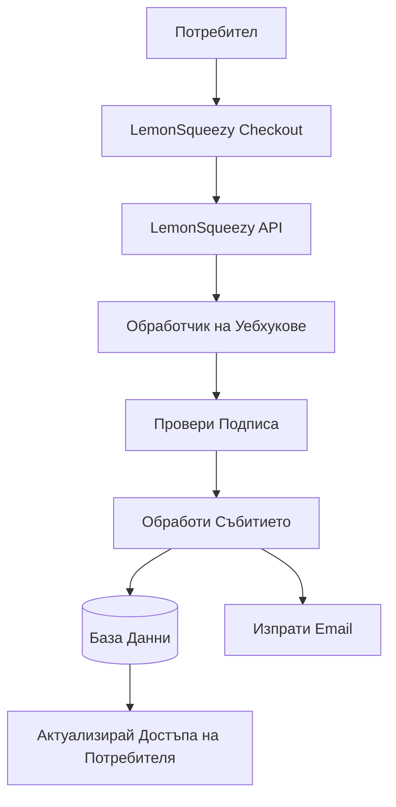

# Конфигурация на LemonSqueezy

Това ръководство обяснява как да конфигурирате LemonSqueezy като доставчик на плащания в приложението Ever Works.

## Преглед

LemonSqueezy е платформа merchant of record, която опростява:

- 💰 Глобални плащания с автоматично данъково съответствие
- 🌍 Поддръжка за 135+ страни
- 📊 Вградена защита от измами
- 🔄 Управление на абонаменти
- 💳 Множество методи на плащане
- 📧 Автоматизирани e-mail разписки

:::tip Защо LemonSqueezy?
LemonSqueezy действа като merchant of record, автоматично обработвайки цялото данъчно съответствие, ДДС и данък върху продажбите. Това означава, че не е нужно да се регистрирате за данъци в различни страни.
:::

## Задължителни променливи на обкръжението

Добавете тези променливи към вашия `.env.local` файл:

```env
# Конфигурация LemonSqueezy
LEMONSQUEEZY_API_KEY=your_api_key_here
LEMONSQUEEZY_WEBHOOK_SECRET=your_webhook_secret_here
LEMONSQUEEZY_STORE_ID=your_store_id_here

# ID на продукт/вариант (незадължително)
NEXT_PUBLIC_LEMONSQUEEZY_PRO_VARIANT_ID=variant_id_here
NEXT_PUBLIC_LEMONSQUEEZY_SPONSOR_VARIANT_ID=variant_id_here
```

## Настройване на таблото за управление на LemonSqueezy

### Стъпка 1: Създайте магазина си

1. Регистрирайте се в [LemonSqueezy](https://lemonsqueezy.com)
2. Създайте нов магазин
3. Попълнете настройките на магазина (име, валута и т.н.)
4. Копирайте **ID на магазина** от URL или настройките

### Стъпка 2: Създайте продукти

1. Отидете на **Продукти** → **Нов Продукт**
2. Създайте нивата на ценообразуване:

| Продукт | Цена | Тип | Описание |
|---------|------|-----|----------|
| **Pro план** | $10/мес | Абонамент | Разширени функции |
| **Спонсорски план** | $20 | Еднократен | Премиум поддръжка |

3. За всеки продукт създайте **Варианти** с конкретни цени
4. Копирайте **ID на варианта** за всяка ценова опция

### Стъпка 3: Вземете API ключ

1. Отидете на **Настройки** → **API**
2. Създайте нов API ключ
3. Копирайте API ключа (започва с `ls_`)
4. Добавете го към `.env.local` като `LEMONSQUEEZY_API_KEY`

### Стъпка 4: Конфигурирайте уебхукове

1. Отидете на **Настройки** → **Уебхукове**
2. Щракнете на **Създай уебхук**
3. Конфигурирайте уебхука:
   - **URL**: `https://вашдомейн.com/api/lemonsqueezy/webhook`
   - **Събития**: Изберете всички абонаментни и поръчкови събития
   - **Тайна**: Генерирайте таен ключ

4. Копирайте **Тайната на уебхука** и я добавете към `.env.local`

#### Препоръчани събития

Изберете тези събития в конфигурацията на уебхука:

- ✅ `subscription_created` - Нов абонамент
- ✅ `subscription_updated` - Промени в абонамента
- ✅ `subscription_cancelled` - Отмяна
- ✅ `subscription_payment_success` - Успешно плащане
- ✅ `subscription_payment_failed` - Неуспешно плащане
- ✅ `subscription_trial_will_end` - Пробният период приключва
- ✅ `order_created` - Еднократна покупка
- ✅ `order_refunded` - Обработено възстановяване

## Крайна точка на уебхука

Уебхукът е достъпен на: `/api/lemonsqueezy/webhook`

### Поддържано съпоставяне на събития

| Събитие LemonSqueezy | Вътрешно събитие | Описание |
|---------------------|-----------------|----------|
| `subscription_created` | `SUBSCRIPTION_CREATED` | Създаден нов абонамент |
| `subscription_updated` | `SUBSCRIPTION_UPDATED` | Абонаментът е актуализиран |
| `subscription_cancelled` | `SUBSCRIPTION_CANCELLED` | Абонаментът е отменен |
| `subscription_payment_success` | `SUBSCRIPTION_PAYMENT_SUCCEEDED` | Плащането е успешно |
| `subscription_payment_failed` | `SUBSCRIPTION_PAYMENT_FAILED` | Плащането е неуспешно |
| `subscription_trial_will_end` | `SUBSCRIPTION_TRIAL_ENDING` | Пробният период скоро приключва |
| `order_created` | `PAYMENT_SUCCEEDED` | Еднократно плащане |
| `order_refunded` | `REFUND_SUCCEEDED` | Обработено възстановяване |

## Имплементация

### Архитектура на платежната система



### Функционалности

#### Сигурност

- ✅ Проверка на HMAC подпис (SHA-256)
- ✅ Валидиране на тайната на уебхука
- ✅ Цялостна обработка на грешки
- ✅ Регистриране на заявки

#### Функционалност

- ✅ Управление на жизнения цикъл на абонаментите
- ✅ Автоматична обработка на плащания
- ✅ Email известия
- ✅ Синхронизация с база данни
- ✅ Мониторинг на грешки

## Пример за употреба

### Създайте checkout

```typescript
import { LemonSqueezyProvider } from '@/lib/payment/providers/lemonsqueezy-provider';

const lsProvider = new LemonSqueezyProvider({
  apiKey: process.env.LEMONSQUEEZY_API_KEY!,
  storeId: process.env.LEMONSQUEEZY_STORE_ID!,
});

// Създайте checkout сесия
const checkout = await lsProvider.createCheckout({
  variantId: 'variant_id_here',
  customerId: 'customer_id',
  redirectUrl: 'https://yoursite.com/success',
});

// Пренасочете потребителя към checkout.url
```

## Тестване

### Тестов режим

1. LemonSqueezy предоставя тестов режим за разработка
2. Използвайте тестови API ключове (налични в таблото за управление)
3. Тествайте уебхукове с инструмента за тестване на уебхукове на LemonSqueezy

### Локално тестване

```bash
# Използвайте инструмент като ngrok за излагане на локалния сървър
ngrok http 3000

# Актуализирайте URL на уебхука в таблото за управление на LemonSqueezy
https://your-ngrok-url.ngrok.io/api/lemonsqueezy/webhook
```

## Мониторинг

Всички уебхук събития се регистрират:

- ✅ **Успех**: `✅ LemonSqueezy [event] handled successfully`
- ❌ **Грешки**: `❌ Failed to handle [event]: [error details]`

Проверете логовете на приложението за активност на уебхукове.

## Отстраняване на проблеми

### Чести проблеми

**Проблем**: Грешка "No signature provided"

- **Решение**: Уверете се, че LemonSqueezy изпраща хедъра `x-signature`
- Проверете конфигурацията на уебхука в таблото за управление на LemonSqueezy

**Проблем**: Грешка "Invalid signature"

- **Решение**: Проверете дали `LEMONSQUEEZY_WEBHOOK_SECRET` съответства на тайната в LemonSqueezy
- Уверете се, че URL на уебхука е правилно конфигуриран

**Проблем**: Уебхукът не получава събития

- **Решение**: Проверете дали URL на уебхука е публично достъпен
- Използвайте ngrok за локално тестване
- Проверете логовете на уебхуковете на LemonSqueezy

## Най-добри практики за сигурност

1. **Само HTTPS**: Винаги използвайте HTTPS за уебхук крайни точки в продукция
2. **Ротация на тайни**: Периодично ротирайте тайните на уебхуковете
3. **Мониторинг**: Наблюдавайте логовете на уебхуковете за подозрителна активност
4. **Променливи на обкръжението**: Никога не качвайте тайни в контрол на версии
5. **Rate limiting**: Приложете rate limiting за продукционни уебхукове
