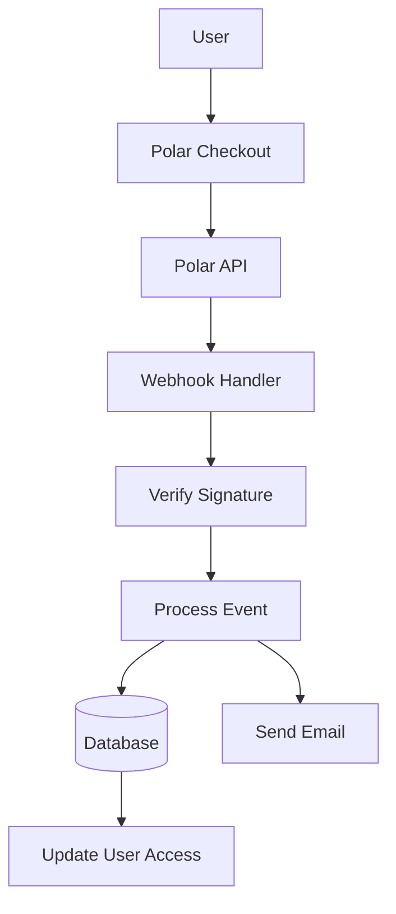

# Полярна конфигурация

Това ръководство обяснява как да конфигурирате Polar като доставчик на плащания във вашето приложение Ever Works.

## Преглед

Polar е модерна платежна платформа, предназначена за разработчици и творци, която предлага:

- 💻 Удобен за разработчици API и документация
- 🔄 Поддръжка за абонамент и еднократно плащане
- 🐙 GitHub интеграция за спонсорство
- 💰 Прозрачна ценова структура
- 🔒 Сигурна обработка на плащанията
- 📊 Вградени анализи и отчети

:::tip Защо Polar?
Polar е създаден специално за разработчици и проекти с отворен код, като предлага чист API, отлична документация и безпроблемна интеграция на GitHub за спонсорство и осигуряване на приходи.
:::

## Задължителни променливи на средата

Добавете тези променливи към вашия `.env.local` файл:

```env
# Polar Configuration
POLAR_API_KEY=your_polar_api_key_here
POLAR_WEBHOOK_SECRET=your_webhook_secret_here
POLAR_APP_URL=https://your-app-url.com

# Product IDs (optional)
NEXT_PUBLIC_POLAR_SUBSCRIPTION_PRODUCT_ID=product_id_here
NEXT_PUBLIC_POLAR_ONETIME_PRODUCT_ID=product_id_here
```

::: предупреждение
Никога не предавайте вашите секретни ключове на контрола на версиите. Запазете `.env.local` във вашия `.gitignore` файл.
:::

## Настройка на таблото на Polar

### Стъпка 1: Създайте своя акаунт

1. Регистрирайте се в [Polar](https://polar.sh)
2. Завършете настройката на вашия акаунт
3. Потвърдете своя имейл адрес

### Стъпка 2: Създайте продукти

1. Навигирайте до **Продукти** → **Нов продукт**
2. Създайте вашите ценови нива:

| Продукт | Цена | Тип | Описание |
|---------|-------|------|-------------|
| **Професионален план** | $10/месец | Абонамент | Разширени функции |
| **Спонсорски план** | $20 | Еднократно | Премиум поддръжка |

3. Конфигурирайте настройките на продукта:
   - Задайте ценообразуване и цикъл на фактуриране
   - Добавете описания на продуктите
   - Конфигуриране на нива на достъп
4. Копирайте **Product ID** за всеки продукт

### Стъпка 3: Вземете API ключ

1. Отидете на **Настройки** → **API ключове**
2. Създайте нов API ключ
3. Копирайте API ключа
4. Добавете го към вашия `.env.local` като `POLAR_API_KEY` ::: съвет
Polar предоставя отделни ключове за разработка и производство. Използвайте тестови ключове по време на разработката.
:::

### Стъпка 4: Конфигурирайте Webhooks

1. Отидете на **Настройки** → **Уебкукички**
2. Щракнете върху **Създаване на уебкукичка**
3. Конфигурирайте уеб кукичката:
   - **URL**: `https://yourdomain.com/api/polar/webhook` - **Събития**: Изберете всички събития за плащане и абонамент
   - **Secret**: Генерирайте таен ключ

4. Копирайте **Webhook Secret** и го добавете към вашия `.env.local` #### Препоръчани събития

Изберете тези събития в конфигурацията на вашата уебкукичка:

- ✅ `payment.succeeded` - Успешно плащане
- ✅ `payment.failed` - Неуспешно плащане
- ✅ `subscription.created` - Нов абонамент
- ✅ `subscription.updated` - Промени в абонамента
- ✅ `subscription.cancelled` - Анулиране
- ✅ `subscription.trial_will_end` - Край на пробния период
- ✅ `refund.created` - Възстановяването е обработено

## Архитектура на платежната система



### Доставчик Polar

Доставчикът Polar ( `lib/payment/lib/providers/polar-provider.ts` ) прилага:

- ✅ Управление на клиенти
- ✅ Управление на продукти и цени
- ✅ Жизнен цикъл на абонамента
- ✅ Обработка на плащане
- ✅ Обработка на уеб кукичка
- ✅ Поддръжка за възстановяване на средства

### API маршрути

Налични са следните API маршрути:

| Маршрут | Метод | Описание |
|-------|--------|-------------|
| `/api/polar/webhook` | ПУБЛИКАЦИЯ | Управление на Polar webhooks |
| `/api/polar/subscription` | ПУБЛИКАЦИЯ | Създаване на абонамент |
| `/api/polar/subscription` | ПОСТАВЕТЕ | Актуализиране на абонамент |
| `/api/polar/subscription` | ИЗТРИВАНЕ | Отказ от абонамент |
| `/api/polar/checkout` | ПУБЛИКАЦИЯ | Създаване на сесия за плащане |
| `/api/polar/payment` | ВЗЕМЕТЕ | Проверете състоянието на плащане |

### Компоненти на потребителския интерфейс

Системата използва компоненти за плащане на Polar:

- `PolarCheckoutButton` - Компонент на бутона за плащане
- `PolarPaymentForm` - Форма за плащане с валидиране
- Адаптивен дизайн за мобилни устройства и настолни компютри
- Поддръжка на множество методи на плащане

## Примери за използване

### Създайте абонамент

```typescript
import { PolarProvider } from '@/lib/payment/providers/polar-provider';

const configs = createProviderConfigs({
  apiKey: process.env.POLAR_API_KEY!,
  webhookSecret: process.env.POLAR_WEBHOOK_SECRET!,
  options: {
    appUrl: process.env.POLAR_APP_URL!
  }
});

const polarProvider = new PolarProvider(configs.polar);

const subscription = await polarProvider.createSubscription({
  customerId: 'customer_id',
  productId: 'product_id',
  paymentMethodId: 'payment_method_id',
  trialPeriodDays: 7
});
```

### Създайте сесия за плащане

```typescript
const checkout = await polarProvider.createCheckout({
  productId: 'product_id_here',
  customerId: 'customer_id',
  successUrl: 'https://yoursite.com/success',
  cancelUrl: 'https://yoursite.com/cancel'
});

// Redirect user to checkout.url
```

### Използвайте компонента за плащане

```tsx
import { PolarCheckoutButton } from '@/lib/payment';

function PaymentPage() {
  return (
    <PolarCheckoutButton
      productId="product_id_here"
      amount={1000} // 10.00 USD in cents
      currency="usd"
      isSubscription={true}
      onSuccess={(paymentId) => {
        console.log('Payment succeeded:', paymentId);
        // Redirect to success page or update UI
      }}
      onError={(error) => {
        console.error('Payment error:', error);
        // Show error message to user
      }}
    />
  );
}
```

## Тестване на вашата интеграция

### Тестови режим

1. **Използвайте тестови API ключове** (достъпни в таблото за управление на Polar)
2. **Използвайте методи за тестово плащане**:
   - Тестови карти, предоставени в таблото за управление на Polar
   - Тестови режим за всички платежни потоци

3. **Тествайте webhooks локално** с инструмент като ngrok:

   ``` баш
   ngrok http 3000
   ```

   Актуализирайте URL адреса на webhook в таблото за управление на Polar до вашия URL адрес на ngrok.

### Тестване на уеб кукичка

```bash
# Use ngrok to expose your local server
ngrok http 3000

# Update webhook URL in Polar dashboard
https://your-ngrok-url.ngrok.io/api/polar/webhook

# Trigger test events from Polar dashboard
```

## Обработка на грешки

Системата автоматично обработва често срещани грешки:

| Тип грешка | Боравене |
|------------|----------|
| Плащането е отказано | Удобно за потребителя съобщение за грешка |
| Мрежови проблеми | Логика за автоматичен повторен опит |
| Неуспешни уебкукички | Вписан за ръчен преглед |
| Грешки при валидиране | Осветяване на полето на формуляр |
| Грешки при абонамент | Изчистване на съобщенията за грешка |

## Най-добри практики за сигурност

1. **API ключове**:
   - Никога не излагайте секретни ключове в код от страна на клиента
   - Използвайте променливи на средата
   - Сменяйте ключовете редовно

2. **Проверка на уебкукичка**:
   - Винаги проверявайте подписите на webhook
   - Валидирайте данните за събитието преди обработка
   - Използвайте HTTPS за всички крайни точки на webhook

3. **Данни за плащане**:
   - Никога не съхранявайте данни за плащане
   - Използвайте защитената обработка на плащанията на Polar
   - Приложете правилно удостоверяване

4. **Потребителски сесии**:
   - Проверете удостоверяването на потребителя
   - Проверка на потребителските разрешения
   - Регистрирайте всички платежни дейности

## GitHub интеграция

Polar предлага безпроблемна интеграция на GitHub:

- **Спонсорства на GitHub**: Свържете Polar със спонсори на GitHub
- **Достъп до хранилище**: Предоставяне на достъп въз основа на абонаменти
- **Организационна поддръжка**: Управление на екипни абонаменти
- **Автоматичен достъп**: Автоматично управление на достъпа

### Настройте GitHub интеграция

1. Отидете на **Настройки** → **Интеграции** → **GitHub**
2. Свържете акаунта си в GitHub
3. Конфигурирайте правила за достъп до хранилището
4. Настройте автоматизирано управление на достъпа

## Зависимости

Необходими пакети (вече включени в Ever Works):

```json
{
  "@polar-sh/sdk": "^1.0.0"
}
```

## Отстраняване на неизправности

### Често срещани проблеми

**Проблем**: Webhook не получава събития

- **Решение**: Проверете дали URL адресът на webhook е публично достъпен
- Използвайте ngrok за локално тестване
- Проверете дали тайната на webhook е правилна

**Проблем**: Плащането се проваля тихо

- **Решение**: Проверете конзолата на браузъра за грешки
- Уверете се, че API ключовете са правилни
- Проверете регистрационните файлове на таблото за управление на Polar

**Проблем**: Абонаментът не се актуализира

- **Решение**: Уверете се, че събитията на webhook са конфигурирани
- Проверете регистрационните файлове на манипулатора на webhook
- Уверете се, че актуализациите на базата данни работят

**Проблем**: Интеграцията на GitHub не работи

- **Решение**: Проверете връзката с GitHub в таблото за управление на Polar
- Проверете настройките за достъп до хранилището
- Уверете се, че са предоставени подходящи разрешения

## Сравнение: Polar срещу други доставчици

| Характеристика | Полярен | Ивица | LemonSqueezy |
|---------|-------|--------|--------------|
| **Фокус върху разработчиците** | ✅ Отлично | ⚠️ Добре | ⚠️ Добре |
| **Интеграция с GitHub** | ✅ Роден | ❌ Не | ❌ Не |
| **Удобен за отворен код** | ✅ Да | ⚠️ Ограничено | ⚠️ Ограничено |
| **Сложност на настройката** | ✅ Просто | ⚠️ Умерено | ✅ Просто |
| **Качество на API** | ✅ Отлично | ✅ Отлично | ⚠️ Добре |
| **Спазване на данъчното законодателство** | ⚠️ Ръководство | ⚠️ Ръководство | ✅ Автоматично |
| **Най-добро за** | Разработчици, OSS | Голям обем | Глобални продажби |

## Следващи стъпки

- [Конфигурация на лента](./лента) - Алтернативен доставчик на плащания
- [Конфигурация на LemonSqueezy](./lemonsqueezy) - Алтернативен доставчик на плащания
- [Преглед на плащанията](/плащане) - Сравнете доставчиците на плащания
- [Променливи на средата](/deployment/environment-variables) - Пълна настройка на средата
- [Внедряване](/внедряване) - Внедрете своята интеграция на плащане

## Ресурси

- [Документация на Polar](https://docs.polar.sh/)
- [Справочник за API](https://docs.polar.sh/api)
- [Ръководство за уеб кукичка] (https://docs.polar.sh/webhooks)
- [Интегриране на GitHub](https://docs.polar.sh/integrations/github)

## Поддръжка

Нуждаете се от помощ за интегрирането на Polar? Проверете нашата [страница за поддръжка](/advanced-guide/support) или се присъединете към нашата общност.
