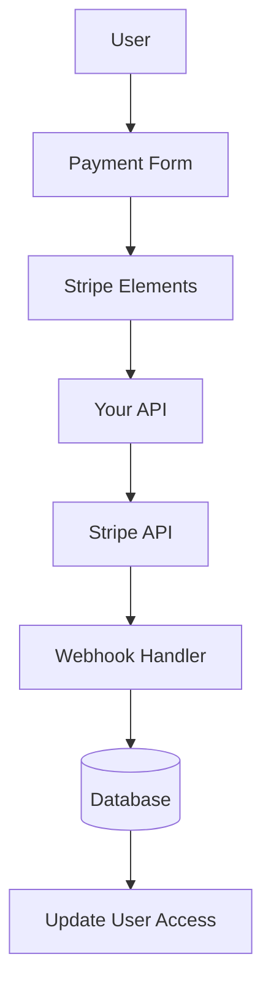

# Конфигурация на лента

Това ръководство обяснява как да конфигурирате Stripe във вашето приложение Ever Works с пълен абонамент и система за плащане.

## Преглед

Stripe е цялостна платежна платформа, която поддържа:

- 💳 Еднократни плащания
- 🔄 Повтарящи се абонаменти
- 🌍 Няколко метода на плащане (карти, Apple Pay, Google Pay)
- 💰 Множество валути
- 📊 Разширен анализ и отчитане

## Задължителни променливи на средата

Добавете тези променливи към вашия `.env.local` файл:

```bash
# Stripe Configuration
STRIPE_SECRET_KEY=sk_test_your_stripe_secret_key_here
STRIPE_WEBHOOK_SECRET=whsec_your_stripe_webhook_secret_here
NEXT_PUBLIC_STRIPE_PUBLISHABLE_KEY=pk_test_your_stripe_publishable_key_here

# Stripe Price IDs
NEXT_PUBLIC_STRIPE_SUBSCRIPTION_PRICE_ID=price_subscription_id_here
NEXT_PUBLIC_STRIPE_ONETIME_PRICE_ID=price_onetime_id_here
NEXT_PUBLIC_STRIPE_FREE_PRICE_ID=price_free_id_here

# Product Pricing (for display purposes)
NEXT_PUBLIC_PRODUCT_PRICE_PRO=10.00
NEXT_PUBLIC_PRODUCT_PRICE_SPONSOR=20.00
NEXT_PUBLIC_PRODUCT_PRICE_FREE=0.00
```

::: предупреждение
Никога не предавайте вашите секретни ключове на контрола на версиите. Запазете `.env.local` във вашия `.gitignore` файл.
:::

## Конфигурация на таблото за управление на Stripe

### Стъпка 1: Създайте продукти

Във вашето [табло за управление на Stripe](https://dashboard.stripe.com/):

1. Отидете до **Продукти** → **Добавяне на продукт**
2. Създайте следните продукти:

| Продукт | Цена | Тип | Описание |
|---------|-------|------|-------------|
| **Безплатен план** | $0,00 | Еднократно | Основни характеристики |
| **Професионален план** | $10,00 | Месечен абонамент | Разширени функции |
| **Спонсорски план** | $20,00 | Еднократно | Премиум поддръжка |

3. Копирайте **Price ID** за всеки продукт (започва с `price_` )

### Стъпка 2: Конфигурирайте Webhooks

Webhooks позволяват на Stripe да уведомява вашето приложение за събития на плащане.

1. Отидете на **Разработчици** → **Webhooks** → **Добавяне на крайна точка**
2. Задайте URL адреса на крайната точка:
   - Развитие: `http://localhost:3000/api/stripe/webhook` - Производство: `https://your-domain.com/api/stripe/webhook` 3. Изберете събития, които да слушате:
   - `payment_intent.succeeded` - `payment_intent.payment_failed` - 7
   - `customer.subscription.updated` - `customer.subscription.deleted` - `customer.subscription.trial_will_end` - `invoice.payment_succeeded` - `invoice.payment_failed` 4. Копирайте **Signing secret** (започва с `whsec_` )

### Стъпка 3: Извличане на API ключове

Във вашето табло за управление на Stripe:

1. **Таен ключ**: **Разработчици** → **API ключове** → **Таен ключ** (започва с `sk_` )
2. **Публикуем ключ**: **Разработчици** → **API ключове** → **Публикуем ключ** (започва с `pk_` )
3. **Webhook Secret**: **Разработчици** → **Webhooks** → Изберете своя webhook → **Signing secret**

::: съвет
Използвайте клавишите **тестов режим** по време на разработката (започват с `sk_test_` и `pk_test_` ). Превключете към **режим на живо** ключове за производство.
:::

## Архитектура на платежната система



### Доставчик на ленти

Доставчикът на Stripe ( `lib/payment/lib/providers/stripe-provider.ts` ) изпълнява:

- ✅ Управление на клиенти
- ✅ Създаване на намерение за плащане
- ✅ Управление на абонаменти
- ✅ Обработка на уеб кукичка
- ✅ Поддръжка на намерение за настройка
- ✅ Възстановяване на суми и анулиране

### API маршрути

Налични са следните API маршрути:

| Маршрут | Метод | Описание |
|-------|--------|-------------|
| `/api/stripe/webhook` | ПУБЛИКАЦИЯ | Обработване на уеб кукички Stripe |
| `/api/stripe/subscription` | ПУБЛИКАЦИЯ | Създаване на абонамент |
| `/api/stripe/subscription` | ПОСТАВЕТЕ | Актуализиране на абонамент |
| `/api/stripe/subscription` | ИЗТРИВАНЕ | Отказ от абонамент |
| `/api/stripe/payment-intent` | ПУБЛИКАЦИЯ | Създайте намерение за плащане |
| `/api/stripe/payment-intent` | ВЗЕМЕТЕ | Потвърдете плащането |
| `/api/stripe/setup-intent` | ПУБЛИКАЦИЯ | Настройте метод на плащане |

### Компоненти на потребителския интерфейс

Системата използва Stripe Elements за сигурни платежни форми:

- `StripeElementsWrapper` - Основен компонент на обвивката
- `StripePaymentForm` - Форма за плащане с валидиране
- Поддръжка за Apple Pay и Google Pay
- Адаптивен дизайн за мобилни устройства и настолни компютри

## Примери за използване

### Създайте абонамент

```typescript
import { StripeProvider } from '@/lib/payment/providers/stripe-provider';

const configs = createProviderConfigs({
  apiKey: process.env.STRIPE_SECRET_KEY!,
  webhookSecret: process.env.STRIPE_WEBHOOK_SECRET!,
  options: {
    publishableKey: process.env.NEXT_PUBLIC_STRIPE_PUBLISHABLE_KEY!,
    apiVersion: '2023-10-16'
  }
});

const stripeProvider = new StripeProvider(configs.stripe);

const subscription = await stripeProvider.createSubscription({
  customerId: 'cus_customer_id',
  priceId: 'price_subscription_id',
  paymentMethodId: 'pm_payment_method_id',
  trialPeriodDays: 7
});
```

### Използвайте компонента за плащане

```tsx
import { PaymentForm } from '@/lib/payment';

function PaymentPage() {
  return (
    <PaymentForm
      amount={1000} // 10.00 USD in cents
      currency="usd"
      isSubscription={true}
      onSuccess={(paymentId) => {
        console.log('Payment succeeded:', paymentId);
        // Redirect to success page or update UI
      }}
      onError={(error) => {
        console.error('Payment error:', error);
        // Show error message to user
      }}
    />
  );
}
```

## Тестване на вашата интеграция

### Тестови режим

1. **Използвайте тестови API ключове** (започнете с `sk_test_` и `pk_test_` )
2. **Използвайте номера на тестови карти**:
   - Успех: `4242 4242 4242 4242` - Отказ: `4000 0000 0000 0002` - 3D Secure: `4000 0025 0000 3155` 3. **Тествайте webhooks локално** със Stripe CLI:

   ``` баш
   слушане на лента --forward-to localhost:3000/api/stripe/webhook
   ```

### Тестване на уеб кукичка

```bash
# Install Stripe CLI
brew install stripe/stripe-cli/stripe

# Login to your Stripe account
stripe login

# Forward webhooks to your local server
stripe listen --forward-to localhost:3000/api/stripe/webhook

# Trigger test events
stripe trigger payment_intent.succeeded
```

## Обработка на грешки

Системата автоматично обработва често срещани грешки:

| Тип грешка | Боравене |
|------------|----------|
| Картата е отхвърлена | Удобно за потребителя съобщение за грешка |
| Недостатъчни средства | Опитайте отново с друга карта |
| Мрежови проблеми | Логика за автоматичен повторен опит |
| Неуспешни уебкукички | Вписан за ръчен преглед |
| Грешки при валидиране | Осветяване на полето на формуляр |

## Най-добри практики за сигурност

1. **API ключове**:
   - Никога не излагайте секретни ключове в код от страна на клиента
   - Използвайте променливи на средата
   - Сменяйте ключовете редовно

2. **Проверка на уебкукичка**:
   - Винаги проверявайте подписите на webhook
   - Валидирайте данните за събитието преди обработка

3. **Данни за плащане**:
   - Никога не съхранявайте номера на карти
   - Използвайте токенизацията на Stripe
   - Прилагане на PCI съответствие

4. **Потребителски сесии**:
   - Проверете удостоверяването на потребителя
   - Проверка на потребителските разрешения
   - Регистрирайте всички платежни дейности

## Зависимости

Необходими пакети (вече включени в Ever Works):

```json
{
  "@stripe/react-stripe-js": "^3.7.0",
  "@stripe/stripe-js": "^7.3.0",
  "stripe": "^18.1.0"
}
```

## Отстраняване на неизправности

### Често срещани проблеми

**Проблем**: Webhook не получава събития

- **Решение**: Проверете дали URL адресът на webhook е публично достъпен
- Използвайте Stripe CLI за локално тестване
- Проверете дали тайната на webhook е правилна

**Проблем**: Плащането се проваля тихо

- **Решение**: Проверете конзолата на браузъра за грешки
- Уверете се, че API ключовете са правилни
- Проверете регистрационните файлове на таблото за управление на Stripe

**Проблем**: 3D Secure не работи

- **Решение**: Уверете се, че работите със статус `requires_action` - Приложете правилен поток за пренасочване
- Тествайте с тестови карти 3D Secure

## Следващи стъпки

- [Конфигурация на LemonSqueezy](./lemonsqueezy) - Алтернативен доставчик на плащания
- [Променливи на средата](/deployment/environment-variables) - Пълна настройка на средата
- [Внедряване](/внедряване) - Внедрете своята интеграция на плащане

## Ресурси

- [Документация на Stripe](https://stripe.com/docs)
- [Ръководство за интегриране на Next.js](https://stripe.com/docs/payments/accept-a-payment?platform=web&ui=elements)
- [Управление на абонаменти](https://stripe.com/docs/billing/subscriptions)
- [Събития в уебкукичка](https://stripe.com/docs/api/events/types)

## Поддръжка

Нуждаете се от помощ за интегрирането на Stripe? Проверете нашата [страница за поддръжка](/advanced-guide/support) или се присъединете към нашата общност.
