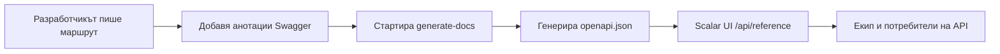

# Обучение за API Документация

Овладейте автоматизираната система за документация на API с анотации на Swagger и интерфейс Scalar UI.

## 🎯 Цели

След завършване на този модул ще можете да:

- ✅ Разбирате работния процес на документацията на API
- ✅ Пишете правилни анотации на Swagger
- ✅ Следвате стандартните конвенции за тагове
- ✅ Генерирате и валидирате документация
- ✅ Отстранявате типични проблеми
- ✅ Поддържате висококачествена документация на API

**Приблизително време**: 2–3 дни

---

## Защо тази система?

### Решени проблеми

- **Непоследователна документация**: Преди имаше 8 различни Stripe тага разпръснати из крайните точки
- **Ръчна синхронизация**: Документацията честозаставаше зад реалния код
- **Лошо преживяване за разработчиците**: Базов Swagger UI с ограничени възможности

### Получени предимства

- **Автоматична синхронизация**: Документацията се генерира директно от анотациите в кода
- **Модерен интерфейс**: Scalar UI с интерактивно тестване и по-добро UX
- **Последователни стандарти**: Унифицирана система от тагове и шаблони за документация

---

## Архитектура на системата

### Основни компоненти

1. **Анотации на Swagger в кода**
   - JSDoc коментари с таг `@swagger`
   - Формат на спецификацията OpenAPI 3.0
   - Вградени директно в файловете на маршрутите

2. **Скрипт generate-docs**
   - Сканира всички `app/api/**/route.ts` файлове
   - Извлича и валидира анотациите на Swagger
   - Генерира унифициран `public/openapi.json`

3. **Интерфейс Scalar UI**
   - Модерен адаптивен интерфейс за документация
   - Интерактивно тестване на API
   - Достъпен на `/api/reference`

### Пълен работен процес



---

## Основни команди

```bash
yarn generate-docs
yarn docs:watch
yarn docs:validate
git status public/openapi.json
```

---

## Стандартна система от тагове

### Конвенции за тагове

#### Административни операции

```yaml
"Admin - Users"        # Управление на потребители
"Admin - Categories"   # Управление на категории
"Admin - Items"        # Управление на съдържание
"Admin - Comments"     # Модериране на коментари
```

#### Основни функции на приложението

```yaml
"Authentication"       # Влизане, излизане, нулиране на парола
"Favorites"           # Любими на потребителя
"Items & Content"     # Преглед на публично съдържание
```

#### Платежни системи

```yaml
"Stripe - Core"              # Checkout, Payment Intent
"Stripe - Subscriptions"     # Управление на абонаменти
"LemonSqueezy - Core"        # Всички операции с LemonSqueezy
```

---

## Добри практики

### Писане на ефективни описания

- Използвайте глаголи за действие: "Създай", "Обнови", "Изтрий", "Вземи"
- Бъдете конкретни: "Вземи профил на потребител", а не "Вземи потребител"
- Не надвишавайте 50 символа за четимост в UI

### Реалистични примери

```yaml
# ❌ Лоши примери
example: "string"

# ✅ Добри примери
example: "john.doe@company.com"
example: "user_123abc456def"
```

---

## Контролен списък за разработчика

Преди да потвърдите промени в API:

- [ ] Анотацията на Swagger е добавена или обновена
- [ ] Използван е правилният таг от стандартната система
- [ ] Присъстват смислено заглавие и описание
- [ ] Документирани са всички полета на тялото на заявката
- [ ] Документирани са всички кодове на отговора
- [ ] Изпълнен е `yarn generate-docs`
- [ ] Документацията е проверена на `/api/reference`
- [ ] `public/openapi.json` е включен в commit-а
