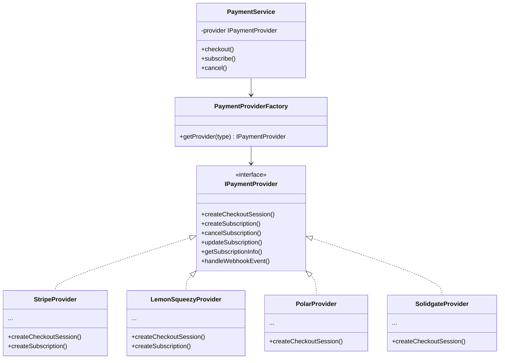

---
id: payment-provider-architecture
title: "Payment Provider Architecture"
sidebar_label: "Payment Provider Architecture"
---

# Zahlungsanbieter-Architektur

Die Vorlage implementiert Zahlungsanbieter-Unterstützung über das **Strategy-Pattern**. Jeder Anbieter implementiert dasselbe `IPaymentProvider`-Interface, sodass der Anwendungscode anbieterunabhängig bleibt.

## Architekturübersicht



## `IPaymentProvider` Interface

Jeder Zahlungsanbieter implementiert folgendes Interface:

```typescript
export interface IPaymentProvider {
  createCheckoutSession(params: CheckoutParams): Promise<CheckoutResult>;
  createSubscription(params: SubscriptionParams): Promise<SubscriptionResult>;
  cancelSubscription(subscriptionId: string, immediately?: boolean): Promise<void>;
  updateSubscription(subscriptionId: string, params: UpdateParams): Promise<SubscriptionResult>;
  getSubscriptionInfo(subscriptionId: string): Promise<SubscriptionInfo>;
  handleWebhookEvent(event: WebhookEvent): Promise<WebhookResult>;
}
```

## `PaymentProviderFactory`

Die Factory verwendet das Singleton-Pattern, um Anbieter-Instanzen zu cachen:

```typescript
export class PaymentProviderFactory {
  private static instances = new Map<string, IPaymentProvider>();

  static getProvider(type: PaymentProviderType): IPaymentProvider {
    if (!this.instances.has(type)) {
      const provider = this.createProvider(type);
      this.instances.set(type, provider);
    }
    return this.instances.get(type)!;
  }

  private static createProvider(type: PaymentProviderType): IPaymentProvider {
    switch (type) {
      case 'stripe': return new StripeProvider();
      case 'lemon_squeezy': return new LemonSqueezyProvider();
      case 'polar': return new PolarProvider();
      case 'solidgate': return new SolidgateProvider();
      default: throw new Error(`Unknown payment provider: ${type}`);
    }
  }
}
```

## `PaymentService`

Der `PaymentService` lädt den konfigurierten Anbieter und delegiert alle Operationen:

```typescript
export class PaymentService {
  private provider: IPaymentProvider;

  constructor() {
    const providerType = process.env.PAYMENT_PROVIDER as PaymentProviderType;
    this.provider = PaymentProviderFactory.getProvider(providerType);
  }

  async checkout(params: CheckoutParams): Promise<CheckoutResult> {
    return this.provider.createCheckoutSession(params);
  }

  async subscribe(params: SubscriptionParams): Promise<SubscriptionResult> {
    return this.provider.createSubscription(params);
  }

  async cancel(subscriptionId: string, immediately = false): Promise<void> {
    return this.provider.cancelSubscription(subscriptionId, immediately);
  }
}
```

## Typdefinitionen

```typescript
export type PaymentProviderType = 'stripe' | 'lemon_squeezy' | 'polar' | 'solidgate';

export type PaymentIntent = {
  id: string;
  provider: PaymentProviderType;
  status: 'pending' | 'succeeded' | 'failed' | 'cancelled';
  amount: number;
  currency: string;
  metadata: Record<string, string>;
  createdAt: Date;
};

export type SubscriptionInfo = {
  id: string;
  status: SubscriptionStatus;
  planId: string;
  currentPeriodStart: Date;
  currentPeriodEnd: Date;
  cancelAtPeriodEnd: boolean;
  trialEnd: Date | null;
};

export type SubscriptionStatus =
  | 'active'
  | 'trialing'
  | 'past_due'
  | 'canceled'
  | 'unpaid'
  | 'incomplete';

export type WebhookResult = {
  success: boolean;
  eventType: WebhookEventType;
  processed: boolean;
};

export enum WebhookEventType {
  PAYMENT_SUCCEEDED = 'payment.succeeded',
  PAYMENT_FAILED = 'payment.failed',
  PAYMENT_REFUNDED = 'payment.refunded',
  SUBSCRIPTION_CREATED = 'subscription.created',
  SUBSCRIPTION_UPDATED = 'subscription.updated',
  SUBSCRIPTION_CANCELLED = 'subscription.cancelled',
  SUBSCRIPTION_RENEWED = 'subscription.renewed',
  SUBSCRIPTION_EXPIRED = 'subscription.expired',
}
```

## Anbieter wechseln

Um den Zahlungsanbieter zu wechseln, genügt es, die Umgebungsvariable zu ändern:

```bash
# .env.local
PAYMENT_PROVIDER=polar  # oder: stripe, lemon_squeezy, solidgate
```

Kein Anwendungscode muss geändert werden. Der `PaymentService` lädt automatisch den richtigen Anbieter.

## Kundener-Auflösung

Bei Stripe und LemonSqueezy werden Kunden anhand ihrer E-Mail-Adresse aufgelöst:

```typescript
async function resolveCustomer(email: string, provider: IPaymentProvider): Promise<string> {
  // 1. In DB nachschlagen
  const existing = await db.query.customers.findFirst({
    where: eq(customers.email, email),
  });
  if (existing?.providerId) return existing.providerId;

  // 2. Beim Anbieter suchen
  const found = await provider.findCustomerByEmail(email);
  if (found) {
    await db.insert(customers).values({ email, providerId: found.id });
    return found.id;
  }

  // 3. Neu anlegen
  const created = await provider.createCustomer({ email });
  await db.insert(customers).values({ email, providerId: created.id });
  return created.id;
}
```

## UI-Komponenten

Die Zahlungs-UI-Komponenten befinden sich in `components/payment/` und verwenden den konfigurierten Anbieter automatisch:

- `PricingTable` – Preistabelle mit Plan-Vergleich
- `CheckoutButton` – Startet den Checkout für einen Plan
- `SubscriptionStatus` – Zeigt aktuellen Abonnementstatus
- `PaymentHistory` – Listet vergangene Zahlungen auf

**Quellen:**
- `template/lib/payment/`
- `template/lib/services/payment.service.ts`
- `template/lib/payment/factory.ts`
