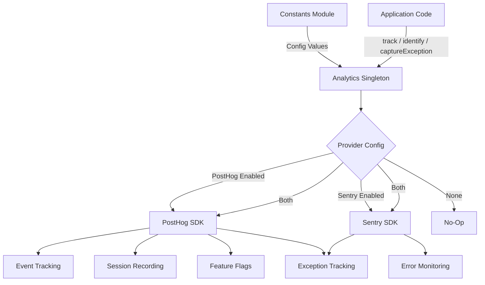
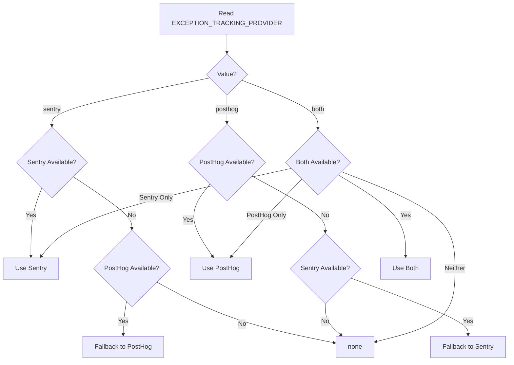

# Analytics-Modul

Das Analysemodul (`template/lib/analytics/`) stellt eine einheitliche Singleton-Klasse für die clientseitige Ereignisverfolgung, Benutzeridentifizierung, Feature-Flag-Auswertung und Ausnahmeerfassung bereit. Es integriert **PostHog** für Produktanalysen und **Sentry** für die Fehlerüberwachung und unterstützt die Verwendung eines der beiden Anbieter einzeln, beider gleichzeitig oder keines von beiden.

## Architekturübersicht



## Quelldateien

|Datei|Beschreibung|
|------|-------------|
|`lib/analytics/index.ts`|`Analytics` Singleton-Klasse und `analytics` Export|

## Kernklasse: `Analytics`

Die Klasse `Analytics` ist ein Singleton, der PostHog und Sentry umschließt. Der Aufruf auf der Serverseite ist sicher – alle Methoden kehren stillschweigend zurück, wenn `window` nicht definiert ist.

### Typdefinitionen

```typescript
type EventProperties = Properties;          // PostHog Properties type
type UserProperties = Record<string, any>;
type ExceptionTrackingProvider = 'sentry' | 'posthog' | 'both' | 'none';
```

### Singleton-Zugriff

```typescript
// Get the singleton instance
const analytics = Analytics.getInstance();

// Or use the pre-created export
import { analytics } from '@/lib/analytics';
```

### `init(): void`

Initialisiert PostHog mit zentraler Konfiguration und richtet die Ausnahmeverfolgung ein. Muss einmal auf der Clientseite aufgerufen werden (normalerweise in einem Root-Layout oder einer Anbieterkomponente).

```typescript
// In your root layout or PostHog provider
'use client';
import { analytics } from '@/lib/analytics';

useEffect(() => {
  analytics.init();
}, []);
```

**Verhalten:**
- Überspringt die Initialisierung, wenn sie bereits initialisiert wurde oder serverseitig ausgeführt wird
- Liest die Konfiguration aus Konstanten (`POSTHOG_KEY`, `POSTHOG_HOST`, `POSTHOG_ENABLED` usw.)
- Konfiguriert die Sitzungsaufzeichnung mit Maskierung, wenn `POSTHOG_SESSION_RECORDING_ENABLED` wahr ist
- Wendet die Abtastrate an (`POSTHOG_SAMPLE_RATE`) – in der Produktion standardmäßig 10 %
- Richtet globale `window.onerror`- und `unhandledrejection`-Handler ein, wenn die PostHog-Ausnahmeverfolgung aktiviert ist
- Verknüpft PostHog mit Sentry, wenn beide Anbieter aktiv sind

### `identify(userId: string, properties?: UserProperties): void`

Ordnet den aktuellen anonymen Benutzer einer identifizierten Benutzer-ID zu. Legt außerdem den Sentry-Benutzerkontext fest, wenn Sentry aktiviert ist.

```typescript
analytics.identify(session.user.id, {
  email: session.user.email,
  plan: 'premium',
});
```

### `reset(): void`

Setzt die aktuelle Benutzeridentität zurück (z. B. beim Abmelden). Löscht sowohl PostHog- als auch Sentry-Benutzerkontexte.

```typescript
analytics.reset();
```

### `track(eventName: string, properties?: EventProperties): void`

Erfasst ein benutzerdefiniertes Ereignis in PostHog.

```typescript
analytics.track('item_submitted', {
  itemId: 'abc-123',
  category: 'SaaS Tools',
});
```

### `trackPageView(url: string, properties?: EventProperties): void`

Erfasst manuell ein Seitenaufrufereignis. Verwenden Sie diese Option, wenn `POSTHOG_AUTO_CAPTURE` deaktiviert ist und Sie eine explizite Seitenaufrufverfolgung benötigen.

```typescript
analytics.trackPageView(window.location.href, {
  referrer: document.referrer,
});
```

### `isFeatureEnabled(flagKey: string, defaultValue?: boolean): boolean`

Wertet ein PostHog-Feature-Flag synchron aus.

```typescript
const showNewUI = analytics.isFeatureEnabled('new-dashboard-ui', false);
```

### `reloadFeatureFlags(): Promise<void>`

Erzwingt einen erneuten Abruf von Feature-Flags vom PostHog-Server.

```typescript
await analytics.reloadFeatureFlags();
```

### `captureException(error: Error | string, context?: Record<string, any>): void`

Einheitliche Ausnahmeverfolgung, die an den/die konfigurierten Anbieter sendet.

```typescript
try {
  await riskyOperation();
} catch (error) {
  analytics.captureException(error, {
    component: 'PaymentForm',
    action: 'submit',
  });
}
```

**Provider-Routing:**
- `'posthog'` – Sendet das Ereignis `$exception` mit Stack-Trace an PostHog
- `'sentry'` – Ruft `Sentry.captureException` mit zusätzlichem Kontext auf
- `'both'` – Wird an beide Anbieter gesendet
- `'none'` – Verwirft stillschweigend

### `captureError(error: Error, context?: Record<string, any>): void`

**Veraltet.** Alias für `captureException`. Protokolliert eine Verfallswarnung.

### `getExceptionTrackingProvider(): ExceptionTrackingProvider`

Gibt den aktuell aktiven Ausnahmeverfolgungsanbieter zurück.

### `setUserProperties(properties: UserProperties): void`

Legt dauerhafte Benutzereigenschaften für das PostHog-Personenprofil über `posthog.people.set()` fest.

```typescript
analytics.setUserProperties({
  subscription_tier: 'premium',
  company: 'Acme Corp',
});
```

### `setSuperProperties(properties: Record<string, any>): void`

Registriert Super-Eigenschaften, die mit jedem nachfolgenden Ereignis über `posthog.register()` gesendet werden.

```typescript
analytics.setSuperProperties({
  app_version: '2.1.0',
  environment: 'production',
});
```

## Konfigurationskonstanten

Die gesamte Analysekonfiguration wird durch Konstanten von `lib/constants.ts` gesteuert:

|Konstant|Standard|Beschreibung|
|----------|---------|-------------|
|`POSTHOG_KEY`|Umgebungsvar|API-Schlüssel des PostHog-Projekts|
|`POSTHOG_HOST`|Umgebungsvar|PostHog-API-Host-URL|
|`POSTHOG_ENABLED`|abgeleitet|True, wenn sowohl Schlüssel als auch Host festgelegt sind|
|`POSTHOG_DEBUG`|Umgebungsvar|Aktivieren Sie die PostHog-Debug-Protokollierung|
|`POSTHOG_SESSION_RECORDING_ENABLED`|`'true'`|Aktivieren Sie die Sitzungsaufzeichnung|
|`POSTHOG_AUTO_CAPTURE`|`'false'`|Seitenaufrufe automatisch erfassen|
|`POSTHOG_SAMPLE_RATE`|`0.1` (Produkt) / `1.0` (Entwickler)|Ereignis-Abtastrate|
|`POSTHOG_SESSION_RECORDING_SAMPLE_RATE`|`0.1` (Produkt) / `1.0` (Entwickler)|Aufnahme-Abtastrate|
|`EXCEPTION_TRACKING_PROVIDER`|`'both'`|Welcher Anbieter behandelt Ausnahmen?|
|`SENTRY_ENABLED`|abgeleitet|True, wenn DSN festgelegt ist und die Umgebung dies zulässt|

## Lösung des Ausnahmeverfolgungsanbieters

Der Anbieter wird zur Konstruktionszeit mit Fallback-Logik bestimmt:



## Verwendung mit Next.js

Typische Integration in ein Next.js App Router-Projekt:

```tsx
// app/providers.tsx
'use client';
import { useEffect } from 'react';
import { analytics } from '@/lib/analytics';
import { useSession } from 'next-auth/react';
import { usePathname } from 'next/navigation';

export function AnalyticsProvider({ children }: { children: React.ReactNode }) {
  const { data: session } = useSession();
  const pathname = usePathname();

  useEffect(() => {
    analytics.init();
  }, []);

  useEffect(() => {
    if (session?.user?.id) {
      analytics.identify(session.user.id, {
        email: session.user.email,
      });
    }
  }, [session]);

  useEffect(() => {
    analytics.trackPageView(pathname);
  }, [pathname]);

  return <>{children}</>;
}
```
