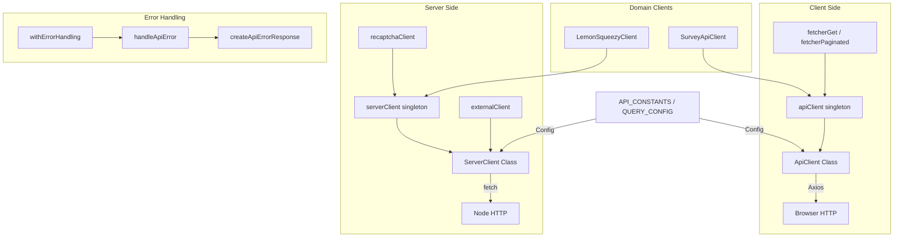

# API-Client-Modul

Das API-Client-Modul (`template/lib/api/`) bietet eine umfassende HTTP-Client-Schicht für die clientseitige und serverseitige API-Kommunikation. Es umfasst einen Axios-basierten Client für die Browsernutzung, einen nativen `fetch`-basierten Server-Client mit Caching und Wiederholungsversuchen, spezialisierte Domänen-Clients und standardisierte Fehlerbehandlung.

## Architekturübersicht



## Quelldateien

|Datei|Beschreibung|
|------|-------------|
|`lib/api/types.ts`|Gemeinsam genutzte Typdefinitionen für die API-Ebene|
|`lib/api/constants.ts`|API-Konstanten und Abfragekonfiguration|
|`lib/api/api-client-class.ts`|`ApiClient` – Axios-basierter Client für Browser|
|`lib/api/singleton.ts`|`ApiClientSingleton` Manager|
|`lib/api/api-client.ts`|Vorgefertigte Client-Instanz- und Fetcher-Helfer|
|`lib/api/server-api-client.ts`|`ServerClient` – abrufbasierter Server-Client|
|`lib/api/error-handler.ts`|Standardisierte API-Fehlerbehandlung|
|`lib/api/lemonsqueezy-client.ts`|LemonSqueezy-Zahlungsclient|
|`lib/api/survey-api.client.ts`|Umfrage zum CRUD-Client|

## Typdefinitionen

### Kerntypen

```typescript
type ApiEndpoint = string;
type QueryParams = Record<string, string | number | boolean | undefined>;
type RequestBody = Record<string, unknown>;

interface PaginationParams {
  page?: number;
  limit?: number;
  search?: string;
  sortBy?: string;
  sortOrder?: 'asc' | 'desc';
}
```

### Antworttypen (diskriminierte Gewerkschaften)

```typescript
type ApiResponse<T = unknown> =
  | { success: true; data: T; total?: number; page?: number; limit?: number; totalPages?: number }
  | { success: false; error: string };

type PaginatedResponse<T> =
  | { success: true; data: T[]; meta: { page: number; totalPages: number; total: number; limit: number } }
  | { success: false; error: string };
```

### Client-Konfiguration

```typescript
interface ApiClientConfig extends Partial<AxiosRequestConfig> {
  baseURL?: string;
  timeout?: number;
  headers?: Record<string, string>;
  accessToken?: string;
  frontendUrl?: string;
}

interface ApiError {
  message: string;
  status?: number;
  code?: string;
}
```

## Kundenseitig: `ApiClient`

Die Klasse `ApiClient` umschließt Axios mit automatischer Token-Injektion, Antwortfehlerbehandlung und typisierten Antworten.

### Konstrukteur

```typescript
const client = new ApiClient({
  baseURL: 'https://api.example.com',
  accessToken: 'bearer-token',
  headers: { 'X-Custom': 'value' },
});
```

### HTTP-Methoden

Bei allen Methoden wird der Umschlag `ApiResponse` ausgepackt und das Feld `data` direkt zurückgegeben:

```typescript
// GET with query params
const items = await client.get<Item[]>('/items', { category: 'tools', limit: 10 });

// POST with body
const created = await client.post<Item>('/items', { name: 'New Tool', url: 'https://...' });

// PUT
const updated = await client.put<Item>('/items/123', { name: 'Updated' });

// PATCH
const patched = await client.patch<Item>('/items/123', { status: 'approved' });

// DELETE
await client.delete<void>('/items/123');

// Paginated GET
const page = await client.getPaginated<Item>('/items', { page: 1, limit: 20, search: 'react' });
```

### Singleton-Zugriff

```typescript
import { getApiClient } from '@/lib/api/singleton';

const client = getApiClient();                    // Default instance
ApiClientSingleton.resetInstance();                // Reset (for tests)
```

### Convenience-Exporte

```typescript
import { apiClient, fetcherGet, fetcherPaginated } from '@/lib/api/api-client';

// Use with React Query / SWR
const data = await fetcherGet<Item[]>('/api/items', { status: 'published' });
const page = await fetcherPaginated<Item>('/api/items', { page: 1, limit: 20 });
```

## Serverseitig: `ServerClient`

Die `ServerClient`-Klasse verwendet natives `fetch` mit Timeout-Behandlung, automatischen Wiederholungsversuchen, LRU-Caching und serverspezifischer URL-Auflösung.

### Hauptmerkmale

- **Timeout-Behandlung** mit `AbortController` (Standard: 30 Sekunden)
- **Automatische Wiederholungsversuche** bei Netzwerkfehlern (Standard: 3 Wiederholungsversuche mit 1 Sekunde Verzögerung)
- **In-Memory-LRU-Cache** für GET-Anfragen (100 Einträge, 5-Minuten-TTL)
- **Server-URL-Auflösung** für interne API-Routen während SSR
- **FormData-Unterstützung** mit automatischer Inhaltstypverarbeitung

### Vorgefertigte Instanzen

```typescript
import { serverClient, externalClient, createApiClient, recaptchaClient } from '@/lib/api/server-api-client';

// Default server client
const result = await serverClient.get<UserData>('/api/users/me');

// External API client (15s timeout, 2 retries)
const external = await externalClient.get<any>('https://api.third-party.com/data');

// Custom client
const customClient = createApiClient('https://api.service.com', { timeout: 10000 });

// ReCAPTCHA verification
const captcha = await recaptchaClient.verify(token);
```

### HTTP-Methoden

```typescript
// All methods return ApiResponse<T>
const result = await serverClient.get<T>(endpoint, options?);
const result = await serverClient.post<T>(endpoint, data?, options?);
const result = await serverClient.put<T>(endpoint, data?, options?);
const result = await serverClient.patch<T>(endpoint, data?, options?);
const result = await serverClient.delete<T>(endpoint, options?);

// File upload
const result = await serverClient.upload<T>(endpoint, fileOrFormData, options?);

// URL-encoded form data
const result = await serverClient.postForm<T>(endpoint, { key: 'value' }, options?);
```

### Cache-Kontrolle

```typescript
serverClient.setCacheEnabled(false);   // Disable caching
serverClient.clearCache();             // Clear all cached responses
apiUtils.clearCache();                 // Same via utility
```

### Utility-Funktionen

```typescript
import { apiUtils } from '@/lib/api/server-api-client';

apiUtils.isSuccess(response);                              // Type guard
apiUtils.getErrorMessage(response);                        // Extract error
apiUtils.createQueryString({ page: 1, limit: 20 });       // 'page=1&limit=20'
apiUtils.buildUrl('/api/items', { page: 1, limit: 20 });  // '/api/items?page=1&limit=20'
```

## Fehlerbehandlung

### `HttpStatus` Aufzählung

```typescript
enum HttpStatus {
  BAD_REQUEST = 400,
  UNAUTHORIZED = 401,
  FORBIDDEN = 403,
  NOT_FOUND = 404,
  METHOD_NOT_ALLOWED = 405,
  CONFLICT = 409,
  UNPROCESSABLE_ENTITY = 422,
  INTERNAL_SERVER_ERROR = 500,
  SERVICE_UNAVAILABLE = 503,
}
```

### `handleApiError(error, context?): NextResponse`

Behandelt API-Routenfehler mit automatischer Statuscode-Erkennung anhand von Fehlermeldungen:

```typescript
import { handleApiError } from '@/lib/api/error-handler';

export async function GET() {
  try {
    const data = await fetchData();
    return NextResponse.json({ success: true, data });
  } catch (error) {
    return handleApiError(error, 'GET /api/items');
  }
}
```

### `withErrorHandling(handler, context?): Promise`

Funktion höherer Ordnung, die einen asynchronen Handler mit Fehlerbehandlung umschließt:

```typescript
import { withErrorHandling } from '@/lib/api/error-handler';

export async function GET() {
  return withErrorHandling(async () => {
    const data = await fetchData();
    return NextResponse.json({ success: true, data });
  }, 'GET /api/items');
}
```

## API-Konstanten

```typescript
const API_CONSTANTS = {
  HEADERS: { CONTENT_TYPE: 'application/json', ACCEPT: 'application/json' },
  STATUS: { UNAUTHORIZED: 401, FORBIDDEN: 403, NOT_FOUND: 404, SERVER_ERROR: 500 },
  DEFAULT_ERROR_MESSAGE: 'An unexpected error occurred',
};

const QUERY_CONFIG = {
  staleTime: 300_000,    // 5 minutes
  gcTime: 86_400_000,    // 1 day
  retry: 1,
  refetchOnWindowFocus: false,
};
```

## Domänen-Clients

### LemonSqueezyClient

```typescript
import { lemonsqueezyClient } from '@/lib/api/lemonsqueezy-client';

const checkout = await lemonsqueezyClient.createCheckout({
  variantId: 12345,
  email: 'user@example.com',
  customPrice: 4900,
});
// Returns: { checkoutUrl, email, customPrice, variantId, metadata }

const health = await lemonsqueezyClient.healthCheck();
const validation = lemonsqueezyClient.validateCheckoutParams(params);
```

### SurveyApiClient

```typescript
import { surveyApiClient } from '@/lib/api/survey-api.client';

const surveys = await surveyApiClient.getMany({ type: 'nps', status: 'active' });
const survey = await surveyApiClient.getOne('survey-id');
const created = await surveyApiClient.create({ title: 'Feedback', type: 'nps' });
await surveyApiClient.submitResponse({ surveyId: 'id', answers: [...] });
const responses = await surveyApiClient.getResponses('survey-id', { page: 1 });
```
