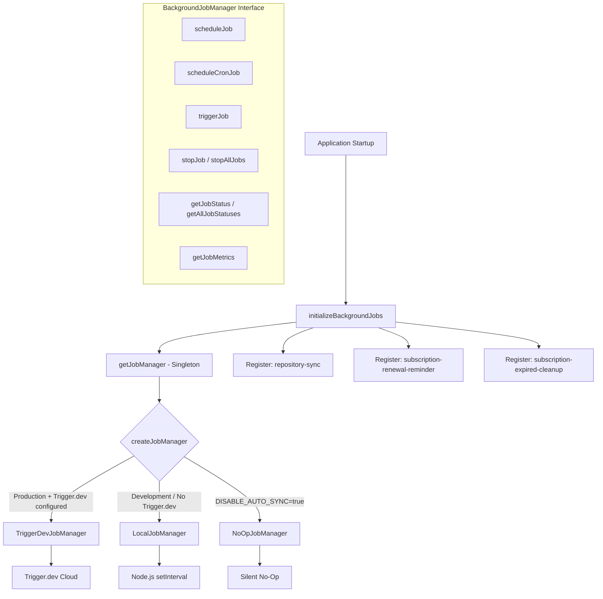
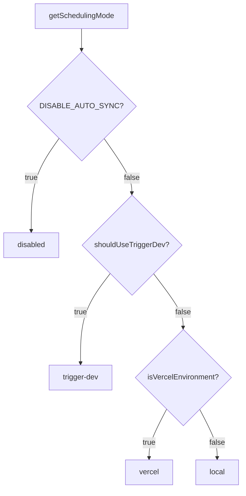

# Modul „Hintergrundjobs“.

Das Hintergrundjobmodul (`template/lib/background-jobs/`) bietet eine Abstraktionsschicht für die Planung und Ausführung wiederkehrender Aufgaben. Es unterstützt drei Laufzeitstrategien – **Trigger.dev** für die Produktion, **local `setInterval`** für die Entwicklung und einen **No-Op**-Modus zum vollständigen Deaktivieren von Jobs – die automatisch basierend auf der Umgebungskonfiguration ausgewählt werden.

## Architekturübersicht



## Quelldateien

|Datei|Beschreibung|
|------|-------------|
|`lib/background-jobs/types.ts`|Schnittstellen- und Typdefinitionen|
|`lib/background-jobs/config.ts`|Trigger.dev-Konfigurations- und Planungsmoduserkennung|
|`lib/background-jobs/job-factory.ts`|Factory-Funktion und Singleton-Manager|
|`lib/background-jobs/local-job-manager.ts`|`LocalJobManager` Implementierung|
|`lib/background-jobs/trigger-dev-job-manager.ts`|`TriggerDevJobManager` Implementierung|
|`lib/background-jobs/noop-job-manager.ts`|`NoOpJobManager` Implementierung|
|`lib/background-jobs/initialize-jobs.ts`|Jobregistrierung beim App-Start|
|`lib/background-jobs/index.ts`|Fassexporte|

## Typdefinitionen

### `BackgroundJobManager` Schnittstelle

```typescript
interface BackgroundJobManager {
  scheduleJob(id: string, name: string, job: () => void | Promise<void>, interval: number): void;
  scheduleCronJob(id: string, name: string, job: () => void | Promise<void>, cronExpression: string): void;
  triggerJob(id: string): Promise<void>;
  stopJob(id: string): void;
  stopAllJobs(): void;
  getJobStatus(id: string): JobStatus | undefined;
  getAllJobStatuses(): JobStatus[];
  getJobMetrics(): JobMetrics;
}
```

### `JobStatus`

```typescript
type JobStatusType = 'running' | 'completed' | 'failed' | 'scheduled' | 'stopped';

interface JobStatus {
  id: string;
  name: string;
  status: JobStatusType;
  lastRun: Date | null;
  nextRun: Date | null;
  duration: number;     // Last execution duration in ms
  error?: string;       // Error message if status is 'failed'
}
```

### `JobMetrics`

```typescript
interface JobMetrics {
  totalExecutions: number;       // Total invocations (not unique jobs)
  successfulJobs: number;
  failedJobs: number;
  averageJobDuration: number;    // Rolling average in ms
  lastCleanup: Date;
}
```

### `TriggerDevConfig`

```typescript
interface TriggerDevConfig {
  enabled: boolean;
  apiKey?: string;
  apiUrl?: string;
  environment: string;
  isFullyConfigured: boolean;
  isPartiallyConfigured: boolean;
}
```

### `SchedulingMode`

```typescript
type SchedulingMode = 'trigger-dev' | 'vercel' | 'local' | 'disabled';
```

## Konfigurationsfunktionen

### `getTriggerDevConfig(): TriggerDevConfig`

Liest Trigger.dev-Einstellungen aus dem ConfigService.

### `shouldUseTriggerDev(): boolean`

Gibt `true` zurück, wenn Trigger.dev vollständig konfiguriert und aktiviert ist und die Umgebung produktiv ist.

### `getSchedulingMode(): SchedulingMode`

Bestimmt anhand dieser Priorität, welches Planungssystem aktiv sein soll:



## Fabrik und Singleton

### `createJobManager(): BackgroundJobManager`

Erstellt den entsprechenden Job-Manager basierend auf der Umgebung:

```typescript
import { createJobManager } from '@/lib/background-jobs';

const manager = createJobManager();
// Returns: TriggerDevJobManager | LocalJobManager | NoOpJobManager
```

### `getJobManager(): BackgroundJobManager`

Gibt die Singleton-Instanz zurück und erstellt sie beim ersten Aufruf:

```typescript
import { getJobManager } from '@/lib/background-jobs';

const manager = getJobManager();
manager.scheduleJob('my-job', 'My Job', async () => {
  await doWork();
}, 60_000);
```

### `resetJobManager(): void`

Stoppt alle Jobs und zerstört den Singleton (nützlich zum Testen):

```typescript
import { resetJobManager } from '@/lib/background-jobs';
resetJobManager();
```

## LocalJobManager

Verwendet Node.js `setInterval` für Entwicklungs- und Fallback-Umgebungen.

**Wichtige Verhaltensweisen:**
- Überspringt die Ausführung, wenn ein Job bereits ausgeführt wird (verhindert Überschneidungen)
- Verfolgt Metriken mit gleitender durchschnittlicher Dauer
- Konvertiert Cron-Ausdrücke über eine vereinfachte Zuordnung in Intervalle
- Reduziert die Konsolenprotokollierung im Entwicklungsmodus

### Cron-zu-Intervall-Zuordnung

|Cron-Muster|Intervall|
|-------------|----------|
| `*/30 * * * * *` |30 Sekunden|
| `*/2 * * * *` |2 Minuten|
| `*/5 * * * *` |5 Minuten|
| `*/15 * * * *` |15 Minuten|
| `0 * * * *` |1 Stunde|
| `0 9 * * *` |24 Stunden|
|Standard|1 Minute|

## TriggerDevJobManager

Registriert Zeitpläne mit der `@trigger.dev/sdk` v4-Zeitplan-API. Führt **keine** lokale Timer aus – die Ausführung wird vom Trigger.dev-Workerprozess übernommen.

**Wichtige Verhaltensweisen:**
- Lazy-Loads `@trigger.dev/sdk` über dynamischen Import
- Konvertiert intervallbasierte Zeitpläne in Cron-Ausdrücke
- Verfolgt lokale Metriken, wenn Aufgaben im Worker-Kontext ausgeführt werden
- `stopJob` / `stopAllJobs` Nur lokalen Status löschen (Remote-Zeitpläne werden von Trigger.dev verwaltet)

## NoOpJobManager

Alle Vorgänge sind stille No-Ops. Wird verwendet, wenn `DISABLE_AUTO_SYNC=true` in der Entwicklung ist.

## Jobregistrierung

Die Funktion `initializeBackgroundJobs()` registriert alle Anwendungsjobs beim Start:

```typescript
import { initializeBackgroundJobs } from '@/lib/background-jobs/initialize-jobs';

// Called once during app initialization
await initializeBackgroundJobs();
```

### Registrierte Jobs

|Job-ID|Zeitplan|Beschreibung|
|--------|----------|-------------|
|`repository-sync`|Alle 5 Minuten|Synchronisiert Git-basierte CMS-Inhalte über `syncManager.performSync()`|
|`subscription-renewal-reminder`|Täglich um 9:00 Uhr|Sendet Verlängerungserinnerungen für Abonnements, die in 7 Tagen ablaufen|
|`subscription-expired-cleanup`|Täglich um Mitternacht|Verarbeitet und läuft Abonnements nach ihrem Enddatum ab|

**Wichtig:** Alle Job-Rückrufe verwenden dynamische Importe, um zu verhindern, dass das Webpack Node.js-spezifische Module zur Build-Zeit bündelt:

```typescript
manager.scheduleJob('repository-sync', 'Repository Synchronization', async () => {
  // Dynamic import prevents webpack bundling of isomorphic-git chain
  const { syncManager } = await import('@/lib/services/sync-service');
  await syncManager.performSync();
}, 5 * 60 * 1000);
```

## Anwendungsbeispiele

### Planen eines benutzerdefinierten Jobs

```typescript
import { getJobManager } from '@/lib/background-jobs';

const manager = getJobManager();

// Interval-based (every 10 minutes)
manager.scheduleJob('cleanup-temp', 'Temp File Cleanup', async () => {
  await cleanupTempFiles();
}, 10 * 60 * 1000);

// Cron-based (every hour)
manager.scheduleCronJob('hourly-report', 'Hourly Report', async () => {
  await generateReport();
}, '0 * * * *');
```

### Überwachungsjobs

```typescript
const manager = getJobManager();

// Check specific job
const status = manager.getJobStatus('repository-sync');
console.log(status?.status, status?.lastRun, status?.duration);

// List all jobs
const allStatuses = manager.getAllJobStatuses();

// Get aggregate metrics
const metrics = manager.getJobMetrics();
console.log(`Total: ${metrics.totalExecutions}, Failed: ${metrics.failedJobs}`);
```

### Manueller Auslöser

```typescript
const manager = getJobManager();
await manager.triggerJob('repository-sync');
```
