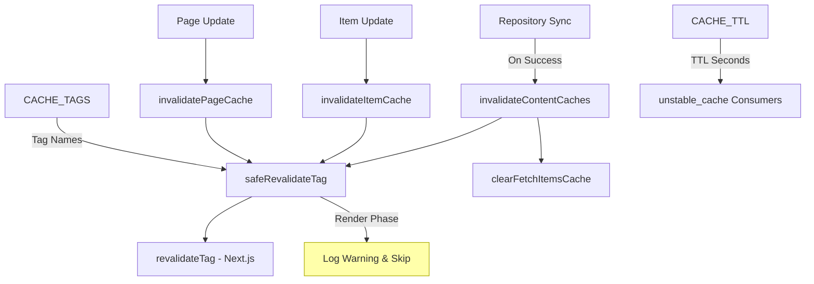
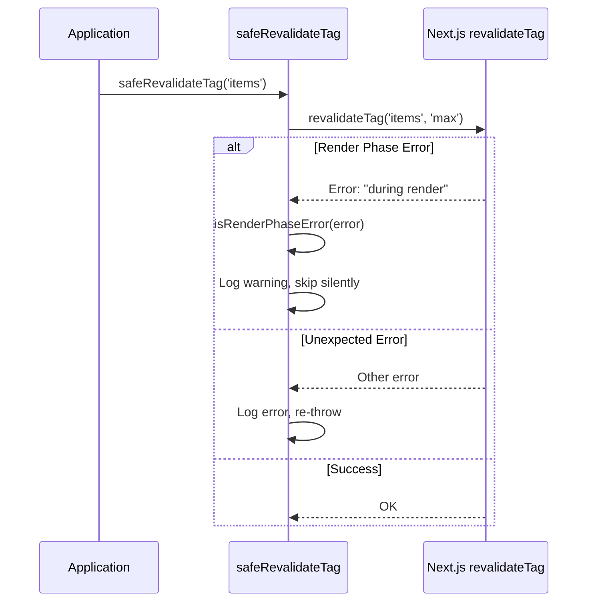
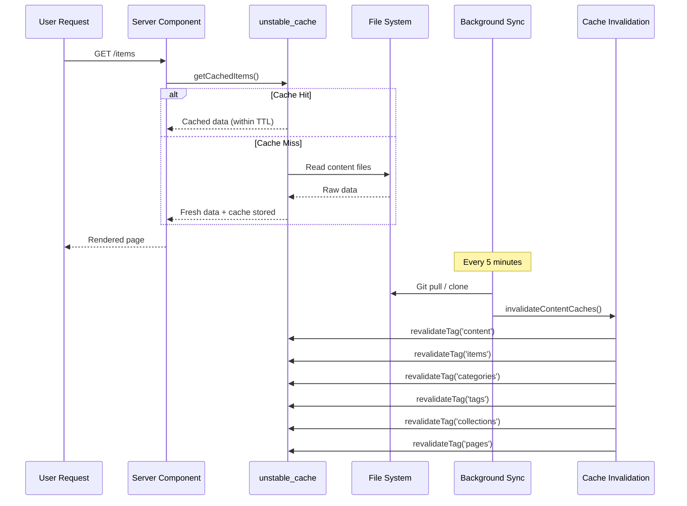

# Cache-Invalidierungsmodul

Das Cache-Invalidierungsmodul (`template/lib/cache-config.ts` und `template/lib/cache-invalidation.ts`) bietet ein zentralisiertes Cache-Tag-System und Invalidierungsfunktionen für Next.js `unstable_cache` und `revalidateTag`. Es stellt sicher, dass Inhaltscaches nach Repository-Synchronisierungen ordnungsgemäß ungültig gemacht werden, während die Einschränkungen der Renderphase von Next.j ordnungsgemäß gehandhabt werden.

## Architekturübersicht



## Quelldateien

|Datei|Beschreibung|
|------|-------------|
|`lib/cache-config.ts`|TTL-Konstanten und Tag-Definitionen zwischenspeichern|
|`lib/cache-invalidation.ts`|Invalidierungsfunktionen mit Renderphasensicherheit|

## Cache-TTL-Konfiguration

Alle TTL-Werte sind in **Sekunden** angegeben und werden mit Next.js `unstable_cache` verwendet:

```typescript
const CACHE_TTL = {
  CONTENT: 600,   // 10 minutes -- content listings
  ITEM: 600,      // 10 minutes -- individual items
  CONFIG: 600,    // 10 minutes -- site configuration
  PAGES: 600,     // 10 minutes -- static pages
} as const;
```

### Verwendung mit `unstable_cache`

```typescript
import { unstable_cache } from 'next/cache';
import { CACHE_TTL, CACHE_TAGS } from '@/lib/cache-config';

const getCachedItems = unstable_cache(
  async () => fetchAllItems(),
  ['items-list'],
  {
    revalidate: CACHE_TTL.CONTENT,
    tags: [CACHE_TAGS.CONTENT, CACHE_TAGS.ITEMS],
  }
);
```

## Cache-Tags

Tags werden mit `revalidateTag()` verwendet, um Caches selektiv ungültig zu machen.

### Statische Tags

|Tag-Konstante|Wert|Beschreibung|
|-------------|-------|-------------|
|`CACHE_TAGS.CONTENT`|`'content'`|Master-Tag – macht alle Inhaltscaches ungültig|
|`CACHE_TAGS.ITEMS`|`'items'`|Sammlung aller Artikel|
|`CACHE_TAGS.CATEGORIES`|`'categories'`|Alle Kategorien|
|`CACHE_TAGS.TAGS`|`'tags'`|Alle Tags|
|`CACHE_TAGS.COLLECTIONS`|`'collections'`|Alle Sammlungen|
|`CACHE_TAGS.CONFIG`|`'config'`|Site-Konfiguration|
|`CACHE_TAGS.PAGES`|`'pages'`|Alle statischen Seiten|

### Dynamische Tags (Funktionen)

|Tag-Funktion|Beispielausgabe|Beschreibung|
|-------------|---------------|-------------|
|`CACHE_TAGS.ITEM(slug)`|`'item:my-tool'`|Spezifischer Artikel nach Schnecke|
|`CACHE_TAGS.PAGE(slug)`|`'page:about'`|Spezifische Seite nach Slug|
|`CACHE_TAGS.ITEMS_LOCALE(locale)`|`'items:en'`|Nach Gebietsschema gefilterte Elemente|
|`CACHE_TAGS.CATEGORIES_LOCALE(locale)`|`'categories:fr'`|Kategorien nach Gebietsschema|
|`CACHE_TAGS.TAGS_LOCALE(locale)`|`'tags:de'`|Tags nach Gebietsschema|
|`CACHE_TAGS.COLLECTIONS_LOCALE(locale)`|`'collections:es'`|Sammlungen nach Gebietsschema|

### Beispiel: Gebietsspezifisches Caching

```typescript
import { CACHE_TAGS, CACHE_TTL } from '@/lib/cache-config';

const getCachedItemsByLocale = unstable_cache(
  async (locale: string) => fetchItemsByLocale(locale),
  ['items-by-locale'],
  {
    revalidate: CACHE_TTL.CONTENT,
    tags: [CACHE_TAGS.ITEMS, CACHE_TAGS.ITEMS_LOCALE('en')],
  }
);
```

## Invalidierungsfunktionen

### `invalidateContentCaches(): Promise<void>`

Macht **alle** inhaltsbezogenen Caches ungültig. Wird aufgerufen, nachdem die Repository-Synchronisierung erfolgreich abgeschlossen wurde.

```typescript
import { invalidateContentCaches } from '@/lib/cache-invalidation';

// After successful repository sync
await performSync();
await invalidateContentCaches();
```

**Diese Tags werden ungültig:**
- `CONTENT`, `ITEMS`, `CATEGORIES`, `TAGS`, `COLLECTIONS`, `PAGES`
- Löscht auch den In-Memory-Cache `fetchItems` über `clearFetchItemsCache()`

### `invalidateItemCache(slug: string): Promise<void>`

Macht den Cache für ein einzelnes Element ungültig.

```typescript
import { invalidateItemCache } from '@/lib/cache-invalidation';

await invalidateItemCache('my-saas-tool');
// Revalidates tag: 'item:my-saas-tool'
```

### `invalidatePageCache(slug: string): Promise<void>`

Macht den Cache für eine einzelne statische Seite ungültig.

```typescript
import { invalidatePageCache } from '@/lib/cache-invalidation';

await invalidatePageCache('about');
// Revalidates tag: 'page:about'
```

## Sicherheit in der Renderphase

Next.js lässt `revalidateTag()` während der Renderphase von Serverkomponenten nicht zu. Das Modul handhabt dies mit einem `safeRevalidateTag` Wrapper.

### Wie es funktioniert



### Fehlererkennungsmuster

Die Funktion `isRenderPhaseError` prüft mehrere Muster auf Widerstandsfähigkeit gegenüber Änderungen der Next.js-Fehlermeldung:

- `"during render"` – Aktuelle Next.js-Nachricht
- `"render phase"` – Alternative Formulierung
- `"revalidate"` + `"render"` – Beide Schlüsselwörter vorhanden
- `"unsupported"` + `"render"` -- Kombinationsprüfung

## Cache-Flussdiagramm


