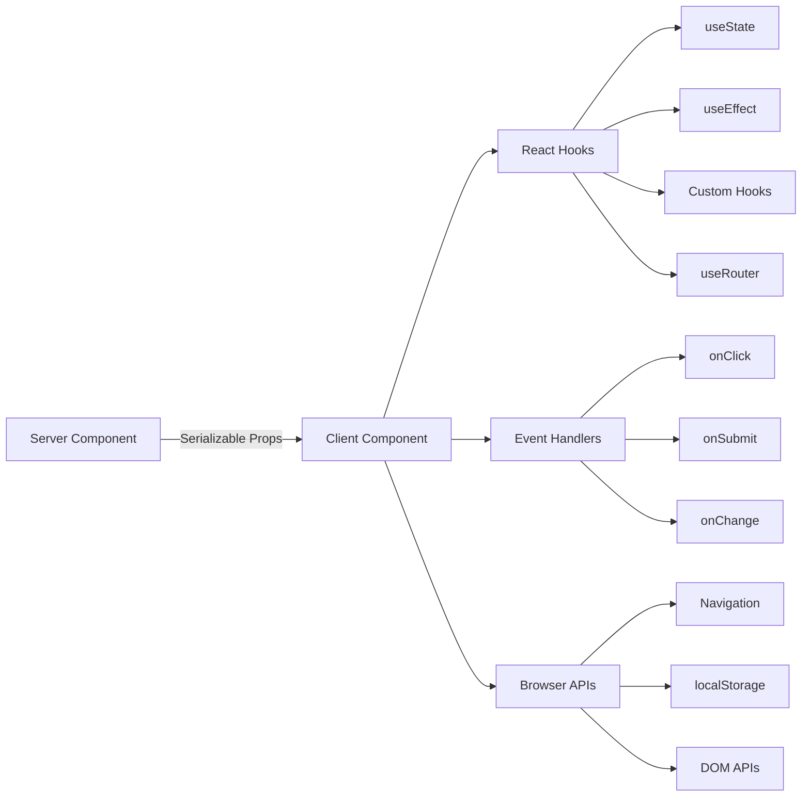

# Client-Komponentenmuster

## Übersicht

Client-Komponenten in der Ever Works-Vorlage sind interaktive „Inseln“, die Benutzerereignisse verarbeiten, den lokalen Status verwalten und in Browser-APIs integrieren. Sie werden durch die `"use client"`-Anweisung oben in der Datei identifiziert und selektiv dort verwendet, wo Interaktivität erforderlich ist.

## Architektur



## Quelldateien

|Datei|Muster|
|------|---------|
|`template/app/[locale]/admin/page.tsx`|Minimaler Client-Wrapper, der an die Komponente delegiert|
|`template/app/not-found.tsx`|Kundennavigation mit `useRouter`|
|`template/app/global-error.tsx`|Fehlergrenze mit Reset-Funktionalität|
|`template/components/filters/filter-url-parser.tsx`|URL-Statusverwaltung|
|`template/components/header/more-menu.tsx`|Interaktive Dropdown-Menüs|

## Kernmuster

### Muster 1: Minimale Client-Wrapper

Viele Seitenkomponenten verwenden den dünnsten möglichen Client-Wrapper:

```typescript
"use client";

import { AdminDashboard } from "@/components/admin";

export default function AdminPage() {
    return <AdminDashboard />;
}
```

Dieses Muster hält die Auslagerungsdatei klein und delegiert gleichzeitig die gesamte Logik an eine separate Komponente. Die `"use client"`-Direktive markiert die Grenze, an der der Serverkomponentenbaum zum Client-Rendering übergeht.

### Muster 2: Fehlergrenzenkomponenten

Der globale Fehlerhandler demonstriert das Fehlergrenzenmuster:

```typescript
'use client';

export default function GlobalError({
    error,
    reset,
}: {
    error: Error & { digest?: string };
    reset: () => void;
}) {
    useEffect(() => {
        console.error(error);
    }, [error]);

    return (
        <html lang="en">
            <body>
                <div>
                    <h1>Something went wrong!</h1>
                    {process.env.NODE_ENV !== 'production' && (
                        <div>
                            <p>{error.message}</p>
                            {error.digest && <p>Error ID: {error.digest}</p>}
                        </div>
                    )}
                    <Button onPress={() => reset()}>Refresh</Button>
                    <Link href="/">Go Home</Link>
                </div>
            </body>
        </html>
    );
}
```

Hauptaspekte:
- Die `error`-Requisite enthält ein optionales `digest` für die Serverfehlerverfolgung
- Die Funktion `reset()` rendert die untergeordneten Elemente der Fehlergrenze neu
- Stack-Traces werden nur in der Entwicklung angezeigt
- Die Komponente umschließt ihre eigenen Tags `<html>` und `<body>`, da globale Fehler die gesamte Seite ersetzen

### Muster 3: Clientseitige Navigation

Die Seite „Nicht gefunden“ zeigt clientseitige Navigationsmuster:

```typescript
'use client';

import { useRouter } from 'next/navigation';

export default function NotFound() {
    const router = useRouter();

    return (
        <div>
            <Button onClick={() => router.back()}>Go Back</Button>
            <Button onClick={() => router.push('/')}>Back to Home</Button>
            <button onClick={() => router.push('/help')}>Contact Support</button>
        </div>
    );
}
```

Der `useRouter`-Hook von `next/navigation` bietet programmatische Navigation. Beachten Sie, dass dies von `next/navigation` und nicht von `next/router` (Pages Router) stammt.

### Muster 4: i18n-fähige Client-Navigation

Die Vorlage bietet länderspezifische Navigations-Hooks über `i18n/navigation.ts`:

```typescript
import { createNavigation } from "next-intl/navigation";
import { routing } from "./routing";

export const { Link, redirect, usePathname, useRouter, getPathname } =
    createNavigation(routing);
```

Clientkomponenten, die einen länderspezifischen Navigationsimport aus diesem Modul anstelle von `next/navigation` benötigen:

```typescript
'use client';

import { Link, useRouter, usePathname } from '@/i18n/navigation';

function LocaleAwareComponent() {
    const router = useRouter();
    const pathname = usePathname();

    // router.push('/about') automatically includes the current locale prefix
    return <Link href="/about">About</Link>;
}
```

### Muster 5: Serveraktionen mit Formularvalidierung

Client-Komponenten werden mithilfe des validierten Aktionsmusters von `lib/auth/middleware.ts` in Serveraktionen integriert:

```typescript
// Server action (lib/auth/middleware.ts)
export function validatedAction<S extends z.ZodType, T>(
    schema: S,
    action: ValidatedActionFunction<S, T>
) {
    return async (prevState: ActionState, formData: FormData): Promise<T> => {
        const result = schema.safeParse(Object.fromEntries(formData));
        if (!result.success) {
            return { error: result.error.issues[0].message } as T;
        }
        return action(result.data, formData);
    };
}

// Client component
'use client';

import { useActionState } from 'react';
import { myServerAction } from './actions';

function MyForm() {
    const [state, formAction, isPending] = useActionState(myServerAction, {});

    return (
        <form action={formAction}>
            {state.error && <p>{state.error}</p>}
            <input name="email" type="email" />
            <button type="submit" disabled={isPending}>Submit</button>
        </form>
    );
}
```

### Muster 6: Statusverwaltung mit benutzerdefinierten Hooks

Die Vorlage organisiert die clientseitige Logik in benutzerdefinierten Hooks im Verzeichnis `hooks/`:

```typescript
'use client';

import { useFavorites } from '@/hooks/useFavorites';
import { useFilters } from '@/hooks/useFilters';

function ItemList() {
    const { favorites, toggleFavorite } = useFavorites();
    const { filters, updateFilter, resetFilters } = useFilters();

    return (
        <div>
            <FilterBar filters={filters} onChange={updateFilter} onReset={resetFilters} />
            <ItemGrid items={items} favorites={favorites} onToggleFavorite={toggleFavorite} />
        </div>
    );
}
```

## Grenzen der Client-Komponenten

### Wann ist `"use client"` zu verwenden?

- **Ereignishandler**: `onClick`, `onSubmit`, `onChange`
- **Reaktions-Hooks**: `useState`, `useEffect`, `useRef`, benutzerdefinierte Hooks
- **Browser-APIs**: `window`, `localStorage`, `navigator`
- **Client-Bibliotheken von Drittanbietern**: UI-Komponentenbibliotheken, die Interaktivität erfordern

### Wann als Serverkomponente beibehalten werden sollte

- Statische Inhaltswiedergabe
- Datenabruf und -transformation
- Übersetzung wird geladen (`getTranslations`)
- Metadatengenerierung
- Layout-Wrapper

## Best Practices in der Vorlage

1. **Drücken Sie `"use client"` so tief wie möglich** – halten Sie die Grenze nahe am interaktiven Blatt
2. **Serverdaten als Requisiten übergeben** – ein erneutes Abrufen auf dem Client vermeiden
3. **Verwenden Sie `useEffect` nur für Nebenwirkungen** – nicht zum Datenabruf
4. **Bevorzugen Sie Serveraktionen gegenüber API-Routen** – für Formularübermittlungen und Mutationen
5. **Navigation aus `@/i18n/navigation`** importieren – sorgt für eine ortsspezifische Weiterleitung
6. **Nur für die Gate-Entwicklung vorgesehene Benutzeroberfläche** – verwenden Sie `process.env.NODE_ENV !== 'production'`-Prüfungen
