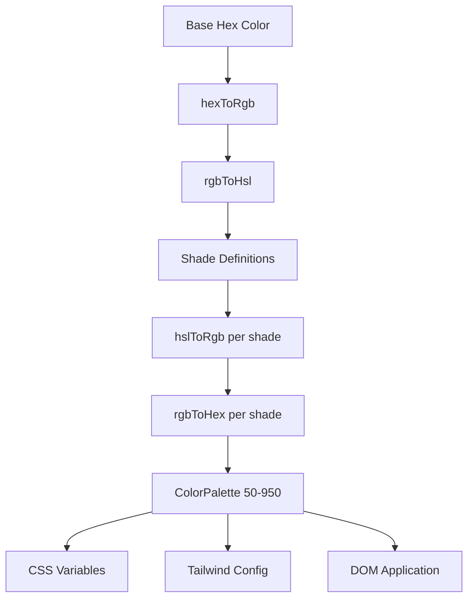

# Farbsystem

Die Vorlage verwendet ein dynamisches Farbgenerierungssystem, das vollständige Farbpaletten aus Basis-Hex-Farben erstellt. Dies unterstützt die Design-Engine und ermöglicht die Farbanpassung zur Laufzeit durch CSS-Variablen und die Tailwind-CSS-Integration.

## Architekturübersicht



## Quelldateien

|Datei|Zweck|
|------|---------|
|`lib/color-generator.ts`|Kernpalettengenerierung aus Hex-Farben|
|`lib/theme-color-manager.ts`|Farbanwendung auf Themenebene und CSS-Generierung|
|`lib/theme-utils.ts`|Hilfsklassen, Deckkraft-Helfer und Designvoreinstellungen|

## Farbkonvertierungspipeline

Das System wandelt Farben durch mehrere Darstellungen um, um Farbtöne präzise zu erzeugen. Vier Konvertierungsfunktionen übernehmen den gesamten Roundtrip.

```typescript
// Hex -> RGB -> HSL (for manipulation) -> RGB -> Hex (output)
export function hexToRgb(hex: string): { r: number; g: number; b: number };
export function rgbToHsl(r: number, g: number, b: number): { h: number; s: number; l: number };
export function hslToRgb(h: number, s: number, l: number): { r: number; g: number; b: number };
export function rgbToHex(r: number, g: number, b: number): string;
```

Helligkeits- und Sättigungsanpassungen erfolgen im HSL-Farbraum, der für wahrnehmbar gleichmäßige Farbübergänge in der gesamten Palette sorgt.

## Schattendefinitionen

Für jede Farbstufe gibt es feste Helligkeits- und Sättigungsanpassungen relativ zur Grundfarbe (500):

|Schatten|Helligkeit anpassen|Sättigungsanpassung|Nutzung|
|-------|-----------------|-------------------|-------|
| 50 | +45 | -30 |Hellste Hintergründe|
| 100 | +40 | -25 |Hover-Hintergründe|
| 200 | +30 | -20 |Aktive Hintergründe|
| 300 | +20 | -10 |Grenzen|
| 400 | +10 | -5 |Platzhaltertext|
| **500** | **0** | **0** |**Grundfarbe**|
| 600 | -10 | +5 |Hover-Zustände|
| 700 | -20 | +10 |Aktive Zustände|
| 800 | -30 | +15 |Hervorhebungstext|
| 900 | -40 | +20 |Schlagzeilen|
| 950 | -45 | +25 |Dunkelste Hintergründe|

## ColorPalette-Schnittstelle

```typescript
export interface ColorPalette {
  50: string;
  100: string;
  200: string;
  300: string;
  400: string;
  500: string;  // Base color
  600: string;
  700: string;
  800: string;
  900: string;
  950: string;
}
```

## Generieren einer Palette

Die Funktion `generateColorPalette` nimmt eine beliebige Hex-Farbe und erzeugt die vollständige Palette mit 11 Farbtönen:

```typescript
import { generateColorPalette } from '@/lib/color-generator';

const palette = generateColorPalette('#3b82f6');
// Returns: { 50: '#e8f0fe', 100: '#d4e4fd', ..., 950: '#0a1d3d' }
```

Die Werte für Helligkeit und Sättigung liegen zwischen 0 und 100, um zu verhindern, dass Farben außerhalb des Bereichs liegen.

## CSS-Variablengenerierung

Das System generiert benutzerdefinierte CSS-Eigenschaften für jeden Farbton:

```typescript
import { generateCssVariables } from '@/lib/color-generator';

const palette = generateColorPalette('#3b82f6');
const css = generateCssVariables('theme-primary', palette);
// Output:
// --theme-primary: #3b82f6;
// --theme-primary-50: #e8f0fe;
// --theme-primary-100: #d4e4fd;
// ... (all 11 shades)
```

## Tailwind CSS-Integration

Generieren Sie Tailwind-Konfigurationsobjekte, die auf CSS-Variablen verweisen:

```typescript
import { generateTailwindConfig } from '@/lib/color-generator';

const config = generateTailwindConfig('theme-primary');
// Returns: {
//   DEFAULT: 'var(--theme-primary)',
//   50: 'var(--theme-primary-50)',
//   100: 'var(--theme-primary-100)',
//   ...
// }
```

## Theme-Farbmanager

Das Modul `theme-color-manager.ts` wendet Paletten zur Laufzeit auf das DOM an.

### Erweiterte Theme-Konfigurationen

Vier integrierte Designs definieren Grundfarben für Primär-, Sekundär-, Akzent-, Hintergrund-, Oberflächen- und Textfarben:

```typescript
export const EXTENDED_THEME_CONFIGS: Record<ThemeKey, ThemeConfig> = {
  everworks: {
    primary: "#3d70ef",
    secondary: "#00c853",
    accent: "#0056b3",
    background: "#ffffff",
    surface: "#f8f9fa",
    text: "#1a1a1a",
    textSecondary: "#6c757d",
  },
  corporate: { /* ... */ },
  material: { /* ... */ },
  funny: { /* ... */ },
};
```

### Anwenden von Paletten auf das DOM

```typescript
import { applyColorPalette, applyThemeWithPalettes } from '@/lib/theme-color-manager';

// Apply a single color palette
applyColorPalette('theme-primary', '#3d70ef');

// Apply an entire theme (primary + secondary + accent + utility colors)
applyThemeWithPalettes('everworks');
```

Die Funktion `applyColorPalette` generiert auch eine RGB-Variante zur Deckkraftunterstützung:

```typescript
// Sets both:
// --theme-primary: #3d70ef
// --theme-primary-rgb: 61, 112, 239
```

### Statisches CSS generieren

Für serverseitiges Rendering oder Build-Time-CSS-Generierung:

```typescript
import { generateThemeCss } from '@/lib/theme-color-manager';

const css = generateThemeCss('everworks');
// Returns full CSS variable string for all theme colors
```

## Theme-Utility-Klassen

Das Modul `theme-utils.ts` bietet vorgefertigte Tailwind-Klassenkombinationen:

```typescript
import { themeClasses } from '@/lib/theme-utils';

// Button variants
themeClasses.button.primary   // "bg-theme-primary hover:bg-theme-accent text-white"
themeClasses.button.secondary // "bg-theme-secondary hover:bg-theme-secondary/80 text-white"
themeClasses.button.outline   // "border-2 border-theme-primary text-theme-primary ..."
themeClasses.button.ghost     // "text-theme-primary hover:bg-theme-primary/10"

// Text variants
themeClasses.text.primary     // "text-theme-text"
themeClasses.text.secondary   // "text-theme-text-secondary"
themeClasses.text.accent      // "text-theme-primary"
```

### Hilfsfunktionen

```typescript
import { withOpacity, getCssVariable, cn, buildThemeClasses } from '@/lib/theme-utils';

// Generate opacity variant
withOpacity('bg-theme-primary', 50); // "bg-theme-primary/50"

// Get CSS variable reference
getCssVariable('theme-primary'); // "var(--theme-primary)"

// Conditional class building
buildThemeClasses('base-class', 'theme-class', {
  'active-class': isActive,
  'disabled-class': isDisabled,
});
```

## Generierung von Batch-Designfarben

Generieren Sie eine CSS- und Tailwind-Konfiguration für mehrere Farben gleichzeitig:

```typescript
import { generateThemeColors } from '@/lib/color-generator';

const result = generateThemeColors({
  primary: '#3d70ef',
  secondary: '#00c853',
  accent: '#0056b3',
});

// result.css - Complete CSS variable declarations
// result.tailwind - Tailwind config object for all colors
```

## Benutzerdefinierte Theme-Anwendung

Wenden Sie beliebige Farben an, ohne die voreingestellten Designs zu verwenden:

```typescript
import { applyCustomTheme } from '@/lib/theme-color-manager';

applyCustomTheme({
  primary: '#e91e63',
  secondary: '#9c27b0',
  accent: '#673ab7',
});
```

## Fehlerbehandlung

Der Theme-Farbmanager umfasst Fallback-Verhalten:

- Wenn kein Designschlüssel gefunden wird, wird auf das `everworks` Standarddesign zurückgegriffen.
- Wenn beim Anwenden eines Themas ein Fehler auftritt und das angeforderte Thema nicht `everworks` ist, wird der Versuch automatisch mit dem Standardthema wiederholt.
- SSR-Sicherheit: `useThemeWithPalettes` prüft die Verfügbarkeit von `window`, bevor DOM-Änderungen angewendet werden.
