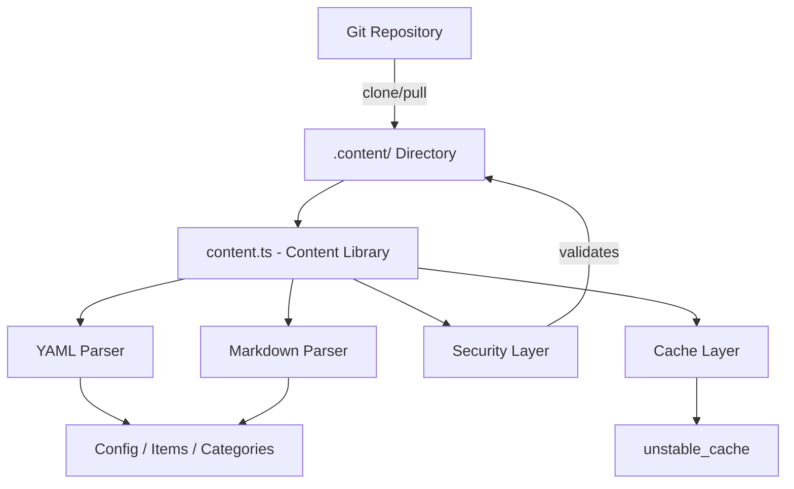
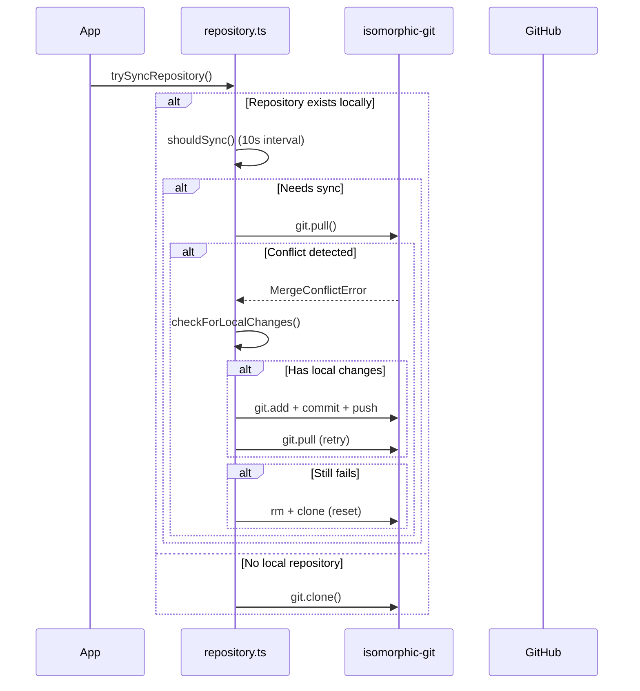

# Inhaltsbibliothek

Die Inhaltsbibliothek (`lib/content.ts`) bietet serverseitige Dienstprogramme zum Lesen, Parsen und Zwischenspeichern von Inhalten aus einem Git-basierten CMS-Repository. Es verwaltet YAML/Markdown-Inhaltsdateien, Konfigurationsmanagement und Inhaltssynchronisierung mit robusten Sicherheitsmaßnahmen.

## Architekturübersicht



## Quelldateien

|Datei|Zweck|
|------|---------|
|`lib/content.ts`|Hauptinhaltsverarbeitung, Lesen und Zwischenspeichern|
|`lib/repository.ts`|Git-Klon-/Pull-Synchronisierung mit Remote-Repository|
|`lib/lib.ts`|Pfad-Dienstprogramme (`getContentPath`, `fsExists`, `dirExists`)|
|`lib/cache-config.ts`|Cache-Tags und TTL-Konfiguration|

## Sicherheitsschicht

Die Inhaltsbibliothek erzwingt mehrere Sicherheitsmaßnahmen, um Path-Traversal- und Injektionsangriffe zu verhindern.

### Validierung des Sprachcodes

```typescript
function validateLanguageCode(lang: string): boolean {
  const validLangPattern = /^[a-zA-Z0-9_-]+$/;
  return validLangPattern.test(lang) && lang.length <= 10;
}
```

Es werden nur alphanumerische Zeichen, Bindestriche und Unterstriche mit einer maximalen Länge von 10 Zeichen akzeptiert.

### Bereinigung von Dateinamen

```typescript
function sanitizeFilename(filename: string): string {
  const sanitized = path.basename(filename);
  if (sanitized.includes('..') || sanitized.includes('/') || sanitized.includes('\\')) {
    throw new Error('Invalid filename: contains dangerous characters');
  }
  return sanitized;
}
```

Verwendet `path.basename`, um Verzeichniskomponenten zu entfernen und alle verbleibenden Durchlaufzeichen abzulehnen.

### Pfadvalidierung

```typescript
function validatePath(filepath: string, basePath: string): void {
  const resolvedPath = path.resolve(filepath);
  const resolvedBase = path.resolve(basePath);
  if (!resolvedPath.startsWith(resolvedBase + path.sep) && resolvedPath !== resolvedBase) {
    throw new Error('Invalid file path: outside of allowed directory');
  }
}
```

Die Funktion `safeReadFile` führt eine doppelte Prüfung durch: Sie validiert den Pfad und überprüft dann, ob der aufgelöste echte Pfad (der den symbolischen Links folgt) im Basisverzeichnis bleibt.

### URL-Validierung

```typescript
function isValidUrl(url: string): boolean {
  const trimmed = url.trim();
  if (trimmed.startsWith('/') && !trimmed.startsWith('//')) return true;
  return trimmed.startsWith('http://') || trimmed.startsWith('https://');
}
```

Blockiert `javascript:`, `data:`, `vbscript:` und andere gefährliche Protokollschemata.

### CSS-Größenvalidierung

```typescript
function isValidCssSize(value: string): boolean {
  if (['auto', 'inherit', 'initial', 'unset'].includes(value.trim())) return true;
  return /^\d+(\.\d+)?(px|em|rem|vh|vw|%|pt|cm|mm|in)?$/.test(value.trim());
}
```

Verhindert die CSS-Injektion durch benutzerdefinierte Hero-Frontmatter-Felder.

## Inhaltsverarbeitung

### YAML-Analyse

Inhaltsdateien werden mithilfe der `yaml`-Bibliothek mit Zod-Schemavalidierung für Frontmatter analysiert:

```typescript
const customHeroFrontmatterSchema = z.object({
  background_image: z.string().refine(isValidUrl, {
    message: 'Invalid URL: must be http, https, or relative path'
  }).optional(),
  // ... additional validated fields
});
```

### Konfigurations-Caching

Die Site-Konfiguration wird mithilfe von Next.js `unstable_cache` mit definierten TTLs und Cache-Tags zwischengespeichert:

```typescript
import { CACHE_TAGS, CACHE_TTL } from './cache-config';

const getCachedConfig = unstable_cache(
  async () => { /* read and parse config.yml */ },
  [CACHE_TAGS.CONFIG],
  { revalidate: CACHE_TTL }
);
```

## Git-Repository-Synchronisierung

Das Modul `repository.ts` verwaltet Git-Vorgänge mithilfe von `isomorphic-git`.

### Ablauf synchronisieren



### Timeout-Schutz

Alle Git-Vorgänge werden mit konfigurierbaren Zeitüberschreitungen umschlossen:

```typescript
async function withTimeout<T>(promise: Promise<T>, timeoutMs: number = 120000): Promise<T> {
  const timeoutPromise = new Promise<never>((_, reject) => {
    setTimeout(() => reject(new Error(`Operation timeout after ${timeoutMs}ms`)), timeoutMs);
  });
  return Promise.race([promise, timeoutPromise]);
}
```

### Konfliktlösung

Das System behandelt Zusammenführungskonflikte mithilfe einer mehrstufigen Strategie:

1. **Lokale Änderungen erkennen** über `git.statusMatrix()`
2. **Versuchen Sie, lokale Änderungen zu pushen**, bevor Sie sie abrufen
3. **Pull erneut versuchen** nach erfolgreichem Push
4. **Vollständiger Reset** (Löschen + erneutes Klonen) als letzter Ausweg

### Fallback-Verhalten

Wenn `DATA_REPOSITORY` nicht konfiguriert ist oder das Klonen fehlschlägt, erstellt das System minimalen Fallback-Inhalt:

```typescript
// Creates empty content directory with minimal config
const DEFAULT_CONFIG = `site_name: Website
item_name: Item
items_name: Items
copyright_year: ${new Date().getFullYear()}
`;
```

## Nur-Server-Durchsetzung

Sowohl `content.ts` als auch `repository.ts` verwenden den `server-only`-Import, um eine versehentliche clientseitige Verwendung zu verhindern:

```typescript
'use server';
import 'server-only';
```

Dadurch wird sichergestellt, dass Inhaltsvorgänge mit Dateisystemzugriff niemals in Client-Bundles eindringen.

## Wichtige exportierte Funktionen

|Funktion|Beschreibung|
|----------|-------------|
|`getCachedConfig()`|Gibt die zwischengespeicherte Site-Konfiguration von `config.yml` zurück|
|`trySyncRepository()`|Klont oder ruft Inhalte aus dem Remote-Git-Repository ab|
|`pullChanges()`|Ruft die neuesten Änderungen mit Konfliktlösung ab|
|`validateLanguageCode()`|Validiert das i18n-Sprachcodeformat|
|`sanitizeFilename()`|Entfernt Verzeichniskomponenten aus Dateinamen|
|`safeReadFile()`|Liest Dateien mit vollständigem Pfaddurchquerungsschutz|
