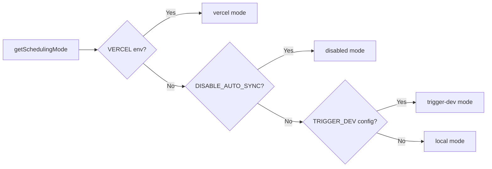

# Cron-Job-System

## Übersicht

Die Ever Works-Vorlage implementiert ein flexibles Hintergrundjobsystem, das drei Planungsmodi unterstützt: **Vercel Cron**, **Trigger.dev** und einen **lokalen Planer**. Cron-Endpunkte sind standardmäßige Next.js-API-Routen, die über `CRON_SECRET` authentifiziert werden, und das System enthält ein Singleton-Initialisierungsmodul, das sicherstellt, dass Jobs genau einmal pro Prozess eingerichtet werden.

## Architektur

```mermaid
flowchart TD
    A[Scheduling Mode Detection] --> B{getSchedulingMode}

    B -->|vercel| C[Vercel Cron]
    B -->|trigger-dev| D[Trigger.dev]
    B -->|local| E[Local Scheduler]
    B -->|disabled| F[No Jobs]

    C --> G[vercel.json crons]
    G --> G1[/api/cron/sync]
    G --> G2[/api/cron/subscription-reminders]
    G --> G3[/api/cron/subscription-expiration]

    G1 --> H[CRON_SECRET Verification]
    G2 --> H
    G3 --> H

    H -->|Valid| I[Execute Job]
    H -->|Invalid| J[401 Unauthorized]

    I --> I1[triggerManualSync]
    I --> I2[subscriptionRenewalReminderJob]
    I --> I3[processExpiredSubscriptions]

    D --> K[Trigger.dev SDK]
    E --> L[Internal setInterval]

    K --> I
    L --> I
```

## Quelldateien

|Datei|Zweck|
|------|---------|
|`template/vercel.json`|Definitionen des Cron-Zeitplans von Vercel|
|`template/app/api/cron/sync/route.ts`|Cron-Endpunkt für die Inhaltssynchronisierung|
|`template/app/api/cron/subscription-reminders/route.ts`|E-Mails zur Verlängerungserinnerung|
|`template/app/api/cron/subscription-expiration/route.ts`|Abgelaufene Abonnementverarbeitung|
|`template/app/api/cron/jobs/background-jobs-init.ts`|Initialisierung eines Singleton-Jobs|

## Cron-Zeitplankonfiguration

### vercel.json

```json
{
    "crons": [
        {
            "path": "/api/cron/sync",
            "schedule": "0 3 * * *"
        },
        {
            "path": "/api/cron/subscription-reminders",
            "schedule": "0 9 * * *"
        },
        {
            "path": "/api/cron/subscription-expiration",
            "schedule": "0 0 * * *"
        }
    ]
}
```

|Arbeit|Zeitplan|Zeit|Beschreibung|
|-----|----------|------|-------------|
|Inhaltssynchronisierung| `0 3 * * *` |Täglich 3:00 Uhr UTC|Synchronisiert Inhalte von Git-basierten CMS|
|Abonnement-Erinnerungen| `0 9 * * *` |Täglich 9:00 Uhr UTC|Versendet E-Mails zur Erinnerung an die Verlängerung|
|Ablauf des Abonnements| `0 0 * * *` |Täglich Mitternacht UTC|Verarbeitet abgelaufene Abonnements|

## Authentifizierung

### Timing-sichere Geheimverifizierung

Alle Cron-Endpunkte überprüfen den `CRON_SECRET` mithilfe eines zeitsicheren Vergleichs, um Timing-Angriffe zu verhindern:

```typescript
import crypto from 'crypto';

function verifyCronSecret(request: NextRequest): boolean {
    const authHeader = request.headers.get('authorization');
    const cronSecret = process.env.CRON_SECRET;

    // Development bypass
    if (!cronSecret && process.env.NODE_ENV === 'development') {
        console.log('[Cron] Bypassing cron auth in development');
        return true;
    }

    if (!cronSecret || !authHeader) return false;

    const expectedValue = `Bearer ${cronSecret}`;

    // Length check before timing-safe comparison
    if (authHeader.length !== expectedValue.length) return false;

    return crypto.timingSafeEqual(
        Buffer.from(authHeader, 'utf8'),
        Buffer.from(expectedValue, 'utf8')
    );
}
```

Wichtige Sicherheitsfunktionen:
- **Timing-sicherer Vergleich** über `crypto.timingSafeEqual` – verhindert, dass Angreifer Antwortzeitunterschiede messen, um das Geheimnis zu erraten
- **Vorabprüfung der Länge** – `timingSafeEqual` erfordert Puffer gleicher Länge
- **Entwicklungsumgehung** – nur wenn `CRON_SECRET` nicht konfiguriert ist und `NODE_ENV=development`

### Automatische Vercel-Authentifizierung

Bei der Bereitstellung auf Vercel fügt die Plattform automatisch den Header `Authorization: Bearer <CRON_SECRET>` für konfigurierte Cron-Jobs hinzu. Sie müssen lediglich die Umgebungsvariable `CRON_SECRET` im Vercel-Dashboard festlegen.

## Job-Implementierungen

### Inhaltssynchronisierungsauftrag

```typescript
export async function GET(request: Request): Promise<NextResponse> {
    const startTime = Date.now();

    // Verify authorization
    if (!isAuthorized) {
        return NextResponse.json({ success: false, message: "Unauthorized" }, { status: 401 });
    }

    try {
        const result = await triggerManualSync();
        const duration = Date.now() - startTime;

        return NextResponse.json({
            success: result.success,
            timestamp: new Date().toISOString(),
            duration,
            message: result.message,
        }, {
            headers: { "Cache-Control": "no-cache, no-store, must-revalidate" },
        });
    } catch (error) {
        return NextResponse.json({
            success: false,
            message: "Cron sync failed",
            details: safeErrorMessage(error, "Unknown error"),
        }, { status: 500 });
    }
}
```

Antwortformat:
```json
{
    "success": true,
    "timestamp": "2025-01-15T03:00:05.123Z",
    "duration": 5123,
    "message": "Sync completed successfully"
}
```

### Job zum Ablauf des Abonnements

Dieser Job verarbeitet abgelaufene Abonnements und sendet Benachrichtigungs-E-Mails:

```typescript
export async function GET(request: NextRequest) {
    if (!verifyCronSecret(request)) {
        return NextResponse.json({ success: false, message: 'Unauthorized' }, { status: 401 });
    }

    // 1. Find and update expired subscriptions
    const result = await subscriptionService.processExpiredSubscriptions();

    // 2. Send notification emails
    const { service: emailService } = await createEmailService();
    if (emailService.isServiceAvailable()) {
        for (const subscription of result.subscriptions) {
            const user = await getUserById(subscription.userId);
            const emailTemplate = getSubscriptionExpiredTemplate({ /* ... */ });
            await sendEmailSafely(emailService, emailConfig, emailTemplate, user.email);
        }
    }

    // 3. Return results
    return NextResponse.json({
        success: true,
        data: {
            processed: result.processed,
            affectedUsers,
            errors: result.errors,
            timestamp: new Date().toISOString()
        }
    });
}
```

Wichtige Verhaltensweisen:
- E-Mail-Fehler führen nicht dazu, dass der Auftrag fehlschlägt
- Die Methode `POST` wird auch als Alias für manuelle Trigger exportiert
- Gibt bei Teilerfolgen `207 Multi-Status` zurück

### Abonnement-Erinnerungsjob

```typescript
export async function GET(request: NextRequest) {
    if (!verifyCronSecret(request)) {
        return NextResponse.json({ error: 'Unauthorized' }, { status: 401 });
    }

    const result = await subscriptionRenewalReminderJob();

    if (!result.success) {
        return NextResponse.json(
            { error: 'Job completed with errors', ...result },
            { status: 207 }  // Multi-Status for partial success
        );
    }

    return NextResponse.json({
        message: 'Subscription reminder job completed',
        ...result
    });
}

// Support POST for Vercel Cron
export async function POST(request: NextRequest) {
    return GET(request);
}
```

## Initialisierung von Hintergrundjobs

### Singleton-Muster

Das Initialisierungsmodul verwendet `globalThis`, um sicherzustellen, dass Jobs genau einmal eingerichtet werden, auch über serverlose Funktionsaufrufe hinweg:

```typescript
const GLOBAL_KEY = '__BACKGROUND_JOBS_INIT__' as const;

interface BackgroundJobsGlobalState {
    initializationState: 'pending' | 'initializing' | 'completed';
    initializationPromise: Promise<void> | null;
    loggedMode: SchedulingMode | null;
}

export async function ensureBackgroundJobsInitialized(): Promise<void> {
    // Skip during tests and builds
    if (process.env.NODE_ENV === 'test') return;
    if (process.env.NEXT_PHASE === 'phase-production-build') return;

    const state = getGlobalState();

    // Fast path: already completed
    if (state.initializationState === 'completed') return;

    // Wait for in-progress initialization
    if (state.initializationState === 'initializing') {
        return state.initializationPromise;
    }

    // Start initialization
    state.initializationState = 'initializing';
    state.initializationPromise = doInitialize();

    try {
        await state.initializationPromise;
        state.initializationState = 'completed';
    } catch (error) {
        state.initializationState = 'pending'; // Allow retry
        throw error;
    }
}
```

### Planungsmodi



|Modus|Verhalten|
|------|----------|
|`vercel`|Von Vercel Cron über HTTP-Endpunkte abgewickelte Jobs|
|`trigger-dev`|Vom Trigger.dev Cloud Scheduler verwaltete Jobs|
|`local`|Interner `setInterval`-basierter Planer für die Entwicklung|
|`disabled`|Keine automatische Planung (`DISABLE_AUTO_SYNC=true`)|

## Umgebungsvariablen

|Variabel|Erforderlich|Beschreibung|
|----------|----------|-------------|
|`CRON_SECRET`|Nur Produktion|Inhabertoken für die Cron-Authentifizierung|
|`DISABLE_AUTO_SYNC`|Nein|Auf `true` setzen, um alle Hintergrundjobs zu deaktivieren|
|`VERCEL`|Automatisch eingestellt|Automatisch von der Vercel-Plattform festgelegt|

## Best Practices

1. **Verwenden Sie für Cron-Geheimnisse immer einen zeitsicheren Vergleich** – verhindert Timing-Angriffe
2. **Exportieren Sie sowohl GET als auch POST** – Vercel Cron kann beide Methoden verwenden
3. **Legen Sie `Cache-Control: no-cache`** für Antworten fest – verhindern Sie das Zwischenspeichern von Jobergebnissen
4. **Jobdauer protokollieren** – hilft bei der Identifizierung von Leistungsrückgängen
5. **Behandeln Sie E-Mail-Fehler ordnungsgemäß** – lassen Sie nicht zu, dass Benachrichtigungsfehler den Job zum Absturz bringen
6. **Verwenden Sie `207 Multi-Status`** für teilweise Erfolge – zur Unterscheidung von vollständigem Erfolg/Misserfolg
