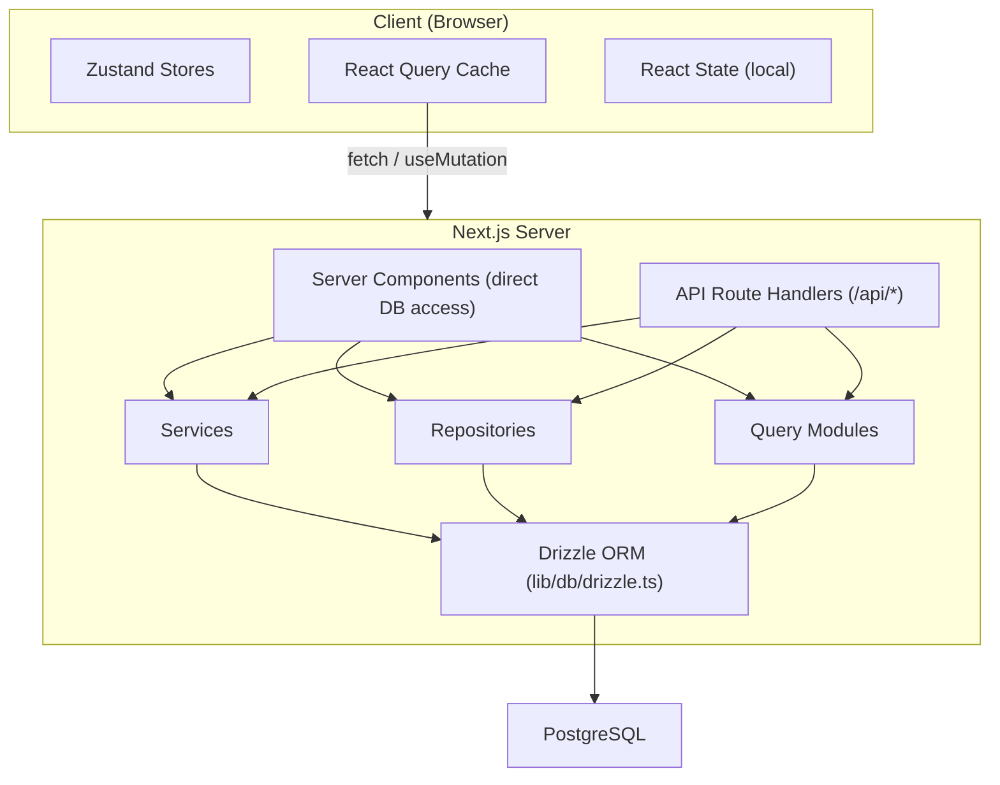

# Datenfluss- und Statusverwaltung

Dieses Dokument beschreibt, wie Daten durch die Ever Works-Vorlage fließen, von der Datenbank zur Benutzeroberfläche, und deckt Serverkomponenten, API-Routen, React Query, Zustandsspeicher und das Repository-Muster ab.

## Architekturübersicht

Die Vorlage verwendet eine mehrschichtige Datenarchitektur:



## Serverseitiger Datenabruf

### Serverkomponenten (direkter DB-Zugriff)

Serverkomponenten im Verzeichnis `app/` können Datenbankabfragefunktionen oder Repository-Methoden direkt importieren und aufrufen. Dies ist der effizienteste Weg, da er unnötige HTTP-Roundtrips vermeidet.

```typescript
// app/[locale]/admin/items/page.tsx (simplified)
import { getItems } from '@/lib/db/queries';

export default async function AdminItemsPage() {
  const items = await getItems();
  return <ItemsList items={items} />;
}
```

### API-Routenhandler

API-Routen in `app/api/` dienen als Brücke zwischen Client-Komponenten und serverseitiger Logik. Sie folgen einem Thin-Handler-Muster: Eingaben validieren, den entsprechenden Dienst oder das entsprechende Repository aufrufen und eine HTTP-Antwort zurückgeben.

```typescript
// Typical API route pattern
export async function GET(request: NextRequest) {
  const session = await auth();
  if (!session?.user) {
    return NextResponse.json({ error: 'Unauthorized' }, { status: 401 });
  }

  const data = await someRepository.findAll();
  return NextResponse.json({ success: true, data });
}
```

## Clientseitiges Statusmanagement

### TanStack-Abfrage (React Query 5)

React Query ist das primäre Tool für die clientseitige Serverstatusverwaltung. Die Vorlage verwendet es umfassend über benutzerdefinierte Hooks im Verzeichnis `hooks/`.

**Globale Konfiguration** (`lib/react-query-config.ts`):
- Standardmäßige Wartezeit: 5 Minuten
- Zeit der Müllabfuhr: 10 Minuten
- Automatischer Wiederholungsversuch mit exponentiellem Backoff (bis zu 3 Wiederholungsversuche)
- Beim Fensterfokus erneut abrufen und erneut verbinden
- Kein erneuter Versuch bei 4xx-Client-Fehlern

**Hook-Muster**: Jeder Funktionsbereich verfügt über dedizierte Hooks, die React Query umschließen:

```typescript
// hooks/use-admin-items.ts (simplified pattern)
import { useQuery, useMutation, useQueryClient } from '@tanstack/react-query';

export function useAdminItems(params) {
  return useQuery({
    queryKey: ['admin', 'items', params],
    queryFn: () => fetch('/api/admin/items').then(r => r.json()),
    staleTime: 5 * 60 * 1000,
  });
}

export function useCreateItem() {
  const queryClient = useQueryClient();
  return useMutation({
    mutationFn: (data) => fetch('/api/admin/items', {
      method: 'POST',
      body: JSON.stringify(data),
    }).then(r => r.json()),
    onSuccess: () => {
      queryClient.invalidateQueries({ queryKey: ['admin', 'items'] });
    },
  });
}
```

### Zustandsgeschäfte

Zustand wird für den reinen Client-UI-Status verwendet, der keine Serversynchronisierung erfordert. Beispiele hierfür sind:

- **Themenstatus**: Bevorzugter Hell-/Dunkelmodus
- **Filterstatus**: Aktive Filterauswahl
- **Modalstatus**: Offener/geschlossener Status für Modalitäten und Overlays
- **Layout-Einstellungen**: Raster- oder Listenansicht, Seitenleistenstatus

### Kontext reagieren

Reaktionskontextanbieter in `components/context/` und `components/providers/` stellen den Komponentenunterbäumen einen gemeinsamen Status zur Verfügung. Der Root-Provider-Wrapper (`app/[locale]/providers.tsx`) besteht aus:

- React Query-Anbieter (mit Abfrage-Client)
- Theme-Anbieter
- Anbieter der Authentifizierungssitzung
- Anbieter von Toast-Benachrichtigungen

## Datenzugriffsschichten

### Repository-Muster

Repositorys in `lib/repositories/` bieten eine saubere Abstraktion über Datenbankoperationen. Jedes Repository kapselt Abfragen für eine bestimmte Domänenentität.

```
lib/repositories/
├── admin-analytics-optimized.repository.ts
├── admin-stats.repository.ts
├── category.repository.ts
├── client-dashboard.repository.ts
├── client-item.repository.ts
├── collection.repository.ts
├── integration-mapping.repository.ts
├── item.repository.ts
├── role.repository.ts
├── sponsor-ad.repository.ts
├── tag.repository.ts
├── twenty-crm-config.repository.ts
└── user.repository.ts
```

### Abfragemodule

Das Verzeichnis `lib/db/queries/` enthält mehr als 23 Abfragemodule, die nach Domänen organisiert sind. Diese stellen rohe Drizzle ORM-Abfragefunktionen bereit, die von Repositorys und Diensten genutzt werden.

### Diensteschicht

Das Verzeichnis `lib/services/` enthält mehr als 30 Servicedateien, die Geschäftslogik implementieren. Dienste orchestrieren mehrere Repositorys, externe API-Aufrufe und Nebenwirkungen (E-Mail, Benachrichtigungen, Webhooks).

## API-Client-Architektur

### Serverseitiger API-Client

`lib/api/server-api-client.ts` bietet einen zentralisierten HTTP-Client für serverseitige Aufrufe mit:
- Automatischer Wiederholungsversuch mit exponentiellem Backoff
- Konfigurierbare Zeitüberschreitungen (Standard 30 Sekunden)
- Strukturierte Protokollierung in der Entwicklung
- Fehlernormalisierung

### Browserseitiger API-Client

`lib/api/api-client.ts` und `lib/api/api-client-class.ts` stellen die clientseitige API-Abstraktion bereit, die von React Query-Hooks zum Aufrufen von API-Routen verwendet wird.

## Inhaltsdaten (Git-basiertes CMS)

Der Elementinhalt (Verzeichnislisten) wird in einem Git-Repository gespeichert und über `lib/content.ts` und `lib/repository.ts` verwaltet. Dieser Inhalt wird zur Erstellungszeit in `.content/` geklont und regelmäßig synchronisiert. Das Inhaltssystem verwendet `isomorphic-git` für Git-Vorgänge direkt aus Node.js.

## Cache-Strategie

Die Vorlage implementiert einen mehrstufigen Caching-Ansatz:

1. **React Query Cache**: Clientseitig mit konfigurierbaren Stale/GC-Zeiten pro Abfrage
2. **Next.js-Cache**: Serverseitiges Rendering und Datencache über `lib/cache-config.ts`
3. **Cache-Invalidierung**: Gezielte Invalidierung durch `lib/cache-invalidation.ts` mithilfe von Revalidierungs-Tags
4. **Datenbankverbindungspooling**: Konfiguriert in `lib/db/drizzle.ts` mit Poolgrößen zwischen 1 und 50 Verbindungen
