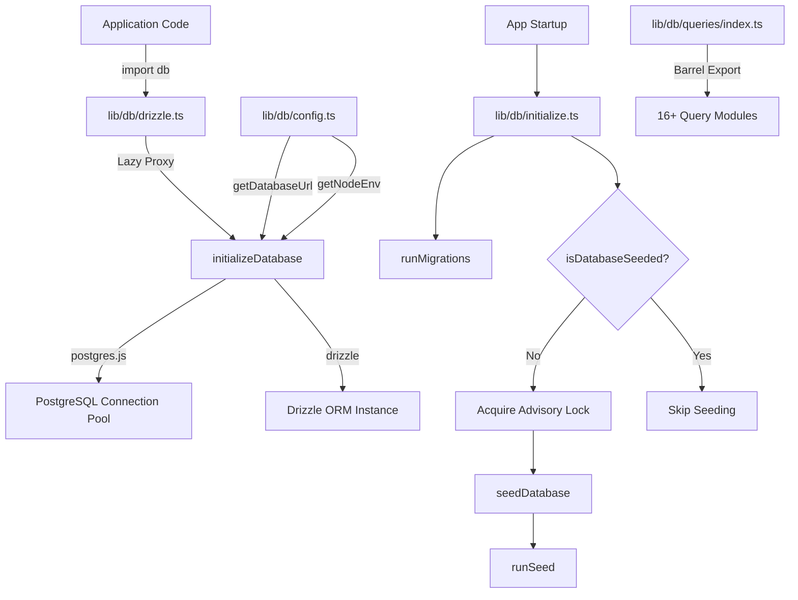
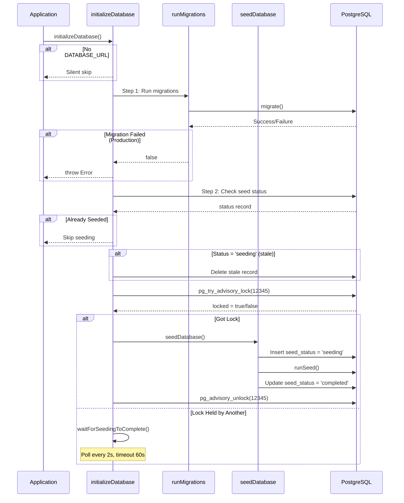

# Modul „Datenbankdienstprogramme“.

Das Datenbankdienstprogrammmodul (`template/lib/db/`) verwaltet das PostgreSQL-Verbindungspooling über `postgres.js`, Drizzle ORM-Initialisierung, automatisierte Migrationen und Datenbank-Seeding mit nebenläufigkeitssicherer Sperre. Es ist für den Einsatz in serverlosen Umgebungen (Vercel) konzipiert, in denen es zu mehreren Kaltstarts kommen kann, um die Datenbank zu initialisieren.

## Architekturübersicht



## Quelldateien

|Datei|Beschreibung|
|------|-------------|
|`lib/db/config.ts`|Skriptsichere Datenbankkonfiguration (kein `server-only`)|
|`lib/db/drizzle.ts`|Verbindungspool und Drizzle-Instanz mit Lazy-Proxy|
|`lib/db/initialize.ts`|Automatische Migration und Seeding-Orchestrierung|
|`lib/db/migrate.ts`|Migrationsläufer|
|`lib/db/queries/index.ts`|Barrel-Export für alle Abfragemodule|

## Datenbankkonfiguration (`config.ts`)

Skriptsichere Funktionen, die `server-only` **nicht** importieren und die Verwendung in Migrations- und Seed-Skripten ermöglichen:

```typescript
function getDatabaseUrl(): string | undefined;
function getNodeEnv(): 'development' | 'production' | 'test';
function isProduction(): boolean;
```

## Verbindung und ORM (`drizzle.ts`)

### Lazy-Proxy-Muster

Der `db`-Export verwendet ein JavaScript `Proxy`, um die Verbindungsinitialisierung bis zur ersten Verwendung aufzuschieben. Dies verhindert Verbindungsfehler während der Erstellungszeit, wenn `DATABASE_URL` möglicherweise nicht verfügbar ist.

```typescript
// Proxy intercepts all property access and initializes on demand
export const db = new Proxy({} as ReturnType<typeof drizzle>, {
  get(target, prop) {
    const database = initializeDatabase();
    return database[prop as keyof typeof database];
  },
});
```

### Konfiguration des Verbindungspools

```typescript
function getPoolSize(): number;
// - Reads DB_POOL_SIZE env var (clamped to 1-50)
// - Defaults: 20 (production), 10 (development)
```

Pooleinstellungen:
- `idle_timeout`: 20 Sekunden
- `connect_timeout`: 30 Sekunden
- `prepare`: false (erforderlich für einige serverlose Umgebungen)

### Singleton über `globalThis`

Die Verbindung wird auf `globalThis` zwischengespeichert, um das Neuladen des Next.js-Hot-Moduls in der Entwicklung zu überstehen:

```typescript
const globalForDb = globalThis as unknown as {
  conn: postgres.Sql | undefined;
  db: ReturnType<typeof drizzle> | undefined;
};
```

### Direkter Instanzzugriff

Für Fälle, die die tatsächliche Drizzle-Instanz erfordern (z. B. den NextAuth.js-Drizzle-Adapter):

```typescript
import { getDrizzleInstance } from '@/lib/db/drizzle';

const adapter = DrizzleAdapter(getDrizzleInstance(), { ... });
```

## Migrationsläufer (`migrate.ts`)

### `runMigrations(): Promise<boolean>`

Führt Drizzle-Migrationen aus dem Ordner `./lib/db/migrations` aus. Der Aufruf kann bei jedem Start sicher erfolgen, da `migrate()` von Drizzle idempotent ist – es verfolgt angewandte Migrationen in einer `__drizzle_migrations` Tabelle.

```typescript
import { runMigrations } from '@/lib/db/migrate';

const success = await runMigrations();
if (!success) {
  console.error('Migrations failed -- run pnpm db:migrate manually');
}
```

**Verhalten:**
- Protokolliert den aktuellen Migrationsverlauf vor und nach der Ausführung
- Gibt `true` bei Erfolg zurück, `false` bei Fehler
- Wird nicht ausgelöst – Fehler werden protokolliert und als boolescher Wert zurückgegeben

## Datenbankinitialisierung (`initialize.ts`)

### `initializeDatabase(): Promise<void>`

Die Hauptinitialisierungsfunktion, die beim Anwendungsstart aufgerufen wird. Bewältigt den gesamten Lebenszyklus:



### Parallelitätssicherheit

Mehrere serverlose Instanzen können gleichzeitig gestartet werden. Das Modul verhindert doppeltes Seeding durch:

1. **PostgreSQL-Beratungssperre** (`pg_try_advisory_lock(12345)`) – nicht blockierend
2. **Seed-Statustabelle** verfolgt die Zustände `seeding`, `completed`, `failed`
3. **Veraltungserkennung** – 5-Minuten-Schwellenwert für den Status „Hängen“ `seeding`
4. **Wait-and-Poll** – Instanzen, die die Sperrabfrage nicht alle 2 Sekunden erhalten können

### Hilfsfunktionen

```typescript
// Check if database has been successfully seeded
async function isDatabaseSeeded(): Promise<boolean>;

// Wait for another instance to finish seeding (60s timeout, 2s intervals)
async function waitForSeedingToComplete(): Promise<boolean>;
```

## Abfragemodule

Das Verzeichnis `lib/db/queries/` enthält domänenspezifische Abfragemodule, die alle über `index.ts` erneut exportiert werden:

|Modul|Domäne|
|--------|--------|
|`activity.queries.ts`|Aktivitätsprotokollierung|
|`auth.queries.ts`|Authentifizierung (Benutzersuche, Passwortüberprüfung)|
|`client.queries.ts`|Kundenprofile|
|`comment.queries.ts`|Kommentare|
|`company.queries.ts`|Firmenprofile|
|`dashboard.queries.ts`|Dashboard-Statistiken|
|`engagement.queries.ts`|Ansichten, Stimmen, Favoriten-Aggregation|
|`item.queries.ts`|Artikel CRUD|
|`location-index.queries.ts`|Standortbasierte Indizierung|
|`newsletter.queries.ts`|Newsletter-Abonnements|
|`payment.queries.ts`|Zahlungsaufzeichnungen|
|`report.queries.ts`|Berichte|
|`subscription.queries.ts`|Abonnements|
|`survey.queries.ts`|Umfragen und Antworten|
|`user.queries.ts`|Benutzerverwaltung|
|`vote.queries.ts`|Abstimmungssystem|

### Muster importieren

```typescript
import {
  getUserByEmail,
  getClientProfileByUserId,
  logActivity,
  isUserAdmin,
} from '@/lib/db/queries';
```

## Umgebungsvariablen

|Variabel|Erforderlich|Beschreibung|
|----------|----------|-------------|
|`DATABASE_URL`|Nein (optionale DB)|PostgreSQL-Verbindungszeichenfolge|
|`DB_POOL_SIZE`|Nein|Verbindungspoolgröße (Standard: 10/20)|
|`NODE_ENV`|Nein|Bestimmt die Standardwerte für die Poolgröße und die Protokollierung|
