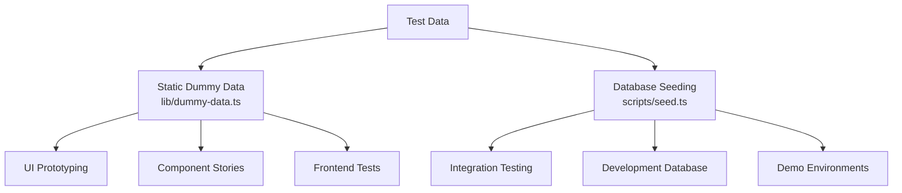
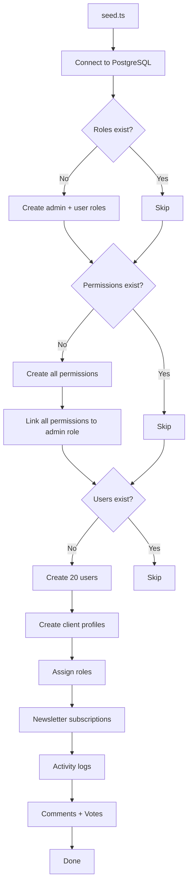
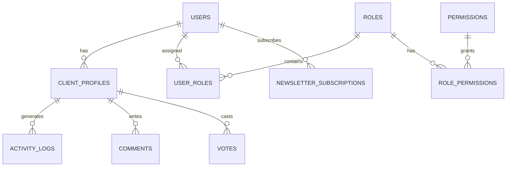

# Dummy-Datensystem

Die Vorlage bietet zwei Ansätze zum Testen von Daten: statische Dummy-Daten für die UI-Entwicklung und das Prototyping sowie ein Datenbank-Seeding-System zum Generieren realistischer Datensätze in PostgreSQL. Gemeinsam decken sie den gesamten Entwicklungslebenszyklus ab, vom Mockup bis zum Integrationstest.

## Übersicht



## Statische Dummy-Daten

Das Modul `lib/dummy-data.ts` exportiert typisierte Beispieldaten zur Verwendung in Komponenten während der Entwicklung.

### Übermittlungsschnittstelle

```typescript
export interface Submission {
  id: string;
  title: string;
  description: string;
  status: "approved" | "pending" | "rejected";
  submittedAt: string | null;
  approvedAt?: string;
  rejectedAt?: string;
  rejectionReason?: string;
  category: string;
  tags: string[];
  views: number;
  likes: number;
}
```

### dummySubmissions

Sechs Mustereinreichungen, die alle Statuszustände abdecken:

|Ausweis|Titel|Status|Kategorie|Ansichten|Gefällt mir|
|---|---|---|---|---|---|
| 1 |Moderne E-Commerce-Plattform|genehmigt|Webentwicklung| 1250 | 89 |
| 2 |Aufgabenverwaltungs-App|ausstehend|Mobile Entwicklung| 567 | 23 |
| 3 |Wetter-Dashboard|abgelehnt|Webentwicklung| 890 | 45 |
| 4 |KI-Chat-Assistent|genehmigt|KI/ML| 2100 | 156 |
| 5 |Fitness-Tracking-App|ausstehend|Mobile Entwicklung| 432 | 18 |
| 6 |Blog-Plattform|ausstehend|Webentwicklung| 0 | 0 |

Verwendung in Komponenten:

```typescript
import { dummySubmissions } from '@/lib/dummy-data';

export function SubmissionList() {
  return (
    <div>
      {dummySubmissions.map((submission) => (
        <SubmissionCard key={submission.id} submission={submission} />
      ))}
    </div>
  );
}
```

### dummyPortfolio

Drei Beispiel-Portfolioelemente zur Präsentation von Projektkarten:

|Ausweis|Titel|Hervorgehoben|Schlagworte|
|---|---|---|---|
| 1 |E-Commerce-Plattform|Ja|Next.js, Stripe, E-Commerce|
| 2 |Aufgabenverwaltungs-App|Ja|Reagieren, Firebase, Echtzeit|
| 3 |Wetter-Dashboard|Nein|Vue.js, Wetter-API, Dashboard|

Zu jedem Portfolioelement gehören:

```typescript
{
  id: string;
  title: string;
  description: string;
  imageUrl: string;      // Unsplash placeholder image
  externalUrl: string;   // Demo link
  tags: string[];
  isFeatured: boolean;
}
```

## Datenbank-Seeding

Das `scripts/seed.ts`-Skript generiert mithilfe von Drizzle ORM realistische Daten direkt in PostgreSQL.

### Seeding-Architektur



### Datenbeziehungen



### Generierte Benutzerprofile

Die Sämaschine erstellt Profile mit deterministischer Variation:

```typescript
// Plan distribution
plan: i % 5 === 0 ? 'premium'    // 20% premium
    : i % 3 === 0 ? 'standard'   // ~13% standard
    : 'free';                     // ~67% free

// Job titles alternate
jobTitle: i % 2 === 0 ? 'Developer' : 'Designer';

// Companies alternate
company: i % 2 === 0 ? 'Acme Inc.' : 'Globex';

// Bios for every 3rd user
bio: i % 3 === 0 ? 'Power user' : null;
```

### Aktivitätsprotokollmuster

Aktivitätsprotokolle durchlaufen vier Aktionstypen:

|Indexmuster|Aktion|Beschreibung|
|---|---|---|
|`i % 4 === 0`|`SIGN_UP`|Kontoerstellung|
|`i % 4 === 1`|`SIGN_IN`|Anmeldeereignis|
|`i % 4 === 2`|`COMMENT`|Kommentar gepostet|
|`i % 4 === 3`|`VOTE`|Stimmabgabe|

Zeitstempel werden innerhalb der letzten 7 Tage randomisiert.

### Stimmenverteilung

Die Stimmen werden im Verhältnis 75/25 aufgeteilt, wobei Upvotes bevorzugt werden:

```typescript
voteType: i % 4 === 0 ? VoteType.DOWNVOTE : VoteType.UPVOTE
```

### Verbindungskonfiguration

Der Seeder verwendet konservative Verbindungseinstellungen, die für Skripte geeignet sind:

```typescript
const conn = postgres(databaseUrl, {
  max: 1,              // Single connection (no pool needed)
  idle_timeout: 20,    // Close idle connections after 20s
  connect_timeout: 10, // 10-second connection timeout
  prepare: false,      // Disable prepared statements
});
```

## Aussaat von Streifenprodukten

Das `scripts/seed-stripe-products.ts`-Skript erstellt den Abrechnungskatalog in Stripe. Die vollständige Produktliste finden Sie in der Dokumentation zu [Datenbankskripts](../development/database-scripts.md).

## Idempotenz

Beide Seeding-Ansätze sind so konzipiert, dass sie für die wiederholte Ausführung sicher sind:

|Datentyp|Schutzzustand|Verhalten bei Wiederholung|
|---|---|---|
|Rollen|`SELECT * FROM roles LIMIT 1`|Überspringen, falls vorhanden|
|Berechtigungen|`SELECT * FROM permissions LIMIT 1`|Überspringen, falls vorhanden|
|Benutzer|`SELECT count(*) FROM users`|Überspringen, wenn Anzahl > 0|
|Newsletter|Im Benutzererstellungsblock enthalten|Mit Benutzern übersprungen|

## Verwendung von Dummy-Daten in der Entwicklung

### Muster 1: Komponenten-Prototyping

Verwenden Sie statische Dummy-Daten, um UI-Komponenten zu erstellen, bevor das Backend bereit ist:

```typescript
import { dummySubmissions, type Submission } from '@/lib/dummy-data';

interface SubmissionCardProps {
  submission: Submission;
}

export function SubmissionCard({ submission }: SubmissionCardProps) {
  const statusColors = {
    approved: 'bg-green-100 text-green-800',
    pending: 'bg-yellow-100 text-yellow-800',
    rejected: 'bg-red-100 text-red-800',
  };

  return (
    <div className="p-4 border rounded-lg">
      <h3>{submission.title}</h3>
      <span className={statusColors[submission.status]}>
        {submission.status}
      </span>
      <p>{submission.description}</p>
      <div className="flex gap-2">
        {submission.tags.map(tag => (
          <span key={tag} className="badge">{tag}</span>
        ))}
      </div>
    </div>
  );
}
```

### Muster 2: Dashboard-Mockups

```typescript
import { dummySubmissions } from '@/lib/dummy-data';

// Derive stats from dummy data
const stats = {
  total: dummySubmissions.length,
  approved: dummySubmissions.filter(s => s.status === 'approved').length,
  pending: dummySubmissions.filter(s => s.status === 'pending').length,
  rejected: dummySubmissions.filter(s => s.status === 'rejected').length,
  totalViews: dummySubmissions.reduce((sum, s) => sum + s.views, 0),
};
```

### Muster 3: Durch echte Daten ersetzen

Wenn die Backend-Integration bereit ist, tauschen Sie den Import aus:

```typescript
// Before (dummy data)
import { dummySubmissions } from '@/lib/dummy-data';
const submissions = dummySubmissions;

// After (real data)
const submissions = await getSubmissions();
```

## Hinzufügen neuer Dummy-Daten

Wenn Sie neue Funktionen hinzufügen, erweitern Sie `lib/dummy-data.ts` mit eingegebenen Beispieldaten:

1. Definieren Sie die TypeScript-Schnittstelle für die Datenform
2. Exportieren Sie es zur Verwendung in Komponenten
3. Erstellen Sie Beispieleinträge für Grenzfälle (leere Felder, Zeichenfolgen mit maximaler Länge, alle Statuswerte).
4. Verwenden Sie realistische Werte (Eigennamen, gültige URLs, angemessene Zahlen)
5. Fügen Sie gegebenenfalls sowohl vorgestellte als auch nicht vorgestellte Artikel hinzu

```typescript
// Example: adding dummy reviews
export interface DummyReview {
  id: string;
  authorName: string;
  rating: number;
  comment: string;
  createdAt: string;
}

export const dummyReviews: DummyReview[] = [
  {
    id: "1",
    authorName: "Jane Developer",
    rating: 5,
    comment: "Excellent tool for rapid prototyping",
    createdAt: "2024-02-01T10:00:00Z"
  },
  // ... more entries covering 1-star, no comment, etc.
];
```
