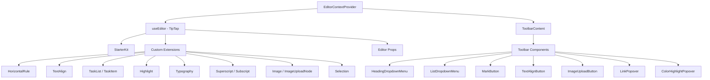

# Editorsystem

Die Vorlage enthält einen auf TipTap (ProseMirror) basierenden Rich-Text-Editor mit einer modularen Architektur aus Erweiterungen, Symbolleistenkomponenten, Hooks und Hilfsfunktionen. Der Editor unterstützt Überschriften, Listen, Aufgabenlisten, Bilder, Codeblöcke, Textformatierung und mehr.

## Architekturübersicht



## Quelldateien

|Verzeichnis|Inhalt|
|-----------|----------|
|`lib/editor/extensions/`|Neuexporte und Konfiguration der TipTap-Erweiterung|
|`lib/editor/components/`|UI-Komponenten (Symbolleistenschaltflächen, Popovers, Symbole)|
|`lib/editor/hooks/`|React-Hooks für die Editor-Statusverwaltung|
|`lib/editor/providers/`|Editor-Kontextanbieter mit Erweiterungseinrichtung|
|`lib/editor/contents/`|Symbolleistenlayout und Inhaltskomponenten des Editors|
|`lib/editor/utils/`|Hilfsfunktionen (Verknüpfungen, Validierung, Upload)|

## Erweiterungskonfiguration

Erweiterungen werden im `EditorContextProvider` registriert. Das `StarterKit` bietet Basisfunktionen mit darüber liegenden zusätzlichen Erweiterungen:

```typescript
const extensions = useMemo(() => [
  StarterKit.configure({
    horizontalRule: false,
    link: { openOnClick: false, enableClickSelection: true },
  }),
  HorizontalRule,
  TextAlign.configure({ types: ['heading', 'paragraph'] }),
  ImageUploadNode.configure({
    accept: 'image/*',
    maxSize: MAX_FILE_SIZE, // 5MB
    limit: 3,
    upload: handleImageUpload,
    onError: (error) => console.error('Upload failed:', error),
  }),
  TaskList,
  TaskItem.configure({ nested: true }),
  Highlight.configure({ multicolor: true }),
  Image,
  Typography,
  Superscript,
  Subscript,
  Selection,
], []);
```

### Zusammenfassung der Erweiterung

|Erweiterung|Quelle|Zweck|
|-----------|--------|---------|
|`StarterKit`|`@tiptap/starter-kit`|Absätze, fett, kursiv, Listen, Code, Blockzitat|
|`HorizontalRule`|`@tiptap/extension-horizontal-rule`|Horizontale Trennwände|
|`TextAlign`|`@tiptap/extension-text-align`|Links, Mitte, rechts, Ausrichtung ausrichten|
|`TaskList` / `TaskItem`|`@tiptap/extension-list`|Interaktive Checkbox-Listen|
|`Highlight`|`@tiptap/extension-highlight`|Mehrfarbige Texthervorhebung|
|`Typography`|`@tiptap/extension-typography`|Intelligente Anführungszeichen, Bindestriche, Auslassungspunkte|
|`Superscript`|`@tiptap/extension-superscript`|Hochgestellter Text|
|`Subscript`|`@tiptap/extension-subscript`|Tiefgestellter Text|
|`Selection`|`@tiptap/extensions`|Verbesserte Auswahlhandhabung|
|`Image`|`@tiptap/extension-image`|Statische Bildanzeige|
|`ImageUploadNode`|Benutzerdefiniert|Hochladen von Bildern per Drag-and-Drop mit Fortschritt|

## Editor-Kontextanbieter

Der Editor wird über React Context für den baumweiten Zugriff bereitgestellt:

```typescript
export const EditorContext = createContext<Editor | null>(null);

export function EditorContextProvider({ children }: { children: React.ReactNode }) {
  const editor = useEditor({
    immediatelyRender: false,
    shouldRerenderOnTransaction: false,
    editorProps: {
      attributes: {
        autocomplete: 'on',
        autocorrect: 'on',
        autocapitalize: 'off',
        'aria-label': 'Main content area, start typing to enter text.',
        class: cn('min-h-96'),
      },
    },
    extensions,
  });

  return <EditorContext.Provider value={editor}>{children}</EditorContext.Provider>;
}
```

Wichtige Konfigurationsoptionen:
- `immediatelyRender: false` verhindert Fehlanpassungen der SSR-Hydratation
- `shouldRerenderOnTransaction: false` optimiert die Leistung, indem unnötiges erneutes Rendern vermieden wird

## Symbolleistenkonfiguration

Die Komponente `ToolbarContent` definiert das vollständige Layout der Symbolleiste, organisiert in Gruppen:

|Gruppe|Komponenten|
|-------|------------|
|Geschichte|Rückgängig machen, Wiederherstellen|
|Blocktypen|Überschriften-Dropdown (H1-H4), Listen-Dropdown (Aufzählungszeichen, geordnet, Aufgabe), Blockquote, Codeblock|
|Inline-Markierungen|Fett, Kursiv, Durchgestrichen, Code, Unterstrichen, Farbhervorhebung, Link|
|Skript|Hochgestellt, tiefgestellt|
|Ausrichtung|Links, Mitte, Rechts, Blocksatz|
|Medien|Bild-Upload|

Gruppen werden durch `ToolbarSeparator` Komponenten mit `Spacer` Elementen zur Positionierung getrennt.

## Editor-Hooks

### `useTiptapEditor`

Bietet flexiblen Zugriff auf die Editor-Instanz entweder über Requisiten oder den Kontext:

```typescript
export function useTiptapEditor(providedEditor?: Editor | null): {
  editor: Editor | null;
  editorState?: Editor["state"];
  canCommand?: Editor["can"];
}
```

Dieser Hook führt einen direkt bereitgestellten Editor mit dem Kontexteditor zusammen, sodass Komponenten sowohl eigenständig als auch innerhalb der Anbieterstruktur funktionieren können.

### Zusätzliche Haken

|Haken|Zweck|
|------|---------|
|`use-editor.ts`|Kerneditor-Statusverwaltung|
|`use-editor-sync.ts`|Synchronisation zwischen Editor-Instanzen|
|`use-cursor-visibility.ts`|Cursorposition und Sichtbarkeitsverfolgung|
|`use-element-rect.ts`|Verfolgung des Elementbegrenzungsrechtecks|
|`use-scrolling.ts`|Scrollposition und -verhalten|
|`use-throttled-callback.ts`|Gedrosselte Rückrufausführung|
|`use-window-size.ts`|Reaktionsschnelle Verfolgung der Fenstergröße|
|`use-unmount.ts`|Bereinigung beim Unmounten der Komponente|

## Utility-Funktionen

### Formatierung von Tastenkombinationen

Das System verarbeitet plattformspezifische Tastaturkürzel:

```typescript
export const MAC_SYMBOLS: Record<string, string> = {
  mod: "Command", command: "Command", meta: "Command",
  ctrl: "Ctrl", alt: "Option", shift: "Shift",
  // ... additional mappings
};

export const formatShortcutKey = (key: string, isMac: boolean, capitalize?: boolean) => {
  // Returns Mac symbols or formatted key names
};

export const parseShortcutKeys = (props: {
  shortcutKeys: string | undefined;
  delimiter?: string;
  capitalize?: boolean;
}) => string[];
```

### Schemavalidierung

```typescript
// Check if a mark type exists in the editor schema
export const isMarkInSchema = (markName: string, editor: Editor | null): boolean;

// Check if a node type exists in the editor schema
export const isNodeInSchema = (nodeName: string, editor: Editor | null): boolean;

// Check if extensions are registered
export function isExtensionAvailable(editor: Editor | null, extensionNames: string | string[]): boolean;
```

### Knotennavigation

```typescript
// Find a node at a specific document position
export function findNodeAtPosition(editor: Editor, position: number): TiptapNode | null;

// Find a node by reference or position
export function findNodePosition(props: {
  editor: Editor | null;
  node?: TiptapNode | null;
  nodePos?: number | null;
}): { pos: number; node: TiptapNode } | null;

// Move focus to the next node
export function focusNextNode(editor: Editor): boolean;
```

### Bild-Upload

```typescript
export const MAX_FILE_SIZE = 5 * 1024 * 1024; // 5MB

export const handleImageUpload = async (
  file: File,
  onProgress?: (event: { progress: number }) => void,
  abortSignal?: AbortSignal
): Promise<string>;
```

Der Upload-Handler validiert die Dateigröße, unterstützt die Fortschrittsverfolgung und verarbeitet den Abbruch über `AbortSignal`.

### URL-Bereinigung

```typescript
export function isAllowedUri(uri: string | undefined, protocols?: ProtocolConfig): boolean;
export function sanitizeUrl(inputUrl: string, baseUrl: string, protocols?: ProtocolConfig): string;
```

Stellt sicher, dass nur sichere Protokolle (`http`, `https`, `ftp`, `mailto` usw.) in Links zulässig sind. Unsichere URLs werden durch `"#"` ersetzt.
