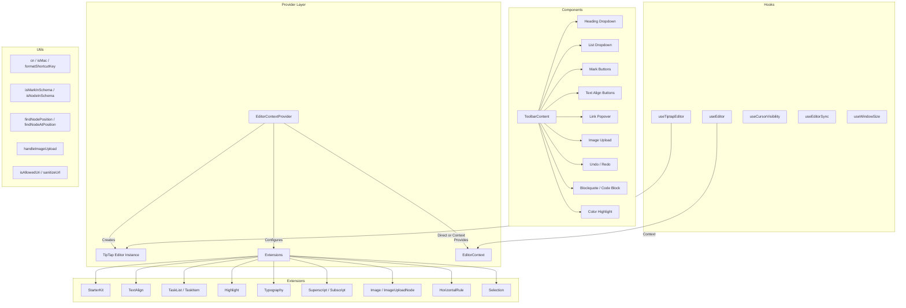

# Editor-Dienstprogrammmodul

Das Editor-Dienstprogrammmodul (`template/lib/editor/`) bietet eine vollständige Rich-Text-Bearbeitungslösung, die auf **TipTap** (ProseMirror) basiert. Es umfasst einen vorkonfigurierten Editor-Anbieter, TipTap-Erweiterungen, eine vollständige Symbolleisten-Komponentenbibliothek, Hilfsfunktionen für die DOM-Manipulation und benutzerdefinierte React-Hooks für die Editor-Statusverwaltung.

## Architekturübersicht



## Quelldateien

|Verzeichnis|Beschreibung|
|-----------|-------------|
|`lib/editor/index.ts`|Fassexport für alle Untermodule|
|`lib/editor/providers/`|`EditorContextProvider` und `EditorContext`|
|`lib/editor/extensions/`|Die TipTap-Erweiterung wird erneut exportiert|
|`lib/editor/hooks/`|Benutzerdefinierte React-Hooks|
|`lib/editor/utils/`|Utility-Funktionen|
|`lib/editor/contents/`|`ToolbarContent` und `EditorContent` Komponenten|
|`lib/editor/components/`|UI-Grundelemente, Symbolleistenschaltflächen, Symbole, Knoten|
|`lib/editor/styles/`|Editor-CSS-Stile|

## Editor-Anbieter

### `EditorContextProvider`

Umschließt untergeordnete Elemente mit einer vorkonfigurierten TipTap-Editor-Instanz:

```tsx
import { EditorContextProvider } from '@/lib/editor';

function MyEditor() {
  return (
    <EditorContextProvider>
      <ToolbarContent editor={null} />
      <EditorContent />
    </EditorContextProvider>
  );
}
```

### Konfiguration

Der Anbieter konfiguriert TipTap mit diesen Einstellungen:

```typescript
const editor = useEditor({
  immediatelyRender: false,
  shouldRerenderOnTransaction: false,
  editorProps: {
    attributes: {
      autocomplete: 'on',
      autocorrect: 'on',
      autocapitalize: 'off',
      'aria-label': 'Main content area, start typing to enter text.',
      class: 'min-h-96',
    },
  },
  extensions: [/* ... */],
});
```

### Vorkonfigurierte Erweiterungen

|Erweiterung|Konfiguration|
|-----------|--------------|
|`StarterKit`|`horizontalRule: false`, `link.openOnClick: false`|
|`HorizontalRule`|Standard|
|`TextAlign`|Gilt für die Knoten `heading` und `paragraph`|
|`ImageUploadNode`|Akzeptieren: `image/*`, max. 5 MB, maximal 3 Bilder|
|`TaskList` / `TaskItem`|Verschachtelte Aufgaben aktiviert|
|`Highlight`|Mehrfarbig aktiviert|
|`Image`|Standard|
|`Typography`|Intelligente Anführungszeichen und Bindestriche|
|`Superscript` / `Subscript`|Standard|
|`Selection`|Standard|

## Haken

### `useEditor(): Editor`

Ruft die Editor-Instanz vom `EditorContext` ab. Muss innerhalb eines `EditorContextProvider` verwendet werden.

```typescript
import { useEditor } from '@/lib/editor';

function MyComponent() {
  const editor = useEditor();
  // editor is the TipTap Editor instance
}
```

### `useTiptapEditor(providedEditor?): { editor, editorState?, canCommand? }`

Flexibler Hook, der eine optionale Editor-Instanz akzeptiert oder auf den TipTap-Kontext zurückgreift:

```typescript
import { useTiptapEditor } from '@/lib/editor/hooks';

function ToolbarButton({ editor: externalEditor }) {
  const { editor, editorState, canCommand } = useTiptapEditor(externalEditor);

  const isBold = editorState ? editor?.isActive('bold') : false;
  const canBold = canCommand ? canCommand().toggleBold() : false;
}
```

### Andere Haken

|Haken|Zweck|
|------|---------|
|`useCursorVisibility`|Verfolgt die Sichtbarkeit der Cursorposition im Ansichtsfenster|
|`useEditorSync`|Synchronisiert den Inhalt des Editors mit dem externen Status|
|`useElementRect`|Verfolgt das Elementbegrenzungsrechteck|
|`useScrolling`|Erkennt den Scrollstatus|
|`useThrottledCallback`|Drosselt eine Rückruffunktion|
|`useUnmount`|Führt die Bereinigung beim Aufheben der Bereitstellung der Komponente durch|
|`useWindowSize`|Verfolgt Fensterabmessungen|

## Utility-Funktionen

### Klassennamen-Helfer

```typescript
function cn(...classes: (string | boolean | undefined | null)[]): string;
// Filters falsy values and joins with space
cn('min-h-96', isActive && 'bg-blue-500', undefined); // 'min-h-96 bg-blue-500'
```

### Plattformerkennung

```typescript
function isMac(): boolean;
// Returns true if navigator.platform includes 'mac'
```

### Formatierung von Tastenkombinationen

```typescript
function formatShortcutKey(key: string, isMac: boolean, capitalize?: boolean): string;
// Mac: 'ctrl' -> '???', 'alt' -> '???', 'shift' -> '???', 'meta' -> '???'
// Windows: 'ctrl' -> 'Ctrl'

function parseShortcutKeys(props: {
  shortcutKeys: string | undefined;
  delimiter?: string;    // default: '+'
  capitalize?: boolean;  // default: true
}): string[];
// 'ctrl+shift+b' -> ['???', '???', 'B'] (Mac) or ['Ctrl', 'Shift', 'B'] (Windows)
```

### Schemainspektion

```typescript
function isMarkInSchema(markName: string, editor: Editor | null): boolean;
// Checks if a mark type exists in the editor schema

function isNodeInSchema(nodeName: string, editor: Editor | null): boolean;
// Checks if a node type exists in the editor schema

function isExtensionAvailable(editor: Editor | null, extensionNames: string | string[]): boolean;
// Checks if one or more extensions are registered
// Logs a warning if none found
```

### Knotenoperationen

```typescript
function findNodeAtPosition(editor: Editor, position: number): TiptapNode | null;
// Returns the node at the given document position

function findNodePosition(props: {
  editor: Editor | null;
  node?: TiptapNode | null;
  nodePos?: number | null;
}): { pos: number; node: TiptapNode } | null;
// Finds position by node reference or position number

function focusNextNode(editor: Editor): boolean;
// Moves cursor to the next node, creating a paragraph if at end

function isNodeTypeSelected(editor: Editor | null, types: string[]): boolean;
// Checks if current selection is a NodeSelection matching any type

function isValidPosition(pos: number | null | undefined): pos is number;
// Type guard for valid document positions (>= 0)
```

### Bild-Upload

```typescript
const MAX_FILE_SIZE = 5 * 1024 * 1024; // 5MB

async function handleImageUpload(
  file: File,
  onProgress?: (event: { progress: number }) => void,
  abortSignal?: AbortSignal,
): Promise<string>;
// Returns the URL of the uploaded image
// Default implementation is a demo stub -- replace with actual upload logic
```

### URL-Validierung

```typescript
function isAllowedUri(uri: string | undefined, protocols?: ProtocolConfig): boolean;
// Checks URI against allowed protocols:
// http, https, ftp, ftps, mailto, tel, callto, sms, cid, xmpp
// Plus any custom protocols passed in

function sanitizeUrl(inputUrl: string, baseUrl: string, protocols?: ProtocolConfig): string;
// Returns sanitized URL or '#' if not allowed
```

## Inhalt der Symbolleiste

Die Komponente `ToolbarContent` stellt eine vollständige, vorkonfigurierte Symbolleiste bereit:

```tsx
import { ToolbarContent } from '@/lib/editor/contents';

<ToolbarContent editor={editor} />
```

### Symbolleistengruppen

|Gruppe|Komponenten|
|-------|-----------|
|Rückgängig/Wiederherstellen|`UndoRedoButton` (rückgängig machen, wiederholen)|
|Blockformatierung|`HeadingDropdownMenu` (H1-H4), `ListDropdownMenu` (Aufzählungspunkt, geordnet, Aufgabe), `BlockquoteButton`, `CodeBlockButton`|
|Inline-Formatierung|`MarkButton` (fett, kursiv, durchgestrichen, kodiert, unterstrichen), `ColorHighlightPopover`, `LinkPopover`|
|Hochgestellt|`MarkButton` (hochgestellt, tiefgestellt)|
|Textausrichtung|`TextAlignButton` (links, zentriert, rechts, Blocksatz)|
|Medien|`ImageUploadButton`|

## Komponentenbibliothek

### Primitive Komponenten

Von Symbolleistenschaltflächen verwendete Basis-UI-Komponenten:

- `Badge`, `Button`, `Card`, `DropdownMenu`, `Input`, `Popover`, `Separator`, `Spacer`, `Toolbar`, `Tooltip`

### Knotenkomponenten

Benutzerdefinierte TipTap-Knotenansichten:

- `HorizontalRuleNode` – benutzerdefinierte horizontale Regelerweiterung
- `ImageUploadNode` – Datei-Upload-Knoten mit Drag-and-Drop

### Symbolkomponenten

SVG-Symbole für alle Symbolleistenaktionen (Fett, Kursiv, Überschriftenebenen, Listen, Ausrichtung usw.).
