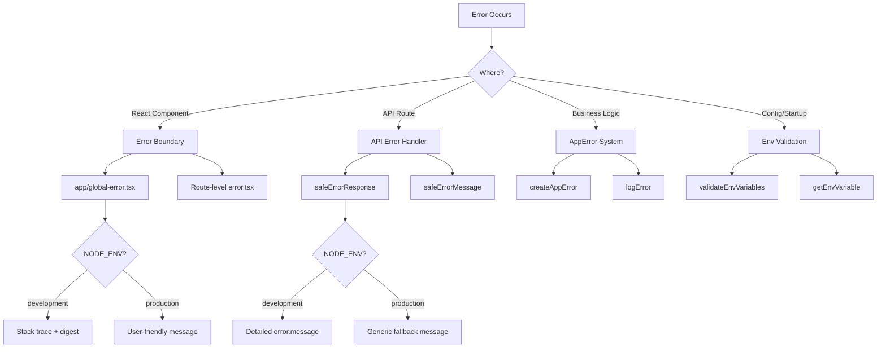

# Fehlerbehandlungsmuster

## Übersicht

Die Ever Works-Vorlage implementiert eine mehrschichtige Fehlerbehandlungsstrategie, die React-Fehlergrenzen, API-Route-Fehlerantworten, typisierte Anwendungsfehler und die Validierung von Umgebungsvariablen umfasst. Das Design priorisiert die Sicherheit (keine Informationslecks in der Produktion) und sorgt gleichzeitig für ein entwicklerfreundliches Debugging in der Entwicklung.

## Architektur



## Quelldateien

|Datei|Zweck|
|------|---------|
|`template/app/global-error.tsx`|React-Fehlergrenze auf Root-Ebene|
|`template/app/not-found.tsx`|404 Seite nicht gefunden|
|`template/lib/utils/api-error.ts`|Dienstprogramme für API-Routenfehler|
|`template/lib/utils/error-handler.ts`|Anwendungsfehlertypen und Protokollierung|
|`template/lib/auth/error-handler.ts`|Authentifizierungsspezifische Fehlerbehandlung|

## Fehlergrenzen reagieren

### Globale Fehlergrenze

Die Datei `global-error.tsx` fängt nicht behandelte Fehler im Stammverzeichnis der Anwendung ab:

```typescript
'use client';

export default function GlobalError({
    error,
    reset,
}: {
    error: Error & { digest?: string };
    reset: () => void;
}) {
    useEffect(() => {
        console.error(error);
    }, [error]);

    return (
        <html lang="en">
            <body>
                <h1>Something went wrong!</h1>
                {process.env.NODE_ENV !== 'production' && (
                    <div>
                        <p className="text-red-600">{error.message}</p>
                        {error.stack && <pre>{error.stack}</pre>}
                        {error.digest && <p>Error ID: {error.digest}</p>}
                    </div>
                )}
                <Button onPress={() => reset()}>Refresh</Button>
                <Link href="/">Go Home</Link>
            </body>
        </html>
    );
}
```

Wichtige Verhaltensweisen:
- **Entwicklung**: Zeigt Fehlermeldung, Stack-Trace und Fehler-Digest an
- **Produktion**: Zeigt nur eine allgemeine Nachricht an
- **Error Digest**: Eine eindeutige ID, die von Next.js für die serverseitige Fehlerkorrelation generiert wird
- **Reset-Funktion**: Rendert den Fehlergrenzen-Teilbaum neu
- **Eigenständiges HTML**: Enthält seine eigenen Tags `<html>` und `<body>`, da es die gesamte Seite ersetzt

### Seite nicht gefunden

```typescript
'use client';

export default function NotFound() {
    const router = useRouter();
    return (
        <div>
            <h1>404</h1>
            <h2>Page Not Found</h2>
            <Button onClick={() => router.back()}>Go Back</Button>
            <Button onClick={() => router.push('/')}>Back to Home</Button>
        </div>
    );
}
```

## API-Fehlerbehandlung

### SafeErrorResponse

Das primäre Dienstprogramm für API-Routenfehlerantworten:

```typescript
export function safeErrorResponse(
    error: unknown,
    fallbackMessage: string,
    status: number = 500
): NextResponse {
    const detail = error instanceof Error ? error.message : String(error);

    // Always log full details server-side
    console.error(`[API Error] ${fallbackMessage}:`, detail);

    const message = process.env.NODE_ENV === "development" ? detail : fallbackMessage;

    return NextResponse.json({ success: false, error: message }, { status });
}
```

Verwendung in API-Routen:

```typescript
export async function GET(request: NextRequest) {
    try {
        const result = await someOperation();
        return NextResponse.json(result);
    } catch (error) {
        return safeErrorResponse(error, 'Failed to process request');
    }
}
```

### SafeErrorMessage

Für Fälle, in denen Sie die Fehlerzeichenfolge benötigen, ohne eine Antwort zu erstellen:

```typescript
export function safeErrorMessage(error: unknown, fallbackMessage: string): string {
    if (process.env.NODE_ENV === "development") {
        return error instanceof Error ? error.message : String(error);
    }
    return fallbackMessage;
}
```

## Anwendungsfehlersystem

### Fehlertypen

```typescript
export enum ErrorType {
    AUTH = 'auth',
    CONFIG = 'config',
    DATABASE = 'database',
    NETWORK = 'network',
    VALIDATION = 'validation',
    UNKNOWN = 'unknown'
}

export interface AppError {
    message: string;
    type: ErrorType;
    code?: string;
    originalError?: unknown;
}
```

### Typische Fehler erstellen

```typescript
import { createAppError, ErrorType } from '@/lib/utils/error-handler';

const error = createAppError(
    'Failed to configure OAuth providers',
    ErrorType.CONFIG,
    'OAUTH_CONFIG_FAILED',
    originalError
);
```

### Strukturierte Fehlerprotokollierung

```typescript
import { logError } from '@/lib/utils/error-handler';

// Logs: [CONFIG] [Auth Config]: Failed to configure OAuth providers
// Logs: Error code: OAUTH_CONFIG_FAILED
// Logs: Original error: <original error details>
logError(error, 'Auth Config');
```

Die Funktion `logError` verarbeitet drei Fehlerformen:
1. **AppError** – strukturiertes Protokoll mit Typ, Code und ursprünglichem Fehler
2. **Fehler** – Standardprotokoll mit Meldung und Stack-Trace
3. **Unbekannt** – Fallback-Protokoll mit String-Erzwingung

### Validierung von Umgebungsvariablen

```typescript
import { validateEnvVariables, getEnvVariable } from '@/lib/utils/error-handler';

// Validate multiple variables at once
const validationError = validateEnvVariables([
    'DATABASE_URL', 'AUTH_SECRET', 'CRON_SECRET'
]);
if (validationError) {
    logError(validationError, 'Startup');
}

// Get a single required variable (throws if missing)
const dbUrl = getEnvVariable('DATABASE_URL');

// Get an optional variable
const optional = getEnvVariable('OPTIONAL_VAR', false);
```

## Fehlerbehandlung in Auth

Die Authentifizierungskonfiguration verwendet eine ordnungsgemäße Verschlechterung:

```typescript
const configureProviders = () => {
    try {
        const oauthProviders = configureOAuthProviders();
        return createNextAuthProviders({ /* full config */ });
    } catch (error) {
        const appError = createAppError(
            'Failed to configure OAuth providers. Falling back to credentials only.',
            ErrorType.CONFIG,
            'OAUTH_CONFIG_FAILED',
            error
        );
        logError(appError, 'Auth Config');

        // Fallback to credentials only
        return createNextAuthProviders({
            credentials: { enabled: true },
            google: { enabled: false },
            github: { enabled: false },
            facebook: { enabled: false },
            twitter: { enabled: false },
        });
    }
};
```

Wenn die Konfiguration des OAuth-Anbieters fehlschlägt, greift das System auf die Authentifizierung nur mit Anmeldeinformationen zurück und stürzt nicht ab.

## Fehlerbehandlungsfluss nach Ebene

|Schicht|Strategie|Produktionsverhalten|
|-------|----------|-------------------|
|Komponenten reagieren|Fehlergrenze (`global-error.tsx`)|Allgemeine Nachricht, kein Stack-Trace|
|API-Routen|`safeErrorResponse()`|Allgemeine Fallback-Nachricht|
|Serveraktionen|`validatedAction()` fängt Zod-Fehler ab|Erste Validierungsfehlermeldung|
|Authentifizierungskonfiguration|Versuchen/Fangen mit `createAppError()`|Würdevolle Herabwürdigung der Anmeldeinformationen|
|Cron-Jobs|Try/Catch + strukturierte Protokollierung|Fehler protokolliert, Antwort zurückgegeben|
|Webhooks|Try/Catch + 400 Antwort|Allgemeine Fehlermeldung an den Anbieter|

## Best Practices

1. **Legen Sie niemals Interna in der Produktion offen** – verwenden Sie immer `safeErrorResponse` für API-Routen
2. **Alles serverseitig protokollieren** – vollständige Fehlerdetails gehen unabhängig von der Umgebung an die Konsole/Protokollierung
3. **Verwenden Sie Tippfehler** – `createAppError` mit `ErrorType` für eine konsistente Kategorisierung
4. **Anmutige Verschlechterung** – Zurückgreifen auf reduzierte Funktionalität statt Absturz
5. **Fehlerauszüge für Korrelation** – Verwenden Sie das Feld `digest` aus Next.js-Fehlern, um serverseitige Probleme zu verfolgen
6. **An Grenzen validieren** – Umgebungsvariablen beim Start prüfen, Eingaben an API-Grenzen validieren
