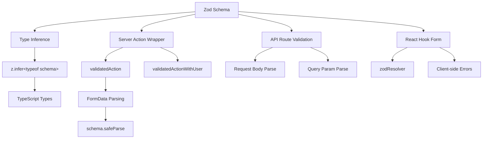

# Formularvalidierungsmuster

## Übersicht

Die Ever Works-Vorlage verwendet **Zod** als einzige Quelle der Wahrheit für die Datenvalidierung über Client- und Servergrenzen hinweg. Validierungsschemata sind in `lib/validations/` organisiert und werden genutzt von:

- **Serveraktionen** über `validatedAction()` und `validatedActionWithUser()` Wrapper
- **API-Routenhandler** für die Validierung des Anforderungstexts/der Abfrageparameter
- **React Hook Form**-Integration für clientseitige Formularvalidierung
- **Typinferenz** über `z.infer<>` für durchgängige Typsicherheit

## Architektur



## Quelldateien

|Datei|Zweck|
|------|---------|
|`template/lib/validations/auth.ts`|Passwortvalidierungsschema|
|`template/lib/validations/company.ts`|CRUD-Schemata des Unternehmens|
|`template/lib/validations/client-item.ts`|Schemata für die Übermittlung/Aktualisierung von Client-Elementen|
|`template/lib/validations/client-dashboard.ts`|Dashboard-Abfrageschemata|
|`template/lib/validations/sponsor-ad.ts`|Lebenszyklusschemata für Sponsor-Anzeigen|
|`template/lib/validations/item.ts`|Standortdatenschema|
|`template/lib/validations/user-location.ts`|Schema der Benutzerstandorteinstellungen|
|`template/lib/auth/middleware.ts`|`validatedAction` / `validatedActionWithUser` Dienstprogramme|

## Validierungsschemamuster

### Muster 1: Passwortvalidierung mit verketteten Regeln

```typescript
import { z } from "zod";

export const passwordSchema = z
    .string()
    .min(8, "Password must be at least 8 characters")
    .regex(/[A-Z]/, "Password must contain at least one uppercase letter")
    .regex(/[a-z]/, "Password must contain at least one lowercase letter")
    .regex(/[0-9]/, "Password must contain at least one number")
    .regex(/[^A-Za-z0-9]/, "Password must contain at least one special character");
```

Dieses Schema erzwingt strenge Passwortanforderungen durch verkettete Verfeinerungen. Jedes `.regex()` stellt eine spezifische Fehlermeldung bereit, die die Benutzeroberfläche inline anzeigen kann.

### Muster 2: Schemapaare erstellen/aktualisieren

Die Unternehmensvalidierung demonstriert das Erstellungs-/Aktualisierungsmuster:

```typescript
export const createCompanySchema = z.object({
    name: z.string().min(1, "Company name is required").max(255),
    website: z.string().url("Invalid URL format").optional().or(z.literal("")),
    domain: z.string().max(255).optional()
        .transform((val) => val?.toLowerCase().trim() || undefined),
    slug: z.string().max(255).optional()
        .transform((val) => val?.toLowerCase().trim() || undefined)
        .refine(
            (val) => !val || /^[a-z0-9-]+$/.test(val),
            { message: "Slug must contain only lowercase letters, numbers, and hyphens" }
        ),
    status: z.enum(companyStatus).default("active"),
});

export const updateCompanySchema = z.object({
    id: z.string().uuid(),
    name: z.string().min(1).max(255).optional(),  // Optional for updates
    // ... other fields also optional
    status: z.enum(companyStatus).optional(),
});
```

Hauptunterschiede:
- **Schemata erstellen** verfügen über Pflichtfelder mit Standardwerten
- **Aktualisierungsschemata** erfordern ein `id` und machen alle anderen Felder optional
- Beide teilen die `.transform()`-Logik zur Normalisierung (z. B. Slugs in Kleinbuchstaben).

### Muster 3: Aufzählungsbasierte Statusfelder

```typescript
export const companyStatus = ["active", "inactive"] as const;
export const itemStatus = ['pending', 'approved', 'rejected'] as const;
export const sponsorAdStatuses = [
    "pending_payment", "pending", "rejected",
    "active", "expired", "cancelled",
] as const;

// Usage in schemas
status: z.enum(companyStatus).default("active"),
status: z.enum(sponsorAdStatuses).optional(),
```

Die Verwendung von `as const`-Arrays mit `z.enum()` bietet sowohl Laufzeitvalidierung als auch Typsicherheit zur Kompilierungszeit.

### Muster 4: Abfrageparameterschemata mit Transformationen

```typescript
export const clientItemsListQuerySchema = z.object({
    page: z.string().optional()
        .transform(val => (val ? parseInt(val, 10) : 1))
        .refine(val => !Number.isNaN(val), { message: 'Page must be a valid number' })
        .refine(val => val >= 1, { message: 'Page must be at least 1' }),
    limit: z.string().optional()
        .transform(val => (val ? parseInt(val, 10) : 10))
        .refine(val => val >= 1 && val <= 100, { message: 'Limit must be between 1 and 100' }),
    status: z.enum(clientStatusFilter).optional().default('all'),
    search: z.string().max(100, 'Search query is too long').optional(),
    sortBy: z.enum(['name', 'updated_at', 'status', 'submitted_at']).optional().default('updated_at'),
    sortOrder: z.enum(['asc', 'desc']).optional().default('desc'),
    deleted: z.string().optional().transform(val => val === 'true'),
});
```

Abfrageparameter kommen als Zeichenfolgen an. Das Schema verwendet `.transform()`, um sie in die richtigen Typen (Zahlen, Boolesche Werte) zu konvertieren und dabei Validierung und Standardwerte anzuwenden.

### Muster 5: Verschachtelte Objektschemata mit feldübergreifender Validierung

```typescript
export const updateLocationSchema = z
    .object({
        defaultLatitude: z.number().min(-90).max(90).nullable().optional(),
        defaultLongitude: z.number().min(-180).max(180).nullable().optional(),
        defaultCity: z.string().max(200).nullable().optional(),
        defaultCountry: z.string().max(100).nullable().optional(),
        locationPrivacy: locationPrivacySchema.optional(),
    })
    .refine(
        (data) => {
            const hasLat = data.defaultLatitude != null;
            const hasLng = data.defaultLongitude != null;
            return hasLat === hasLng;  // Both or neither
        },
        { message: 'Both latitude and longitude must be provided together' }
    );
```

Das `.refine()` auf Objektebene validiert feldübergreifende Abhängigkeiten – Breiten- und Längengrad müssen beide vorhanden sein oder beide fehlen.

### Muster 6: Union-Typen für flexible Eingaben

```typescript
category: z.union([
    z.string().min(1, 'Category is required'),
    z.array(z.string().min(1)).min(1, 'At least one category is required'),
]).optional().nullable(),
```

Dies akzeptiert sowohl eine einzelne Zeichenfolge als auch ein Array von Zeichenfolgen für das Kategoriefeld und unterstützt verschiedene Formulareingabetypen.

## Serverseitige Validierung

### validierter Action Wrapper

```typescript
export function validatedAction<S extends z.ZodType<any, any>, T>(
    schema: S,
    action: ValidatedActionFunction<S, T>
) {
    return async (prevState: ActionState, formData: FormData): Promise<T> => {
        const result = schema.safeParse(Object.fromEntries(formData));
        if (!result.success) {
            return { error: result.error.issues[0].message } as T;
        }
        return action(result.data, formData);
    };
}
```

Diese Funktion höherer Ordnung:
1. Konvertiert `FormData` in ein einfaches Objekt
2. Validiert anhand des Zod-Schemas mit `safeParse()`
3. Gibt den ersten Validierungsfehler zurück, wenn dieser ungültig ist
4. Ruft die Aktionsfunktion mit analysierten, typisierten Daten auf, sofern gültig

### validedActionWithUser Wrapper

```typescript
export function validatedActionWithUser<S extends z.ZodType<any, any>, T>(
    schema: S,
    action: ValidatedActionWithUserFunction<S, T>
) {
    return async (prevState: ActionState, formData: FormData): Promise<T> => {
        const session = await auth();
        if (!session?.user) {
            throw new Error("User is not authenticated");
        }
        const result = schema.safeParse(Object.fromEntries(formData));
        if (!result.success) {
            return { error: result.error.issues[0].message } as T;
        }
        return action(result.data, formData, session.user);
    };
}
```

Dadurch wird vor der Validierung eine Authentifizierungsprüfung hinzugefügt, bei der das authentifizierte `user`-Objekt an die Aktionsfunktion übergeben wird.

## Typinferenz

Jedes Schema exportiert abgeleitete TypeScript-Typen:

```typescript
export type CreateCompanyInput = z.infer<typeof createCompanySchema>;
export type UpdateCompanyInput = z.infer<typeof updateCompanySchema>;
export type ClientUpdateItemInput = z.infer<typeof clientUpdateItemSchema>;
export type ClientCreateItemInput = z.infer<typeof clientCreateItemSchema>;
```

Diese Typen werden in der gesamten Serviceschicht und auf den API-Routen verwendet, um sicherzustellen, dass die validierte Datenform mit den Erwartungen der Geschäftslogik übereinstimmt.

## Best Practices

1. **Einzelnes Schema, mehrere Verbraucher** – einmal in `lib/validations/` definieren, überall verwenden
2. **An der Grenze transformieren** – verwenden Sie `.transform()`, um Zeichenfolgen in die richtigen Typen zu konvertieren
3. **Benutzerdefinierte Fehlermeldungen** – jede Validierungsregel enthält eine benutzerfreundliche Meldung
4. **Gemeinsame Unterschemata** – Schemata wie `locationSchema` und `passwordSchema` formularübergreifend wiederverwenden
5. **Typen aus Schemata ableiten** – Definieren Sie niemals manuell Typen, die Schemadefinitionen duplizieren
6. **Feldübergreifende Validierung** – verwenden Sie `.refine()` auf Objektebene für Mehrfeldregeln
7. **Sinnvolle Standardeinstellungen** – verwenden Sie `.default()` für optionale Felder mit Standardwerten
