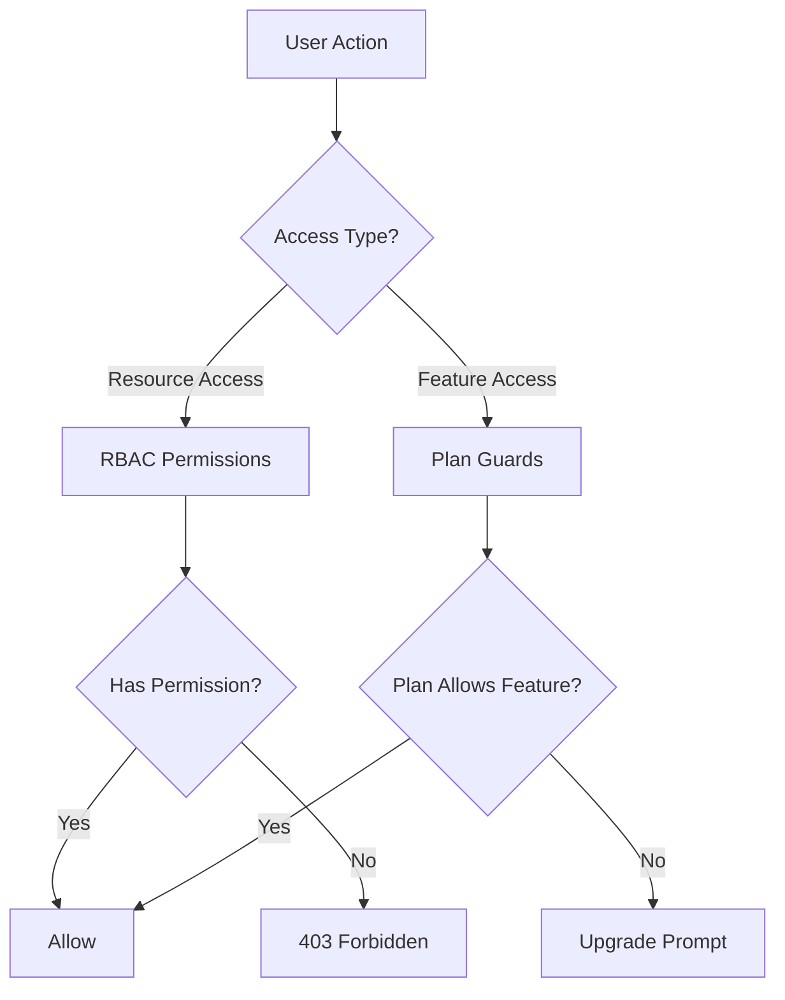
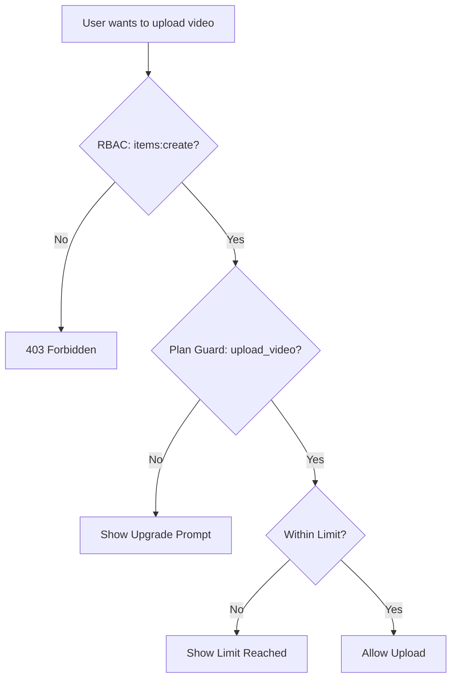

# Wach- und Berechtigungssystem

Die Ever Works-Vorlage implementiert ein zweischichtiges Zugriffskontrollsystem: **RBAC-Berechtigungen** für rollenbasierten Ressourcenzugriff und **Planschutzvorrichtungen** für abonnementbasiertes Feature-Gating. Zusammen steuern diese Systeme, was Benutzer tun können und auf welche Funktionen sie zugreifen können.

## Systemarchitektur



## RBAC-Berechtigungssystem

### Berechtigungsdefinitionen

Alle Berechtigungen werden in `lib/permissions/definitions.ts` im Format `resource:action` definiert:

```typescript
const PERMISSIONS = {
  items: {
    read: 'items:read',
    create: 'items:create',
    update: 'items:update',
    delete: 'items:delete',
    review: 'items:review',
    approve: 'items:approve',
    reject: 'items:reject',
  },
  categories: { read, create, update, delete },
  tags: { read, create, update, delete },
  roles: { read, create, update, delete },
  users: { read, create, update, delete, assignRoles },
  analytics: { read, export },
  system: { settings },
} as const;
```

### Berechtigungstyp

Der Typ `Permission` wird vom const-Objekt `PERMISSIONS` abgeleitet und gewährleistet so die Typsicherheit:

```typescript
type Permission = 'items:read' | 'items:create' | ... | 'system:settings';
```

### Standardrollen

Zwei Standardrollen sind vorkonfiguriert:

|Rolle|Ausweis|Berechtigungen|
|---|---|---|
|Superadministrator|`super-admin`|Alle Systemberechtigungen|
|Content-Manager|`content-manager`|Artikel + Kategorien + Tags (vollständiges CRUD + Rezension)|

### Berechtigungsgruppen

Berechtigungen sind in UI-freundlichen Gruppen in `lib/permissions/groups.ts` organisiert:

|Gruppe|Symbol|Enthaltene Ressourcen|
|---|---|---|
|Content-Management|`FileText`|Artikel, Kategorien, Tags|
|Benutzerverwaltung|`Users`|Benutzer, Rollen|
|System & Analyse|`Settings`|Analytik, System|

### Utility-Funktionen

Das Modul `lib/permissions/utils.ts` stellt Statusverwaltungsdienstprogramme für die Berechtigungs-Benutzeroberfläche bereit:

```typescript
// Create a permission state map for checkboxes
const state = createPermissionState(currentPermissions);
// { 'items:read': true, 'items:create': true, ... }

// Get selected permissions from state
const selected = getSelectedPermissions(state);

// Calculate changes between old and new permissions
const changes = calculatePermissionChanges(original, updated);
// { added: ['items:delete'], removed: ['tags:create'] }

// Compare two permission sets
const equal = arePermissionsEqual(perms1, perms2);

// Filter permissions by search term
const filtered = filterPermissions(allPerms, 'items');
```

## Plan Guards System

Planwächter steuern den Zugriff auf Funktionen basierend auf dem Abonnementplan des Benutzers. Das System ist in `lib/guards/plan-features.guard.ts` definiert.

### Planhierarchie

```typescript
const PLAN_LEVELS: Record<string, number> = {
  free: 1,
  standard: 2,
  premium: 3,
};
```

### Feature-Definitionen

Alle geschlossenen Funktionen werden in `FEATURES` aufgelistet:

|Kategorie|Funktionen|
|---|---|
|Einreichung|`submit_product`, `extended_description`, `unlimited_description`, `upload_images`, `upload_video`|
|Abzeichen|`verified_badge`, `sponsored_badge`|
|Rezension|`priority_review`, `instant_review`|
|Sichtbarkeit|`search_visibility`, `category_placement`, `sponsored_position`, `homepage_featured`, `newsletter_mention`|
|Analytik|`view_statistics`, `advanced_analytics`|
|Unterstützung|`email_support`, `priority_email_support`, `phone_support`|
|Sozial|`social_sharing`, `learn_more_button`|
|Andere|`free_modifications`, `unlimited_submissions`|

### Funktionszugriffsmatrix

Jede Funktion ist einer Zugriffsregel zugeordnet:

|Zugriffstyp|Syntax|Beispiel|
|---|---|---|
|Alle Pläne|`'all'`|`submit_product`, `upload_images`|
|Einzelplan|`PaymentPlan.PREMIUM`|`upload_video`, `instant_review`|
|Mindestplan|`{ minPlan: PaymentPlan.STANDARD }`|`verified_badge`, `priority_review`|
|Konkrete Pläne|`[PaymentPlan.STANDARD, PaymentPlan.PREMIUM]`|(benutzerdefinierte Funktionen)|

### Plangrenzen

Die numerischen Beschränkungen variieren je nach Plan:

|Begrenzen|Kostenlos|Standard|Premium|
|---|---|---|---|
|`max_images`| 1 | 5 |Unbegrenzt|
|`max_description_words`| 200 | 500 |Unbegrenzt|
|`max_submissions`| 1 | 10 |Unbegrenzt|
|`review_days`| 7 | 3 | 1 |
|`free_modification_days`| 0 | 30 | 365 |

### Serverseitige Guard-Nutzung

```typescript
import { canAccessFeature, createPlanGuard, FEATURES } from '@/lib/guards';

// Simple check
const allowed = canAccessFeature(FEATURES.UPLOAD_VIDEO, userPlan);

// Guard factory for multiple checks
const guard = createPlanGuard(userPlan);
guard.canAccess(FEATURES.VERIFIED_BADGE);       // boolean
guard.requireFeature(FEATURES.UPLOAD_VIDEO);     // throws PlanGuardError
guard.getLimit('max_images');                    // number | null
guard.isWithinLimit('max_submissions', count);   // boolean
guard.getAccessibleFeatures();                   // Feature[]
```

### PlanGuardError

Wenn `requireFeature` fehlschlägt, wird ein Tippfehler ausgegeben:

```typescript
class PlanGuardError extends Error {
  feature: Feature;      // e.g., 'upload_video'
  userPlan: string;      // e.g., 'free'
  requiredPlan: PaymentPlan; // e.g., 'premium'
}
```

### Clientseitiger Guard-Hook

Der `usePlanGuard` Hook in `hooks/use-plan-guard.ts` umschließt das Schutzsystem für React-Komponenten:

```typescript
import { usePlanGuard, FEATURES } from '@/hooks/use-plan-guard';

function VideoUploadButton() {
  const { canAccess, requireUpgrade, isLoading } = usePlanGuard();

  if (isLoading) return <Spinner />;

  const upgradePlan = requireUpgrade(FEATURES.UPLOAD_VIDEO);
  if (upgradePlan) {
    return <UpgradePrompt plan={upgradePlan} />;
  }

  return <Button>Upload Video</Button>;
}
```

### Spezialhaken

#### `useFeatureAccess`

Überprüfen Sie den Zugriff auf eine einzelne Funktion:

```typescript
const { hasAccess, requiredPlan, isLoading } = useFeatureAccess(FEATURES.VERIFIED_BADGE);
```

#### `useFeatureLimit`

Überprüfen Sie die numerischen Grenzwerte anhand der verbleibenden Anzahl:

```typescript
const { limit, isUnlimited, remaining, isWithinLimit } = useFeatureLimit('max_images', currentCount);

if (!isUnlimited && remaining <= 0) {
  return <LimitReached />;
}
```

## Komponieren von Wachen

Für komplexe Zutrittskontrollszenarien sind Wächter selbstverständlich:

```typescript
// Server: Combine RBAC + plan check
function canCreateItem(userPermissions: UserPermissions, userPlan: string): boolean {
  const hasRBACAccess = hasPermission(userPermissions, 'items:create');
  const hasPlanAccess = canAccessFeature(FEATURES.SUBMIT_PRODUCT, userPlan);
  return hasRBACAccess && hasPlanAccess;
}

// Client: Combine hooks
function CreateItemButton() {
  const { canAccess } = usePlanGuard();
  const { permissions } = useRolePermissions();

  const canCreate =
    hasPermission(permissions, 'items:create') &&
    canAccess(FEATURES.SUBMIT_PRODUCT);

  if (!canCreate) return null;
  return <Button>Create Item</Button>;
}
```

## Guard-Flussdiagramm



## Neue Wachen hinzufügen

### Hinzufügen einer neuen Berechtigung

1. Zu `PERMISSIONS` in `lib/permissions/definitions.ts` hinzufügen:

```typescript
billing: {
  read: 'billing:read',
  manage: 'billing:manage',
},
```

2. Zu einer Berechtigungsgruppe hinzufügen in `lib/permissions/groups.ts`
3. Weisen Sie entsprechende Standardrollen zu

### Hinzufügen einer neuen Planfunktion

1. Fügen Sie die Feature-Konstante zu `FEATURES` in `lib/guards/plan-features.guard.ts` hinzu.
2. Definieren Sie die Zugriffsregel in `FEATURE_ACCESS`
3. Fügen Sie optional numerische Grenzwerte zu `PLAN_LIMITS` hinzu.

## Best Practices

1. **Bevorzugen Sie Plan Guards für Feature Gating** und RBAC für die Ressourcenzugriffskontrolle – mischen Sie sie nicht.
2. **Prüfen Sie immer auf dem Server**, auch wenn der Client UI-Elemente verbirgt – clientseitige Prüfungen gelten nur für UX.
3. **Verwenden Sie `createPlanGuard`** für mehrere Prüfungen in derselben Anfrage, um wiederholte Plansuchen zu vermeiden.
4. **Verwaltung von Ladezuständen** in Hooks – Plandaten werden möglicherweise asynchron vom Abonnementdienst geladen.
5. **Funktionsnamen aussagekräftig halten** – verwenden Sie `upload_video` und nicht `feature_3`, um in Protokollen und Fehlermeldungen Klarheit zu schaffen.
