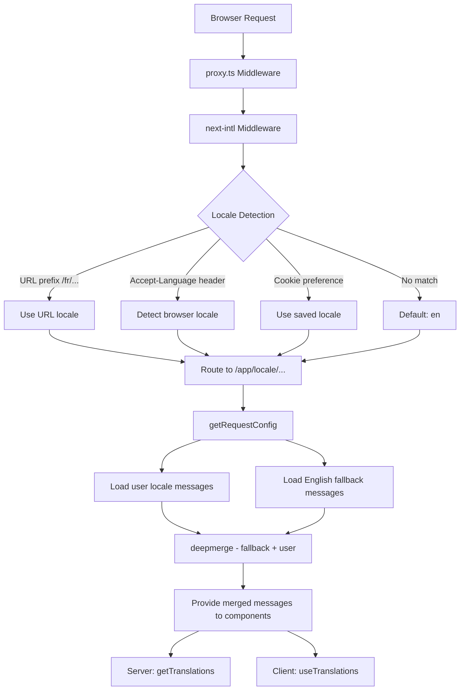

# i18n-Implementierung

## Übersicht

Die Ever Works-Vorlage implementiert die Internationalisierung mithilfe von **next-intl** mit Unterstützung für mehr als 20 Gebietsschemata, RTL-Textrichtung (von rechts nach links), Deep-Merge-Nachrichten-Fallbacks und gebietsschemabezogener Navigation. Das System ist auf drei Ebenen aufgebaut: Routing-Konfiguration, Laden von Nachrichten mit Fallback und länderspezifische Navigationshilfen.

## Architektur



## Quelldateien

|Datei|Zweck|
|------|---------|
|`template/i18n/routing.ts`|Lokale Routing-Konfiguration|
|`template/i18n/request.ts`|Laden von Nachrichten im Anforderungsbereich|
|`template/i18n/navigation.ts`|Lokale Navigationsexporte|
|`template/lib/constants.ts`|Gebietsschema- und RTL-Definitionen|
|`template/messages/*.json`|Übersetzungsnachrichtendateien|
|`template/proxy.ts`|Middleware mit Gebietsschema-Präfixauflösung|

## Unterstützte Gebietsschemas

```typescript
// lib/constants.ts
export const DEFAULT_LOCALE = 'en';
export const LOCALES = [
    'en', 'fr', 'es', 'de', 'zh', 'ar', 'he',
    'ru', 'uk', 'pt', 'it', 'ja', 'ko', 'nl',
    'pl', 'tr', 'vi', 'th', 'hi', 'id', 'bg'
] as const;

export type Locale = (typeof LOCALES)[number];

/** Locales that use right-to-left text direction */
export const RTL_LOCALES: readonly Locale[] = ['ar', 'he'] as const;
```

Die Vorlage unterstützt 20 Gebietsschemas, darunter zwei RTL-Gebietsschemas (Arabisch und Hebräisch).

## Routing-Konfiguration

```typescript
// i18n/routing.ts
import { defineRouting } from "next-intl/routing";
import { DEFAULT_LOCALE, LOCALES } from "@/lib/constants";

export const routing = defineRouting({
    locales: LOCALES,
    defaultLocale: DEFAULT_LOCALE,
    localeDetection: true,
    localePrefix: "as-needed",
});
```

|Einstellung|Wert|Wirkung|
|---------|-------|--------|
|`locales`|20 Gebietsschemacodes|Unterstützter Sprachsatz|
|`defaultLocale`|`'en'`|Fallback, wenn kein Gebietsschema übereinstimmt|
|`localeDetection`|`true`|Automatische Erkennung anhand des Headers `Accept-Language`|
|`localePrefix`|`"as-needed"`|Das Standardgebietsschema hat kein Präfix. andere tun es|

Mit `localePrefix: "as-needed"`:
- Englisch (Standard): `https://example.com/about`
- Französisch: `https://example.com/fr/about`
- Arabisch: `https://example.com/ar/about`

## Laden von Nachrichten mit Fallback

```typescript
// i18n/request.ts
import deepmerge from "deepmerge";
import { getRequestConfig } from "next-intl/server";

export default getRequestConfig(async ({ requestLocale }) => {
    let locale = await requestLocale;

    if (!locale || !routing.locales.includes(locale as any)) {
        locale = routing.defaultLocale;
    }

    const userMessages = (await import(`../messages/${locale}.json`)).default;
    const defaultMessages = (await import(`../messages/en.json`)).default;
    const messages = deepmerge(defaultMessages, userMessages) as any;

    return { locale, messages };
});
```

Die Deep-Merge-Strategie stellt sicher, dass:
1. Englische Nachrichten dienen als vollständiges Fallback-Set
2. Gebietsschemaspezifische Meldungen haben Vorrang vor Englisch, sofern Übersetzungen vorhanden sind
3. Fehlende Übersetzungen werden elegant auf Englisch zurückgesetzt, anstatt Schlüssel anzuzeigen

### Struktur der Nachrichtendatei

```
messages/
  en.json        # Complete English messages (base)
  fr.json        # French translations
  es.json        # Spanish translations
  de.json        # German translations
  ar.json        # Arabic translations
  he.json        # Hebrew translations
  zh.json        # Chinese translations
  ...            # 13+ more locales
```

### Datums-/Zahlenformate

```typescript
// i18n/request.ts
export const formats = {
    dateTime: {
        short: {
            day: "numeric",
            month: "short",
            year: "numeric",
        },
    },
    number: {
        precise: {
            maximumFractionDigits: 5,
        },
    },
    list: {
        enumeration: {
            style: "long",
            type: "conjunction",
        },
    },
} satisfies Formats;
```

## Navigationshelfer

```typescript
// i18n/navigation.ts
import { createNavigation } from "next-intl/navigation";
import { routing } from "./routing";

export const { Link, redirect, usePathname, useRouter, getPathname } =
    createNavigation(routing);
```

Diese Exporte ersetzen die Standard-Next.js-Navigationsdienstprogramme durch länderspezifische Versionen:

|Exportieren|Standard Next.js|Gebietsschemabezogenes Verhalten|
|--------|-----------------|----------------------|
|`Link`|`next/link`|Fügt das Gebietsschema-Präfix zu `href` hinzu.|
|`redirect`|`next/navigation`|Behält das aktuelle Gebietsschema bei der Umleitung bei|
|`usePathname`|`next/navigation`|Gibt den Pfad ohne Gebietsschemapräfix zurück|
|`useRouter`|`next/navigation`|`push()` / `replace()` Gebietsschema-Präfix hinzufügen|
|`getPathname`| -- |Serverseitiger Pfad mit Gebietsschema|

### Verwendung in Serverkomponenten

```typescript
import { getTranslations } from 'next-intl/server';

export default async function Page({ params }: { params: Promise<{ locale: string }> }) {
    const { locale } = await params;
    const t = await getTranslations({ locale, namespace: 'common' });

    return <h1>{t('WELCOME')}</h1>;
}
```

### Verwendung in Client-Komponenten

```typescript
'use client';
import { useTranslations } from 'next-intl';
import { Link } from '@/i18n/navigation';

export function NavLink() {
    const t = useTranslations('navigation');
    return <Link href="/about">{t('ABOUT')}</Link>;
}
```

## Auflösung des Middleware-Gebietsschemas

Die Middleware in `proxy.ts` löst Gebietsschemainformationen für Authentifizierungsschutzentscheidungen auf:

```typescript
function resolveLocalePrefix(pathname: string): {
    prefix: string;           // "/fr" or ""
    hasLocale: boolean;
    locale?: string;
    pathWithoutLocale: string; // "/admin/items"
} {
    const segments = pathname.split('/').filter(Boolean);
    const maybeLocale = segments[0];
    const hasLocale = routing.locales.includes(maybeLocale as any);
    const pathWithoutLocale = hasLocale
        ? `/${segments.slice(1).join('/')}`
        : pathname;
    return {
        prefix: hasLocale ? `/${maybeLocale}` : '',
        hasLocale,
        locale: hasLocale ? maybeLocale : undefined,
        pathWithoutLocale
    };
}
```

Dies wird verwendet, um länderspezifische Weiterleitungs-URLs in Authentifizierungswächtern zu erstellen:

```typescript
url.pathname = `${localePrefix}/auth/signin`;
```

## RTL-Unterstützung

RTL-Gebietsschemas sind in `lib/constants.ts` definiert:

```typescript
export const RTL_LOCALES: readonly Locale[] = ['ar', 'he'] as const;
```

Die Root-Layout-Komponente sollte das Attribut `dir` basierend auf dem aktuellen Gebietsschema anwenden:

```typescript
// app/[locale]/layout.tsx
const isRTL = RTL_LOCALES.includes(locale as Locale);

return (
    <html lang={locale} dir={isRTL ? 'rtl' : 'ltr'}>
        {/* ... */}
    </html>
);
```

## SEO: Hreflang-Alternativen

Das Dienstprogramm `lib/seo/hreflang.ts` generiert alternative Sprachlinks für SEO:

```typescript
import { generateHreflangAlternates } from '@/lib/seo/hreflang';

export async function generateMetadata(): Promise<Metadata> {
    return {
        alternates: {
            languages: generateHreflangAlternates('/about')
        }
    };
}
```

Dadurch werden `<link rel="alternate" hreflang="fr" href="...">`-Tags für alle unterstützten Gebietsschemata sowie ein `x-default`-Eintrag generiert, der auf die englische Version verweist.

## Next.js-Plugin-Integration

```typescript
// next.config.ts
import createNextIntlPlugin from "next-intl/plugin";

const withNextIntl = createNextIntlPlugin('./i18n/request.ts');
const configWithIntl = withNextIntl(nextConfig);
```

Das Plugin `next-intl` wird auf die Next.js-Konfiguration mit einem expliziten Pfad zur Anforderungskonfigurationsdatei angewendet.

## Best Practices

1. **In Serverkomponenten immer `getTranslations` verwenden** – lädt Übersetzungen ohne Client-Bundle-Kosten
2. **Navigation von `@/i18n/navigation`** importieren – stellt eine länderspezifische Verlinkung sicher
3. **Englisch vollständig halten** – es dient als Ersatz für alle anderen Gebietsschemas
4. **Namespace-Übersetzungen verwenden** – nach Funktion organisieren (`common`, `footer`, `pages` usw.)
5. **Überprüfen Sie RTL mit `RTL_LOCALES`** – wenden Sie `dir="rtl"` auf Layoutebene an
6. **Generieren Sie Hreflang-Tags** – verwenden Sie `generateHreflangAlternates()` in Metadatenfunktionen
