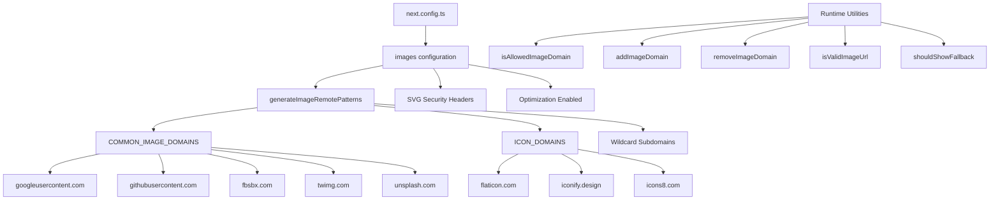

# Bildoptimierung

## Übersicht

Die Ever Works-Vorlage konfiguriert die Bildoptimierung von Next.js mit dynamischen Remote-Mustern, SVG-Unterstützung und einer Dienstprogrammebene für die Domänenverwaltung. Das System verarbeitet Bilder von OAuth-Anbietern (Google, GitHub, Facebook, Twitter), Stockfoto-Diensten (Unsplash) und Symbolbibliotheken und erzwingt gleichzeitig Sicherheitsheader für SVG-Inhalte.

## Architektur



## Quelldateien

|Datei|Zweck|
|------|---------|
|`template/next.config.ts`|Next.js-Bildkonfiguration|
|`template/lib/utils/image-domains.ts`|Dienstprogramme zur Domänenverwaltung|

## Konfiguration

### Next.js-Bildeinstellungen

```typescript
// next.config.ts
images: {
    remotePatterns: generateImageRemotePatterns(),
    dangerouslyAllowSVG: true,
    contentDispositionType: 'attachment',
    contentSecurityPolicy: "default-src 'self'; script-src 'none'; sandbox;",
    unoptimized: false,
},
```

|Einstellung|Wert|Zweck|
|---------|-------|---------|
|`remotePatterns`|Dynamisch über `generateImageRemotePatterns()`|Externe Bilddomänen auf die Whitelist setzen|
|`dangerouslyAllowSVG`|`true`|SVG-Bilder durch den Optimierer zulassen|
|`contentDispositionType`|`'attachment'`|Erzwingen Sie den Download anstelle des Inline-Renderings für den Rohzugriff|
|`contentSecurityPolicy`|Strenger Sandkasten|Verhindern Sie SVG-basierte XSS-Angriffe|
|`unoptimized`|`false`|Lassen Sie die Bildoptimierung aktiviert|

### SVG-Sicherheit

SVG-Dateien können eingebettetes JavaScript enthalten. Die Vorlage mildert dies durch:
- **Inhaltssicherheitsrichtlinie**: `script-src 'none'; sandbox;` verhindert die Skriptausführung in SVGs
- **Inhaltsdisposition**: `attachment` stellt sicher, dass SVGs heruntergeladen und nicht ausgeführt werden, wenn direkt darauf zugegriffen wird

## Remote-Mustergenerierung

Die Funktion `generateImageRemotePatterns()` erstellt die Zulassungsliste dynamisch:

```typescript
export function generateImageRemotePatterns() {
    const patterns = [
        {
            protocol: 'https' as const,
            hostname: 'lh3.googleusercontent.com',
            pathname: '/a/**'
        },
        {
            protocol: 'https' as const,
            hostname: 'avatars.githubusercontent.com',
            pathname: '/u/**'
        },
        {
            protocol: 'https' as const,
            hostname: 'platform-lookaside.fbsbx.com',
            pathname: '/platform/**'
        },
        // ... more specific patterns
    ];

    // Add wildcard subdomain patterns
    [...COMMON_IMAGE_DOMAINS, ...ICON_DOMAINS].forEach((domain) => {
        patterns.push({
            protocol: 'https' as const,
            hostname: `*.${domain}`,
            pathname: '/**'
        });
    });

    return patterns;
}
```

### Erlaubte Domänen

**Gemeinsame Bilddomänen** (OAuth-Avatare, Stockfotos):

|Domäne|Quelle|
|--------|--------|
|`lh3.googleusercontent.com`|Google OAuth-Avatare|
|`avatars.githubusercontent.com`|GitHub OAuth-Avatare|
|`platform-lookaside.fbsbx.com`|Facebook-OAuth-Avatare|
|`pbs.twimg.com`|Twitter/X-Avatare|
|`images.unsplash.com`|Unsplash-Archivfotos|

**Symboldomänen** (Elementsymbole):

|Domäne|Quelle|
|--------|--------|
|`flaticon.com`|Flaticon-Symbole|
|`iconify.design`|Ikonifizieren Sie Symbole|
|`icons8.com`|Symbole8 Symbole|
|`feathericons.com`|Federsymbole|
|`heroicons.com`|Heldensymbole|
|`tabler-icons.io`|Tabler-Symbole|

## Laufzeitdomänenverwaltung

### Erlaubte Domänen prüfen

```typescript
import { isAllowedImageDomain } from '@/lib/utils/image-domains';

// Returns true for whitelisted domains
isAllowedImageDomain('https://lh3.googleusercontent.com/a/photo.jpg'); // true
isAllowedImageDomain('https://cdn.flaticon.com/icons/svg/123.svg');    // true
isAllowedImageDomain('https://evil-site.com/image.jpg');               // false

// Relative URLs are always allowed
isAllowedImageDomain('/images/logo.png'); // true
```

### Dynamische Domain-Hinzufügung

```typescript
import { addImageDomain, removeImageDomain } from '@/lib/utils/image-domains';

// Add a new domain at runtime
addImageDomain('cdn.example.com');

// Add as an icon domain
addImageDomain('my-icons.com', true);

// Remove a domain
removeImageDomain('old-cdn.com');
```

Hinweis: Laufzeiterweiterungen wirken sich auf die Dienstprogrammfunktionen aus, ändern jedoch nicht die `next.config.ts` Remote-Muster von Next.js (diese erfordern eine Neuerstellung).

### URL-Validierung

```typescript
import { isValidImageUrl, isProblematicUrl, shouldShowFallback } from '@/lib/utils/image-domains';

// Check URL format validity
isValidImageUrl('https://example.com/photo.jpg'); // true
isValidImageUrl('/images/local.png');              // true (relative)
isValidImageUrl('not-a-url');                      // false

// Check for problematic URLs (non-image pages, redirect URLs)
isProblematicUrl('https://flaticon.com/icone-gratuite/search'); // true (not a direct image)
isProblematicUrl('https://cdn.flaticon.com/icon.svg');          // false (has image extension)

// Determine if fallback icon should be shown
shouldShowFallback('');                                          // true (empty)
shouldShowFallback('https://flaticon.com/icone-gratuite/123');   // true (problematic)
shouldShowFallback('https://cdn.flaticon.com/icon.svg');         // false
```

## Sicherheitsheader

Das `next.config.ts` wendet Sicherheitsheader auf alle Routen an:

```typescript
async headers() {
    return [{
        source: "/(.*)",
        headers: [
            { key: "X-Content-Type-Options", value: "nosniff" },
            { key: "X-Frame-Options", value: "DENY" },
            { key: "Referrer-Policy", value: "strict-origin-when-cross-origin" },
            { key: "X-DNS-Prefetch-Control", value: "on" },
            { key: "Strict-Transport-Security", value: "max-age=63072000; includeSubDomains; preload" },
            {
                key: "Content-Security-Policy",
                value: "default-src 'self'; script-src 'self' 'unsafe-inline' https://assets.lemonsqueezy.com; style-src 'self' 'unsafe-inline'; img-src 'self' data: https:; font-src 'self'; connect-src 'self' https:; frame-ancestors 'none';"
            },
        ],
    }];
},
```

Die `img-src 'self' data: https:`-Direktive erlaubt Bilder vom gleichen Ursprung, Daten-URIs und jeder HTTPS-Quelle. Dies ist für `img-src` absichtlich freizügig, da die Next.js-Image-Komponente die Domänenvalidierung auf Anwendungsebene übernimmt.

## Best Practices

1. **Verwenden Sie `next/image`** für alle externen Bilder – es kümmert sich um Optimierung, Lazy Loading und Formatkonvertierung
2. **Neue Domänen zu `image-domains.ts` hinzufügen** – nicht inline in `next.config.ts`
3. **Überprüfen Sie `shouldShowFallback()`** vor dem Rendern – zeigen Sie ein Standardsymbol für ungültige/fehlende URLs an
4. **SVG-Sicherheitsheader beibehalten** – Entfernen Sie niemals die Einstellungen `contentSecurityPolicy` oder `contentDispositionType`
5. **Pfadnameneinschränkungen bevorzugen** – Verwenden Sie nach Möglichkeit bestimmte `pathname`-Muster (z. B. `/a/**`) gegenüber breiten Platzhaltern
