# Übersicht über die Lib-Dienstprogramme

Das Verzeichnis `template/lib/` ist die Kerndienstprogramm- und Geschäftslogikschicht der Ever Works-Vorlage. Es enthält gemeinsame Module für Analyse, API-Kommunikation, Authentifizierung, Hintergrundjobs, Caching, Konfiguration, Datenbankzugriff, Zahlungen, Editor-Tools, Wachen und mehr. Die gesamte Nicht-Komponenten- und Nicht-Routen-Logik lebt hier und folgt dem Prinzip, Komponenten präsentativ zu halten und schwere Logik an `lib/` zu delegieren.

## Modulkarte

```mermaid
graph TD
    subgraph Core Infrastructure
        A[config/] --> B[config.ts / config-manager.ts]
        C[db/] --> D[drizzle.ts / queries/ / migrate.ts]
        E[cache-config.ts] --> F[cache-invalidation.ts]
    end

    subgraph Auth & Security
        G[auth/] --> H[NextAuth / Supabase / Guards / Caching]
        I[guards/] --> J[Plan Feature Access Control]
        K[permissions/] --> L[Role-Based Permissions]
    end

    subgraph API Layer
        M[api/] --> N[ApiClient / ServerClient / Error Handling]
    end

    subgraph Analytics & Tracking
        O[analytics/] --> P[PostHog + Sentry Singleton]
    end

    subgraph Background Processing
        Q[background-jobs/] --> R[Trigger.dev / Local / NoOp]
    end

    subgraph Content & Editor
        S[content.ts] --> T[Git CMS Content Loader]
        U[editor/] --> V[TipTap Rich Text Editor]
        W[lib.ts] --> X[Content Path / File Utilities]
    end

    subgraph Business Logic
        Y[services/] --> Z[20+ Domain Services]
        AA[repositories/] --> AB[Data Access Layer]
        AC[payment/] --> AD[Stripe / LemonSqueezy / Polar]
    end

    subgraph Shared Utilities
        AE[constants.ts + constants/]
        AF[utils.ts + utils/]
        AG[types.ts + types/]
        AH[validations/]
        AI[helpers.ts]
    end
```



## Verzeichnisstruktur

|Verzeichnis / Datei|Beschreibung|
|-----------------|-------------|
|`lib/analytics/`|PostHog + Sentry Analytics Singleton ([docs](./analytics-module))|
|`lib/api/`|HTTP-Clients für Browser und Server ([docs](./api-client-module))|
|`lib/auth/`|Authentifizierung mit NextAuth.js + Supabase ([docs](./auth-utilities-module))|
|`lib/background-jobs/`|Jobplanung mit Trigger.dev / local / no-op ([docs](./background-jobs-module))|
|`lib/cache-config.ts`|Cache-TTL- und Tag-Definitionen ([docs](./cache-invalidation-module))|
|`lib/cache-invalidation.ts`|Cache-Invalidierungsfunktionen ([docs](./cache-invalidation-module))|
|`lib/config/`|Zentralisierter Konfigurationsdienst mit Zod-Schemas|
|`lib/config.ts`|Site-Konfiguration (`siteConfig`)|
|`lib/config-manager.ts`|Laufzeitkonfigurationsmanager|
|`lib/constants.ts`|Anwendungskonstanten-Fass ([docs](./constants-reference-module))|
|`lib/constants/`|Domänenspezifische Konstanten (Zahlung, Analyse)|
|`lib/content.ts`|Git-basiertes Laden und Zwischenspeichern von CMS-Inhalten|
|`lib/db/`|Datenbankanbindung, Migrationen, Seeding, Abfragen ([docs](./db-utilities-module))|
|`lib/editor/`|Komponenten und Dienstprogramme des TipTap-Rich-Text-Editors ([docs](./editor-utilities-module))|
|`lib/guards/`|Planbasierte Funktionszugriffskontrolle ([docs](./guards-module))|
|`lib/helpers.ts`|Zuordnung von Sprachcode zu Ländercode|
|`lib/lib.ts`|Inhaltspfadauflösung, Dateisystem-Dienstprogramme|
|`lib/logger.ts`|Strukturiertes Protokollierungsdienstprogramm|
|`lib/mail/`|E-Mail-Versand mit Vorlagenunterstützung|
|`lib/mappers/`|Datentransformations-Mapper|
|`lib/maps/`|Integrationen von Kartenanbietern (Google Maps, Mapbox)|
|`lib/middleware/`|Next.js-Middleware-Dienstprogramme|
|`lib/newsletter/`|Anbieter von Newsletter-Abonnements|
|`lib/paginate.ts`|Paginierungshilfsfunktion|
|`lib/payment/`|Zahlungsabwicklung (Stripe, LemonSqueezy, Solidgate, Polar)|
|`lib/permissions/`|Rollenbasierte Berechtigungsdefinitionen|
|`lib/query-client.ts`|Konfiguration des React Query-Clients|
|`lib/react-query-config.ts`|Standardoptionen für React Query|
|`lib/repositories/`|Datenzugriffsschicht (Repository-Muster)|
|`lib/repository.ts`|Git-Repository-Vorgänge (Klonen, Pull, Synchronisieren)|
|`lib/seo/`|SEO-Metadaten und strukturierte Datengeneratoren|
|`lib/services/`|Geschäftslogikdienste (über 20 Domänendienste)|
|`lib/stripe-helpers.ts`|Stripe-spezifische Dienstprogramme|
|`lib/swagger/`|Swagger/OpenAPI-Anmerkungen|
|`lib/theme-color-manager.ts`|Dynamisches Theme-Farbmanagement|
|`lib/theme-utils.ts`|Theme-Dienstprogrammfunktionen|
|`lib/themes.tsx`|Themendefinitionen|
|`lib/types.ts`|Gemeinsam genutzte Typdefinitionen|
|`lib/types/`|Domänenspezifische Typdefinitionen|
|`lib/utils.ts`|Allgemeine Dienstprogrammfunktionen|
|`lib/utils/`|Domänenspezifische Dienstprogramme (15+ Module)|
|`lib/validations/`|Zod-Validierungsschemata|

## Wichtige eigenständige Module

### `lib/helpers.ts` – Sprach-/Ländercode-Zuordnung

```typescript
type LanguageCode = 'en' | 'fr' | 'es' | 'zh' | 'de' | 'ar' | ... ;

const LANGUAGE_COUNTRY_CODES: Record<LanguageCode, string>;
// { en: 'US', fr: 'FR', es: 'ES', zh: 'CN', ... }

const appLocales: string[];
// All supported locale codes

function getCountryCode(languageCode?: LanguageCode): string;
// 'en' -> 'US', 'fr' -> 'FR'
```

### `lib/lib.ts` – Inhaltspfad und Dateisystem

Nur-Server-Dienstprogramme für die Inhaltsverzeichnisverwaltung:

```typescript
function getContentPath(): string;
// Returns '.content' path (local) or '/tmp/.content' (Vercel runtime)

async function ensureContentAvailable(): Promise<string>;
// Ensures content is available, triggering Git clone if needed

async function fsExists(filepath: string): Promise<boolean>;
async function dirExists(dirpath: string): Promise<boolean>;
```

### `lib/paginate.ts` – Paginierungshilfe

```typescript
function paginate<T>(items: T[], page: number, limit: number): T[];
```

### `lib/logger.ts` – Strukturierte Protokollierung

```typescript
const logger = {
  info(message: string, context?: Record<string, any>): void;
  warn(message: string, context?: Record<string, any>): void;
  error(message: string, context?: Record<string, any>): void;
  debug(message: string, context?: Record<string, any>): void;
};
```

### `lib/color-generator.ts` – Deterministische Farberzeugung

Erzeugt konsistente Farben aus Zeichenfolgen (wird für Avatare, Tags usw. verwendet).

### `lib/theme-color-manager.ts` – Dynamische Designfarben

Verwaltet benutzerdefinierte CSS-Eigenschaftsaktualisierungen für den Themenwechsel.

## Diensteschicht (`lib/services/`)

Das Diensteverzeichnis enthält nach Domäne geordnete Geschäftslogikdienste:

|Service|Verantwortung|
|---------|---------------|
|`analytics-background-processor.ts`|Hintergrundanalytische Verarbeitung|
|`analytics-export.service.ts`|Export von Analytics-Daten|
|`analytics-scheduled-reports.service.ts`|Geplante Analyseberichte|
|`category-file.service.ts`|Kategoriedateioperationen|
|`category-git.service.ts`|Kategorie Git-Operationen|
|`collection-git.service.ts`|Sammlung von Git-Operationen|
|`company.service.ts`|Verwaltung von Firmenprofilen|
|`currency-detection.service.ts`|Erkennung der Benutzerwährung|
|`currency.service.ts`|Währungsumrechnung|
|`email-notification.service.ts`|E-Mail-Benachrichtigungen|
|`engagement.service.ts`|Ansichts-/Abstimmungs-/Favoritenverfolgung|
|`file.service.ts`|Datei-Upload/-Verwaltung|
|`geocoding/`|Geokodierung mit Google/Mapbox-Anbietern|
|`item-audit.service.ts`|Artikel-Audit-Trail|
|`item-git.service.ts`|Item-Git-Operationen|
|`location/`|Standortindizierung und -verwaltung|
|`moderation.service.ts`|Inhaltsmoderation|
|`notification.service.ts`|Push-Benachrichtigungen|
|`posthog-api.service.ts`|Serverseitige PostHog-API|
|`role-db.service.ts`|Rollenmanagement|
|`settings.service.ts`|Anwendungseinstellungen|
|`sponsor-ad.service.ts`|Verwaltung von Sponsor-Anzeigen|
|`stripe-products.service.ts`|Stripe-Produktsynchronisierung|
|`subscription-jobs.ts`|Abonnement-Hintergrundjobs|
|`subscription.service.ts`|Abonnementlebenszyklus|
|`survey.service.ts`|Umfragemanagement|
|`sync-service.ts`|Git-Repository-Synchronisierung|
|`tag-git.service.ts`|Markieren Sie Git-Operationen|
|`twenty-crm-*.ts`|Zwanzig CRM-Integration (5 Dateien)|
|`user-db.service.ts`|Benutzerdatenbankoperationen|
|`webhook-subscription.service.ts`|Webhook-Verwaltung|

## Utils-Ebene (`lib/utils/`)

Utility-Module für spezifische Anliegen:

|Modul|Zweck|
|--------|---------|
|`api-error.ts`|API-Fehlerklasse|
|`bot-detection.ts`|Erkennung von Bot-Benutzeragenten|
|`checkout-utils.ts`|Helfer beim Bezahlvorgang|
|`client-auth.ts`|Clientseitige Authentifizierungsdienstprogramme|
|`currency-format.ts`|Währungsformatierung|
|`custom-navigation.ts`|Benutzerdefinierte Router-Navigation|
|`database-check.ts`|Datenbank-Gesundheitsprüfung|
|`email-validation.ts`|Validierung des E-Mail-Formats|
|`error-handler.ts`|Globaler Fehlerhandler|
|`featured-items.ts`|Auswahl der vorgestellten Artikel|
|`footer-utils.ts`|Dienstprogramme für Fußzeilen-Links|
|`image-domains.ts`|Zulässige Bilddomänen|
|`pagination-validation.ts`|Validierung der Paginierungsparameter|
|`payment-provider.ts`|Erkennung von Zahlungsanbietern|
|`plan-expiration.utils.ts`|Ablaufberechnungen planen|
|`rate-limit.ts`|Begrenzung der API-Rate|
|`request-body.ts`|Body-Parsing anfordern|
|`server-url.ts`|Server-URL-Auflösung|
|`settings.ts`|Hilfsfunktionen für Einstellungen|
|`slug.ts`|Generierung von URL-Slugs|
|`url-cleaner.ts`|URL-Bereinigung|
|`url-filter-sync.ts`|Synchronisierung des URL-Filterstatus|

## Designprinzipien

1. **Trennung von Belangen** – Geschäftslogik in `services/`, Datenzugriff in `repositories/` und `db/queries/`, Darstellung in `components/`.

2. **Skriptsicherheit** – Module, die von Migrations-/Seed-Skripten verwendet werden (wie `constants/payment.ts` und `db/config.ts`), vermeiden den Import von Next.js-spezifischem Code.

3. **Verzögerte Initialisierung** – Datenbankverbindungen, API-Clients und Jobmanager verwenden Singleton-Muster mit verzögerter Initialisierung, um Fehler während der Erstellungszeit zu vermeiden.

4. **Dynamische Importe** – Node.js-spezifische Module verwenden dynamische Importe in Hintergrundjobs und Authentifizierung, um Probleme bei der Webpack-Bündelung zu verhindern.

5. **Server-/Client-Grenze** – Nur-Server-Module verwenden das Paket `server-only`. Clientsichere Module vermeiden Serverimporte. Die `'use client'`-Direktive wird sparsam verwendet.
