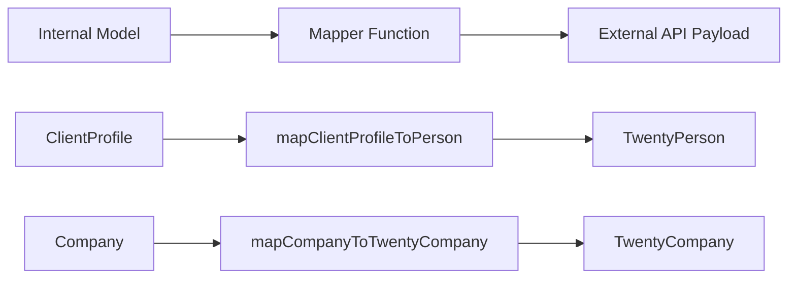

# Mapper-Muster

Die Vorlage verwendet reine Mapper-Funktionen, um Daten zwischen internen Modellen und externen API-Nutzlasten zu transformieren. Mapper sind nebenwirkungsfrei, nullsicher und validieren erforderliche Felder vor der Transformation.

## Architekturübersicht



## Quelldateien

|Datei|Zweck|
|------|---------|
|`lib/mappers/twenty-crm.mapper.ts`|Ordnet lokale Entitäten den Twenty CRM API-Nutzlasten zu|

## Designprinzipien

Das Mapper-Modul folgt strengen funktionalen Programmierkonventionen:

1. **Reine Funktionen** – keine Nebenwirkungen, keine Mutationen, keine Datenbankaufrufe
2. **Null-sicher** – alle optionalen Felder verwenden explizite Null-/Undefiniert-Prüfungen
3. **Validierung vor der Zuordnung** – Erforderliche Felder werden mit beschreibenden Fehlern validiert
4. **Externe ID-Durchsetzung** – jede zugeordnete Entität muss über einen gültigen `external_id` verfügen.

## Externe ID-Validierung

Jede einem externen System zugeordnete Entität erfordert eine gültige Kennung:

```typescript
export function ensureExternalId(id: string | undefined | null, entityType: string): string {
  if (!id || id.trim() === '') {
    throw new Error(`${entityType} ID is required for external_id mapping`);
  }
  return id.trim();
}
```

Diese Funktion wird zu Beginn jedes Mappers aufgerufen, um sicherzustellen, dass das Feld `external_id` niemals leer ist.

## Standortextraktion

Eine Dienstprogrammfunktion analysiert Städtenamen aus Freitext-Standortzeichenfolgen:

```typescript
export function extractCityFromLocation(location: string | undefined | null): string | null {
  if (!location || location.trim() === '') return null;
  const parts = location.split(',');
  const city = parts[0]?.trim();
  return city || null;
}
```

Verarbeitet Formate wie `"San Francisco"`, `"San Francisco, CA"` und `"San Francisco, CA, USA"`.

## Kundenprofil für zwanzig CRM-Personen

Ordnet interne `ClientProfile` Datensätze der Twenty CRM `TwentyPerson` Nutzlast zu:

```typescript
export function mapClientProfileToPerson(clientProfile: ClientProfile): TwentyPerson {
  const external_id = ensureExternalId(clientProfile.id, 'ClientProfile');

  const person: TwentyPerson = {
    external_id,
    name: clientProfile.name,
    email: clientProfile.email,
  };

  // Optional field mapping (null-safe)
  if (clientProfile.phone)     person.phone = clientProfile.phone;
  if (clientProfile.jobTitle)  person.job_title = clientProfile.jobTitle;
  if (clientProfile.company)   person.company_name = clientProfile.company;
  if (clientProfile.website)   person.website = clientProfile.website;

  const city = extractCityFromLocation(clientProfile.location);
  if (city) person.city = city;

  // Custom fields
  if (clientProfile.accountType) person.account_type = clientProfile.accountType;
  if (clientProfile.plan)        person.plan = clientProfile.plan;
  if (clientProfile.totalSubmissions !== null && clientProfile.totalSubmissions !== undefined) {
    person.total_submissions = clientProfile.totalSubmissions;
  }

  return person;
}
```

### Feldzuordnungstabelle

|ClientProfile-Feld|TwentyPerson-Feld|Erforderlich|Notizen|
|--------------------|--------------------|----------|-------|
|`id`|`external_id`|Ja|Validiert und getrimmt|
|`name`|`name`|Ja|Direkte Zuordnung|
|`email`|`email`|Ja|Direkte Zuordnung|
|`phone`|`phone`|Nein|Nur wenn vorhanden|
|`jobTitle`|`job_title`|Nein|CamelCase zu Snake_Case|
|`company`|`company_name`|Nein|Feld umbenannt|
|`website`|`website`|Nein|Direkte Zuordnung|
|`location`|`city`|Nein|Extrahiert über `extractCityFromLocation`|
|`accountType`|`account_type`|Nein|Benutzerdefiniertes Feld|
|`plan`|`plan`|Nein|Benutzerdefiniertes Feld|
|`totalSubmissions`|`total_submissions`|Nein|Explizite Nullprüfung erforderlich|

## Unternehmen zu Twenty CRM Company

Ordnet interne `Company`-Entitäten der Twenty CRM `TwentyCompany`-Nutzlast zu:

```typescript
export function mapCompanyToTwentyCompany(company: Company): TwentyCompany {
  const external_id = ensureExternalId(company.id, 'Company');

  const twentyCompany: TwentyCompany = {
    external_id,
    name: company.name,
  };

  if (company.domain)  twentyCompany.domain_name = company.domain;
  if (company.website) twentyCompany.website = company.website;
  if (company.status)  twentyCompany.status = company.status;

  return twentyCompany;
}
```

### Feldzuordnungstabelle

|Firmenfeld|TwentyCompany-Feld|Erforderlich|Notizen|
|--------------|---------------------|----------|-------|
|`id`|`external_id`|Ja|Validiert und getrimmt|
|`name`|`name`|Ja|Direkte Zuordnung|
|`domain`|`domain_name`|Nein|Feld umbenannt|
|`website`|`website`|Nein|Direkte Zuordnung|
|`status`|`status`|Nein|`'active'` oder `'inactive'`|

## Neue Mapper hinzufügen

Befolgen Sie beim Erstellen von Mappern für neue Integrationen die etablierten Muster:

```typescript
// 1. Always validate external_id first
const external_id = ensureExternalId(entity.id, 'EntityName');

// 2. Build the required fields object
const payload: ExternalType = {
  external_id,
  // ... required fields
};

// 3. Conditionally add optional fields (null-safe)
if (entity.optionalField) {
  payload.optional_field = entity.optionalField;
}

// 4. Return the payload -- never mutate the input
return payload;
```

## Überlegungen zum Testen

Da es sich bei Mappern um reine Funktionen handelt, lassen sie sich problemlos in Unit-Tests testen:

- Testen Sie mit allen optionalen Feldern
- Testen Sie mit allen optionalen Feldern als `null` oder `undefined`
- Testen Sie, ob fehlende erforderliche IDs beschreibende Fehler auslösen
- Testen Sie die Standortextraktion mit verschiedenen Zeichenfolgenformaten
- Stellen Sie sicher, dass das Eingabeobjekt niemals mutiert wird
