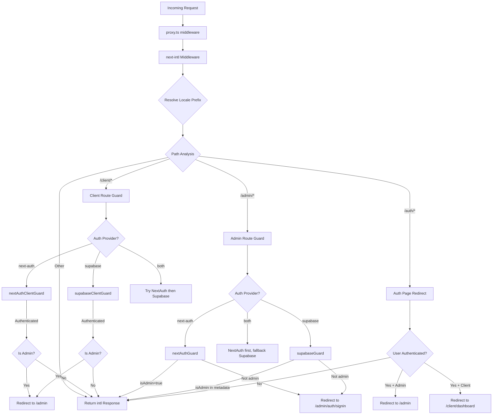

# Middleware-Kette und Anforderungsverarbeitung

## Übersicht

Die Ever Works-Vorlage verwendet eine **einheitliche Middleware**-Architektur, die in `proxy.ts` im Projektstamm definiert ist. Diese Middleware orchestriert drei kritische Anliegen für jede eingehende Anfrage:

1. **Internationalisierung** – Gebietsschemaerkennung, Präfixeinfügung und Weiterleitung über `next-intl`
2. **Authentifizierungswächter** – Schutz der Routen `/admin/*` und `/client/*` mit NextAuth, Supabase oder beiden
3. **Rollenbasierte Umleitung** – authentifizierte Benutzer von öffentlichen Authentifizierungsseiten wegleiten und Administratoren/Clients zu ihren jeweiligen Dashboards umleiten

Das Design unterstützt ein **pluggable Auth Provider**-Modell: Die Middleware liest den aktuellen `AuthProviderType` (`'next-auth'`, `'supabase'` oder `'both'`) aus der zentralen Authentifizierungskonfiguration und wählt entsprechend die entsprechenden Schutzfunktionen aus.

## Architekturdiagramm



## Quelldateien

|Datei|Zweck|
|------|---------|
|`template/proxy.ts`|Haupteinstiegspunkt für die Middleware|
|`template/lib/auth/config.ts`|Konfiguration des Authentifizierungsanbieters (`getAuthConfig()`)|
|`template/lib/auth/supabase/middleware.ts`|Supabase-Sitzungsaktualisierungshelfer|
|`template/lib/auth/validate-callback-url.ts`|Sichere Rückruf-URL-Erstellung|
|`template/i18n/routing.ts`|Lokale Routing-Konfiguration|

## Bearbeitungsauftrag anfordern

### Schritt 1: Internationalisierung

Jede Anfrage durchläuft zunächst die `next-intl` Middleware, die mit `createIntlMiddleware(routing)` erstellt wurde:

```typescript
import createIntlMiddleware from 'next-intl/middleware';
import { routing } from './i18n/routing';

const intl = createIntlMiddleware(routing);
```

Dies übernimmt die Gebietsschemaerkennung über den `Accept-Language`-Header, die Cookie-Einstellungen und das URL-Präfix. Die Routing-Konfiguration verwendet `localePrefix: "as-needed"`, was bedeutet, dass für das Standardgebietsschema (`en`) kein URL-Präfix erforderlich ist.

### Schritt 2: Lokale Auflösung

Der Helfer `resolveLocalePrefix` extrahiert Gebietsschemainformationen aus dem Pfadnamen:

```typescript
function resolveLocalePrefix(pathname: string): {
    prefix: string;       // e.g., "/fr" or ""
    hasLocale: boolean;
    locale?: string;
    pathWithoutLocale: string;  // e.g., "/admin/items"
}
```

Dies ist wichtig, da alle nachfolgenden Pfadabgleiche (z. B. die Prüfung auf `/admin` oder `/client`) auf dem Pfad **ohne** dem Gebietsschemapräfix erfolgen müssen.

### Schritt 3: Routenbasierte Guard-Auswahl

Die Middleware wertet `pathWithoutLocale` aus, um zu bestimmen, welche Schutzkette angewendet werden soll:

|Pfadmuster|Schutz angewendet|Zweck|
|-------------|--------------|---------|
|`/client` oder `/client/*`|Client-Authentifizierungsschutz|Erfordert Authentifizierung; leitet Administratoren zu `/admin` weiter|
|`/admin/*` (außer `/admin/auth/signin`)|Admin-Authentifizierungsschutz|Erfordert Authentifizierung + `isAdmin` Flag|
|`/auth/*`|Authentifizierungsseitenumleitung|Leitet authentifizierte Benutzer von der Anmeldung/Registrierung weg|
|Alles andere|Keine Wache|Wird mit i18n-Antwort durchgelassen|

### Schritt 4: Authentifizierungsüberprüfung

#### NextAuth Guard (JWT-basiert)

```typescript
const token = await getToken({ req, secret: process.env.AUTH_SECRET });
if (token?.isAdmin === true) {
    return baseRes; // Admin access granted
}
```

NextAuth-Wächter verwenden `getToken()` von `next-auth/jwt`, um das JWT-Token aus Cookies zu lesen. Dies ist mit Edge Runtime kompatibel und erfordert keine Datenbanksuche.

#### Supabase-Wache

```typescript
const supRes = await supabaseUpdate(req);
// Merge cookies...
const { data: { user } } = await supabase.auth.getUser();
const isAdmin = user?.user_metadata?.isAdmin === true
    || user?.user_metadata?.role === 'admin';
```

Der Supabase-Guard aktualisiert zunächst die Sitzung mit `updateSession()` und überprüft dann die Benutzermetadaten auf Admin-Flags.

### Schritt 5: Cookie-Verbreitung

Ein wichtiges Implementierungsdetail: Wenn ein Wächter eine Umleitungsantwort erzeugt, müssen alle Cookies von `intlResponse` weitergegeben werden:

```typescript
const redirectRes = NextResponse.redirect(url);
baseRes.cookies.getAll().forEach((c) => redirectRes.cookies.set(c));
return redirectRes;
```

Dadurch wird sichergestellt, dass Gebietsschemaeinstellungen und Authentifizierungssitzungscookies Weiterleitungen überleben.

## Konfiguration

### Auswahl des Authentifizierungsanbieters

Der Authentifizierungsanbieter wird durch `getAuthConfig()` in `lib/auth/config.ts` bestimmt:

```typescript
export type AuthProviderType = 'supabase' | 'next-auth' | 'both';

export function getAuthConfig(): AuthConfig {
    // Priority 1: Global override via configureAuth()
    // Priority 2: Environment-based (detects Supabase env vars)
    // Priority 3: Default ('next-auth')
}
```

### Middleware-Matcher

```typescript
export const config = {
    matcher: ['/((?!api|trpc|_next|_vercel|.*\\..*).*)']
};
```

Dieser reguläre Ausdruck schließt Folgendes aus:
- `/api/*` Routen (verwaltet von der Next.js-API-Ebene)
- `/trpc/*` Routen
- `/_next/*` (Next.js-Interna)
- `/_vercel/*` (Vercel-Interna)
- Jeder Pfad mit einer Dateierweiterung (statische Assets)

### Rückruf-URL-Sicherheit

Die Middleware verwendet `createSafeCallbackUrl()`, um Open-Redirect-Angriffe zu verhindern:

```typescript
export function createSafeCallbackUrl(pathname: string, search?: string): string {
    // Limits URL length to 2048 characters
    // Validates relative-only paths
}

export function isValidCallbackUrl(url: string | null): boolean {
    return url?.startsWith('/') && !url.startsWith('//');
}
```

## Dual-Provider-Modus („beide“)

Wenn `provider === 'both'`, implementiert die Middleware eine Fallback-Kette:

1. **Client-Routen**: Probieren Sie zuerst NextAuth aus. Wenn Sie nicht authentifiziert sind, versuchen Sie es mit Supabase
2. **Admin-Routen**: Probieren Sie zuerst NextAuth aus. Wenn es zu einer Weiterleitung kommt (verweigert), versuchen Sie es mit Supabase
3. **Authentifizierungsseiten**: Überprüfen Sie zuerst das NextAuth-Token und dann die Supabase-Sitzung

Dadurch können Organisationen zwischen Authentifizierungsanbietern migrieren, ohne bestehende Benutzer zu stören.

## Wichtige Implementierungsdetails

### Edge-Laufzeitkompatibilität

Die Middleware läuft in der Next.js Edge Runtime. Alle Authentifizierungsprüfungen verwenden Edge-kompatible APIs:
- NextAuth: `getToken()` (JWT-basiert, keine Datenbank erforderlich)
- Supabase: `createServerClient()` mit Cookie-basierter Sitzung

### Entwicklungs- vs. Produktionsprotokollierung

Die Debug-Protokollierung ist hinter `NODE_ENV === 'development'` eingegrenzt:

```typescript
if (process.env.NODE_ENV === 'development') {
    console.log('[Middleware] Admin access granted via token');
}
```

### Aktualisierung der Supabase-Sitzung

Der Supabase-Middleware-Helfer (`updateSession`) wird vor jeder Authentifizierungsprüfung aufgerufen, um sicherzustellen, dass Token aktualisiert werden:

```typescript
export async function updateSession(request: NextRequest) {
    const supabase = createServerClient(url, anonKey, {
        cookies: { getAll, setAll }
    });
    // IMPORTANT: DO NOT REMOVE auth.getUser()
    await supabase.auth.getUser();
    return supabaseResponse;
}
```

Der Kommentar im Quellcode betont, dass `auth.getUser()` nicht entfernt werden darf – es löst den Token-Aktualisierungszyklus aus, der zufällige Abmeldungen verhindert.
