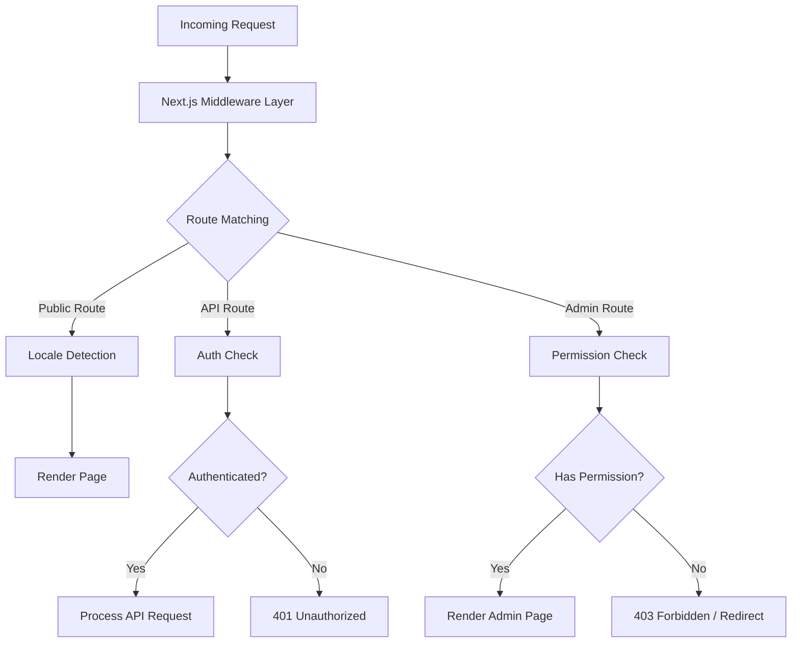
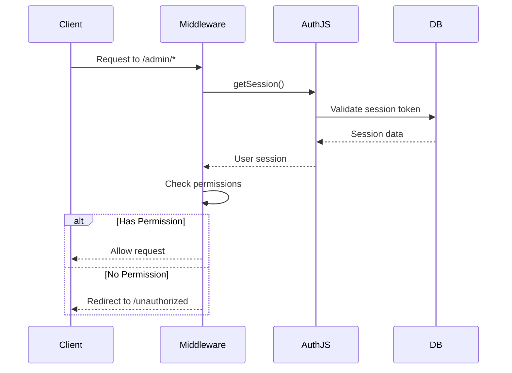
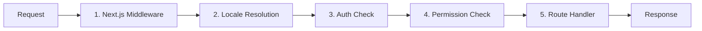

# Deep Dive zur Middleware

Die Ever Works-Vorlage verwendet eine mehrschichtige Middleware-Architektur, die auf Next.js App Router-Konventionen und benutzerdefinierter Logik zur Berechtigungsprüfung basiert. Dieses Dokument behandelt die gesamte Anforderungsverarbeitungspipeline, Berechtigungsprüfungen, Authentifizierungs-Middleware, Gebietsschemabehandlung und Middleware-Bestellung.

## Architekturübersicht



## Berechtigungsprüfungs-Middleware

Das Berechtigungsprüfungssystem befindet sich in `lib/middleware/permission-check.ts` und bietet eine detaillierte Zugriffskontrolle für API-Routen und Admin-Seiten.

### Kernschnittstelle

```typescript
interface UserPermissions {
  userId: string;
  roles: string[];
  permissions: Permission[];
}
```

### Funktionen zur Berechtigungsprüfung

|Funktion|Zweck|Rückgaben|
|---|---|---|
|`hasPermission(user, permission)`|Überprüfen Sie die Einzelberechtigung|`boolean`|
|`hasAnyPermission(user, permissions)`|Überprüfen Sie, ob der Benutzer mindestens einen hat|`boolean`|
|`hasAllPermissions(user, permissions)`|Überprüfen Sie, ob der Benutzer alle aufgelistet hat|`boolean`|
|`hasResourcePermission(user, resource, action)`|Überprüfen Sie das Format `resource:action`|`boolean`|
|`getResourcePermissions(user, resource)`|Erhalten Sie alle Berechtigungen für eine Ressource|`Permission[]`|
|`canManageResource(user, resource)`|Überprüfen Sie den Zugriff zum Erstellen/Aktualisieren/Löschen|`boolean`|
|`isSuperAdmin(user)`|Suchen Sie nach der Superadministratorrolle oder allen Berechtigungen|`boolean`|

### Verwendung in API-Routen

```typescript
import { hasPermission, hasAnyPermission } from '@/lib/middleware/permission-check';

export async function GET(request: Request) {
  const userPermissions = await getUserPermissions(session);

  // Single permission check
  if (!hasPermission(userPermissions, 'items:read')) {
    return new Response('Forbidden', { status: 403 });
  }

  // Multiple permission check (any)
  if (!hasAnyPermission(userPermissions, ['items:review', 'items:approve'])) {
    return new Response('Forbidden', { status: 403 });
  }
}
```

### Prüfungen auf Ressourcenebene

```typescript
// Check specific resource and action
const canEdit = hasResourcePermission(userPermissions, 'items', 'update');

// Get all permissions for a resource
const itemPerms = getResourcePermissions(userPermissions, 'items');
// Returns: ['items:read', 'items:create', 'items:update']

// Check management capability (create, update, or delete)
const canManage = canManageResource(userPermissions, 'categories');
```

### Spezialisierte Berechtigungshelfer

Die Middleware stellt domänenspezifische Helfer bereit, die mehrere Berechtigungsprüfungen kombinieren:

```typescript
// Can the user review, approve, or reject items?
const canReview = canReviewItems(userPermissions);

// Can the user manage users (read, create, update, delete, assignRoles)?
const canAdmin = canManageUsers(userPermissions);

// Can the user view analytics data?
const canView = canViewAnalytics(userPermissions);

// Is the user a super admin?
const isAdmin = isSuperAdmin(userPermissions);
```

### Super-Admin-Erkennung

Die Funktion `isSuperAdmin` verwendet einen zweistufigen Ansatz:

1. **Rollenprüfung** (primär): Prüft, ob der Benutzer die Rolle `super-admin` hat
2. **Berechtigungsprüfung** (Fallback): Überprüft, ob der Benutzer über alle Systemberechtigungen verfügt

```typescript
function isSuperAdmin(userPermissions: UserPermissions): boolean {
  // Fast path: check role
  if (userPermissions.roles.includes('super-admin')) {
    return true;
  }
  // Exhaustive check: verify all permissions
  return hasAllPermissions(userPermissions, allSystemPermissions);
}
```

## Authentifizierungs-Middleware

Die Authentifizierung erfolgt über NextAuth.js (Auth.js v5), das in `auth.config.ts` konfiguriert ist. Die Middleware wird bei jeder Anfrage an geschützte Routen ausgeführt.

### Anbieterkonfiguration

Die Authentifizierungskonfiguration konfiguriert OAuth-Anbieter dynamisch mit elegantem Fallback:

|Anbieter|Konfigurationsquelle|
|---|---|
|Google|`authConfig.google.clientId/clientSecret`|
|GitHub|`authConfig.github.clientId/clientSecret`|
|Facebook|`authConfig.facebook.clientId/clientSecret`|
|Twitter/X|`authConfig.twitter.clientId/clientSecret`|
|Anmeldeinformationen|Immer aktiviert|

Wenn die OAuth-Konfiguration fehlschlägt, greift das System auf die Authentifizierung nur mit Anmeldeinformationen zurück.

### Authentifizierungssitzungsablauf



## Lokale Middleware

Die Vorlage unterstützt mehr als 20 Gebietsschemas durch `next-intl` Middleware-Integration. Die Erkennung des Gebietsschemas folgt dem Präfixmuster „nach Bedarf“:

- Standardgebietsschema (`en`): Kein URL-Präfix – `/items/my-app`
- Andere Gebietsschemas: Gebietsschema-Präfix – `/fr/items/my-app`

### Unterstützte Gebietsschemas

|Gebietsschema|Sprache|Gebietsschema|Sprache|
|---|---|---|---|
|`en`|Englisch (Standard)|`ja`|Japanisch|
|`fr`|Französisch|`ko`|Koreanisch|
|`es`|Spanisch|`nl`|Niederländisch|
|`de`|Deutsch|`pl`|Polnisch|
|`zh`|Chinesisch|`tr`|Türkisch|
|`ar`|Arabisch|`vi`|Vietnamesisch|
|`he`|Hebräisch|`th`|Thailändisch|
|`ru`|Russisch|`hi`|Hindi|
|`uk`|Ukrainisch|`id`|Indonesisch|
|`pt`|Portugiesisch|`bg`|Bulgarisch|
|`it`|Italienisch| | |

## Anforderungsverarbeitungspipeline

Die gesamte Anfrageverarbeitungspipeline folgt dieser Reihenfolge:



### Pipeline-Schritte

1. **Next.js Middleware** (`middleware.ts`): Wird bei jeder Anfrage ausgeführt, die mit den konfigurierten Matchern übereinstimmt. Verarbeitet Weiterleitungen, Umschreibungen und Header-Injection.

2. **Gebietsschemaauflösung**: Erkennt das bevorzugte Gebietsschema des Benutzers anhand des URL-Pfads, des `Accept-Language`-Headers oder des Cookies. Legt das Gebietsschema für den Anforderungskontext fest.

3. **Authentifizierungsprüfung**: Validiert bei geschützten Routen (`/admin/*`, `/dashboard/*`, `/api/admin/*`) das Sitzungstoken des Benutzers.

4. **Berechtigungsprüfung**: Nach der Authentifizierung wird überprüft, ob der Benutzer über die erforderlichen Berechtigungen für die spezifische Ressource und Aktion verfügt.

5. **Route-Handler**: Die eigentliche Seitenkomponente oder der API-Route-Handler verarbeitet die Anfrage.

### Bestellgarantien für Middleware

Das System erzwingt eine strikte Reihenfolge:

- Die Lokalisierungserkennung wird immer zuerst ausgeführt (erforderlich für Fehlerseiten).
- Authentifizierungsprüfungen werden vor Berechtigungsprüfungen ausgeführt (es ist ein Benutzer erforderlich, der die Berechtigungen überprüft).
- Berechtigungsprüfungen sind das letzte Tor vor den Streckenabfertigern
- API-Routen verwenden Berechtigungsprüfungen auf Funktionsebene (nicht auf Middleware-Ebene).

## Dienstprogramme zur Berechtigungsvalidierung

Die Middleware umfasst Validierungshilfen für die Arbeit mit Berechtigungszeichenfolgen:

```typescript
// Validate a permission string
validatePermission('items:read');     // true
validatePermission('invalid:perm');   // false

// Parse a permission into parts
parsePermission('items:update');
// Returns: { resource: 'items', action: 'update' }

// Get summary grouped by resource
getPermissionSummary(userPermissions);
// Returns: { items: ['read', 'create'], categories: ['read'] }
```

## Fehlerbehandlung

Das Middleware-System behandelt Fehler auf jeder Ebene:

|Schicht|Fehler|Antwort|
|---|---|---|
|Gebietsschema|Ungültiges Gebietsschema|Zum Standardgebietsschema umleiten|
|Auth|Keine Sitzung|401 oder Weiterleitung zur Anmeldung|
|Auth|Abgelaufene Sitzung|401 mit Aktualisierungshinweis|
|Erlaubnis|Fehlende Berechtigung|403 Verboten|
|Erlaubnis|Ungültige Berechtigungszeichenfolge|Warnung protokolliert, Zugriff verweigert|

## Best Practices

1. **Verwenden Sie die spezifischste Prüfung** – bevorzugen Sie `hasPermission` mit einer einzigen Berechtigung gegenüber `isSuperAdmin` für reguläres Feature-Gating.

2. **Berechtigungen in API-Routen prüfen** – Verlassen Sie sich nicht ausschließlich auf Middleware; Zur Tiefenverteidigung immer im Routenhandler validieren.

3. **Verwenden Sie dynamische Importe** in der Middleware, um die Bündelung reiner Servermodule in der Edge-Laufzeit zu vermeiden.

4. **Schnelle Berechtigungsprüfungen durchführen** – die `O(1)`-Berechtigungssatzsuche sorgt für minimalen Overhead pro Anfrage.

5. **Berechtigungsfehler protokollieren** – Verwenden Sie die strukturierte Protokollierung mit der Benutzer-ID und der versuchten Berechtigung für die Sicherheitsüberwachung.
