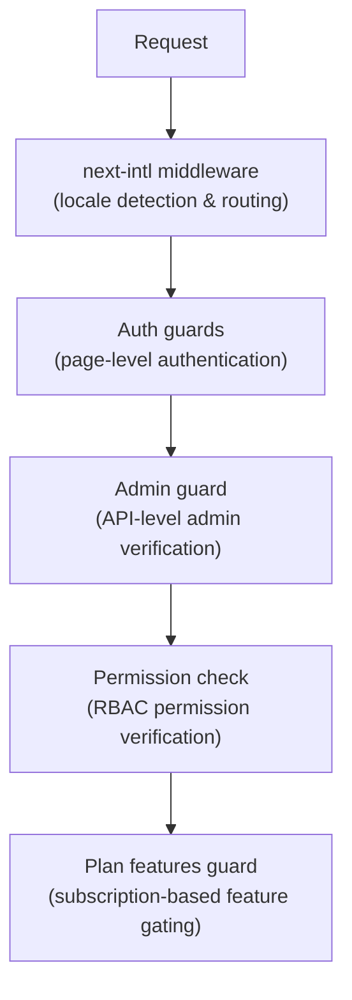

# Middleware und Guards

Die Ever Works-Vorlage verwendet ein mehrschichtiges Schutzsystem, das aus Next.js-Middleware für das Routing, Authentifizierungswächtern für den Seiten- und API-Schutz, Berechtigungsprüfungen für RBAC und planbasierten Funktionswächtern für das Abonnement-Gating besteht.

## Middleware-Schichten



## Gebietsschema-Middleware (next-intl)

Die Root-Middleware übernimmt das Internationalisierungsrouting über `next-intl`. Die Konfiguration erfolgt über `i18n/routing.ts` und `i18n/request.ts`.

Verantwortlichkeiten:
- Erkennen Sie das Benutzergebietsschema anhand des URL-Pfads, der Cookies oder des `Accept-Language`-Headers
- Leiten Sie Anfragen ohne Gebietsschemapräfix an das entsprechende Gebietsschema um
- Standardmäßig ist Englisch (`en`), wenn keine Präferenz erkannt wird
- Unterstützt 6 Gebietsschemata: `en`, `fr`, `es`, `de`, `ar`, `zh`

## Authentifizierungswächter

### Wächter auf Seitenebene (`lib/auth/guards.ts`)

Das Guards-Modul bietet serverseitige Authentifizierungsprüfungen für Seiten. Diese werden an der Spitze der Serverkomponenten aufgerufen, um den Seitenzugriff zu schützen.

**`requireAuth()`** – Erfordert eine Authentifizierung des Benutzers:

```typescript
import { requireAuth } from '@/lib/auth/guards';

export default async function ProtectedPage() {
  const session = await requireAuth();
  // session.user is guaranteed to exist here
  return <div>Welcome {session.user.email}</div>;
}
```

Wenn der Benutzer nicht authentifiziert ist, wird er zu `/auth/signin` umgeleitet.

**`requireAdmin()`** – Erfordert eine Authentifizierung des Benutzers UND eine Administratorrolle:

```typescript
import { requireAdmin } from '@/lib/auth/guards';

export default async function AdminPage() {
  const session = await requireAdmin();
  return <div>Admin: {session.user.email}</div>;
}
```

Wenn der Benutzer nicht authentifiziert ist, wird er zu `/admin/auth/signin` umgeleitet. Wenn sie authentifiziert sind, aber kein Administrator sind, werden sie zu `/unauthorized` umgeleitet.

**`getSession()`** – Ruft Sitzung ohne Umleitung ab:

```typescript
const session = await getSession();
if (session) {
  // Authenticated
} else {
  // Guest
}
```

**`checkIsAdmin()`** – Überprüft den Administratorstatus ohne Umleitung:

```typescript
const isAdmin = await checkIsAdmin();
// Returns true or false
```

### Validierte Aktionen (`lib/auth/guards.ts`)

Das Guards-Modul stellt außerdem validierte Aktions-Wrapper für Next.js-Serveraktionen bereit:

**`validatedAction(schema, action)`** – Validiert Formulardaten anhand eines Zod-Schemas:

```typescript
export const myAction = validatedAction(mySchema, async (data, formData) => {
  // data is validated and typed
});
```

**`validatedActionWithUser(schema, action)`** – Validiert und erfordert Authentifizierung:

```typescript
export const myAction = validatedActionWithUser(mySchema, async (data, formData, user) => {
  // data is validated, user is authenticated
});
```

## Admin Guard (`lib/auth/admin-guard.ts`)

Der Admin Guard bietet API-Routenschutz speziell für Admin-Endpunkte.

**`checkAdminAuth()`** – Middleware-Funktion für API-Routen:

```typescript
import { checkAdminAuth } from '@/lib/auth/admin-guard';

export async function GET(request: NextRequest) {
  const authError = await checkAdminAuth();
  if (authError) return authError;

  // User is verified admin, proceed with handler
}
```

Gibt `null` zurück, wenn autorisiert, oder ein `NextResponse` mit dem entsprechenden Fehlerstatus (401 oder 403).

**`withAdminAuth(handler)`** – Funktions-Wrapper höherer Ordnung:

```typescript
import { withAdminAuth } from '@/lib/auth/admin-guard';

export const GET = withAdminAuth(async (request) => {
  // Already verified as admin
  return NextResponse.json({ data: 'admin only' });
});
```

Der Admin-Guard überprüft sowohl die Authentifizierung (Sitzung vorhanden) als auch die Autorisierung (Benutzer hat Administratorrolle in der Datenbank über `isAdmin()`-Prüfung).

## Berechtigungsprüfungssystem (`lib/middleware/permission-check.ts`)

Das Berechtigungssystem implementiert eine rollenbasierte Zugriffskontrolle (RBAC) mit granularen Berechtigungen.

### Berechtigungsstruktur

Berechtigungen folgen einem `resource:action`-Format:

```typescript
// Examples of permission keys
'items:read'
'items:create'
'items:update'
'items:delete'
'items:review'
'items:approve'
'items:reject'
'categories:read'
'categories:create'
'users:assignRoles'
'analytics:read'
'system:settings'
```

### Funktionen zur Berechtigungsprüfung

```typescript
import {
  hasPermission,
  hasAnyPermission,
  hasAllPermissions,
  hasResourcePermission,
  canManageResource,
  canReviewItems,
  canManageUsers,
  canManageRoles,
  canViewAnalytics,
  isSuperAdmin,
} from '@/lib/middleware/permission-check';

// Single permission check
hasPermission(userPermissions, 'items:create');

// Any of multiple permissions
hasAnyPermission(userPermissions, ['items:create', 'items:update']);

// All permissions required
hasAllPermissions(userPermissions, ['items:read', 'items:update']);

// Resource-level check
hasResourcePermission(userPermissions, 'items', 'create');

// Domain-specific helpers
canManageResource(userPermissions, 'categories'); // create, update, or delete
canReviewItems(userPermissions);                  // review, approve, or reject
canManageUsers(userPermissions);                  // user CRUD + assignRoles
isSuperAdmin(userPermissions);                    // all system permissions
```

### Super-Admin-Erkennung

Die Funktion `isSuperAdmin()` prüft zwei Bedingungen:
1. Ob der Benutzer die Rolle `super-admin` hat (bevorzugt)
2. Als Fallback, ob der Benutzer ALLE Systemberechtigungen hat

### Berechtigungsvalidierung

```typescript
// Validate a permission string is defined in the system
validatePermission('items:create'); // true
validatePermission('invalid:perm'); // false

// Parse permission into resource and action
parsePermission('items:create'); // { resource: 'items', action: 'create' }
```

## Plan-Features-Guard (`lib/guards/plan-features.guard.ts`)

Der Plan umfasst Schutzkontrollen für den Funktionszugriff basierend auf Abonnementplänen (kostenlos, Standard, Premium).

### Planhierarchie

```typescript
const PLAN_LEVELS = {
  free: 1,
  standard: 2,
  premium: 3,
};
```

### Funktionszugriffsmatrix

Jede Funktion ist den Plänen zugeordnet, die darauf zugreifen können:

|Funktion|Kostenlos|Standard|Premium|
|---------|------|----------|---------|
|Produkt einreichen|Ja|Ja|Ja|
|Bilder hochladen|Ja|Ja|Ja|
|E-Mail-Support|Ja|Ja|Ja|
|Erweiterte Beschreibung| - |Ja|Ja|
|Verifiziertes Abzeichen| - |Ja|Ja|
|Vorrangige Überprüfung| - |Ja|Ja|
|Statistiken anzeigen| - |Ja|Ja|
|Video hochladen| - | - |Ja|
|Gesponsertes Abzeichen| - | - |Ja|
|Homepage vorgestellt| - | - |Ja|
|Erweiterte Analytik| - | - |Ja|
|Unbegrenzte Einsendungen| - | - |Ja|

### Plangrenzen

Jeder Plan hat numerische Beschränkungen für bestimmte Funktionen:

|Begrenzen|Kostenlos|Standard|Premium|
|-------|------|----------|---------|
|Maximale Bilder| 1 | 5 |Unbegrenzt|
|Max. Beschreibungswörter| 200 | 500 |Unbegrenzt|
|Max. Einsendungen| 1 | 10 |Unbegrenzt|
|Rezensionstage| 7 | 3 | 1 |
|Kostenlose Änderungstage| 0 | 30 | 365 |

### Verwendung des Plan Guard

**Direkte Funktionsaufrufe:**

```typescript
import { canAccessFeature, getFeatureLimit, isWithinLimit } from '@/lib/guards';

canAccessFeature('upload_video', 'free');    // false
canAccessFeature('upload_video', 'premium'); // true
getFeatureLimit('max_images', 'standard');   // 5
isWithinLimit('max_submissions', 3, 'free'); // false (limit is 1)
```

**Fabrik bewachen (für Mehrfachkontrollen):**

```typescript
import { createPlanGuard } from '@/lib/guards';

const guard = createPlanGuard('standard');
guard.canAccess('verified_badge');     // true
guard.canAccess('upload_video');       // false
guard.getLimit('max_images');          // 5
guard.requireFeature('upload_video');  // throws PlanGuardError
```

**React-Hook-Integration:**

```typescript
import { createPlanGuardResult } from '@/lib/guards';

// In a hook or component
const guardResult = createPlanGuardResult(userPlan);
guardResult.canAccess('verified_badge');
guardResult.accessibleFeatures; // array of all accessible features
```

Das von `requireFeature()` ausgelöste `PlanGuardError` enthält den Funktionsnamen, den aktuellen Plan des Benutzers und den erforderlichen Plan und ermöglicht informative Upgrade-Eingabeaufforderungen in der Benutzeroberfläche.
