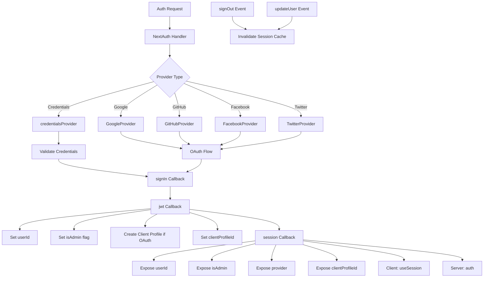

# NextAuth-Konfiguration

## Übersicht

Die Ever Works-Vorlage konfiguriert NextAuth.js (Auth.js v5) mit JWT-basierten Sitzungen, einem Drizzle ORM-Adapter, mehreren OAuth-Anbietern (Google, GitHub, Facebook, Twitter), anmeldeinformationsbasierter Authentifizierung und benutzerdefinierten Rückrufen für die Administrator-/Client-Rollenverwaltung. Das System unterstützt die automatische Erstellung von Clientprofilen für OAuth-Benutzer und Sitzungscaching mit Cache-Invalidierung.

## Architektur



## Quelldateien

|Datei|Zweck|
|------|---------|
|`template/lib/auth/index.ts`|Hauptkonfiguration und Exporte von NextAuth|
|`template/auth.config.ts`|Anbieterkonfiguration (Edge-kompatibel)|
|`template/lib/auth/config.ts`|Auswahl des Authentifizierungsanbietertyps|
|`template/lib/auth/providers.ts`|OAuth-Provider-Factory-Funktionen|
|`template/lib/auth/credentials.ts`|Implementierung des Anmeldeinformationsanbieters|
|`template/lib/auth/guards.ts`|Serverseitige Auth-Guard-Dienstprogramme|
|`template/lib/auth/middleware.ts`|Validierte Aktions-Wrapper|
|`template/lib/auth/setup.ts`|Hilfsprogramm zur Authentifizierungsinitialisierung|
|`template/lib/auth/cached-session.ts`|Verwaltung des Sitzungscache|
|`template/lib/auth/session-cache.ts`|Implementierung des Sitzungscache|
|`template/lib/auth/admin-guard.ts`|Administratorspezifische Schutzlogik|

## NextAuth-Initialisierung

```typescript
// lib/auth/index.ts
export const { handlers, auth, signIn, signOut, unstable_update } = NextAuth({
    adapter: drizzle,
    session: {
        strategy: 'jwt',
        maxAge: 30 * 24 * 60 * 60,    // 30 days
        updateAge: 24 * 60 * 60        // Refresh every 24 hours
    },
    jwt: {
        maxAge: 30 * 24 * 60 * 60      // 30 days
    },
    callbacks: { authorized, redirect, signIn, jwt, session },
    events: { signOut, updateUser },
    pages: {
        signIn: '/auth/signin',
        signOut: '/auth/signout',
        error: '/auth/error',
        verifyRequest: '/auth/verify-request',
        newUser: '/auth/register'
    },
    ...authConfig  // Merges providers from auth.config.ts
});
```

### Sitzungsstrategie

Die Vorlage verwendet **JWT-Sitzungen** (`strategy: 'jwt'`), keine Datenbanksitzungen. Das bedeutet:
- Sitzungen werden in verschlüsselten Cookies gespeichert, nicht in der Datenbank
- Zur Validierung einer Sitzung ist keine Datenbankabfrage erforderlich
- Kompatibel mit Edge Runtime (Middleware)
- Sitzungsdaten sind auf das beschränkt, was in ein JWT-Token passt

## Datenbankadapter

```typescript
const isDatabaseAvailable = !!coreConfig.DATABASE_URL && typeof db !== 'undefined';

const drizzle = isDatabaseAvailable
    ? DrizzleAdapter(getDrizzleInstance(), {
        usersTable: users,
        accountsTable: accounts,
        sessionsTable: sessions,
        verificationTokensTable: verificationTokens
    })
    : undefined;
```

Der Adapter wird bedingt basierend auf der Datenbankverfügbarkeit erstellt. Dadurch kann die Vorlage auch ohne Datenbank gestartet werden (z. B. bei der Ersteinrichtung), allerdings ist die Authentifizierung eingeschränkt.

## Anbieterkonfiguration

### auth.config.ts (Edge-kompatibel)

```typescript
// auth.config.ts
const configureProviders = () => {
    try {
        const oauthProviders = configureOAuthProviders();
        return createNextAuthProviders({
            google: oauthProviders.find((p) => p.id === 'google')
                ? { enabled: true, clientId: '...', clientSecret: '...' }
                : { enabled: false },
            github: { /* ... */ },
            facebook: { /* ... */ },
            twitter: { /* ... */ },
            credentials: { enabled: true },
        });
    } catch (error) {
        // Fallback to credentials only
        return createNextAuthProviders({
            credentials: { enabled: true },
            google: { enabled: false },
            github: { enabled: false },
            facebook: { enabled: false },
            twitter: { enabled: false },
        });
    }
};

export default {
    trustHost: true,
    providers: configureProviders(),
} satisfies NextAuthConfig;
```

### Anbieterfabrik

```typescript
// lib/auth/providers.ts
export function createNextAuthProviders(config: OAuthProvidersConfig) {
    const providers = [];

    if (config.google?.enabled && config.google.clientId && config.google.clientSecret) {
        providers.push(GoogleProvider({
            clientId: config.google.clientId,
            clientSecret: config.google.clientSecret,
            ...config.google.options,
        }));
    }
    // GitHub, Facebook, Twitter follow the same pattern...

    if (config.credentials?.enabled) {
        providers.push(credentialsProvider);
    }

    return providers;
}
```

Anbieter werden nur hinzugefügt, wenn sie über gültige Anmeldeinformationen verfügen, wodurch Konfigurationsfehler beim Start verhindert werden.

## Rückrufe

### Anmelden Rückruf

```typescript
signIn: async ({ user, account, profile }) => {
    const isCredentials = account?.provider === 'credentials';

    if (!user?.email) {
        return !isCredentials; // Allow OAuth without email
    }

    if (!isDatabaseAvailable) {
        return !isCredentials; // Skip DB validation if no DB
    }

    // For OAuth providers, allow account linking
    if (!isCredentials && account?.provider) {
        return true;
    }

    return true;
}
```

### jwt-Rückruf

Der JWT-Callback ist der Kern der Authentifizierungspipeline. Es läuft bei jeder Anfrage und verwaltet:

```typescript
jwt: async ({ token, user, account }) => {
    // 1. Set userId from user object or token.sub
    if (user?.id) token.userId = user.id;
    if (!token.userId && token.sub) token.userId = token.sub;

    // 2. Set clientProfileId
    if (user?.clientProfileId) token.clientProfileId = user.clientProfileId;

    // 3. Record provider
    if (account?.provider) token.provider = account.provider;

    // 4. Auto-create client profile for OAuth users
    if (isOAuthProvider && !token.clientProfileId && token.userId) {
        let clientProfile = await getClientProfileByUserId(token.userId);
        if (!clientProfile) {
            clientProfile = await createClientProfile({
                userId: token.userId,
                email: token.email,
                name: token.name || token.email?.split('@')[0],
            });
        }
        token.clientProfileId = clientProfile?.id;
    }

    // 5. Set isAdmin flag
    if (user?.isClient !== undefined) {
        token.isAdmin = !user.isClient;
    } else if (user?.isAdmin !== undefined) {
        token.isAdmin = user.isAdmin;
    } else if (token.isAdmin === undefined) {
        token.isAdmin = false; // Default: non-admin
    }

    return token;
}
```

### Sitzungsrückruf

Ordnet JWT-Tokenfelder dem Sitzungsobjekt zu, das für Clientkomponenten verfügbar gemacht wird:

```typescript
session: async ({ session, token }) => {
    if (token && session.user) {
        session.user.id = token.userId;
        session.user.clientProfileId = token.clientProfileId;
        session.user.provider = token.provider || 'credentials';
        session.user.isAdmin = token.isAdmin;
    }
    return session;
}
```

## Veranstaltungen

### Ungültigkeit des Sitzungscache

```typescript
events: {
    signOut: async (event) => {
        const token = 'token' in event ? event.token : undefined;
        if (token?.userId) {
            await invalidateSessionCache(undefined, token.userId);
        }
    },
    updateUser: async ({ user }) => {
        if (user?.id) {
            await invalidateSessionCache(undefined, user.id);
        }
    }
}
```

Sowohl die Ereignisse `signOut` als auch `updateUser` lösen eine Ungültigmachung des Sitzungscache aus, um sicherzustellen, dass veraltete Sitzungsdaten nach Änderungen des Authentifizierungsstatus nicht bereitgestellt werden.

## Serverseitige Wachen

### requireAuth

```typescript
export async function requireAuth() {
    const session = await auth();
    if (!session?.user) {
        redirect('/auth/signin');
    }
    return session;
}
```

### requireAdmin

```typescript
export async function requireAdmin() {
    const session = await auth();
    if (!session?.user) {
        redirect('/admin/auth/signin');
    }
    if (!session.user.isAdmin) {
        redirect('/unauthorized');
    }
    return session;
}
```

### Versorgungswachen

```typescript
// Check without redirecting
export async function getSession() {
    return await auth();
}

export async function checkIsAdmin() {
    const session = await auth();
    return session?.user?.isAdmin === true;
}
```

## Benutzerdefinierte Seiten

|Seite|Pfad|Zweck|
|------|------|---------|
|Anmelden|`/auth/signin`|Anmeldeformular|
|Abmelden|`/auth/signout`|Abmeldebestätigung|
|Fehler|`/auth/error`|Auth-Fehleranzeige|
|Anfrage überprüfen|`/auth/verify-request`|Aufforderung zur E-Mail-Bestätigung|
|Registrieren|`/auth/register`|Neue Benutzerregistrierung|

## Umgebungsvariablen

|Variabel|Erforderlich|Zweck|
|----------|----------|---------|
|`AUTH_SECRET`|Ja|JWT-Verschlüsselungsgeheimnis|
|`AUTH_GOOGLE_ID`|Nein|Google OAuth-Client-ID|
|`AUTH_GOOGLE_SECRET`|Nein|Geheimnis des Google OAuth-Clients|
|`AUTH_GITHUB_ID`|Nein|GitHub OAuth-Client-ID|
|`AUTH_GITHUB_SECRET`|Nein|GitHub OAuth-Client-Geheimnis|
|`AUTH_FACEBOOK_ID`|Nein|Facebook-OAuth-Client-ID|
|`AUTH_FACEBOOK_SECRET`|Nein|Facebook-OAuth-Client-Geheimnis|
|`AUTH_TWITTER_ID`|Nein|Twitter/X OAuth-Client-ID|
|`AUTH_TWITTER_SECRET`|Nein|Twitter/X OAuth-Client-Geheimnis|
|`DATABASE_URL`|Für Adapter|Datenbankverbindungszeichenfolge|

## Best Practices

1. **Verwenden Sie die JWT-Strategie** für Edge Runtime-Kompatibilität in Middleware
2. **Clientprofile automatisch erstellen** für OAuth-Benutzer im JWT-Rückruf
3. **Anmutige Verschlechterung** – wenn die OAuth-Konfiguration fehlschlägt, greifen Sie nur auf Anmeldeinformationen zurück
4. **Cache bei Authentifizierungsereignissen ungültig machen** – Abmelden und Benutzeraktualisierung löschen beide zwischengespeicherten Sitzungen
5. **Bedingter Adapter** – Ermöglicht den Start ohne Datenbank für die Erstkonfiguration
6. **Schutzfunktionen** – verwenden Sie `requireAuth()` / `requireAdmin()` in Serverkomponenten, keine manuellen Sitzungsprüfungen
7. **Benutzerdefinierte Seiten** – Überschreiben Sie die Standard-NextAuth-Seiten für eine konsistente Benutzeroberfläche mit dem Vorlagendesign
