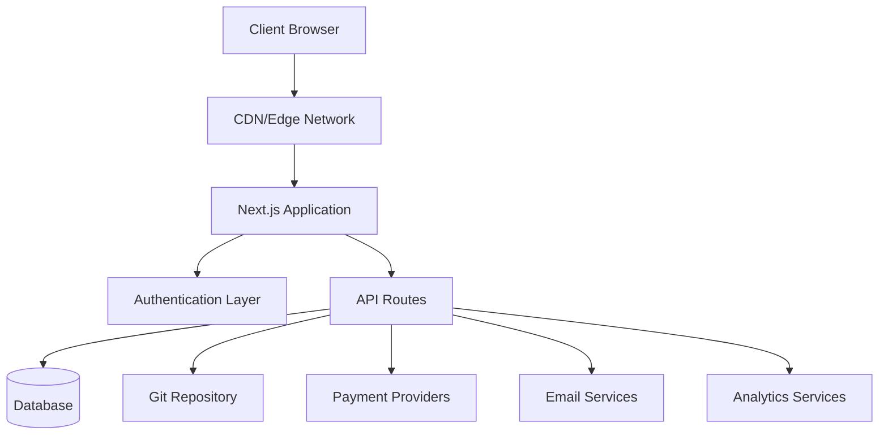
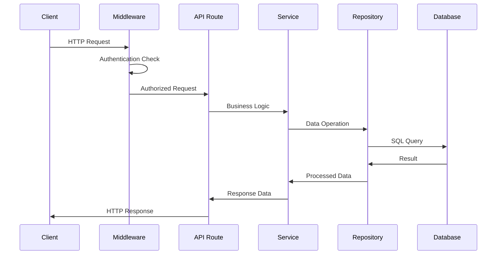
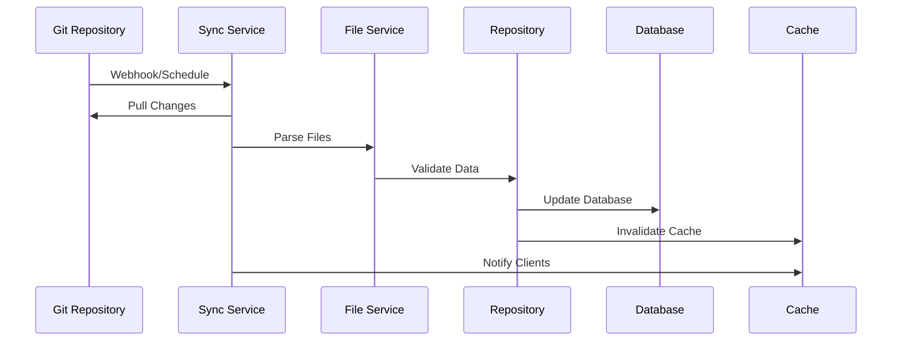

# Architekturübersicht

The Ever Works folgt einer modernen, skalierbaren Architektur, die auf Leistung, Wartbarkeit und Entwicklererfahrung ausgelegt ist.

## High-Level-Architektur



## Grundprinzipien

### 1. Trennung der Belange
- **Präsentationsschicht**: React-Komponenten und UI-Logik
- **Business-Schicht**: Dienste und Repositorys
- **Datenschicht**: Datenbank und externe APIs

### 2. Modularer Aufbau
- Funktionsbasierte Organisation
- Wiederverwendbare Komponenten
- Plugin-ähnliche Integrationen

### 3. Geben Sie Sicherheit ein
- Durchgehend TypeScript
- Strenge Typprüfung
- Laufzeitvalidierung mit Zod

### 4. Leistung zuerst
- Serverseitiges Rendering
- Statische Erzeugung, wo möglich
- Optimierte Caching-Strategien

## Anwendungsschichten

### Frontend-Ebene

**Technologie**: React 19 + Next.js 15
**Aufgaben**:
- Rendering der Benutzeroberfläche
- Clientseitiges Zustandsmanagement
- Benutzerinteraktionen
- Routenabwicklung

**Schlüsselkomponenten**:
- Seitenkomponenten (`app/[locale]/`)
- Wiederverwendbare UI-Komponenten (`components/`)
- Benutzerdefinierte Hooks (`hooks/`)
- Kontextanbieter (`components/providers/`)

### API-Schicht

**Technologie**: Next.js API-Routen
**Aufgaben**:
- Ausführung der Geschäftslogik
- Datenvalidierung
- Externe Serviceintegration
- Authentifizierungsbehandlung

**Struktur**:
```
app/api/
├── auth/           # Authentication endpoints
├── admin/          # Admin-only endpoints
├── items/          # Item management
└── webhooks/       # External service webhooks
```

### Datenschicht

**Technologien**: Drizzle ORM + PostgreSQL
**Aufgaben**:
- Datenpersistenz
- Abfrageoptimierung
- Transaktionsmanagement
- Schemamigrationen

**Komponenten**:
- Datenbankschema (`lib/db/schema.ts`)
- Repositories (`lib/repositories/`)
- Migrationsdateien (`lib/db/migrations/`)

### Inhaltsebene

**Technologie**: Git-basiertes CMS
**Aufgaben**:
- Inhaltssynchronisierung
- Versionskontrolle
- Kollaborative Bearbeitung
- Inhaltsvalidierung

**Struktur**:
```
.content/
├── config.yml      # Site configuration
├── items/          # Item definitions
├── categories/     # Category definitions
└── tags/           # Tag definitions
```

## Designmuster

### 1. Repository-Muster

Zusammenfassung der Datenzugriffslogik:

```typescript
interface ItemRepository {
  findById(id: string): Promise<Item | null>;
  findBySlug(slug: string): Promise<Item | null>;
  findWithFilters(filters: ItemFilters): Promise<Item[]>;
  create(item: CreateItemRequest): Promise<Item>;
  update(id: string, updates: UpdateItemRequest): Promise<Item>;
  delete(id: string): Promise<void>;
}
```

### 2. Service-Layer-Muster

Kapselt Geschäftslogik:

```typescript
class ItemService {
  constructor(
    private itemRepository: ItemRepository,
    private gitService: GitService,
    private notificationService: NotificationService
  ) {}

  async submitItem(data: SubmitItemRequest): Promise<SubmissionResult> {
    // Business logic here
  }
}
```

### 3. Fabrikmuster

Erstellt Dienstinstanzen:

```typescript
class PaymentProviderFactory {
  static create(provider: PaymentProvider): PaymentService {
    switch (provider) {
      case 'stripe':
        return new StripePaymentService();
      case 'lemonsqueezy':
        return new LemonSqueezyPaymentService();
      default:
        throw new Error(`Unsupported provider: ${provider}`);
    }
  }
}
```

### 4. Beobachtermuster

Ereignisgesteuerte Updates:

```typescript
class ContentSyncService {
  private observers: ContentObserver[] = [];

  addObserver(observer: ContentObserver): void {
    this.observers.push(observer);
  }

  notifyObservers(event: ContentEvent): void {
    this.observers.forEach(observer => observer.update(event));
  }
}
```

## Datenfluss

### 1. Anforderungsablauf



### 2. Ablauf der Inhaltssynchronisierung



## Sicherheitsarchitektur

### 1. Authentifizierungsablauf


### 2. Autorisierungsebenen

- **Routenebene**: Middleware-Schutz
- **API-Ebene**: Endpunktwächter
- **Datenebene**: Sicherheit auf Zeilenebene
- **UI-Ebene**: Komponentenbasierte Zugriffskontrolle

### 3. Sicherheitsmaßnahmen

- **Eingabevalidierung**: Zod-Schemas
- **SQL-Injection**: Parametrisierte Abfragen
- **XSS-Schutz**: Inhaltsbereinigung
- **CSRF-Schutz**: Token-Validierung
- **Ratenbegrenzung**: Drosselung anfordern

## Caching-Strategie

### 1. Anwendungscache

- **React Query**: Clientseitiger Datencache
- **Next.js Cache**: Seiten- und API-Routen-Cache
- **Statische Generierung**: Vorgefertigte Seiten

### 2. Datenbank-Cache

- **Verbindungspooling**: Effiziente DB-Verbindungen
- **Abfrageoptimierung**: Indizierte Abfragen
- **Replikate lesen**: Verteilte Lesevorgänge

### 3. CDN-Cache

- **Statische Assets**: Bilder, CSS, JS
- **API-Antworten**: Zwischenspeicherbare Endpunkte
- **Edge-Standorte**: Globaler Vertrieb

## Überlegungen zur Skalierbarkeit

### 1. Horizontale Skalierung

- **Zustandsloses Design**: Keine serverseitigen Sitzungen
- **Datenbankskalierung**: Replikate und Sharding lesen
- **CDN-Verteilung**: Globales Edge-Caching

### 2. Leistungsoptimierung

- **Code-Splitting**: Dynamische Importe
- **Bildoptimierung**: Next.js-Bildkomponente
- **Bundle-Optimierung**: Baumschütteln und -minimierung

### 3. Überwachung und Beobachtbarkeit

- **Fehlerverfolgung**: Sentry-Integration
- **Leistungsüberwachung**: Core Web Vitals
- **Analytics**: PostHog-Integration
- **Protokollierung**: Strukturierte Protokollierung

## Technologieentscheidungen

### Warum Next.js?
- **Full-Stack-Framework**: API-Routen + Frontend
- **Leistung**: SSR, SSG und ISR
- **Entwicklererfahrung**: Hot-Reloading, TypeScript-Unterstützung
- **Ökosystem**: Umfangreiches Plugin-Ökosystem

### Warum Drizzle ORM?
- **Typsicherheit**: Vollständige TypeScript-Unterstützung
- **Leistung**: Minimaler Overhead
- **Flexibilität**: Raw SQL bei Bedarf
- **Migrationssystem**: Versionsgesteuerte Schemaänderungen

### Warum Git-basiertes CMS?
- **Versionskontrolle**: Vollständige Verlaufsverfolgung
- **Zusammenarbeit**: Pull-Request-Workflow
- **Backup**: Von Natur aus verteilt
- **Flexibilität**: Jeder Git-Anbieter

### Warum auf eine Abfrage reagieren?
- **Caching**: Intelligente Cache-Verwaltung
- **Synchronisierung**: Hintergrundaktualisierungen
- **Optimistische Updates**: Bessere UX
- **Fehlerbehandlung**: Wiederholungslogik

## Erweiterungspunkte

Die Architektur bietet mehrere Erweiterungspunkte:

### 1. Benutzerdefinierte Authentifizierungsanbieter
```typescript
// lib/auth/providers/custom-provider.ts
export function CustomProvider(options: CustomProviderOptions) {
  return {
    id: "custom",
    name: "Custom Provider",
    type: "oauth",
    // Implementation
  }
}
```

### 3. Integration von Inhaltsquellen
```typescript
// lib/content/sources/custom-source.ts
export class CustomContentSource implements ContentSource {
  async sync(): Promise<SyncResult> {
    // Implementation
  }
}
```

## Nächste Schritte

- [Erkunden Sie den Tech-Stack](./tech-stack) im Detail
