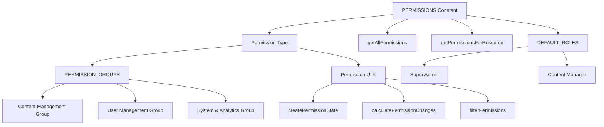

# Berechtigungssystem

Die Vorlage implementiert ein granulares, ressourcenbasiertes Berechtigungssystem mit typsicheren Berechtigungsdefinitionen, logischen Gruppierungen für die UI-Organisation und Hilfsfunktionen für die Statusverwaltung und Änderungserkennung.

## Architekturübersicht



## Quelldateien

|Datei|Zweck|
|------|---------|
|`lib/permissions/definitions.ts`|Berechtigungskonstanten, Typextraktion, Standardrollen|
|`lib/permissions/groups.ts`|UI-orientierte Berechtigungsgruppierungen mit Metadaten|
|`lib/permissions/utils.ts`|Zustandsverwaltung, Diff-Berechnung und Filterung|

## Berechtigungsdefinitionen

Berechtigungen folgen einer `resource:action` Namenskonvention. Das Objekt `PERMISSIONS` organisiert sie nach Ressource:

```typescript
export const PERMISSIONS = {
  items: {
    read: 'items:read',
    create: 'items:create',
    update: 'items:update',
    delete: 'items:delete',
    review: 'items:review',
    approve: 'items:approve',
    reject: 'items:reject',
  },
  categories: {
    read: 'categories:read',
    create: 'categories:create',
    update: 'categories:update',
    delete: 'categories:delete',
  },
  tags: {
    read: 'tags:read',
    create: 'tags:create',
    update: 'tags:update',
    delete: 'tags:delete',
  },
  roles: {
    read: 'roles:read',
    create: 'roles:create',
    update: 'roles:update',
    delete: 'roles:delete',
  },
  users: {
    read: 'users:read',
    create: 'users:create',
    update: 'users:update',
    delete: 'users:delete',
    assignRoles: 'users:assignRoles',
  },
  analytics: {
    read: 'analytics:read',
    export: 'analytics:export',
  },
  system: {
    settings: 'system:settings',
  },
} as const;
```

### Vollständige Berechtigungsliste

|Ressource|Aktionen|
|----------|---------|
|`items`|`read`, `create`, `update`, `delete`, `review`, `approve`, `reject`|
|`categories`|`read`, `create`, `update`, `delete`|
|`tags`|`read`, `create`, `update`, `delete`|
|`roles`|`read`, `create`, `update`, `delete`|
|`users`|`read`, `create`, `update`, `delete`, `assignRoles`|
|`analytics`|`read`, `export`|
|`system`|`settings`|

## Typsicherer Berechtigungstyp

Der Typ `Permission` wird mithilfe rekursiver bedingter Typen aus der Konstante `PERMISSIONS` extrahiert:

```typescript
type PermissionValues<T> = T extends Record<string, infer U>
  ? U extends Record<string, infer V>
    ? V extends string ? V : never
    : never
  : never;

export type Permission = PermissionValues<typeof PERMISSIONS>;
// Resolves to: 'items:read' | 'items:create' | ... | 'system:settings'
```

Dadurch wird die Sicherheit bei der Kompilierung gewährleistet: Jede Berechtigungszeichenfolge, die nicht in der `PERMISSIONS`-Konstante vorhanden ist, verursacht einen TypeScript-Fehler.

## Abfragefunktionen

```typescript
// Get all permissions as a flat array
export function getAllPermissions(): Permission[];

// Get permissions for a specific resource
export function getPermissionsForResource(resource: keyof typeof PERMISSIONS): Permission[];

// Validate whether a string is a valid permission
export function isValidPermission(permission: string): permission is Permission;
```

## Standardrollen

Zwei integrierte Rollendefinitionen bieten Ausgangspunkte:

```typescript
export const DEFAULT_ROLES = {
  SUPER_ADMIN: {
    id: 'super-admin',
    name: 'Super Administrator',
    description: 'Full system access with all permissions',
    permissions: getAllPermissions(), // Every permission
  },
  CONTENT_MANAGER: {
    id: 'content-manager',
    name: 'Content Manager',
    description: 'Manage content including items, categories, and tags',
    permissions: [
      ...getPermissionsForResource('items'),
      ...getPermissionsForResource('categories'),
      ...getPermissionsForResource('tags'),
    ],
  },
} as const;
```

## Berechtigungsgruppen

Gruppen organisieren Berechtigungen für die UI-Anzeige mit Symbolen und Beschreibungen:

```typescript
export interface PermissionGroup {
  id: string;
  name: string;
  description: string;
  icon: string;       // Lucide icon name
  permissions: Permission[];
}

export const PERMISSION_GROUPS: PermissionGroup[] = [
  {
    id: 'content',
    name: 'Content Management',
    description: 'Manage items, categories, and tags',
    icon: 'FileText',
    permissions: [...items, ...categories, ...tags],
  },
  {
    id: 'users',
    name: 'User Management',
    description: 'Manage users and their roles',
    icon: 'Users',
    permissions: [...users, ...roles],
  },
  {
    id: 'system',
    name: 'System & Analytics',
    description: 'System settings and analytics access',
    icon: 'Settings',
    permissions: [...analytics, ...system],
  },
];
```

### Gruppenabfragefunktionen

```typescript
// Find which group a permission belongs to
export function getPermissionGroup(permission: Permission): PermissionGroup | undefined;

// Get all permissions in a group by group ID
export function getPermissionsByGroup(groupId: string): Permission[];
```

### Formatierung der Berechtigungsanzeige

```typescript
// Format for display: "items:approve" -> "Approve Items"
export function formatPermissionName(permission: Permission): string;

// Generate description: "items:approve" -> "Approve submissions items and submissions"
export function formatPermissionDescription(permission: Permission): string;
```

Der Beschreibungsformatierer verwendet Nachschlagetabellen sowohl für Aktionen als auch für Ressourcen:

|Aktion|Beschreibung Präfix|
|--------|-------------------|
|`read`|Ansehen und zugreifen|
|`create`|Neu erstellen|
|`update`|Vorhandenes bearbeiten|
|`delete`|Entfernen|
|`review`|Überprüfen und moderieren|
|`approve`|Einsendungen genehmigen|
|`reject`|Einsendungen ablehnen|
|`assignRoles`|Weisen Sie Rollen zu|
|`export`|Daten exportieren von|
|`settings`|Einstellungen verwalten für|

## Berechtigungsstatusverwaltung

Das Dienstprogrammmodul bietet Funktionen zum Verwalten des Berechtigungsstatus in der Benutzeroberfläche:

### Status aus Berechtigungen erstellen

```typescript
export function createPermissionState(currentPermissions: Permission[]): PermissionState;
// Returns: { 'items:read': true, 'items:create': true, ... }
```

### Ausgewählte Berechtigungen extrahieren

```typescript
export function getSelectedPermissions(permissionState: PermissionState): Permission[];
// Filters the state object to return only permissions where value is `true`
```

### Änderungserkennung

```typescript
export function calculatePermissionChanges(
  originalPermissions: Permission[],
  newPermissions: Permission[]
): PermissionChanges;
// Returns: { added: Permission[], removed: Permission[] }
```

### Gleichheitsprüfung

```typescript
export function arePermissionsEqual(
  permissions1: Permission[],
  permissions2: Permission[]
): boolean;
// Uses Set-based comparison for order-independent equality
```

### Suchfilterung

```typescript
export function filterPermissions(
  permissions: Permission[],
  searchTerm: string
): Permission[];
// Matches against permission string and space-separated format
// e.g., "assign" matches "users:assignRoles" and "users assignRoles"
```

## Anwendungsbeispiel

```typescript
import { PERMISSIONS, getAllPermissions } from '@/lib/permissions/definitions';
import { PERMISSION_GROUPS, formatPermissionName } from '@/lib/permissions/groups';
import { createPermissionState, calculatePermissionChanges } from '@/lib/permissions/utils';

// Check a specific permission
if (userPermissions.includes(PERMISSIONS.items.approve)) {
  // User can approve items
}

// Build a permission editor UI
const state = createPermissionState(user.permissions);

// After user toggles permissions
const changes = calculatePermissionChanges(user.permissions, newPermissions);
console.log(`Added: ${changes.added.length}, Removed: ${changes.removed.length}`);
```
