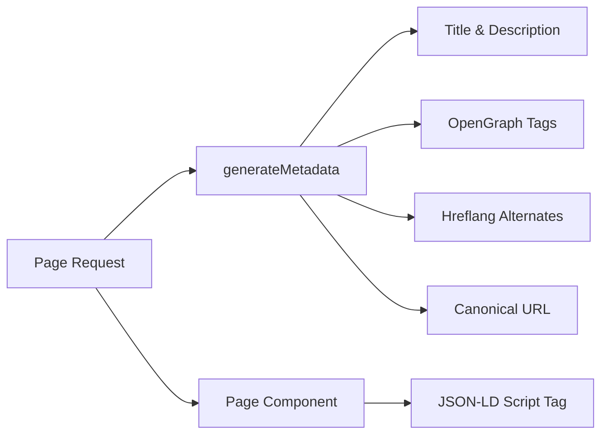

# SEO-System

Die Ever Works-Vorlage umfasst ein umfassendes SEO-System, das strukturierte Daten (JSON-LD), Hreflang-Tags, OpenGraph-Metadaten und dynamische Sitemaps generiert. Alle SEO-Dienstprogramme laufen unter `lib/seo/` und lassen sich in die Next.js-Metadaten-API integrieren.

## Architekturübersicht



### Quelldateien

|Datei|Zweck|
|---|---|
|`lib/seo/schema.ts`|Generatoren für strukturierte JSON-LD-Daten|
|`lib/seo/hreflang.ts`|Generatoren für alternative URLs in verschiedenen Sprachen|
|`lib/seo/listing-metadata.ts`|Metadatenfabrik der Auflistungsseite|

## Strukturierte JSON-LD-Daten

Das `lib/seo/schema.ts`-Modul generiert Schema.org-strukturierte Daten für Suchmaschinen-Rich-Suchergebnisse.

### Produktschema

Erzeugt für Artikeldetailseiten ein Schema `Product`:

```typescript
import { generateProductSchema } from '@/lib/seo/schema';

const schema = generateProductSchema({
  name: 'My App',
  description: 'A productivity tool',
  image: 'https://example.com/icon.png',
  url: 'https://example.com/items/my-app',
  category: 'Productivity',
  sourceUrl: 'https://myapp.com',
  brandName: 'MyApp Inc.',
});
```

Erzeugte Ausgabe:

```json
{
  "@context": "https://schema.org",
  "@type": "Product",
  "name": "My App",
  "description": "A productivity tool",
  "image": "https://example.com/icon.png",
  "url": "https://example.com/items/my-app",
  "category": "Productivity",
  "brand": {
    "@type": "Brand",
    "name": "MyApp Inc."
  },
  "offers": {
    "@type": "Offer",
    "url": "https://myapp.com",
    "availability": "https://schema.org/InStock"
  }
}
```

### Organisationsschema

Erzeugt ein standortweites `Organization`-Schema für die Sichtbarkeit im Knowledge Panel:

```typescript
import { generateOrganizationSchema } from '@/lib/seo/schema';

const schema = generateOrganizationSchema();
```

Dieses Schema umfasst:
- Markenname, URL und Logo
- Links zu sozialen Profilen (`sameAs` Array) von `siteConfig.social`
- Kontaktpunkt mit E-Mail (sofern konfiguriert)

### Website-Schema mit SearchAction

Aktiviert das Google Sitelinks-Suchfeld:

```typescript
import { generateWebSiteSchema } from '@/lib/seo/schema';

const schema = generateWebSiteSchema('en');
// Includes potentialAction with SearchAction targeting /?q={search_term_string}
```

Das Schema berücksichtigt Gebietsschemapräfixe:
- Standardgebietsschema: `https://example.com`
- Andere Orte: `https://example.com/fr`

### Breadcrumb-Schema

Erzeugt `BreadcrumbList` für navigationsbezogene Suchergebnisse:

```typescript
import { generateBreadcrumbSchema } from '@/lib/seo/schema';

const schema = generateBreadcrumbSchema([
  { name: 'Home', url: 'https://example.com' },
  { name: 'Productivity', url: 'https://example.com/categories/productivity' },
  { name: 'My App', url: 'https://example.com/items/my-app' },
]);
```

### Einbetten in Seiten

JSON-LD wird mithilfe eines `<script>`-Tags in die Seitenkomponente eingebettet:

```tsx
export default function ItemDetailPage({ item }) {
  const schema = generateProductSchema({ ... });

  return (
    <>
      <script
        type="application/ld+json"
        dangerouslySetInnerHTML={{ __html: JSON.stringify(schema) }}
      />
      <ItemDetail item={item} />
    </>
  );
}
```

## Hreflang-Tags

Das `lib/seo/hreflang.ts`-Modul generiert alternative Sprach-URLs für SEO mit mehreren Standorten.

### URL-Muster

Die Vorlage verwendet das Gebietsschema-Präfixmuster „nach Bedarf“:

|Gebietsschema|URL-Muster|
|---|---|
|`en` (Standard)|`https://example.com/items/my-app`|
|`fr`|`https://example.com/fr/items/my-app`|
|`es`|`https://example.com/es/items/my-app`|
|`x-default`|Identisch mit `en` (Standardgebietsschema)|

### Alternativen generieren

```typescript
import { generateHreflangAlternates } from '@/lib/seo/hreflang';

// For any page path
const alternates = generateHreflangAlternates('/about');
// Returns: { en: 'https://example.com/about', fr: 'https://example.com/fr/about', ... }

// Convenience functions for common page types
import { generateItemHreflangAlternates } from '@/lib/seo/hreflang';
const itemAlternates = generateItemHreflangAlternates('my-app');

import { generatePageHreflangAlternates } from '@/lib/seo/hreflang';
const pageAlternates = generatePageHreflangAlternates('about');
```

### Integration mit Next.js-Metadaten

```typescript
export async function generateMetadata({ params }) {
  const { locale, slug } = await params;
  return {
    alternates: {
      canonical: `https://example.com/${locale}/items/${slug}`,
      languages: generateItemHreflangAlternates(slug),
    },
  };
}
```

### Unterstützte Gebietsschemazuordnungen

Alle über 20 Standorte werden in `LOCALE_TO_HREFLANG` zugeordnet:

```
en -> en, fr -> fr, es -> es, de -> de, zh -> zh,
ar -> ar, he -> he, ru -> ru, uk -> uk, pt -> pt,
it -> it, ja -> ja, ko -> ko, nl -> nl, pl -> pl,
tr -> tr, vi -> vi, th -> th, hi -> hi, id -> id, bg -> bg
```

## Seitenmetadaten auflisten

Das Modul `lib/seo/listing-metadata.ts` generiert vollständige `Metadata` Objekte für Listen- und Kategorieseiten.

### Nutzung

```typescript
import { generateListingMetadata } from '@/lib/seo/listing-metadata';

export async function generateMetadata({ params }) {
  const { locale } = await params;
  return generateListingMetadata({
    title: 'Time Tracking Tools',
    description: 'Browse the best time tracking tools',
    path: '/categories/time-tracking',
    locale,
    itemCount: 42,
    keywords: ['time tracking', 'productivity', 'tools'],
    imageUrl: 'https://example.com/og/time-tracking.png',
  });
}
```

### Generierte Metadatenstruktur

Die Funktion erzeugt ein vollständiges Next.js `Metadata`-Objekt:

|Feld|Quelle|
|---|---|
|`title`|`{Titel} \|{siteName}`|
|`description`|Benutzerdefiniert oder automatisch aus Titel + Artikelanzahl generiert|
|`keywords`|Verknüpftes Schlüsselwort-Array|
|`openGraph.type`|`'website'`|
|`openGraph.siteName`|Von `siteConfig.name`|
|`openGraph.url`|Kanonische URL mit Gebietsschema|
|`openGraph.images`|Optionale Bild-URL|
|`twitter.card`|`'summary_large_image'`|
|`alternates.canonical`|Vollständige kanonische URL|
|`alternates.languages`|Hreflang-Alternativen für alle Gebietsschemas|

## OpenGraph-Bilderzeugung

Dynamische OG-Bilder werden mit Next.js `ImageResponse` auf zwei Ebenen generiert:

|Datei|Route|Zweck|
|---|---|---|
|`app/opengraph-image.tsx`|`/opengraph-image`|Siteweites Standard-OG-Bild|
|`app/[locale]/items/[slug]/opengraph-image.tsx`|`/items/{slug}/opengraph-image`|Dynamisches OG-Bild pro Artikel|

Diese Dateien verwenden das Modul `next/og`, um React-Komponenten zum Zeitpunkt der Anfrage als Bilder darzustellen und so dynamischen Text, Logos und Branding zu ermöglichen.

## SEO-Checkliste

Stellen Sie beim Hinzufügen eines neuen Seitentyps sicher, dass die folgenden SEO-Elemente vorhanden sind:

|Element|Umsetzung|
|---|---|
|Seitentitel|`generateMetadata` mit beschreibendem Titel|
|Meta-Beschreibung|Benutzerdefinierte Beschreibung oder automatisch generiert|
|Kanonische URL|Eingestellt in `alternates.canonical`|
|Hreflang-Tags|Verwenden Sie `generateHreflangAlternates`|
|OpenGraph-Tags|Eingebunden über `generateListingMetadata` oder manuell|
|Twitter-Karte|Setzen Sie `twitter.card` auf `summary_large_image`|
|JSON-LD|Schema über `<script type="application/ld+json">` hinzufügen|
|Semmelbrösel|Verwenden Sie `generateBreadcrumbSchema` für verschachtelte Seiten|

## Best Practices

1. **Legen Sie immer kanonische URLs fest** – verhindert Probleme mit doppelten Inhalten in verschiedenen Gebietsschemas.
2. **Hreflang für alle Gebietsschemata einschließen** – auch wenn der Inhalt noch nicht übersetzt ist, hilft die URL-Struktur Suchmaschinen.
3. **Verwenden Sie beschreibende, eindeutige Titel** – vermeiden Sie generische Titel wie „Home“ ohne den Site-Namen.
4. **Beschreibungen unter 160 Zeichen halten** – längere Beschreibungen werden in den Suchergebnissen abgeschnitten.
5. **Testen Sie strukturierte Daten** vor der Bereitstellung mit dem Google Rich Results Test-Tool.
6. **Generieren Sie OG-Bilder dynamisch** – statische Fallback-Bilder lassen artikelspezifische Branding-Möglichkeiten außer Acht.
