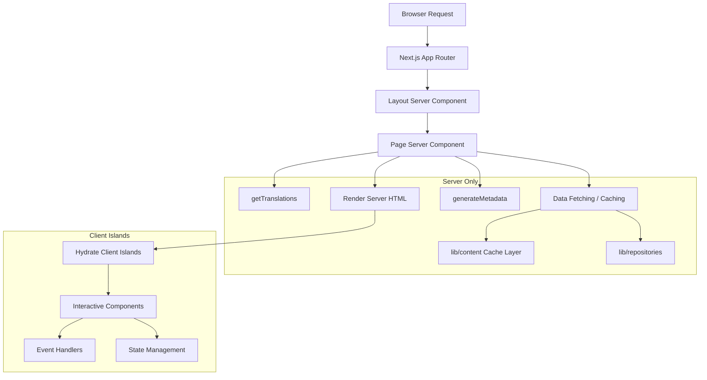

# Muster für Serverkomponenten

## Übersicht

Die Ever Works-Vorlage nutzt React Server Components (RSC) als Standard-Rendering-Strategie im gesamten Next.js App Router. Serverkomponenten übernehmen das Abrufen von Daten, das Laden von Übersetzungen, die Generierung von Metadaten und die Layouterstellung auf dem Server und senden nur den gerenderten HTML-Code an den Client.

## Architektur



## Quelldateien

|Datei|Muster demonstriert|
|------|---------------------|
|`template/app/[locale]/about/page.tsx`|Datenabruf, i18n, Metadaten, MDX-Rendering|
|`template/app/[locale]/layout.tsx`|Root-Layout mit Locale-Anbieter|
|`template/app/layout.tsx`|Globales Layout, Schriftarten, Anbieter|
|`template/app/sitemap.ts`|Nur-Server-Routengenerierung|
|`template/app/robots.ts`|Nur-Server-Konfiguration|

## Kernmuster

### Muster 1: Asynchrone Seitenkomponenten mit i18n

Jede lokalisierte Seite folgt diesem Muster:

```typescript
// Server Component -- no "use client" directive
export const revalidate = 3600; // ISR: revalidate every hour

interface PageProps {
    params: Promise<{ locale: string }>;
}

export async function generateMetadata({ params }: PageProps): Promise<Metadata> {
    const { locale } = await params;
    const t = await getTranslations({ locale, namespace: 'footer' });
    return {
        title: t('ABOUT_US'),
        description: t('ABOUT_PAGE_META_DESCRIPTION'),
        alternates: {
            languages: generateHreflangAlternates('/about')
        }
    };
}

export default async function AboutPage({ params }: PageProps) {
    const { locale } = await params;
    const pageData = await getCachedPageContent('about', locale);
    const tCommon = await getTranslations({ locale, namespace: 'common' });

    return (
        <PageContainer>
            <MDX source={pageData?.content || DEFAULT_CONTENT} />
        </PageContainer>
    );
}
```

Hauptmerkmale:
- `params` ist ein `Promise` (Next.js 15+ App Router-Konvention)
- Mehrere `getTranslations()` Aufrufe für verschiedene Namespaces
- Abrufen von zwischengespeichertem Inhalt über `getCachedPageContent()`
- Statisches Revalidierungsintervall mit `export const revalidate`

### Muster 2: Metadatengenerierung

Serverkomponenten generieren SEO-Metadaten auf Routenebene:

```typescript
export async function generateMetadata({ params }: PageProps): Promise<Metadata> {
    const { locale } = await params;
    const t = await getTranslations({ locale, namespace: 'pages' });

    return {
        metadataBase: new URL(appUrl),
        title: t('PAGE_TITLE'),
        description: t('PAGE_DESCRIPTION'),
        alternates: {
            languages: generateHreflangAlternates('/path')
        }
    };
}
```

Das Dienstprogramm `generateHreflangAlternates()` von `lib/seo/hreflang.ts` generiert automatisch alternative Sprachlinks für alle unterstützten Gebietsschemas.

### Muster 3: ISR mit Content Caching

```typescript
export const revalidate = 3600; // Revalidate every hour

export default async function Page({ params }: PageProps) {
    const data = await getCachedPageContent('page-name', locale);
    // Render with cached data...
}
```

Die Funktion `getCachedPageContent()` stellt eine serverseitige Cache-Ebene über dem Git-basierten CMS-Inhalt in `.content/` bereit. In Kombination mit `revalidate` entsteht ein ISR-Muster (Inkrementelle statische Regeneration), bei dem Seiten statisch generiert und regelmäßig aktualisiert werden.

### Muster 4: Serverseitige Authentifizierungsprüfungen

Geschützte Seiten verwenden serverseitige Schutzvorrichtungen von `lib/auth/guards.ts`:

```typescript
import { requireAuth, requireAdmin } from '@/lib/auth/guards';

export default async function ProtectedPage() {
    const session = await requireAuth();
    // session.user is guaranteed to exist here
    return <div>Welcome {session.user.email}</div>;
}

export default async function AdminPage() {
    const session = await requireAdmin();
    // session.user.isAdmin is guaranteed true here
    return <AdminDashboard />;
}
```

Diese Wachen rufen intern `auth()` auf und verwenden `redirect()` von `next/navigation`, um nicht authentifizierte Benutzer zur Anmeldeseite weiterzuleiten. Die Umleitung erfolgt serverseitig, sodass kein Client-JavaScript erforderlich ist.

### Muster 5: Zusammenstellen von Server- und Clientkomponenten

Serverkomponenten delegieren Interaktivität an Clientkomponenten-„Inseln“:

```typescript
// Server Component (page.tsx)
export default async function Page({ params }: PageProps) {
    const { locale } = await params;
    const data = await fetchData();
    const t = await getTranslations({ locale, namespace: 'page' });

    return (
        <div>
            <h1>{t('TITLE')}</h1>
            {/* Server-rendered static content */}
            <StaticContent data={data} />
            {/* Client island for interactivity */}
            <InteractiveFilter initialData={data} />
        </div>
    );
}
```

Daten fließen als serialisierbare Requisiten vom Server zum Client. Clientkomponenten empfangen vorab abgerufene Daten und verarbeiten Benutzerinteraktionen.

## Strategien zum Datenabruf

### Direkter Repository-Zugriff

Serverkomponenten können Repository-Funktionen direkt importieren und aufrufen:

```typescript
import { getItemBySlug } from '@/lib/repositories/item-repository';

export default async function ItemPage({ params }) {
    const item = await getItemBySlug(params.slug);
    // ...
}
```

### Zwischengespeicherte Inhaltsschicht

Für Git-basierte CMS-Inhalte:

```typescript
import { getCachedPageContent } from '@/lib/content';

const pageData = await getCachedPageContent('about', locale);
```

### Externe API-Aufrufe

Servicefunktionen in `lib/services/` kapseln externe API-Interaktionen:

```typescript
import { triggerManualSync } from '@/lib/services/sync-service';
```

## Streaming und Spannung

Serverkomponenten unterstützen Streaming über React Suspense-Grenzen. Auf großen Seiten können Ladezustände für einzelne Abschnitte angezeigt werden:

```typescript
import { Suspense } from 'react';

export default async function Page() {
    return (
        <div>
            <Header /> {/* Renders immediately */}
            <Suspense fallback={<LoadingSkeleton />}>
                <SlowDataSection /> {/* Streams when ready */}
            </Suspense>
        </div>
    );
}
```

## Best Practices in der Vorlage

1. **Kein `"use client"`, sofern nicht erforderlich** – Komponenten sind standardmäßig Serverkomponenten
2. **Übersetzungen werden serverseitig geladen** – `getTranslations()` läuft nur auf dem Server
3. **Metadaten, die zusammen mit Seiten gespeichert sind** – `generateMetadata` wird aus derselben Datei exportiert
4. **Erneute Validierung auf Routenebene** – `export const revalidate` steuert das ISR-Timing
5. **Schutzfunktionen für die Authentifizierung** – serverseitige Weiterleitungen ohne Client-Bundle-Kosten
6. **Requisiten runter, Ereignisse hoch** – Serverkomponenten geben Daten als Requisiten an Client-Inseln weiter
