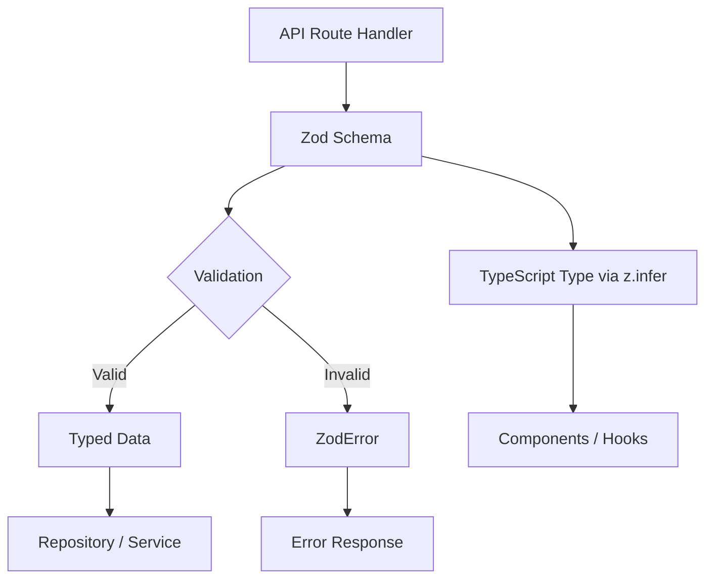

# Validierungsmuster

Die Vorlage verwendet Zod für die schemabasierte Validierung über alle API-Grenzen hinweg. Validierungsschemata definieren Datenformen, Einschränkungen, Transformationen und Typinferenz in einer einzigen Wahrheitsquelle. Jede Domäne verfügt über ein eigenes Validierungsmodul mit Schemata für Erstellungs-, Aktualisierungs- und Abfragevorgänge.

## Architekturübersicht



## Quelldateien

|Datei|Zweck|
|------|---------|
|`lib/validations/auth.ts`|Passwort- und Authentifizierungsschemata|
|`lib/validations/item.ts`|Schema der Artikelstandortdaten|
|`lib/validations/client-item.ts`|Clientseitige Schemata zum Erstellen/Aktualisieren/Abfragen von Elementen|
|`lib/validations/company.ts`|Firmen-CRUD- und Artikel-Firmen-Zuordnungsschemata|
|`lib/validations/sponsor-ad.ts`|Lebenszyklusschemata für Sponsor-Anzeigen|
|`lib/validations/client-dashboard.ts`|Dashboard-Abfrageparameterschemata|
|`lib/validations/user-location.ts`|Benutzerstandort und Datenschutzeinstellungen|

## Kernmuster

### Muster 1: Schema + abgeleiteter Typ

Jedes Schema exportiert einen entsprechenden TypeScript-Typ über `z.infer`:

```typescript
import { z } from 'zod';

export const createCompanySchema = z.object({
  name: z.string().min(1, "Company name is required").max(255),
  website: z.string().url("Invalid URL format").optional().or(z.literal("")),
  status: z.enum(["active", "inactive"]).default("active"),
});

export type CreateCompanyInput = z.infer<typeof createCompanySchema>;
// Inferred type:
// {
//   name: string;
//   website?: string | "";
//   status: "active" | "inactive";
// }
```

### Muster 2: Transformieren und normalisieren

Schemata verwenden `.transform()`, um Eingabedaten zu normalisieren:

```typescript
domain: z.string()
  .max(255)
  .optional()
  .transform((val) => val?.toLowerCase().trim() || undefined),

slug: z.string()
  .max(255)
  .optional()
  .transform((val) => val?.toLowerCase().trim() || undefined)
  .refine(
    (val) => !val || /^[a-z0-9-]+$/.test(val),
    { message: "Slug must contain only lowercase letters, numbers, and hyphens" }
  ),
```

### Muster 3: Enum-Einschränkungen

Statusfelder verwenden `z.enum()` mit const-Arrays zur Typsicherheit:

```typescript
export const companyStatus = ["active", "inactive"] as const;
export const sponsorAdStatuses = [
  "pending_payment", "pending", "rejected",
  "active", "expired", "cancelled",
] as const;
export const sponsorAdIntervals = ["weekly", "monthly"] as const;

// Usage in schemas
status: z.enum(companyStatus).default("active"),
interval: z.enum(sponsorAdIntervals),
```

### Muster 4: Erzwungene Abfrageparameter

Abfragezeichenfolgenparameter aus HTTP-Anfragen werden aus Zeichenfolgen erzwungen:

```typescript
export const querySponsorAdsSchema = z.object({
  page: z.coerce.number().int().positive().default(1),
  limit: z.coerce.number().int().positive().max(100).default(10),
  status: z.enum(sponsorAdStatuses).optional(),
  sortBy: z.enum(["createdAt", "updatedAt", "startDate", "endDate", "status"]).default("createdAt"),
  sortOrder: z.enum(["asc", "desc"]).default("desc"),
});
```

### Muster 5: String-to-Number-Transformation

Für Abfrageparameter, die als Zeichenfolgen eingehen, aber Zahlen darstellen:

```typescript
page: z.string()
  .optional()
  .transform(val => (val ? parseInt(val, 10) : 1))
  .refine(val => !Number.isNaN(val), { message: 'Page must be a valid number' })
  .refine(val => val >= 1, { message: 'Page must be at least 1' }),

deleted: z.string()
  .optional()
  .transform(val => val === 'true'),  // String "true" -> boolean true
```

### Muster 6: Feldübergreifende Validierung mit Refine

Komplexe Validierungsregeln, die mehrere Felder umfassen:

```typescript
export const updateLocationSchema = z.object({
  defaultLatitude: z.number().min(-90).max(90).nullable().optional(),
  defaultLongitude: z.number().min(-180).max(180).nullable().optional(),
  defaultCity: z.string().max(200).nullable().optional(),
  defaultCountry: z.string().max(100).nullable().optional(),
  locationPrivacy: locationPrivacySchema.optional(),
}).refine(
  (data) => {
    const hasLat = data.defaultLatitude != null;
    const hasLng = data.defaultLongitude != null;
    return hasLat === hasLng;  // Both or neither
  },
  { message: 'Both latitude and longitude must be provided together' }
);
```

### Muster 7: Union-Typen

Felder, die mehrere Formate akzeptieren:

```typescript
category: z.union([
  z.string().min(1, 'Category is required'),
  z.array(z.string().min(1)).min(1, 'At least one category is required'),
]).optional().nullable(),
```

## Domänenschemata

### Authentifizierung

Passwortvalidierung mit mehreren Regex-Einschränkungen:

```typescript
export const passwordSchema = z.string()
  .min(8, "Password must be at least 8 characters")
  .regex(/[A-Z]/, "Must contain at least one uppercase letter")
  .regex(/[a-z]/, "Must contain at least one lowercase letter")
  .regex(/[0-9]/, "Must contain at least one number")
  .regex(/[^A-Za-z0-9]/, "Must contain at least one special character");
```

### Artikelstandort

Geografische Daten mit begrenzten Koordinaten:

```typescript
export const locationSchema = z.object({
  address: z.string().optional(),
  city: z.string().optional(),
  state: z.string().optional(),
  country: z.string().optional(),
  postal_code: z.string().optional(),
  latitude: z.number().min(-90).max(90).optional(),
  longitude: z.number().min(-180).max(180).optional(),
  service_area: z.enum(['local', 'regional', 'national', 'global']).optional(),
  is_remote: z.boolean().optional(),
  geocoded_by: z.enum(['mapbox', 'google']).optional(),
}).optional();
```

### Datenschutz des Benutzerstandorts

Enum-basierte Datenschutzeinstellungen:

```typescript
export const locationPrivacyValues = ['private', 'city', 'exact'] as const;
export const locationPrivacySchema = z.enum(locationPrivacyValues);
export type LocationPrivacy = z.infer<typeof locationPrivacySchema>;
```

### Übermittlung von Kundenartikeln

Vollständiges Erstellungsschema mit externen Validierungskonstanten:

```typescript
import { ITEM_VALIDATION } from '@/lib/types/item';

export const clientCreateItemSchema = z.object({
  name: z.string()
    .min(ITEM_VALIDATION.NAME_MIN_LENGTH)
    .max(ITEM_VALIDATION.NAME_MAX_LENGTH),
  description: z.string()
    .min(ITEM_VALIDATION.DESCRIPTION_MIN_LENGTH)
    .max(ITEM_VALIDATION.DESCRIPTION_MAX_LENGTH),
  source_url: z.string().url('Invalid URL format'),
  category: z.union([
    z.string().min(1),
    z.array(z.string().min(1)).min(1),
  ]).optional().nullable(),
  tags: z.array(z.string().min(1)).optional().default([]),
  icon_url: z.string().url().optional().or(z.literal('')),
  location: locationSchema,
});
```

### Lebenszyklus der Sponsor-Anzeige

Mehrere Schemata, die den gesamten Sponsor-Anzeigen-Workflow abdecken:

|Schema|Zweck|
|--------|---------|
|`createSponsorAdSchema`|Einreichung einer neuen Sponsoranzeige|
|`updateSponsorAdSchema`|Admin-Update (Status, Termine, Abonnement)|
|`approveSponsorAdSchema`|Genehmigung durch den Administrator|
|`rejectSponsorAdSchema`|Ablehnung durch den Administrator mit Begründung (10–500 Zeichen)|
|`cancelSponsorAdSchema`|Stornierung mit optionaler Begründung|
|`querySponsorAdsSchema`|Paginierte Auflistung mit Filtern|

## Schema-Wiederverwendungsmuster

### Teilschemata für Updates

Aktualisierungsschemata spiegeln häufig Erstellungsschemata wider, wobei alle Felder optional sind:

```typescript
export const updateCompanySchema = z.object({
  id: z.string().uuid(),
  name: z.string().min(1).max(255).optional(),
  website: z.string().url().optional().or(z.literal("")),
  status: z.enum(companyStatus).optional(),
});
```

### Schema-Aliasing

Wenn zwei Vorgänge identische Validierungsanforderungen haben:

```typescript
export const assignCompanyToItemSchema = z.object({
  itemSlug: z.string().min(1).max(255).transform(val => val.toLowerCase().trim()),
  companyId: z.string().uuid("Invalid company ID format"),
});

// Reuse for updates (identical validation)
export const updateItemCompanySchema = assignCompanyToItemSchema;
```

### Selektive Kommissionierung

Verwenden von `.pick()` zum Erstellen von Teilmengenschemata:

```typescript
const validatedData = userValidationSchema
  .pick({ email: true, password: true })
  .parse(data);
```

## Verwendung in API-Routen

```typescript
import { clientCreateItemSchema } from '@/lib/validations/client-item';

export async function POST(request: Request) {
  const body = await request.json();

  // Validation + transformation in one step
  const result = clientCreateItemSchema.safeParse(body);

  if (!result.success) {
    return Response.json(
      { errors: result.error.flatten().fieldErrors },
      { status: 400 }
    );
  }

  // result.data is fully typed and transformed
  const item = await repository.create(result.data);
  return Response.json(item, { status: 201 });
}
```
